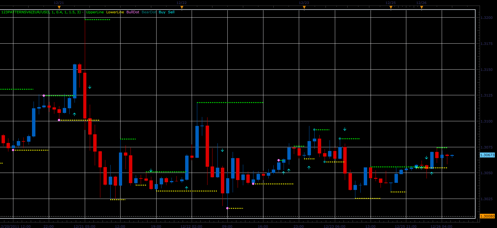

# 1-2-3 pattern indicator

> Source: https://fxcodebase.com/code/viewtopic.php?f=17&t=10444  
> Forum: 17 · Topic 10444 · 26 post(s)

---

## 1-2-3 pattern indicator

**Alexander.Gettinger** · Mon Dec 26, 2011 6:20 am

This indicator is a ported MQL4 indicator from request [viewtopic.php?f=27&t=8816&p=19417#p19417](https://fxcodebase.com/code/viewtopic.php?f=27&t=8816&p=19417#p19417).

 

Download:

 [123PatternsV6.lua](files/21673/123PatternsV6.lua)

---

## Re: 1-2-3 pattern indicator

**automan** · Tue Dec 27, 2011 9:44 am

Strategy?

---

## Re: 1-2-3 pattern indicator

**Apprentice** · Wed Dec 28, 2011 5:23 am

Your request is added to the developmental cue.

---

## Re: 1-2-3 pattern indicator

**Blackcat2** · Wed Dec 28, 2011 11:01 pm

The arrows and dots are not updating automatically on the chart. I have to refresh the chart manually..
Please kindly fix it so it'll update/refresh itself on when next candle is created..

Thanks..
BC

---

## Re: 1-2-3 pattern indicator

**Alexander.Gettinger** · Thu Dec 29, 2011 8:25 am

OK

---

## Re: 1-2-3 pattern indicator

**automan** · Mon Jan 16, 2012 1:48 pm

Strangely enough, does not update the indicator only if you change the time scale

 but if you move (scroll) in and out (+ -) Indicator is updated

 think it would be pretty good strategy with stops and limits

---

## Re: 1-2-3 pattern indicator

**Terrance** · Tue Jan 24, 2012 1:30 pm

I have same problem, I do not know enough on programing to repair
Seems like a very good indicator

---

## Re: 1-2-3 pattern indicator

**Terrance** · Fri Mar 09, 2012 2:15 pm

Could some one Kindly fix this indicator so it will update

---

## Re: 1-2-3 pattern indicator

**Alexander.Gettinger** · Mon Mar 12, 2012 8:59 am

Please, see this version of indicator:

 [123PatternsV6.lua](files/27933/123PatternsV6.lua)

---

## Re: 1-2-3 pattern indicator

**Terrance** · Tue Mar 13, 2012 5:32 pm

hide transitions not working

---

## Re: 1-2-3 pattern indicator

**Alexander.Gettinger** · Fri Mar 16, 2012 9:13 am

> **Terrance wrote:**
> hide transitions not working

I updated the indicator in the previous post. Download it again.

---

## Re: 1-2-3 pattern indicator

**dslickone** · Wed Feb 27, 2013 6:06 pm

Does the strategy this indicator exist?
Can anyone help out kindly?

---

## Re: 1-2-3 pattern indicator

**Apprentice** · Thu Feb 28, 2013 4:31 am

Can you define the Entry Exit rules for such strategy.

---

## Re: 1-2-3 pattern indicator

**dslickone** · Thu Feb 28, 2013 9:11 am

View attachment for the 123 pattern indicator.
The calculation and style of the indicator should remain unchanged.

Entry:
Buy when market price crosses the break out line to the up side and a buy arrow appears
Sell when market price crosses the break out line to the down side and a sell arrow appears.
Exit:
The exit point should be set in PIPS according to preference
The trailing stop should also be set in PIPS
Stop loss:
The stop loss should be set in PIPS according to preference

PRICE PARAMETERS:
For all time frame

TRADING PARAMETERS:
Allow strategy to trade: yes/no (default "no")
Account to trade on: account on which strategy is being used
Trade amount in lots: min 1 - max 100 (default "1")
Set limit order: yes/no (default "no")
Limit order in pips: (default "30")
Set stop order: yes/no (default "no")
Stop order in pips: (default "30")
Trailing stop order: yes/no (default "no")
Trailing stop in pips: (default "20")

SIGNAL PARAMETERS:
Show alert: yes/no (default "no")
Play sound: yes/no (default "no")
Sound file: (default "popup message")
Recurrent sound: yes/no (default "no")

---

## Re: 1-2-3 pattern indicator

**Apprentice** · Fri Mar 01, 2013 5:39 am

Your request is added to the developmental list.

---

## Re: 1-2-3 pattern indicator

**dslickone** · Thu Mar 07, 2013 4:32 pm

Can anyone please add an alert signal to the 123 pattern indicator so that once a buy or sell breakout occurs it gives an alert with sound?

---

## Re: 1-2-3 pattern indicator

**dslickone** · Thu Mar 07, 2013 8:40 pm

I tried to create a signal for the 123 pattern indicator but there seems to be a problem somewhere because it fails to even load on the Marketscope platform.I am not a programmer neither am I a developer,could someone kindly help make this signal alert work correctly?
The signal alert is attached below.
Thanks in advance!

---

## Re: 1-2-3 pattern indicator

**Jabez3** · Thu Mar 14, 2013 5:32 pm

Can an alert be added to the 1-2-3 pattern indicator.

Thank You

---

## Re: 1-2-3 pattern indicator

**Apprentice** · Sat Mar 16, 2013 8:30 am

Your request is added to the development list.

---

## Re: 1-2-3 pattern indicator

**speedytina** · Mon Jan 20, 2014 11:37 pm

Was this strategy ever developed? If so, where can I find it?

Thanks,
Ian

> **dslickone wrote:**
> View attachment for the 123 pattern indicator.
> The calculation and style of the indicator should remain unchanged.
>
> Entry:
> Buy when market price crosses the break out line to the up side and a buy arrow appears
> Sell when market price crosses the break out line to the down side and a sell arrow appears.
> Exit:
> The exit point should be set in PIPS according to preference
> The trailing stop should also be set in PIPS
> Stop loss:
> The stop loss should be set in PIPS according to preference
>
> PRICE PARAMETERS:
> For all time frame
>
> TRADING PARAMETERS:
> Allow strategy to trade: yes/no (default "no")
> Account to trade on: account on which strategy is being used
> Trade amount in lots: min 1 - max 100 (default "1")
> Set limit order: yes/no (default "no")
> Limit order in pips: (default "30")
> Set stop order: yes/no (default "no")
> Stop order in pips: (default "30")
> Trailing stop order: yes/no (default "no")
> Trailing stop in pips: (default "20")
>
> SIGNAL PARAMETERS:
> Show alert: yes/no (default "no")
> Play sound: yes/no (default "no")
> Sound file: (default "popup message")
> Recurrent sound: yes/no (default "no")

---

## Re: 1-2-3 pattern indicator

**moomoofx** · Thu Jan 23, 2014 4:31 am

The strategy and signal has been implemented here: [viewtopic.php?f=31&t=60232](https://fxcodebase.com/code/viewtopic.php?f=31&t=60232)

Note: Indicators are not supposed to support Alerts, that is what a Signal or Strategy is for. I hope this meets your needs.

Cheers,
MooMooFX

---

## Re: 1-2-3 pattern indicator

**supertrader123** · Thu Jan 23, 2014 7:45 am

moomoofx,

thank you for this nice strategy

---

## Re: 1-2-3 pattern indicator

**speedytina** · Thu Jan 23, 2014 11:54 pm

Thank you.

> **moomoofx wrote:**
> The strategy and signal has been implemented here: [viewtopic.php?f=31&t=60232](https://fxcodebase.com/code/viewtopic.php?f=31&t=60232)
>
> Note: Indicators are not supposed to support Alerts, that is what a Signal or Strategy is for. I hope this meets your needs.
>
> Cheers,
> MooMooFX

---

## Re: 1-2-3 pattern indicator

**Apprentice** · Sun Oct 28, 2018 5:04 am

The indicator was revised and updated.

---

## Re: 1-2-3 pattern indicator

**kankatrader** · Fri Jan 11, 2019 5:12 am

Hello,

Please the possibility to change the arrow size

---

## Re: 1-2-3 pattern indicator

**Apprentice** · Fri Jan 11, 2019 8:46 am

Try it now.
