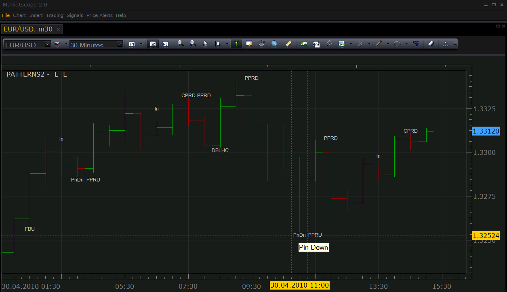
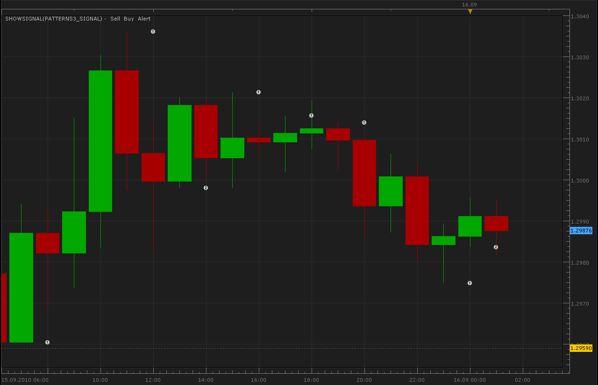
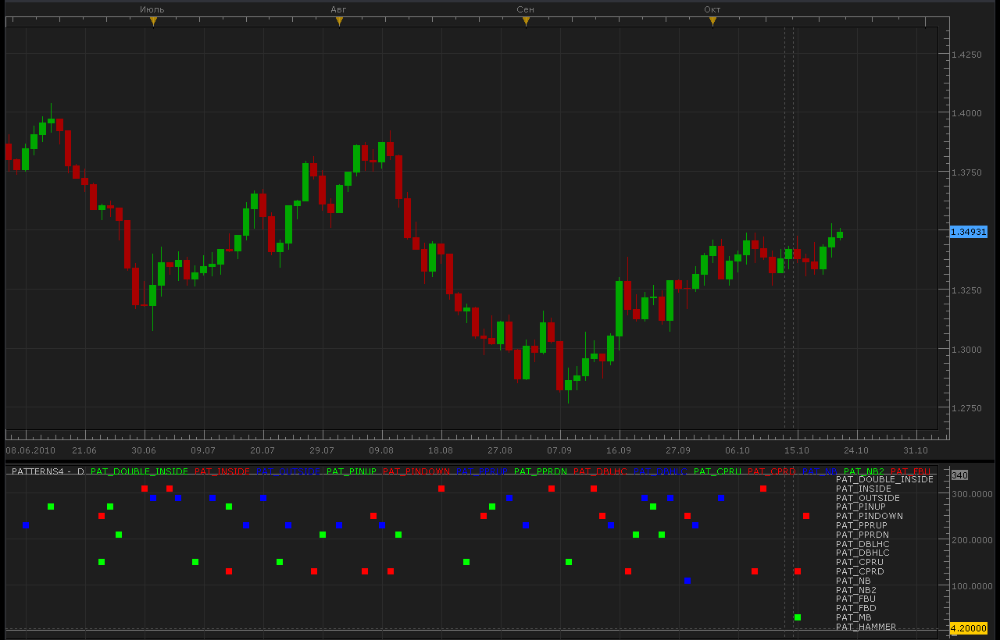

# 15 popular candle patterns

> Source: https://fxcodebase.com/code/viewtopic.php?f=17&t=903  
> Forum: 17 · Topic 903 · 79 post(s)

---

## 15 popular candle patterns

**Nikolay.Gekht** · Fri Apr 30, 2010 3:11 pm

The indicator recognizes 15 popular candle patterns. See below for the short pattern description.

The indicator shows a short name of patterns above (below) the last candle of the pattern. To see the full name just move the mouse cursor over the pattern label and wait until a tooltip with the full name appears.

 

 [Patterns2.lua](files/1648/Patterns2.lua)

The indicator was revised and updated

---

## Patterns (part I)

**Nikolay.Gekht** · Fri Apr 30, 2010 3:25 pm

**NB – Neutral Bar**

The open and close prices of the bar are very close.
The bar can indicate that the price is unpredictable.

**FBU,FBD – Force bar Up and Down**

The bar closes at it’s highest (lowest) price.
The bar can indicate that the price movement is very strong.

**In - Inside Bar**

The next bar is completely inside the previous bar.
If the next bar is opposite, it could predict the change of the trend.

**DblIn - Double Inside Bar**

Two consecutive bars are inside bars.
The double inside bar can show squeezing of the market before jump.

Out - Outside Bar

The previous bar is completely inside the next bar.
The same side next bar usually confirms the trend; the opposite next bar can predict the change of the trend.

**DBLHC,DBHLC – Double Bar Low Higher Close and Double Bar High Lower Close**

The high (low) prices are the same. The close of the current bar is below (above) the close price of the previous bar.
The stronger version of the outside bar.

---

## Patterns (part II)

**Nikolay.Gekht** · Fri Apr 30, 2010 3:26 pm

**PnU, PnD – Pin Up and Pin Down**

The previous bar has the highest high and low (lowest high and low) of the last three bars and the previous bar upper (lower) shadow is longer than the body.
The pattern can show the change of the trend. The longer shadow of the previous bar shows the higher strength of the pattern.

**PPRU, PPRD – Pivot Point Reversal Up and Down**

The previous bar must have highest high and low (lowest high and low) of the last three bars and the current bar must close below close (above high) of the previous bar.
The pattern can predict the change of the trend.

**CPRU,CPRD – Closing Price Reversal Up and Down**

Three consecutive bars have highest high and low (lowest high and low) values. The close price of the last bar is below (above) the close price of the previous bar.
The pattern can predict the change of the trend.

**MB – Mirror Bar**

Two consequent bars are opposite bars and have the same size of the body. Up and down shadows does not matter.
The pattern can indicate the end of the price correction.

---

## Re: 15 popular candle patterns

**patick** · Sat May 01, 2010 8:33 pm

Man, every time I think, "this is my favorite indicator," you [guys] bring out an even bigger diamond out of the mine

May you make so much money, you'll have a hard time storing it all in one country.

---

## Re: 15 popular candle patterns

**Nikolay.Gekht** · Mon May 03, 2010 5:36 pm

Thank you!

We're really happy that our indicators are useful for our valuable users.

---

## Re: 15 popular candle patterns

**boursicoton** · Thu Jul 08, 2010 2:26 pm

possible to see one pattern on all pattern ? for good visibity....
thanks

---

## Re: 15 popular candle patterns

**Alexander.Gettinger** · Mon Sep 13, 2010 3:26 am

On/off patterns added.

Code: [Select all](https://fxcodebase.com/code/)
`function Init()
    indicator:name("Candle Pattern 3");
    indicator:description("");
    indicator:requiredSource(core.Bar);
    indicator:type(core.Indicator);

    indicator.parameters:addInteger("EQ", "Maximum of pips distance between equal prices", "", 1, 0, 100);
    indicator.parameters:addBoolean("PAT_DOUBLE_INSIDE", "Enable Double Inside", "", true);
    indicator.parameters:addBoolean("PAT_INSIDE", "Enable Inside", "", true);
    indicator.parameters:addBoolean("PAT_OUTSIDE", "Enable Outside", "", true);
    indicator.parameters:addBoolean("PAT_PINUP", "Enable Pin Up", "", true);
    indicator.parameters:addBoolean("PAT_PINDOWN", "Enable Pin Down", "", true);
    indicator.parameters:addBoolean("PAT_PPRUP", "Enable Pivot Point Reversal Up", "", true);
    indicator.parameters:addBoolean("PAT_PPRDN", "Enable Pivot Point Reversal Down", "", true);
    indicator.parameters:addBoolean("PAT_DBLHC", "Enable Double Bar Low With A Higher Close", "", true);
    indicator.parameters:addBoolean("PAT_DBHLC", "Enable Double Bar High With A Lower Close", "", true);
    indicator.parameters:addBoolean("PAT_CPRU", "Enable Close Price Reversal Up", "", true);
    indicator.parameters:addBoolean("PAT_CPRD", "Enable Close Price Reversal Down", "", true);
    indicator.parameters:addBoolean("PAT_NB", "Enable Neutral Bar", "", true);
    indicator.parameters:addBoolean("PAT_FBU", "Enable Force Bar Up", "", true);
    indicator.parameters:addBoolean("PAT_FBD", "Enable Force Bar Down", "", true);
    indicator.parameters:addBoolean("PAT_MB", "Enable Mirror Bar", "", true);

    indicator.parameters:addGroup("Style");
    indicator.parameters:addInteger("FontSize", "Font Size", "", 6, 4, 12);
    indicator.parameters:addColor("LblColor", "Color for pattern labels", "", core.COLOR_LABEL);
end

local source;
local P;
local UP;
local DN;
local EQ;

function Prepare()
    EQ = instance.parameters.EQ * instance.source:pipSize();
    source = instance.source;
    InitPattern(source);

    local name;
    name = profile:id();
    instance:name(name);

    UP = instance:createTextOutput("L", "L", "Arial", instance.parameters.FontSize, core.H_Center, core.V_Top, instance.parameters.LblColor, 0);
    DN = instance:createTextOutput("L", "L", "Arial", instance.parameters.FontSize, core.H_Center, core.V_Bottom, instance.parameters.LblColor, 0);
end

local prevSerial = nil;

function Update(period, mode)
    if period == 0 then
        prevSerial = source:serial(period);
    else
        if prevSerial ~= source:serial(period) then
            prevSerial = source:serial(period);
            UpdatePattern(period - 1);
        end
    end
end

function RegisterPattern(period, pattern)
    local short, long, up, length;
    local price;
    short, long, up, length = DecodePattern(pattern);
    if length~=nil then
     if up then
         price = core.max(source.high, core.rangeTo(period, length));
         UP:set(period, price, short, long);
     else
         price = core.min(source.low, core.rangeTo(period, length));
         DN:set(period, price, short, long);
     end
    end
end

local O, H, L, C, T, B, BL, US, LS; -- open, high, low, close prices, top and bottom of the candle, body, upper shadow and lower shadow length

function InitPattern(source)
    O = source.open;
    H = source.high;
    L = source.low;
    C = source.close;
    T = instance:addInternalStream(0, 0);
    B = instance:addInternalStream(0, 0);
    BL = instance:addInternalStream(0, 0);
    US = instance:addInternalStream(0, 0);
    LS = instance:addInternalStream(0, 0);
end

local PAT_NONE = 0;
local PAT_DOUBLE_INSIDE = 1;
local PAT_INSIDE = 2;
local PAT_OUTSIDE = 4;
local PAT_PINUP = 5;
local PAT_PINDOWN = 6;
local PAT_PPRUP = 7;
local PAT_PPRDN = 8;
local PAT_DBLHC = 9;
local PAT_DBHLC = 10;
local PAT_CPRU = 11;
local PAT_CPRD = 12;
local PAT_NB = 13;
local PAT_FBU = 14;
local PAT_FBD = 15;
local PAT_MB = 16;

-- short name, name, up/down flag, length of pattern
function DecodePattern(pattern)
    if pattern == PAT_NONE then
        return nil, nil, nil, nil;
    elseif pattern == PAT_DOUBLE_INSIDE and instance.parameters:getBoolean("PAT_DOUBLE_INSIDE")==true then
        return "DblIn", "Double Inside", true, 3;
    elseif pattern == PAT_INSIDE and instance.parameters:getBoolean("PAT_INSIDE")==true then
        return "In", "Inside", true, 2;
    elseif pattern == PAT_OUTSIDE and instance.parameters:getBoolean("PAT_OUTSIDE")==true then
        return "Out", "Outside", true, 2;
    elseif pattern == PAT_PINUP and instance.parameters:getBoolean("PAT_PINUP")==true then
        return "PnUp", "Pin Up", true, 2;
    elseif pattern == PAT_PINDOWN and instance.parameters:getBoolean("PAT_PINDOWN")==true then
        return "PnDn", "Pin Down", false, 2;
    elseif pattern == PAT_PPRUP and instance.parameters:getBoolean("PAT_PPRUP")==true then
        return "PPRU", "Pivot Point Reversal Up", false, 3;
    elseif pattern == PAT_PPRDN and instance.parameters:getBoolean("PAT_PPRDN")==true then
        return "PPRD", "Pivot Point Reversal Down", true, 3;
    elseif pattern == PAT_DBLHC and instance.parameters:getBoolean("PAT_DBLHC")==true then
        return "DBLHC", "Double Bar Low With A Higher Close", false, 2;
    elseif pattern == PAT_DBHLC and instance.parameters:getBoolean("PAT_DBHLC")==true then
        return "DBHLC", "Double Bar High With A Lower Close", true, 2;
    elseif pattern == PAT_CPRU and instance.parameters:getBoolean("PAT_CPRU")==true then
        return "CPRU", "Close Price Reversal Up", false, 3;
    elseif pattern == PAT_CPRD and instance.parameters:getBoolean("PAT_CPRD")==true then
        return "CPRD", "Close Price Reversal Down", true, 3;
    elseif pattern == PAT_NB and instance.parameters:getBoolean("PAT_NB")==true then
        return "NB", "Neutral Bar", true, 1;
    elseif pattern == PAT_FBU and instance.parameters:getBoolean("PAT_FBU")==true then
        return "FBU", "Force Bar Up", false, 1;
    elseif pattern == PAT_FBD and instance.parameters:getBoolean("PAT_FBD")==true then
        return "FBD", "Force Bar Down", true, 1;
    elseif pattern == PAT_MB and instance.parameters:getBoolean("PAT_MB")==true then
        return "MB", "Mirror Bar", true, 2;
    else
        return nil, nil, nil, nil;
    end
end

function Cmp(price1, price2)
    if math.abs(price1 - price2) < EQ then
        return 0;
    elseif price1 > price2 then
        return 1;
    else
        return -1;
    end
end

function UpdatePattern(p)
    T[p] = math.max(O[p], C[p]);
    B[p] = math.min(O[p], C[p]);
    BL[p] = T[p] - B[p];
    US[p] = H[p] - T[p];
    LS[p] = B[p] - L[p];

    if p >= 0 then
        -- 1 - candle patterns
        if Cmp(O[p], C[p]) == 0 and US[p] > math.max(EQ * 4, source:pipSize() * 4) and
                                    LS[p] > math.max(EQ * 4, source:pipSize() * 4) then
           RegisterPattern(p, PAT_NB);
        end

        if C[p] == H[p] then
           RegisterPattern(p, PAT_FBU);
        end

        if C[p] == L[p] then
           RegisterPattern(p, PAT_FBD);
        end
    end
    if p >= 1 then
        -- 2 - candle patterns
       if Cmp(H[p], H[p - 1]) < 0 and Cmp(L[p], L[p - 1]) > 0 then
           RegisterPattern(p, PAT_INSIDE);
       end
       if Cmp(H[p], H[p - 1]) > 0 and Cmp(L[p], L[p - 1]) < 0 then
           RegisterPattern(p, PAT_OUTSIDE);
       end
       if Cmp(H[p], H[p - 1]) == 0 and Cmp(C[p], C[p - 1]) < 0 and Cmp(L[p], L[p - 1]) <= 0 then
           RegisterPattern(p, PAT_DBHLC);
       end
       if Cmp(L[p], L[p - 1]) == 0 and Cmp(C[p], C[p - 1]) > 0 and Cmp(H[p], H[p - 1]) >= 0  then
           RegisterPattern(p, PAT_DBLHC);
       end
       if Cmp(BL[p - 1], BL[p]) == 0 and Cmp(O[p - 1], C[p]) == 0 then
           RegisterPattern(p, PAT_MB);
       end
    end

    if p >= 2 then
        -- 3 - candle patterns
        if Cmp(H[p], H[p - 1]) < 0 and Cmp(L[p], L[p - 1]) > 0 and
           Cmp(H[p - 1], H[p - 2]) < 0 and Cmp(L[p - 1], L[p - 2]) > 0 then
            RegisterPattern(p, PAT_DOUBLE_INSIDE);
        end
        if Cmp(H[p - 1], H[p - 2]) > 0 and Cmp(H[p - 1], H[p]) > 0 and
           Cmp(L[p - 1], L[p - 2]) > 0 and Cmp(L[p - 1], L[p]) > 0 and
           BL[p - 1] * 2 < US[p - 1] then
            RegisterPattern(p - 1, PAT_PINUP);
        end
        if Cmp(H[p - 1], H[p - 2]) < 0 and Cmp(H[p - 1], H[p]) < 0 and
           Cmp(L[p - 1], L[p - 2]) < 0 and Cmp(L[p - 1], L[p]) < 0 and
           BL[p - 1] * 2 < LS[p - 1] then
            RegisterPattern(p - 1, PAT_PINDOWN);
        end
        if Cmp(H[p - 1], H[p - 2]) > 0 and Cmp(H[p - 1], H[p]) > 0 and
           Cmp(L[p - 1], L[p - 2]) > 0 and Cmp(L[p - 1], L[p]) > 0 and
           Cmp(C[p], L[p - 1]) < 0 then
            RegisterPattern(p, PAT_PPRDN);
        end
        if Cmp(H[p - 1], H[p - 2]) < 0 and Cmp(H[p - 1], H[p]) < 0 and
           Cmp(L[p - 1], L[p - 2]) < 0 and Cmp(L[p - 1], L[p]) < 0 and
           Cmp(C[p], H[p - 1]) > 0 then
            RegisterPattern(p, PAT_PPRUP);
        end
        if Cmp(H[p - 1], H[p - 2]) < 0 and Cmp(L[p - 1], L[p - 2]) < 0 and
           Cmp(H[p], H[p - 1]) < 0 and Cmp(L[p], L[p - 1]) < 0 and
           Cmp(C[p], C[p - 1]) > 0 and Cmp(O[p], C[p]) < 0 then
            RegisterPattern(p, PAT_CPRU);
        end
        if Cmp(H[p - 1], H[p - 2]) > 0 and Cmp(L[p - 1], L[p - 2]) > 0 and
           Cmp(H[p], H[p - 1]) > 0 and Cmp(L[p], L[p - 1]) > 0 and
           Cmp(C[p], C[p - 1]) < 0 and Cmp(O[p], C[p]) > 0 then
            RegisterPattern(p, PAT_CPRD);
        end
    end
end`

---

## Re: 15 popular candle patterns

**DS0167** · Mon Sep 13, 2010 4:58 am

Hello,

Nice tool Will you create the same for candle chart (instead of bar chart)?

Thank you

Kind regards,
DS0167

---

## Re: 15 popular candle patterns

**Apprentice** · Mon Sep 13, 2010 5:47 am

This indicator work on the Bar Chart also.

---

## Re: 15 popular candle patterns

**boursicoton** · Mon Sep 13, 2010 10:38 am

very good !

---

## Re: 15 popular candle patterns

**jcervinka** · Mon Sep 13, 2010 2:38 pm

Can you make a sound signal for this indicator??
Whenever the bar you choose, after his closing, to have a sound signal..

Thanks

Jernej

---

## Re: 15 popular candle patterns

**Apprentice** · Mon Sep 13, 2010 6:00 pm

Added to Development Cue.

---

## Re: 15 popular candle patterns

**Alexander.Gettinger** · Wed Sep 15, 2010 1:42 am

In indicator are added 14 new patterns.

Code: [Select all](https://fxcodebase.com/code/)
`function Init()
    indicator:name("Candle Pattern 3");
    indicator:description("");
    indicator:requiredSource(core.Bar);
    indicator:type(core.Indicator);

    indicator.parameters:addInteger("EQ", "Maximum of pips distance between equal prices", "", 1, 0, 100);
    indicator.parameters:addBoolean("PAT_DOUBLE_INSIDE", "Enable Double Inside", "", true);
    indicator.parameters:addBoolean("PAT_INSIDE", "Enable Inside", "", true);
    indicator.parameters:addBoolean("PAT_OUTSIDE", "Enable Outside", "", true);
    indicator.parameters:addBoolean("PAT_PINUP", "Enable Pin Up", "", true);
    indicator.parameters:addBoolean("PAT_PINDOWN", "Enable Pin Down", "", true);
    indicator.parameters:addBoolean("PAT_PPRUP", "Enable Pivot Point Reversal Up", "", true);
    indicator.parameters:addBoolean("PAT_PPRDN", "Enable Pivot Point Reversal Down", "", true);
    indicator.parameters:addBoolean("PAT_DBLHC", "Enable Double Bar Low With A Higher Close", "", true);
    indicator.parameters:addBoolean("PAT_DBHLC", "Enable Double Bar High With A Lower Close", "", true);
    indicator.parameters:addBoolean("PAT_CPRU", "Enable Close Price Reversal Up", "", true);
    indicator.parameters:addBoolean("PAT_CPRD", "Enable Close Price Reversal Down", "", true);
    indicator.parameters:addBoolean("PAT_NB", "Enable Neutral Bar", "", true);
    indicator.parameters:addBoolean("PAT_FBU", "Enable Force Bar Up", "", true);
    indicator.parameters:addBoolean("PAT_FBD", "Enable Force Bar Down", "", true);
    indicator.parameters:addBoolean("PAT_MB", "Enable Mirror Bar", "", true);
    indicator.parameters:addBoolean("PAT_HAMMER", "Enable Hammer", "", true);
    indicator.parameters:addBoolean("PAT_SHOOTSTAR", "Enable Shooting Star", "", true);
    indicator.parameters:addBoolean("PAT_EVSTAR", "Enable Evening Star", "", true);
    indicator.parameters:addBoolean("PAT_MORNSTAR", "Enable Morning Star", "", true);
    indicator.parameters:addBoolean("PAT_EVDJSTAR", "Enable Evening Doji Star", "", true);
    indicator.parameters:addBoolean("PAT_MORNDJSTAR", "Enable Morning Doji Star", "", true);
    indicator.parameters:addBoolean("PAT_BEARHARAMI", "Enable Bearish Harami", "", true);
    indicator.parameters:addBoolean("PAT_BEARHARAMICROSS", "Enable Bearish Harami Cross", "", true);
    indicator.parameters:addBoolean("PAT_BULLHARAMI", "Enable Bullish Harami", "", true);
    indicator.parameters:addBoolean("PAT_BULLHARAMICROSS", "Enable Bullish Harami Cross", "", true);
    indicator.parameters:addBoolean("PAT_DARKCLOUD", "Enable Dark Cloud Cover", "", true);
    indicator.parameters:addBoolean("PAT_DOJISTAR", "Enable Doji Star", "", true);
    indicator.parameters:addBoolean("PAT_ENGBEARLINE", "Enable Engulfing Bearish Line", "", true);
    indicator.parameters:addBoolean("PAT_ENGBULLLINE", "Enable Engulfing Bullish Line", "", true);
   

    indicator.parameters:addGroup("Style");
    indicator.parameters:addInteger("FontSize", "Font Size", "", 6, 4, 12);
    indicator.parameters:addColor("LblColor", "Color for pattern labels", "", core.COLOR_LABEL);
end

local source;
local P;
local UP;
local DN;
local EQ;

function Prepare()
    EQ = instance.parameters.EQ * instance.source:pipSize();
    source = instance.source;
    InitPattern(source);

    local name;
    name = profile:id();
    instance:name(name);

    UP = instance:createTextOutput("L", "L", "Arial", instance.parameters.FontSize, core.H_Center, core.V_Top, instance.parameters.LblColor, 0);
    DN = instance:createTextOutput("L", "L", "Arial", instance.parameters.FontSize, core.H_Center, core.V_Bottom, instance.parameters.LblColor, 0);
end

local prevSerial = nil;

function Update(period, mode)
    if period == 0 then
        prevSerial = source:serial(period);
    else
        if prevSerial ~= source:serial(period) then
            prevSerial = source:serial(period);
            UpdatePattern(period - 1);
        end
    end
end

function RegisterPattern(period, pattern)
    local short, long, up, length;
    local price;
    short, long, up, length = DecodePattern(pattern);
    if length~=nil then
     if up then
         price = core.max(source.high, core.rangeTo(period, length));
         UP:set(period, price, short, long);
     else
         price = core.min(source.low, core.rangeTo(period, length));
         DN:set(period, price, short, long);
     end
    end
end

local O, H, L, C, T, B, BL, US, LS; -- open, high, low, close prices, top and bottom of the candle, body, upper shadow and lower shadow length

function InitPattern(source)
    O = source.open;
    H = source.high;
    L = source.low;
    C = source.close;
    T = instance:addInternalStream(0, 0);
    B = instance:addInternalStream(0, 0);
    BL = instance:addInternalStream(0, 0);
    US = instance:addInternalStream(0, 0);
    LS = instance:addInternalStream(0, 0);
end

local PAT_NONE = 0;
local PAT_DOUBLE_INSIDE = 1;
local PAT_INSIDE = 2;
local PAT_OUTSIDE = 4;
local PAT_PINUP = 5;
local PAT_PINDOWN = 6;
local PAT_PPRUP = 7;
local PAT_PPRDN = 8;
local PAT_DBLHC = 9;
local PAT_DBHLC = 10;
local PAT_CPRU = 11;
local PAT_CPRD = 12;
local PAT_NB = 13;
local PAT_FBU = 14;
local PAT_FBD = 15;
local PAT_MB = 16;

local PAT_HAMMER=17;
local PAT_SHOOTSTAR=18;
local PAT_EVSTAR=19;
local PAT_MORNSTAR=20;
local PAT_BEARHARAMI=21;
local PAT_BEARHARAMICROSS=22;
local PAT_BULLHARAMI=23;
local PAT_BULLHARAMICROSS=24;
local PAT_DARKCLOUD=25;
local PAT_DOJISTAR=26;
local PAT_ENGBEARLINE=27;
local PAT_ENGBULLLINE=28;
local PAT_EVDJSTAR=29;
local PAT_MORNDJSTAR=30;

-- short name, name, up/down flag, length of pattern
function DecodePattern(pattern)
    if pattern == PAT_NONE then
        return nil, nil, nil, nil;
    elseif pattern == PAT_DOUBLE_INSIDE and instance.parameters:getBoolean("PAT_DOUBLE_INSIDE")==true then
        return "DblIn", "Double Inside", true, 3;
    elseif pattern == PAT_INSIDE and instance.parameters:getBoolean("PAT_INSIDE")==true then
        return "In", "Inside", true, 2;
    elseif pattern == PAT_OUTSIDE and instance.parameters:getBoolean("PAT_OUTSIDE")==true then
        return "Out", "Outside", true, 2;
    elseif pattern == PAT_PINUP and instance.parameters:getBoolean("PAT_PINUP")==true then
        return "PnUp", "Pin Up", true, 2;
    elseif pattern == PAT_PINDOWN and instance.parameters:getBoolean("PAT_PINDOWN")==true then
        return "PnDn", "Pin Down", false, 2;
    elseif pattern == PAT_PPRUP and instance.parameters:getBoolean("PAT_PPRUP")==true then
        return "PPRU", "Pivot Point Reversal Up", false, 3;
    elseif pattern == PAT_PPRDN and instance.parameters:getBoolean("PAT_PPRDN")==true then
        return "PPRD", "Pivot Point Reversal Down", true, 3;
    elseif pattern == PAT_DBLHC and instance.parameters:getBoolean("PAT_DBLHC")==true then
        return "DBLHC", "Double Bar Low With A Higher Close", false, 2;
    elseif pattern == PAT_DBHLC and instance.parameters:getBoolean("PAT_DBHLC")==true then
        return "DBHLC", "Double Bar High With A Lower Close", true, 2;
    elseif pattern == PAT_CPRU and instance.parameters:getBoolean("PAT_CPRU")==true then
        return "CPRU", "Close Price Reversal Up", false, 3;
    elseif pattern == PAT_CPRD and instance.parameters:getBoolean("PAT_CPRD")==true then
        return "CPRD", "Close Price Reversal Down", true, 3;
    elseif pattern == PAT_NB and instance.parameters:getBoolean("PAT_NB")==true then
        return "NB", "Neutral Bar", true, 1;
    elseif pattern == PAT_FBU and instance.parameters:getBoolean("PAT_FBU")==true then
        return "FBU", "Force Bar Up", false, 1;
    elseif pattern == PAT_FBD and instance.parameters:getBoolean("PAT_FBD")==true then
        return "FBD", "Force Bar Down", true, 1;
    elseif pattern == PAT_MB and instance.parameters:getBoolean("PAT_MB")==true then
        return "MB", "Mirror Bar", true, 2;
    elseif pattern == PAT_HAMMER and instance.parameters:getBoolean("PAT_HAMMER")==true then
        return "HAMMER", "Hammer Pattern", true, 1;
    elseif pattern == PAT_SHOOTSTAR and instance.parameters:getBoolean("PAT_SHOOTSTAR")==true then
        return "SHOOTSTAR", "Shooting Star", true, 1;
    elseif pattern == PAT_EVSTAR and instance.parameters:getBoolean("PAT_EVSTAR")==true then
        return "EVSTAR", "Evening Star", true, 3;
    elseif pattern == PAT_MORNSTAR and instance.parameters:getBoolean("PAT_MORNSTAR")==true then
        return "MORNSTAR", "Morning Star", true, 3;
    elseif pattern == PAT_EVDJSTAR and instance.parameters:getBoolean("PAT_EVDJSTAR")==true then
        return "EVDJSTAR", "Evening Doji Star", true, 3;
    elseif pattern == PAT_MORNDJSTAR and instance.parameters:getBoolean("PAT_MORNDJSTAR")==true then
        return "MORNDJSTAR", "Morning Doji Star", true, 3;
    elseif pattern == PAT_BEARHARAMI and instance.parameters:getBoolean("PAT_BEARHARAMI")==true then
        return "BEARHARAMI", "Bearish Harami", true, 2;
    elseif pattern == PAT_BEARHARAMICROSS and instance.parameters:getBoolean("PAT_BEARHARAMICROSS")==true then
        return "BEARHARAMICROSS", "Bearish Harami Cross", true, 2;
    elseif pattern == PAT_BULLHARAMI and instance.parameters:getBoolean("PAT_BULLHARAMI")==true then
        return "BULLHARAMI", "Bullish Harami", true, 2;
    elseif pattern == PAT_BULLHARAMICROSS and instance.parameters:getBoolean("PAT_BULLHARAMICROSS")==true then
        return "BULLHARAMICROSS", "Bullish Harami Cross", true, 2;
    elseif pattern == PAT_DARKCLOUD and instance.parameters:getBoolean("PAT_DARKCLOUD")==true then
        return "DARKCLOUD", "Dark Cloud Cover", true, 2;
    elseif pattern == PAT_DOJISTAR and instance.parameters:getBoolean("PAT_DOJISTAR")==true then
        return "DOJISTAR", "Doji Star", true, 2;
    elseif pattern == PAT_ENGBEARLINE and instance.parameters:getBoolean("PAT_ENGBEARLINE")==true then
        return "ENGBEARLINE", "Engulfing Bearish Line", true, 2;
    elseif pattern == PAT_ENGBULLLINE and instance.parameters:getBoolean("PAT_ENGBULLLINE")==true then
        return "ENGBULLLINE", "Engulfing Bullish Line", true, 2;
    else
        return nil, nil, nil, nil;
    end
end

function Cmp(price1, price2)
    if math.abs(price1 - price2) < EQ then
        return 0;
    elseif price1 > price2 then
        return 1;
    else
        return -1;
    end
end

function UpdatePattern(p)
    T[p] = math.max(O[p], C[p]);
    B[p] = math.min(O[p], C[p]);
    BL[p] = T[p] - B[p];
    US[p] = H[p] - T[p];
    LS[p] = B[p] - L[p];

    if p >= 0 then
        -- 1 - candle patterns
        if Cmp(O[p], C[p]) == 0 and US[p] > math.max(EQ * 4, source:pipSize() * 4) and
                                    LS[p] > math.max(EQ * 4, source:pipSize() * 4) then
           RegisterPattern(p, PAT_NB);
        end

        if C[p] == H[p] then
           RegisterPattern(p, PAT_FBU);
        end

        if C[p] == L[p] then
           RegisterPattern(p, PAT_FBD);
        end
       
        if US[p] <= math.max(EQ, source:pipSize()) and LS[p]>2.*BL[p] then
           RegisterPattern(p, PAT_HAMMER);
        end

        if LS[p] <= math.max(EQ, source:pipSize()) and US[p]>2.*BL[p] then
           RegisterPattern(p, PAT_SHOOTSTAR);
        end
    end
    if p >= 1 then
        -- 2 - candle patterns
       if Cmp(H[p], H[p - 1]) < 0 and Cmp(L[p], L[p - 1]) > 0 then
           RegisterPattern(p, PAT_INSIDE);
       end
       if Cmp(H[p], H[p - 1]) > 0 and Cmp(L[p], L[p - 1]) < 0 then
           RegisterPattern(p, PAT_OUTSIDE);
       end
       if Cmp(H[p], H[p - 1]) == 0 and Cmp(C[p], C[p - 1]) < 0 and Cmp(L[p], L[p - 1]) <= 0 then
           RegisterPattern(p, PAT_DBHLC);
       end
       if Cmp(L[p], L[p - 1]) == 0 and Cmp(C[p], C[p - 1]) > 0 and Cmp(H[p], H[p - 1]) >= 0  then
           RegisterPattern(p, PAT_DBLHC);
       end
       if Cmp(BL[p - 1], BL[p]) == 0 and Cmp(O[p - 1], C[p]) == 0 then
           RegisterPattern(p, PAT_MB);
       end
       if Cmp(H[p],H[p-1])<0 and Cmp(L[p],L[p-1])>0 and Cmp(C[p-1],O[p-1])>0 and
       Cmp(C[p],O[p])<0 and Cmp(BL[p-1],BL[p])>0 and Cmp(C[p-1],O[p])>0 and Cmp(O[p-1],C[p])<0 then
           RegisterPattern(p, PAT_BEARHARAMI);
       end
       if Cmp(H[p],H[p-1])<0 and Cmp(L[p],L[p-1])>0 and Cmp(C[p-1],O[p-1])>0 and Cmp(O[p],C[p])==0 and
       Cmp(BL[p-1],BL[p])>0 and Cmp(C[p-1],O[p])>0 and Cmp(O[p-1],C[p])<0 then
           RegisterPattern(p, PAT_BEARHARAMICROSS);
       end
       if Cmp(H[p],H[p-1])<0 and Cmp(L[p],L[p-1])>0 and Cmp(C[p-1],O[p-1])<0 and
       Cmp(C[p],O[p])>0 and Cmp(BL[p-1],BL[p])>0 and Cmp(C[p-1],O[p])<0 and Cmp(O[p-1],C[p])>0 then
           RegisterPattern(p, PAT_BULLHARAMI);
       end
       if Cmp(H[p],H[p-1])<0 and Cmp(L[p],L[p-1])>0 and Cmp(C[p-1],O[p-1])<0 and Cmp(O[p],C[p])==0 and
       Cmp(BL[p-1],BL[p])>0 and Cmp(C[p-1],O[p])<0 and Cmp(O[p-1],C[p])>0 then
           RegisterPattern(p, PAT_BULLHARAMICROSS);
       end
       if Cmp(C[p-1],O[p-1])>0 and Cmp(C[p],O[p])<0 and Cmp(H[p-1],O[p])<0 and Cmp(C[p],C[p-1])<0 and Cmp(C[p],O[p-1])>0 then
           RegisterPattern(p, PAT_DARKCLOUD);
       end
       if Cmp(O[p],C[p])==0 and ((Cmp(C[p-1],O[p-1])>0 and Cmp(O[p],H[p-1])>0) or (Cmp(C[p-1],O[p-1])<0 and Cmp(O[p],L[p-1])<0)) then
           RegisterPattern(p, PAT_DOJISTAR);
       end
       if Cmp(C[p-1],O[p-1])>0 and Cmp(C[p],O[p])<0 and Cmp(O[p],C[p-1])>0 and Cmp(C[p],O[p-1])<0 then
           RegisterPattern(p, PAT_ENGBEARLINE);
       end
       if Cmp(C[p-1],O[p-1])<0 and Cmp(C[p],O[p])>0 and Cmp(O[p],C[p-1])<0 and Cmp(C[p],O[p-1])>0 then
           RegisterPattern(p, PAT_ENGBULLLINE);
       end
    end

    if p >= 2 then
        -- 3 - candle patterns
        if Cmp(H[p], H[p - 1]) < 0 and Cmp(L[p], L[p - 1]) > 0 and
           Cmp(H[p - 1], H[p - 2]) < 0 and Cmp(L[p - 1], L[p - 2]) > 0 then
            RegisterPattern(p, PAT_DOUBLE_INSIDE);
        end
        if Cmp(H[p - 1], H[p - 2]) > 0 and Cmp(H[p - 1], H[p]) > 0 and
           Cmp(L[p - 1], L[p - 2]) > 0 and Cmp(L[p - 1], L[p]) > 0 and
           BL[p - 1] * 2 < US[p - 1] then
            RegisterPattern(p - 1, PAT_PINUP);
        end
        if Cmp(H[p - 1], H[p - 2]) < 0 and Cmp(H[p - 1], H[p]) < 0 and
           Cmp(L[p - 1], L[p - 2]) < 0 and Cmp(L[p - 1], L[p]) < 0 and
           BL[p - 1] * 2 < LS[p - 1] then
            RegisterPattern(p - 1, PAT_PINDOWN);
        end
        if Cmp(H[p - 1], H[p - 2]) > 0 and Cmp(H[p - 1], H[p]) > 0 and
           Cmp(L[p - 1], L[p - 2]) > 0 and Cmp(L[p - 1], L[p]) > 0 and
           Cmp(C[p], L[p - 1]) < 0 then
            RegisterPattern(p, PAT_PPRDN);
        end
        if Cmp(H[p - 1], H[p - 2]) < 0 and Cmp(H[p - 1], H[p]) < 0 and
           Cmp(L[p - 1], L[p - 2]) < 0 and Cmp(L[p - 1], L[p]) < 0 and
           Cmp(C[p], H[p - 1]) > 0 then
            RegisterPattern(p, PAT_PPRUP);
        end
        if Cmp(H[p - 1], H[p - 2]) < 0 and Cmp(L[p - 1], L[p - 2]) < 0 and
           Cmp(H[p], H[p - 1]) < 0 and Cmp(L[p], L[p - 1]) < 0 and
           Cmp(C[p], C[p - 1]) > 0 and Cmp(O[p], C[p]) < 0 then
            RegisterPattern(p, PAT_CPRU);
        end
        if Cmp(H[p - 1], H[p - 2]) > 0 and Cmp(L[p - 1], L[p - 2]) > 0 and
           Cmp(H[p], H[p - 1]) > 0 and Cmp(L[p], L[p - 1]) > 0 and
           Cmp(C[p], C[p - 1]) < 0 and Cmp(O[p], C[p]) > 0 then
            RegisterPattern(p, PAT_CPRD);
        end
        if Cmp(C[p-2],O[p-2])>0 and Cmp(C[p-1],O[p-1])>0 and Cmp(C[p],O[p])<0 and Cmp(C[p-2],O[p-1])<0 and
   Cmp(BL[p-2],BL[p-1])>0 and Cmp(BL[p-1],BL[p])<0 and Cmp(C[p],O[p-2])>0 and Cmp(C[p],C[p-2])<0 then
       RegisterPattern(p, PAT_EVSTAR);
   end
        if Cmp(C[p-2],O[p-2])<0 and Cmp(C[p-1],O[p-1])>0 and Cmp(C[p],O[p])>0 and Cmp(C[p-2],O[p-1])>0 and
   Cmp(BL[p-2],BL[p-1])>0 and Cmp(BL[p-1],BL[p])<0 and Cmp(C[p],C[p-2])>0 and Cmp(C[p],O[p-2])<0 then
       RegisterPattern(p, PAT_MORNSTAR);
   end
        if Cmp(C[p-2],O[p-2])>0 and Cmp(C[p-1],O[p-1])==0 and Cmp(C[p],O[p])<0 and Cmp(C[p-2],O[p-1])<0 and
   Cmp(BL[p-2],BL[p-1])>0 and Cmp(BL[p-1],BL[p])<0 and Cmp(C[p],O[p-2])>0 and Cmp(C[p],C[p-2])<0 then
       RegisterPattern(p, PAT_EVDJSTAR);
   end
        if Cmp(C[p-2],O[p-2])<0 and Cmp(C[p-1],O[p-1])==0 and Cmp(C[p],O[p])>0 and Cmp(C[p-2],O[p-1])>0 and
   Cmp(BL[p-2],BL[p-1])>0 and Cmp(BL[p-1],BL[p])<0 and Cmp(C[p],C[p-2])>0 and Cmp(C[p],O[p-2])<0 then
       RegisterPattern(p, PAT_MORNDJSTAR);
   end
    end
end`

---

## Re: 15 popular candle patterns

**Alexander.Gettinger** · Wed Sep 15, 2010 1:51 am

**HAMMER**

 [1657](files/4505/Hammer.png)

Little body (black or white) with long bottom and without top shadow.

**SHOOTSTAR** - Shooting Star

Little body (black or white) with long top and without bottom shadow.

**EVENING STAR** - Shooting Star

After big white body follows small white with top breakup. Third black candle must have close price within first body.

---

## Re: 15 popular candle patterns

**Alexander.Gettinger** · Wed Sep 15, 2010 1:56 am

**MORNSTAR** - Morning Star

After big black body follows small white with bottom breakup. Third white candle must have close price within first body.

**BEARHARAMI** - Bearish Harami

Small black body follows big white candle and it is found between high and low first candle.

**BEARHARAMICROSS** - Bearish Harami Cross

Doji follows big white candle and it is found between high and low first candle.

---

## Re: 15 popular candle patterns

**Alexander.Gettinger** · Wed Sep 15, 2010 2:06 am

**BULLHARAMI** - Bullish Harami

Small white body follows big black candle and it is found between high and low first candle.

**BULLHARAMICROSS** Bullish Harami Cross

Doji follows big black candle and it is found between high and low first candle.

**DARKCLOUD** - Dark Cloud Cover

After white candle follow black candle. Black candle opened above high of white candle and closed within white candle.

---

## Re: 15 popular candle patterns

**Alexander.Gettinger** · Wed Sep 15, 2010 2:11 am

**DOJISTAR** - Doji Star

After white or black candle follow doji candle. Doji opened above or below high of first candle.

**ENGBEARLINE** - Engulfing Bearish Line

After small white candle follow big outside black candle.

**ENGBULLLINE** - Engulfing Bullish Line

After small black candle follow big outside white candle.

---

## Re: 15 popular candle patterns

**Alexander.Gettinger** · Wed Sep 15, 2010 2:14 am

**EVDJSTAR** - Evening Doji Star

After big white body follows doji with top breakup. Third black candle must have close price within first body.

**MORNDJSTAR** - Morning Doji Star

After big black body follows doji with bottom breakup. Third white candle must have close price within first body.

---

## Re: 15 popular candle patterns

**Alexander.Gettinger** · Thu Sep 16, 2010 12:44 am

Signals for candle patterns.

 

Code: [Select all](https://fxcodebase.com/code/)
`function Init()
    strategy:name("Candle patterns signal");
    strategy:description("Candle patterns signal");

    strategy.parameters:addInteger("EQ", "Maximum of pips distance between equal prices", "", 1, 0, 100);
    strategy.parameters:addBoolean("PAT_DOUBLE_INSIDE", "Enable Double Inside", "", true);
    strategy.parameters:addBoolean("PAT_INSIDE", "Enable Inside", "", true);
    strategy.parameters:addBoolean("PAT_OUTSIDE", "Enable Outside", "", true);
    strategy.parameters:addBoolean("PAT_PINUP", "Enable Pin Up", "", true);
    strategy.parameters:addBoolean("PAT_PINDOWN", "Enable Pin Down", "", true);
    strategy.parameters:addBoolean("PAT_PPRUP", "Enable Pivot Point Reversal Up", "", true);
    strategy.parameters:addBoolean("PAT_PPRDN", "Enable Pivot Point Reversal Down", "", true);
    strategy.parameters:addBoolean("PAT_DBLHC", "Enable Double Bar Low With A Higher Close", "", true);
    strategy.parameters:addBoolean("PAT_DBHLC", "Enable Double Bar High With A Lower Close", "", true);
    strategy.parameters:addBoolean("PAT_CPRU", "Enable Close Price Reversal Up", "", true);
    strategy.parameters:addBoolean("PAT_CPRD", "Enable Close Price Reversal Down", "", true);
    strategy.parameters:addBoolean("PAT_NB", "Enable Neutral Bar", "", true);
    strategy.parameters:addBoolean("PAT_FBU", "Enable Force Bar Up", "", true);
    strategy.parameters:addBoolean("PAT_FBD", "Enable Force Bar Down", "", true);
    strategy.parameters:addBoolean("PAT_MB", "Enable Mirror Bar", "", true);
    strategy.parameters:addBoolean("PAT_HAMMER", "Enable Hammer", "", true);
    strategy.parameters:addBoolean("PAT_SHOOTSTAR", "Enable Shooting Star", "", true);
    strategy.parameters:addBoolean("PAT_EVSTAR", "Enable Evening Star", "", true);
    strategy.parameters:addBoolean("PAT_MORNSTAR", "Enable Morning Star", "", true);
    strategy.parameters:addBoolean("PAT_EVDJSTAR", "Enable Evening Doji Star", "", true);
    strategy.parameters:addBoolean("PAT_MORNDJSTAR", "Enable Morning Doji Star", "", true);
    strategy.parameters:addBoolean("PAT_BEARHARAMI", "Enable Bearish Harami", "", true);
    strategy.parameters:addBoolean("PAT_BEARHARAMICROSS", "Enable Bearish Harami Cross", "", true);
    strategy.parameters:addBoolean("PAT_BULLHARAMI", "Enable Bullish Harami", "", true);
    strategy.parameters:addBoolean("PAT_BULLHARAMICROSS", "Enable Bullish Harami Cross", "", true);
    strategy.parameters:addBoolean("PAT_DARKCLOUD", "Enable Dark Cloud Cover", "", true);
    strategy.parameters:addBoolean("PAT_DOJISTAR", "Enable Doji Star", "", true);
    strategy.parameters:addBoolean("PAT_ENGBEARLINE", "Enable Engulfing Bearish Line", "", true);
    strategy.parameters:addBoolean("PAT_ENGBULLLINE", "Enable Engulfing Bullish Line", "", true);

    strategy.parameters:addString("Period", "Time frame", "", "m1");
    strategy.parameters:setFlag("Period", core.FLAG_PERIODS);

    strategy.parameters:addBoolean("ShowAlert", "Show Alert", "", true);
    strategy.parameters:addBoolean("PlaySound", "Play Sound", "", false);
    strategy.parameters:addFile("SoundFile", "Sound file", "", "");
end

local SoundFile;
local gSource = nil;

local PAT_NONE = 0;
local PAT_DOUBLE_INSIDE = 1;
local PAT_INSIDE = 2;
local PAT_OUTSIDE = 4;
local PAT_PINUP = 5;
local PAT_PINDOWN = 6;
local PAT_PPRUP = 7;
local PAT_PPRDN = 8;
local PAT_DBLHC = 9;
local PAT_DBHLC = 10;
local PAT_CPRU = 11;
local PAT_CPRD = 12;
local PAT_NB = 13;
local PAT_FBU = 14;
local PAT_FBD = 15;
local PAT_MB = 16;

local PAT_HAMMER=17;
local PAT_SHOOTSTAR=18;
local PAT_EVSTAR=19;
local PAT_MORNSTAR=20;
local PAT_BEARHARAMI=21;
local PAT_BEARHARAMICROSS=22;
local PAT_BULLHARAMI=23;
local PAT_BULLHARAMICROSS=24;
local PAT_DARKCLOUD=25;
local PAT_DOJISTAR=26;
local PAT_ENGBEARLINE=27;
local PAT_ENGBULLLINE=28;
local PAT_EVDJSTAR=29;
local PAT_MORNDJSTAR=30;

local EQ;

function DecodePattern(pattern)
    if pattern == PAT_NONE then
        return nil, nil, nil, nil;
    elseif pattern == PAT_DOUBLE_INSIDE and instance.parameters:getBoolean("PAT_DOUBLE_INSIDE")==true then
        return "DblIn", "Double Inside", true, 3;
    elseif pattern == PAT_INSIDE and instance.parameters:getBoolean("PAT_INSIDE")==true then
        return "In", "Inside", true, 2;
    elseif pattern == PAT_OUTSIDE and instance.parameters:getBoolean("PAT_OUTSIDE")==true then
        return "Out", "Outside", true, 2;
    elseif pattern == PAT_PINUP and instance.parameters:getBoolean("PAT_PINUP")==true then
        return "PnUp", "Pin Up", true, 2;
    elseif pattern == PAT_PINDOWN and instance.parameters:getBoolean("PAT_PINDOWN")==true then
        return "PnDn", "Pin Down", false, 2;
    elseif pattern == PAT_PPRUP and instance.parameters:getBoolean("PAT_PPRUP")==true then
        return "PPRU", "Pivot Point Reversal Up", false, 3;
    elseif pattern == PAT_PPRDN and instance.parameters:getBoolean("PAT_PPRDN")==true then
        return "PPRD", "Pivot Point Reversal Down", true, 3;
    elseif pattern == PAT_DBLHC and instance.parameters:getBoolean("PAT_DBLHC")==true then
        return "DBLHC", "Double Bar Low With A Higher Close", false, 2;
    elseif pattern == PAT_DBHLC and instance.parameters:getBoolean("PAT_DBHLC")==true then
        return "DBHLC", "Double Bar High With A Lower Close", true, 2;
    elseif pattern == PAT_CPRU and instance.parameters:getBoolean("PAT_CPRU")==true then
        return "CPRU", "Close Price Reversal Up", false, 3;
    elseif pattern == PAT_CPRD and instance.parameters:getBoolean("PAT_CPRD")==true then
        return "CPRD", "Close Price Reversal Down", true, 3;
    elseif pattern == PAT_NB and instance.parameters:getBoolean("PAT_NB")==true then
        return "NB", "Neutral Bar", true, 1;
    elseif pattern == PAT_FBU and instance.parameters:getBoolean("PAT_FBU")==true then
        return "FBU", "Force Bar Up", false, 1;
    elseif pattern == PAT_FBD and instance.parameters:getBoolean("PAT_FBD")==true then
        return "FBD", "Force Bar Down", true, 1;
    elseif pattern == PAT_MB and instance.parameters:getBoolean("PAT_MB")==true then
        return "MB", "Mirror Bar", true, 2;
    elseif pattern == PAT_HAMMER and instance.parameters:getBoolean("PAT_HAMMER")==true then
        return "HAMMER", "Hammer Pattern", true, 1;
    elseif pattern == PAT_SHOOTSTAR and instance.parameters:getBoolean("PAT_SHOOTSTAR")==true then
        return "SHOOTSTAR", "Shooting Star", true, 1;
    elseif pattern == PAT_EVSTAR and instance.parameters:getBoolean("PAT_EVSTAR")==true then
        return "EVSTAR", "Evening Star", true, 3;
    elseif pattern == PAT_MORNSTAR and instance.parameters:getBoolean("PAT_MORNSTAR")==true then
        return "MORNSTAR", "Morning Star", true, 3;
    elseif pattern == PAT_EVDJSTAR and instance.parameters:getBoolean("PAT_EVDJSTAR")==true then
        return "EVDJSTAR", "Evening Doji Star", true, 3;
    elseif pattern == PAT_MORNDJSTAR and instance.parameters:getBoolean("PAT_MORNDJSTAR")==true then
        return "MORNDJSTAR", "Morning Doji Star", true, 3;
    elseif pattern == PAT_BEARHARAMI and instance.parameters:getBoolean("PAT_BEARHARAMI")==true then
        return "BEARHARAMI", "Bearish Harami", true, 2;
    elseif pattern == PAT_BEARHARAMICROSS and instance.parameters:getBoolean("PAT_BEARHARAMICROSS")==true then
        return "BEARHARAMICROSS", "Bearish Harami Cross", true, 2;
    elseif pattern == PAT_BULLHARAMI and instance.parameters:getBoolean("PAT_BULLHARAMI")==true then
        return "BULLHARAMI", "Bullish Harami", true, 2;
    elseif pattern == PAT_BULLHARAMICROSS and instance.parameters:getBoolean("PAT_BULLHARAMICROSS")==true then
        return "BULLHARAMICROSS", "Bullish Harami Cross", true, 2;
    elseif pattern == PAT_DARKCLOUD and instance.parameters:getBoolean("PAT_DARKCLOUD")==true then
        return "DARKCLOUD", "Dark Cloud Cover", true, 2;
    elseif pattern == PAT_DOJISTAR and instance.parameters:getBoolean("PAT_DOJISTAR")==true then
        return "DOJISTAR", "Doji Star", true, 2;
    elseif pattern == PAT_ENGBEARLINE and instance.parameters:getBoolean("PAT_ENGBEARLINE")==true then
        return "ENGBEARLINE", "Engulfing Bearish Line", true, 2;
    elseif pattern == PAT_ENGBULLLINE and instance.parameters:getBoolean("PAT_ENGBULLLINE")==true then
        return "ENGBULLLINE", "Engulfing Bullish Line", true, 2;
    else
        return nil, nil, nil, nil;
    end
end

function RegisterPattern(period, pattern)
    local short, long, up, length;
    local price;
    short, long, up, length = DecodePattern(pattern);
    if length~=nil then
     if up then
         ExtSignal(gSource.high, period, long, SoundFile);
     else
         ExtSignal(gSource.low, period, long, SoundFile);
     end
    end
end

function Cmp(price1, price2)
    if math.abs(price1 - price2) < EQ then
        return 0;
    elseif price1 > price2 then
        return 1;
    else
        return -1;
    end
end

function Prepare()

    ShowAlert = instance.parameters.ShowAlert;
   
    if instance.parameters.PlaySound then
        SoundFile = instance.parameters.SoundFile;
    else
        SoundFile = nil;
    end

    assert(not(PlaySound) or (PlaySound and SoundFile ~= ""), "Sound file must be specified");

    ExtSetupSignal(profile:id() .. ":", ShowAlert);

    assert(instance.parameters.Period ~= "t1", "Can't be applied on ticks!");

    gSource = ExtSubscribe(1, nil, instance.parameters.Period, true, "bar");
   
    EQ = instance.parameters.EQ * gSource:pipSize();

    local name = profile:id() .. "(" .. instance.bid:instrument()  .. "(" .. instance.parameters.Period  .. ")" .. ")";
    instance:name(name);
end

local O, H, L, C, T, B, BL, US, LS;
local O1, H1, L1, C1, T1, B1, BL1, US1, LS1;
local O2, H2, L2, C2, T2, B2, BL2, US2, LS2;

-- when tick source is updated
function ExtUpdate(id, source, period)
    if period <= 3 then
        return ;
    end
   
    O=gSource.open[period];
    H=gSource.high[period];
    L=gSource.low[period];
    C=gSource.close[period];
    T=math.max(O,C);
    B=math.min(O,C);
    BL=T-B;
    US=H-T;
    LS=B-L;
    O1=gSource.open[period-1];
    H1=gSource.high[period-1];
    L1=gSource.low[period-1];
    C1=gSource.close[period-1];
    T1=math.max(O1,C1);
    B1=math.min(O1,C1);
    BL1=T1-B1;
    US1=H1-T1;
    LS1=B1-L1;
    O2=gSource.open[period-2];
    H2=gSource.high[period-2];
    L2=gSource.low[period-2];
    C2=gSource.close[period-2];
    T2=math.max(O2,C2);
    B2=math.min(O2,C2);
    BL2=T2-B2;
    US2=H2-T2;
    LS2=B2-L2;

-- 1 - candle patterns
   
    if Cmp(O, C) == 0 and US > math.max(EQ * 4, gSource:pipSize() * 4) and
       LS > math.max(EQ * 4, gSource:pipSize() * 4) then
     RegisterPattern(period, PAT_NB);
    end

    if C == H then
     RegisterPattern(period, PAT_FBU);
    end

    if C == L then
     RegisterPattern(period, PAT_FBD);
    end

    if US <= math.max(EQ, gSource:pipSize()) and LS>2.*BL then
     RegisterPattern(period, PAT_HAMMER);
    end

    if LS <= math.max(EQ, gSource:pipSize()) and US>2.*BL then
     RegisterPattern(period, PAT_SHOOTSTAR);
    end
   
-- 2 - candle patterns   

       if Cmp(H, H1) < 0 and Cmp(L, L1) > 0 then
           RegisterPattern(period, PAT_INSIDE);
       end
       
       if Cmp(H, H1) > 0 and Cmp(L, L1) < 0 then
           RegisterPattern(period, PAT_OUTSIDE);
       end
       
       if Cmp(H, H1) == 0 and Cmp(C, C1) < 0 and Cmp(L, L1) <= 0 then
           RegisterPattern(period, PAT_DBHLC);
       end
       
       if Cmp(L, L1) == 0 and Cmp(C, C1) > 0 and Cmp(H, H1) >= 0  then
           RegisterPattern(period, PAT_DBLHC);
       end
       
       if Cmp(BL1, BL) == 0 and Cmp(O1, C) == 0 then
           RegisterPattern(period, PAT_MB);
       end
       
       if Cmp(H,H1)<0 and Cmp(L,L1)>0 and Cmp(C1,O1)>0 and
       Cmp(C,O)<0 and Cmp(BL1,BL)>0 and Cmp(C1,O)>0 and Cmp(O1,C)<0 then
           RegisterPattern(period, PAT_BEARHARAMI);
       end
       
       if Cmp(H,H1)<0 and Cmp(L,L1)>0 and Cmp(C1,O1)>0 and Cmp(O,C)==0 and
       Cmp(BL1,BL)>0 and Cmp(C1,O)>0 and Cmp(O1,C)<0 then
           RegisterPattern(period, PAT_BEARHARAMICROSS);
       end
       
       if Cmp(H,H1)<0 and Cmp(L,L1)>0 and Cmp(C1,O1)<0 and
       Cmp(C,O)>0 and Cmp(BL1,BL)>0 and Cmp(C1,O)<0 and Cmp(O1,C)>0 then
           RegisterPattern(period, PAT_BULLHARAMI);
       end
       
       if Cmp(H,H1)<0 and Cmp(L,L1)>0 and Cmp(C1,O1)<0 and Cmp(O,C)==0 and
       Cmp(BL1,BL)>0 and Cmp(C1,O)<0 and Cmp(O1,C)>0 then
           RegisterPattern(period, PAT_BULLHARAMICROSS);
       end
       
       if Cmp(C1,O1)>0 and Cmp(C,O)<0 and Cmp(H1,O)<0 and Cmp(C,C1)<0 and Cmp(C,O1)>0 then
           RegisterPattern(period, PAT_DARKCLOUD);
       end
       
       if Cmp(O,C)==0 and ((Cmp(C1,O1)>0 and Cmp(O,H1)>0) or (Cmp(C1,O1)<0 and Cmp(O,L1)<0)) then
           RegisterPattern(period, PAT_DOJISTAR);
       end
       
       if Cmp(C1,O1)>0 and Cmp(C,O)<0 and Cmp(O,C1)>0 and Cmp(C,O1)<0 then
           RegisterPattern(period, PAT_ENGBEARLINE);
       end
       
       if Cmp(C1,O1)<0 and Cmp(C,O)>0 and Cmp(O,C1)<0 and Cmp(C,O1)>0 then
           RegisterPattern(period, PAT_ENGBULLLINE);
       end
       
       
-- 3 - candle patterns           

        if Cmp(H, H1) < 0 and Cmp(L, L1) > 0 and
           Cmp(H1, H2) < 0 and Cmp(L1, L2) > 0 then
            RegisterPattern(period, PAT_DOUBLE_INSIDE);
        end
       
        if Cmp(H1, H2) > 0 and Cmp(H1, H) > 0 and
           Cmp(L1, L2) > 0 and Cmp(L1, L) > 0 and
           BL1 * 2 < US1 then
            RegisterPattern(period, PAT_PINUP);
        end
       
        if Cmp(H1, H2) < 0 and Cmp(H1, H) < 0 and
           Cmp(L1, L2) < 0 and Cmp(L1, L) < 0 and
           BL1 * 2 < LS1 then
            RegisterPattern(period, PAT_PINDOWN);
        end
       
        if Cmp(H1, H2) > 0 and Cmp(H1, H) > 0 and
           Cmp(L1, L2) > 0 and Cmp(L1, L) > 0 and
           Cmp(C, L1) < 0 then
            RegisterPattern(period, PAT_PPRDN);
        end
       
        if Cmp(H1, H2) < 0 and Cmp(H1, H) < 0 and
           Cmp(L1, L2) < 0 and Cmp(L1, L) < 0 and
           Cmp(C, H1) > 0 then
            RegisterPattern(period, PAT_PPRUP);
        end
       
        if Cmp(H1, H2) < 0 and Cmp(L1, L2) < 0 and
           Cmp(H, H1) < 0 and Cmp(L, L1) < 0 and
           Cmp(C, C1) > 0 and Cmp(O, C) < 0 then
            RegisterPattern(period, PAT_CPRU);
        end
       
        if Cmp(H1, H2) > 0 and Cmp(L1, L2) > 0 and
           Cmp(H, H1) > 0 and Cmp(L, L1) > 0 and
           Cmp(C, C1) < 0 and Cmp(O, C) > 0 then
            RegisterPattern(period, PAT_CPRD);
        end
       
        if Cmp(C2,O2)>0 and Cmp(C1,O1)>0 and Cmp(C,O)<0 and Cmp(C2,O1)<0 and
   Cmp(BL2,BL1)>0 and Cmp(BL1,BL)<0 and Cmp(C,O2)>0 and Cmp(C,C2)<0 then
       RegisterPattern(period, PAT_EVSTAR);
   end
   
        if Cmp(C2,O2)<0 and Cmp(C1,O1)>0 and Cmp(C,O)>0 and Cmp(C2,O1)>0 and
   Cmp(BL2,BL1)>0 and Cmp(BL1,BL)<0 and Cmp(C,C2)>0 and Cmp(C,O2)<0 then
       RegisterPattern(period, PAT_MORNSTAR);
   end
   
        if Cmp(C2,O2)>0 and Cmp(C1,O1)==0 and Cmp(C,O)<0 and Cmp(C2,O1)<0 and
   Cmp(BL2,BL1)>0 and Cmp(BL1,BL)<0 and Cmp(C,O2)>0 and Cmp(C,C2)<0 then
       RegisterPattern(period, PAT_EVDJSTAR);
   end
   
        if Cmp(C2,O2)<0 and Cmp(C1,O1)==0 and Cmp(C,O)>0 and Cmp(C2,O1)>0 and
   Cmp(BL2,BL1)>0 and Cmp(BL1,BL)<0 and Cmp(C,C2)>0 and Cmp(C,O2)<0 then
       RegisterPattern(period, PAT_MORNDJSTAR);
   end

end

dofile(core.app_path() .. "\\strategies\\standard\\include\\helper.lua");`

Program must be installed as strategy.

---

## Re: 15 popular candle patterns

**Alexander.Gettinger** · Mon Sep 20, 2010 9:40 pm

In indicator and signal added pattern NB2: two consecutive Neutral Bars.

Indicator:

Code: [Select all](https://fxcodebase.com/code/)
`function Init()
    indicator:name("Candle Pattern 3");
    indicator:description("");
    indicator:requiredSource(core.Bar);
    indicator:type(core.Indicator);

    indicator.parameters:addInteger("EQ", "Maximum of pips distance between equal prices", "", 1, 0, 100);
    indicator.parameters:addBoolean("PAT_DOUBLE_INSIDE", "Enable Double Inside", "", true);
    indicator.parameters:addBoolean("PAT_INSIDE", "Enable Inside", "", true);
    indicator.parameters:addBoolean("PAT_OUTSIDE", "Enable Outside", "", true);
    indicator.parameters:addBoolean("PAT_PINUP", "Enable Pin Up", "", true);
    indicator.parameters:addBoolean("PAT_PINDOWN", "Enable Pin Down", "", true);
    indicator.parameters:addBoolean("PAT_PPRUP", "Enable Pivot Point Reversal Up", "", true);
    indicator.parameters:addBoolean("PAT_PPRDN", "Enable Pivot Point Reversal Down", "", true);
    indicator.parameters:addBoolean("PAT_DBLHC", "Enable Double Bar Low With A Higher Close", "", true);
    indicator.parameters:addBoolean("PAT_DBHLC", "Enable Double Bar High With A Lower Close", "", true);
    indicator.parameters:addBoolean("PAT_CPRU", "Enable Close Price Reversal Up", "", true);
    indicator.parameters:addBoolean("PAT_CPRD", "Enable Close Price Reversal Down", "", true);
    indicator.parameters:addBoolean("PAT_NB", "Enable Neutral Bar", "", true);
    indicator.parameters:addBoolean("PAT_NB2", "Enable 2 Neutral Bars", "", true);
    indicator.parameters:addBoolean("PAT_FBU", "Enable Force Bar Up", "", true);
    indicator.parameters:addBoolean("PAT_FBD", "Enable Force Bar Down", "", true);
    indicator.parameters:addBoolean("PAT_MB", "Enable Mirror Bar", "", true);
    indicator.parameters:addBoolean("PAT_HAMMER", "Enable Hammer", "", true);
    indicator.parameters:addBoolean("PAT_SHOOTSTAR", "Enable Shooting Star", "", true);
    indicator.parameters:addBoolean("PAT_EVSTAR", "Enable Evening Star", "", true);
    indicator.parameters:addBoolean("PAT_MORNSTAR", "Enable Morning Star", "", true);
    indicator.parameters:addBoolean("PAT_EVDJSTAR", "Enable Evening Doji Star", "", true);
    indicator.parameters:addBoolean("PAT_MORNDJSTAR", "Enable Morning Doji Star", "", true);
    indicator.parameters:addBoolean("PAT_BEARHARAMI", "Enable Bearish Harami", "", true);
    indicator.parameters:addBoolean("PAT_BEARHARAMICROSS", "Enable Bearish Harami Cross", "", true);
    indicator.parameters:addBoolean("PAT_BULLHARAMI", "Enable Bullish Harami", "", true);
    indicator.parameters:addBoolean("PAT_BULLHARAMICROSS", "Enable Bullish Harami Cross", "", true);
    indicator.parameters:addBoolean("PAT_DARKCLOUD", "Enable Dark Cloud Cover", "", true);
    indicator.parameters:addBoolean("PAT_DOJISTAR", "Enable Doji Star", "", true);
    indicator.parameters:addBoolean("PAT_ENGBEARLINE", "Enable Engulfing Bearish Line", "", true);
    indicator.parameters:addBoolean("PAT_ENGBULLLINE", "Enable Engulfing Bullish Line", "", true);
   

    indicator.parameters:addGroup("Style");
    indicator.parameters:addInteger("FontSize", "Font Size", "", 6, 4, 12);
    indicator.parameters:addColor("LblColor", "Color for pattern labels", "", core.COLOR_LABEL);
end

local source;
local P;
local UP;
local DN;
local EQ;

function Prepare()
    EQ = instance.parameters.EQ * instance.source:pipSize();
    source = instance.source;
    InitPattern(source);

    local name;
    name = profile:id();
    instance:name(name);

    UP = instance:createTextOutput("L", "L", "Arial", instance.parameters.FontSize, core.H_Center, core.V_Top, instance.parameters.LblColor, 0);
    DN = instance:createTextOutput("L", "L", "Arial", instance.parameters.FontSize, core.H_Center, core.V_Bottom, instance.parameters.LblColor, 0);
end

local prevSerial = nil;

function Update(period, mode)
    if period == 0 then
        prevSerial = source:serial(period);
    else
        if prevSerial ~= source:serial(period) then
            prevSerial = source:serial(period);
            UpdatePattern(period - 1);
        end
    end
end

function RegisterPattern(period, pattern)
    local short, long, up, length;
    local price;
    short, long, up, length = DecodePattern(pattern);
    if length~=nil then
     if up then
         price = core.max(source.high, core.rangeTo(period, length));
         UP:set(period, price, short, long);
     else
         price = core.min(source.low, core.rangeTo(period, length));
         DN:set(period, price, short, long);
     end
    end
end

local O, H, L, C, T, B, BL, US, LS; -- open, high, low, close prices, top and bottom of the candle, body, upper shadow and lower shadow length

function InitPattern(source)
    O = source.open;
    H = source.high;
    L = source.low;
    C = source.close;
    T = instance:addInternalStream(0, 0);
    B = instance:addInternalStream(0, 0);
    BL = instance:addInternalStream(0, 0);
    US = instance:addInternalStream(0, 0);
    LS = instance:addInternalStream(0, 0);
end

local PAT_NONE = 0;
local PAT_DOUBLE_INSIDE = 1;
local PAT_INSIDE = 2;
local PAT_OUTSIDE = 4;
local PAT_PINUP = 5;
local PAT_PINDOWN = 6;
local PAT_PPRUP = 7;
local PAT_PPRDN = 8;
local PAT_DBLHC = 9;
local PAT_DBHLC = 10;
local PAT_CPRU = 11;
local PAT_CPRD = 12;
local PAT_NB = 13;
local PAT_FBU = 14;
local PAT_FBD = 15;
local PAT_MB = 16;

local PAT_HAMMER=17;
local PAT_SHOOTSTAR=18;
local PAT_EVSTAR=19;
local PAT_MORNSTAR=20;
local PAT_BEARHARAMI=21;
local PAT_BEARHARAMICROSS=22;
local PAT_BULLHARAMI=23;
local PAT_BULLHARAMICROSS=24;
local PAT_DARKCLOUD=25;
local PAT_DOJISTAR=26;
local PAT_ENGBEARLINE=27;
local PAT_ENGBULLLINE=28;
local PAT_EVDJSTAR=29;
local PAT_MORNDJSTAR=30;
local PAT_NB2 = 31;

-- short name, name, up/down flag, length of pattern
function DecodePattern(pattern)
    if pattern == PAT_NONE then
        return nil, nil, nil, nil;
    elseif pattern == PAT_DOUBLE_INSIDE and instance.parameters:getBoolean("PAT_DOUBLE_INSIDE")==true then
        return "DblIn", "Double Inside", true, 3;
    elseif pattern == PAT_INSIDE and instance.parameters:getBoolean("PAT_INSIDE")==true then
        return "In", "Inside", true, 2;
    elseif pattern == PAT_OUTSIDE and instance.parameters:getBoolean("PAT_OUTSIDE")==true then
        return "Out", "Outside", true, 2;
    elseif pattern == PAT_PINUP and instance.parameters:getBoolean("PAT_PINUP")==true then
        return "PnUp", "Pin Up", true, 2;
    elseif pattern == PAT_PINDOWN and instance.parameters:getBoolean("PAT_PINDOWN")==true then
        return "PnDn", "Pin Down", false, 2;
    elseif pattern == PAT_PPRUP and instance.parameters:getBoolean("PAT_PPRUP")==true then
        return "PPRU", "Pivot Point Reversal Up", false, 3;
    elseif pattern == PAT_PPRDN and instance.parameters:getBoolean("PAT_PPRDN")==true then
        return "PPRD", "Pivot Point Reversal Down", true, 3;
    elseif pattern == PAT_DBLHC and instance.parameters:getBoolean("PAT_DBLHC")==true then
        return "DBLHC", "Double Bar Low With A Higher Close", false, 2;
    elseif pattern == PAT_DBHLC and instance.parameters:getBoolean("PAT_DBHLC")==true then
        return "DBHLC", "Double Bar High With A Lower Close", true, 2;
    elseif pattern == PAT_CPRU and instance.parameters:getBoolean("PAT_CPRU")==true then
        return "CPRU", "Close Price Reversal Up", false, 3;
    elseif pattern == PAT_CPRD and instance.parameters:getBoolean("PAT_CPRD")==true then
        return "CPRD", "Close Price Reversal Down", true, 3;
    elseif pattern == PAT_NB and instance.parameters:getBoolean("PAT_NB")==true then
        return "NB", "Neutral Bar", true, 1;
    elseif pattern == PAT_FBU and instance.parameters:getBoolean("PAT_FBU")==true then
        return "FBU", "Force Bar Up", false, 1;
    elseif pattern == PAT_FBD and instance.parameters:getBoolean("PAT_FBD")==true then
        return "FBD", "Force Bar Down", true, 1;
    elseif pattern == PAT_MB and instance.parameters:getBoolean("PAT_MB")==true then
        return "MB", "Mirror Bar", true, 2;
    elseif pattern == PAT_HAMMER and instance.parameters:getBoolean("PAT_HAMMER")==true then
        return "HAMMER", "Hammer Pattern", true, 1;
    elseif pattern == PAT_SHOOTSTAR and instance.parameters:getBoolean("PAT_SHOOTSTAR")==true then
        return "SHOOTSTAR", "Shooting Star", true, 1;
    elseif pattern == PAT_EVSTAR and instance.parameters:getBoolean("PAT_EVSTAR")==true then
        return "EVSTAR", "Evening Star", true, 3;
    elseif pattern == PAT_MORNSTAR and instance.parameters:getBoolean("PAT_MORNSTAR")==true then
        return "MORNSTAR", "Morning Star", true, 3;
    elseif pattern == PAT_EVDJSTAR and instance.parameters:getBoolean("PAT_EVDJSTAR")==true then
        return "EVDJSTAR", "Evening Doji Star", true, 3;
    elseif pattern == PAT_MORNDJSTAR and instance.parameters:getBoolean("PAT_MORNDJSTAR")==true then
        return "MORNDJSTAR", "Morning Doji Star", true, 3;
    elseif pattern == PAT_BEARHARAMI and instance.parameters:getBoolean("PAT_BEARHARAMI")==true then
        return "BEARHARAMI", "Bearish Harami", true, 2;
    elseif pattern == PAT_BEARHARAMICROSS and instance.parameters:getBoolean("PAT_BEARHARAMICROSS")==true then
        return "BEARHARAMICROSS", "Bearish Harami Cross", true, 2;
    elseif pattern == PAT_BULLHARAMI and instance.parameters:getBoolean("PAT_BULLHARAMI")==true then
        return "BULLHARAMI", "Bullish Harami", true, 2;
    elseif pattern == PAT_BULLHARAMICROSS and instance.parameters:getBoolean("PAT_BULLHARAMICROSS")==true then
        return "BULLHARAMICROSS", "Bullish Harami Cross", true, 2;
    elseif pattern == PAT_DARKCLOUD and instance.parameters:getBoolean("PAT_DARKCLOUD")==true then
        return "DARKCLOUD", "Dark Cloud Cover", true, 2;
    elseif pattern == PAT_DOJISTAR and instance.parameters:getBoolean("PAT_DOJISTAR")==true then
        return "DOJISTAR", "Doji Star", true, 2;
    elseif pattern == PAT_ENGBEARLINE and instance.parameters:getBoolean("PAT_ENGBEARLINE")==true then
        return "ENGBEARLINE", "Engulfing Bearish Line", true, 2;
    elseif pattern == PAT_ENGBULLLINE and instance.parameters:getBoolean("PAT_ENGBULLLINE")==true then
        return "ENGBULLLINE", "Engulfing Bullish Line", true, 2;
    elseif pattern == PAT_NB2 and instance.parameters:getBoolean("PAT_NB2")==true then
        return "NB2", "2 Neutral Bars", true, 2;
    else
        return nil, nil, nil, nil;
    end
end

function Cmp(price1, price2)
    if math.abs(price1 - price2) < EQ then
        return 0;
    elseif price1 > price2 then
        return 1;
    else
        return -1;
    end
end

function UpdatePattern(p)
    T[p] = math.max(O[p], C[p]);
    B[p] = math.min(O[p], C[p]);
    BL[p] = T[p] - B[p];
    US[p] = H[p] - T[p];
    LS[p] = B[p] - L[p];

    if p >= 0 then
        -- 1 - candle patterns
        if Cmp(O[p], C[p]) == 0 and US[p] > math.max(EQ * 4, source:pipSize() * 4) and
                                    LS[p] > math.max(EQ * 4, source:pipSize() * 4) then
           RegisterPattern(p, PAT_NB);
        end

        if C[p] == H[p] then
           RegisterPattern(p, PAT_FBU);
        end

        if C[p] == L[p] then
           RegisterPattern(p, PAT_FBD);
        end
       
        if US[p] <= math.max(EQ, source:pipSize()) and LS[p]>2.*BL[p] then
           RegisterPattern(p, PAT_HAMMER);
        end

        if LS[p] <= math.max(EQ, source:pipSize()) and US[p]>2.*BL[p] then
           RegisterPattern(p, PAT_SHOOTSTAR);
        end
    end
    if p >= 1 then
        -- 2 - candle patterns
       if Cmp(H[p], H[p - 1]) < 0 and Cmp(L[p], L[p - 1]) > 0 then
           RegisterPattern(p, PAT_INSIDE);
       end
       if Cmp(H[p], H[p - 1]) > 0 and Cmp(L[p], L[p - 1]) < 0 then
           RegisterPattern(p, PAT_OUTSIDE);
       end
       if Cmp(H[p], H[p - 1]) == 0 and Cmp(C[p], C[p - 1]) < 0 and Cmp(L[p], L[p - 1]) <= 0 then
           RegisterPattern(p, PAT_DBHLC);
       end
       if Cmp(L[p], L[p - 1]) == 0 and Cmp(C[p], C[p - 1]) > 0 and Cmp(H[p], H[p - 1]) >= 0  then
           RegisterPattern(p, PAT_DBLHC);
       end
       if Cmp(BL[p - 1], BL[p]) == 0 and Cmp(O[p - 1], C[p]) == 0 then
           RegisterPattern(p, PAT_MB);
       end
       if Cmp(H[p],H[p-1])<0 and Cmp(L[p],L[p-1])>0 and Cmp(C[p-1],O[p-1])>0 and
       Cmp(C[p],O[p])<0 and Cmp(BL[p-1],BL[p])>0 and Cmp(C[p-1],O[p])>0 and Cmp(O[p-1],C[p])<0 then
           RegisterPattern(p, PAT_BEARHARAMI);
       end
       if Cmp(H[p],H[p-1])<0 and Cmp(L[p],L[p-1])>0 and Cmp(C[p-1],O[p-1])>0 and Cmp(O[p],C[p])==0 and
       Cmp(BL[p-1],BL[p])>0 and Cmp(C[p-1],O[p])>0 and Cmp(O[p-1],C[p])<0 then
           RegisterPattern(p, PAT_BEARHARAMICROSS);
       end
       if Cmp(H[p],H[p-1])<0 and Cmp(L[p],L[p-1])>0 and Cmp(C[p-1],O[p-1])<0 and
       Cmp(C[p],O[p])>0 and Cmp(BL[p-1],BL[p])>0 and Cmp(C[p-1],O[p])<0 and Cmp(O[p-1],C[p])>0 then
           RegisterPattern(p, PAT_BULLHARAMI);
       end
       if Cmp(H[p],H[p-1])<0 and Cmp(L[p],L[p-1])>0 and Cmp(C[p-1],O[p-1])<0 and Cmp(O[p],C[p])==0 and
       Cmp(BL[p-1],BL[p])>0 and Cmp(C[p-1],O[p])<0 and Cmp(O[p-1],C[p])>0 then
           RegisterPattern(p, PAT_BULLHARAMICROSS);
       end
       if Cmp(C[p-1],O[p-1])>0 and Cmp(C[p],O[p])<0 and Cmp(H[p-1],O[p])<0 and Cmp(C[p],C[p-1])<0 and Cmp(C[p],O[p-1])>0 then
           RegisterPattern(p, PAT_DARKCLOUD);
       end
       if Cmp(O[p],C[p])==0 and ((Cmp(C[p-1],O[p-1])>0 and Cmp(O[p],H[p-1])>0) or (Cmp(C[p-1],O[p-1])<0 and Cmp(O[p],L[p-1])<0)) then
           RegisterPattern(p, PAT_DOJISTAR);
       end
       if Cmp(C[p-1],O[p-1])>0 and Cmp(C[p],O[p])<0 and Cmp(O[p],C[p-1])>0 and Cmp(C[p],O[p-1])<0 then
           RegisterPattern(p, PAT_ENGBEARLINE);
       end
       if Cmp(C[p-1],O[p-1])<0 and Cmp(C[p],O[p])>0 and Cmp(O[p],C[p-1])<0 and Cmp(C[p],O[p-1])>0 then
           RegisterPattern(p, PAT_ENGBULLLINE);
       end
        if Cmp(O[p], C[p]) == 0 and US[p] > math.max(EQ * 4, source:pipSize() * 4) and
                                    LS[p] > math.max(EQ * 4, source:pipSize() * 4) and
      Cmp(O[p-1], C[p-1]) == 0 and US[p-1] > math.max(EQ * 4, source:pipSize() * 4) and
                                LS[p-1] > math.max(EQ * 4, source:pipSize() * 4) then
           RegisterPattern(p, PAT_NB2);
        end
    end

    if p >= 2 then
        -- 3 - candle patterns
        if Cmp(H[p], H[p - 1]) < 0 and Cmp(L[p], L[p - 1]) > 0 and
           Cmp(H[p - 1], H[p - 2]) < 0 and Cmp(L[p - 1], L[p - 2]) > 0 then
            RegisterPattern(p, PAT_DOUBLE_INSIDE);
        end
        if Cmp(H[p - 1], H[p - 2]) > 0 and Cmp(H[p - 1], H[p]) > 0 and
           Cmp(L[p - 1], L[p - 2]) > 0 and Cmp(L[p - 1], L[p]) > 0 and
           BL[p - 1] * 2 < US[p - 1] then
            RegisterPattern(p - 1, PAT_PINUP);
        end
        if Cmp(H[p - 1], H[p - 2]) < 0 and Cmp(H[p - 1], H[p]) < 0 and
           Cmp(L[p - 1], L[p - 2]) < 0 and Cmp(L[p - 1], L[p]) < 0 and
           BL[p - 1] * 2 < LS[p - 1] then
            RegisterPattern(p - 1, PAT_PINDOWN);
        end
        if Cmp(H[p - 1], H[p - 2]) > 0 and Cmp(H[p - 1], H[p]) > 0 and
           Cmp(L[p - 1], L[p - 2]) > 0 and Cmp(L[p - 1], L[p]) > 0 and
           Cmp(C[p], L[p - 1]) < 0 then
            RegisterPattern(p, PAT_PPRDN);
        end
        if Cmp(H[p - 1], H[p - 2]) < 0 and Cmp(H[p - 1], H[p]) < 0 and
           Cmp(L[p - 1], L[p - 2]) < 0 and Cmp(L[p - 1], L[p]) < 0 and
           Cmp(C[p], H[p - 1]) > 0 then
            RegisterPattern(p, PAT_PPRUP);
        end
        if Cmp(H[p - 1], H[p - 2]) < 0 and Cmp(L[p - 1], L[p - 2]) < 0 and
           Cmp(H[p], H[p - 1]) < 0 and Cmp(L[p], L[p - 1]) < 0 and
           Cmp(C[p], C[p - 1]) > 0 and Cmp(O[p], C[p]) < 0 then
            RegisterPattern(p, PAT_CPRU);
        end
        if Cmp(H[p - 1], H[p - 2]) > 0 and Cmp(L[p - 1], L[p - 2]) > 0 and
           Cmp(H[p], H[p - 1]) > 0 and Cmp(L[p], L[p - 1]) > 0 and
           Cmp(C[p], C[p - 1]) < 0 and Cmp(O[p], C[p]) > 0 then
            RegisterPattern(p, PAT_CPRD);
        end
        if Cmp(C[p-2],O[p-2])>0 and Cmp(C[p-1],O[p-1])>0 and Cmp(C[p],O[p])<0 and Cmp(C[p-2],O[p-1])<0 and
   Cmp(BL[p-2],BL[p-1])>0 and Cmp(BL[p-1],BL[p])<0 and Cmp(C[p],O[p-2])>0 and Cmp(C[p],C[p-2])<0 then
       RegisterPattern(p, PAT_EVSTAR);
   end
        if Cmp(C[p-2],O[p-2])<0 and Cmp(C[p-1],O[p-1])>0 and Cmp(C[p],O[p])>0 and Cmp(C[p-2],O[p-1])>0 and
   Cmp(BL[p-2],BL[p-1])>0 and Cmp(BL[p-1],BL[p])<0 and Cmp(C[p],C[p-2])>0 and Cmp(C[p],O[p-2])<0 then
       RegisterPattern(p, PAT_MORNSTAR);
   end
        if Cmp(C[p-2],O[p-2])>0 and Cmp(C[p-1],O[p-1])==0 and Cmp(C[p],O[p])<0 and Cmp(C[p-2],O[p-1])<0 and
   Cmp(BL[p-2],BL[p-1])>0 and Cmp(BL[p-1],BL[p])<0 and Cmp(C[p],O[p-2])>0 and Cmp(C[p],C[p-2])<0 then
       RegisterPattern(p, PAT_EVDJSTAR);
   end
        if Cmp(C[p-2],O[p-2])<0 and Cmp(C[p-1],O[p-1])==0 and Cmp(C[p],O[p])>0 and Cmp(C[p-2],O[p-1])>0 and
   Cmp(BL[p-2],BL[p-1])>0 and Cmp(BL[p-1],BL[p])<0 and Cmp(C[p],C[p-2])>0 and Cmp(C[p],O[p-2])<0 then
       RegisterPattern(p, PAT_MORNDJSTAR);
   end
    end
end`

Signal:

Code: [Select all](https://fxcodebase.com/code/)
`function Init()
    strategy:name("Candle patterns signal");
    strategy:description("Candle patterns signal");

    strategy.parameters:addInteger("EQ", "Maximum of pips distance between equal prices", "", 1, 0, 100);
    strategy.parameters:addBoolean("PAT_DOUBLE_INSIDE", "Enable Double Inside", "", true);
    strategy.parameters:addBoolean("PAT_INSIDE", "Enable Inside", "", true);
    strategy.parameters:addBoolean("PAT_OUTSIDE", "Enable Outside", "", true);
    strategy.parameters:addBoolean("PAT_PINUP", "Enable Pin Up", "", true);
    strategy.parameters:addBoolean("PAT_PINDOWN", "Enable Pin Down", "", true);
    strategy.parameters:addBoolean("PAT_PPRUP", "Enable Pivot Point Reversal Up", "", true);
    strategy.parameters:addBoolean("PAT_PPRDN", "Enable Pivot Point Reversal Down", "", true);
    strategy.parameters:addBoolean("PAT_DBLHC", "Enable Double Bar Low With A Higher Close", "", true);
    strategy.parameters:addBoolean("PAT_DBHLC", "Enable Double Bar High With A Lower Close", "", true);
    strategy.parameters:addBoolean("PAT_CPRU", "Enable Close Price Reversal Up", "", true);
    strategy.parameters:addBoolean("PAT_CPRD", "Enable Close Price Reversal Down", "", true);
    strategy.parameters:addBoolean("PAT_NB", "Enable Neutral Bar", "", true);
    strategy.parameters:addBoolean("PAT_NB2", "Enable 2 Neutral Bars", "", true);
    strategy.parameters:addBoolean("PAT_FBU", "Enable Force Bar Up", "", true);
    strategy.parameters:addBoolean("PAT_FBD", "Enable Force Bar Down", "", true);
    strategy.parameters:addBoolean("PAT_MB", "Enable Mirror Bar", "", true);
    strategy.parameters:addBoolean("PAT_HAMMER", "Enable Hammer", "", true);
    strategy.parameters:addBoolean("PAT_SHOOTSTAR", "Enable Shooting Star", "", true);
    strategy.parameters:addBoolean("PAT_EVSTAR", "Enable Evening Star", "", true);
    strategy.parameters:addBoolean("PAT_MORNSTAR", "Enable Morning Star", "", true);
    strategy.parameters:addBoolean("PAT_EVDJSTAR", "Enable Evening Doji Star", "", true);
    strategy.parameters:addBoolean("PAT_MORNDJSTAR", "Enable Morning Doji Star", "", true);
    strategy.parameters:addBoolean("PAT_BEARHARAMI", "Enable Bearish Harami", "", true);
    strategy.parameters:addBoolean("PAT_BEARHARAMICROSS", "Enable Bearish Harami Cross", "", true);
    strategy.parameters:addBoolean("PAT_BULLHARAMI", "Enable Bullish Harami", "", true);
    strategy.parameters:addBoolean("PAT_BULLHARAMICROSS", "Enable Bullish Harami Cross", "", true);
    strategy.parameters:addBoolean("PAT_DARKCLOUD", "Enable Dark Cloud Cover", "", true);
    strategy.parameters:addBoolean("PAT_DOJISTAR", "Enable Doji Star", "", true);
    strategy.parameters:addBoolean("PAT_ENGBEARLINE", "Enable Engulfing Bearish Line", "", true);
    strategy.parameters:addBoolean("PAT_ENGBULLLINE", "Enable Engulfing Bullish Line", "", true);

    strategy.parameters:addString("Period", "Time frame", "", "m1");
    strategy.parameters:setFlag("Period", core.FLAG_PERIODS);

    strategy.parameters:addBoolean("ShowAlert", "Show Alert", "", true);
    strategy.parameters:addBoolean("PlaySound", "Play Sound", "", false);
    strategy.parameters:addFile("SoundFile", "Sound file", "", "");
end

local SoundFile;
local gSource = nil;

local PAT_NONE = 0;
local PAT_DOUBLE_INSIDE = 1;
local PAT_INSIDE = 2;
local PAT_OUTSIDE = 4;
local PAT_PINUP = 5;
local PAT_PINDOWN = 6;
local PAT_PPRUP = 7;
local PAT_PPRDN = 8;
local PAT_DBLHC = 9;
local PAT_DBHLC = 10;
local PAT_CPRU = 11;
local PAT_CPRD = 12;
local PAT_NB = 13;
local PAT_FBU = 14;
local PAT_FBD = 15;
local PAT_MB = 16;

local PAT_HAMMER=17;
local PAT_SHOOTSTAR=18;
local PAT_EVSTAR=19;
local PAT_MORNSTAR=20;
local PAT_BEARHARAMI=21;
local PAT_BEARHARAMICROSS=22;
local PAT_BULLHARAMI=23;
local PAT_BULLHARAMICROSS=24;
local PAT_DARKCLOUD=25;
local PAT_DOJISTAR=26;
local PAT_ENGBEARLINE=27;
local PAT_ENGBULLLINE=28;
local PAT_EVDJSTAR=29;
local PAT_MORNDJSTAR=30;
local PAT_NB2 = 31;

local EQ;

function DecodePattern(pattern)
    if pattern == PAT_NONE then
        return nil, nil, nil, nil;
    elseif pattern == PAT_DOUBLE_INSIDE and instance.parameters:getBoolean("PAT_DOUBLE_INSIDE")==true then
        return "DblIn", "Double Inside", true, 3;
    elseif pattern == PAT_INSIDE and instance.parameters:getBoolean("PAT_INSIDE")==true then
        return "In", "Inside", true, 2;
    elseif pattern == PAT_OUTSIDE and instance.parameters:getBoolean("PAT_OUTSIDE")==true then
        return "Out", "Outside", true, 2;
    elseif pattern == PAT_PINUP and instance.parameters:getBoolean("PAT_PINUP")==true then
        return "PnUp", "Pin Up", true, 2;
    elseif pattern == PAT_PINDOWN and instance.parameters:getBoolean("PAT_PINDOWN")==true then
        return "PnDn", "Pin Down", false, 2;
    elseif pattern == PAT_PPRUP and instance.parameters:getBoolean("PAT_PPRUP")==true then
        return "PPRU", "Pivot Point Reversal Up", false, 3;
    elseif pattern == PAT_PPRDN and instance.parameters:getBoolean("PAT_PPRDN")==true then
        return "PPRD", "Pivot Point Reversal Down", true, 3;
    elseif pattern == PAT_DBLHC and instance.parameters:getBoolean("PAT_DBLHC")==true then
        return "DBLHC", "Double Bar Low With A Higher Close", false, 2;
    elseif pattern == PAT_DBHLC and instance.parameters:getBoolean("PAT_DBHLC")==true then
        return "DBHLC", "Double Bar High With A Lower Close", true, 2;
    elseif pattern == PAT_CPRU and instance.parameters:getBoolean("PAT_CPRU")==true then
        return "CPRU", "Close Price Reversal Up", false, 3;
    elseif pattern == PAT_CPRD and instance.parameters:getBoolean("PAT_CPRD")==true then
        return "CPRD", "Close Price Reversal Down", true, 3;
    elseif pattern == PAT_NB and instance.parameters:getBoolean("PAT_NB")==true then
        return "NB", "Neutral Bar", true, 1;
    elseif pattern == PAT_FBU and instance.parameters:getBoolean("PAT_FBU")==true then
        return "FBU", "Force Bar Up", false, 1;
    elseif pattern == PAT_FBD and instance.parameters:getBoolean("PAT_FBD")==true then
        return "FBD", "Force Bar Down", true, 1;
    elseif pattern == PAT_MB and instance.parameters:getBoolean("PAT_MB")==true then
        return "MB", "Mirror Bar", true, 2;
    elseif pattern == PAT_HAMMER and instance.parameters:getBoolean("PAT_HAMMER")==true then
        return "HAMMER", "Hammer Pattern", true, 1;
    elseif pattern == PAT_SHOOTSTAR and instance.parameters:getBoolean("PAT_SHOOTSTAR")==true then
        return "SHOOTSTAR", "Shooting Star", true, 1;
    elseif pattern == PAT_EVSTAR and instance.parameters:getBoolean("PAT_EVSTAR")==true then
        return "EVSTAR", "Evening Star", true, 3;
    elseif pattern == PAT_MORNSTAR and instance.parameters:getBoolean("PAT_MORNSTAR")==true then
        return "MORNSTAR", "Morning Star", true, 3;
    elseif pattern == PAT_EVDJSTAR and instance.parameters:getBoolean("PAT_EVDJSTAR")==true then
        return "EVDJSTAR", "Evening Doji Star", true, 3;
    elseif pattern == PAT_MORNDJSTAR and instance.parameters:getBoolean("PAT_MORNDJSTAR")==true then
        return "MORNDJSTAR", "Morning Doji Star", true, 3;
    elseif pattern == PAT_BEARHARAMI and instance.parameters:getBoolean("PAT_BEARHARAMI")==true then
        return "BEARHARAMI", "Bearish Harami", true, 2;
    elseif pattern == PAT_BEARHARAMICROSS and instance.parameters:getBoolean("PAT_BEARHARAMICROSS")==true then
        return "BEARHARAMICROSS", "Bearish Harami Cross", true, 2;
    elseif pattern == PAT_BULLHARAMI and instance.parameters:getBoolean("PAT_BULLHARAMI")==true then
        return "BULLHARAMI", "Bullish Harami", true, 2;
    elseif pattern == PAT_BULLHARAMICROSS and instance.parameters:getBoolean("PAT_BULLHARAMICROSS")==true then
        return "BULLHARAMICROSS", "Bullish Harami Cross", true, 2;
    elseif pattern == PAT_DARKCLOUD and instance.parameters:getBoolean("PAT_DARKCLOUD")==true then
        return "DARKCLOUD", "Dark Cloud Cover", true, 2;
    elseif pattern == PAT_DOJISTAR and instance.parameters:getBoolean("PAT_DOJISTAR")==true then
        return "DOJISTAR", "Doji Star", true, 2;
    elseif pattern == PAT_ENGBEARLINE and instance.parameters:getBoolean("PAT_ENGBEARLINE")==true then
        return "ENGBEARLINE", "Engulfing Bearish Line", true, 2;
    elseif pattern == PAT_ENGBULLLINE and instance.parameters:getBoolean("PAT_ENGBULLLINE")==true then
        return "ENGBULLLINE", "Engulfing Bullish Line", true, 2;
    elseif pattern == PAT_NB2 and instance.parameters:getBoolean("PAT_NB2")==true then
        return "NB2", "2 Neutral Bar", true, 2;
    else
        return nil, nil, nil, nil;
    end
end

function RegisterPattern(period, pattern)
    local short, long, up, length;
    local price;
    short, long, up, length = DecodePattern(pattern);
    if length~=nil then
     if up then
         ExtSignal(gSource.high, period, long, SoundFile);
     else
         ExtSignal(gSource.low, period, long, SoundFile);
     end
    end
end

function Cmp(price1, price2)
    if math.abs(price1 - price2) < EQ then
        return 0;
    elseif price1 > price2 then
        return 1;
    else
        return -1;
    end
end

function Prepare()

    ShowAlert = instance.parameters.ShowAlert;
   
    if instance.parameters.PlaySound then
        SoundFile = instance.parameters.SoundFile;
    else
        SoundFile = nil;
    end

    assert(not(PlaySound) or (PlaySound and SoundFile ~= ""), "Sound file must be specified");

    ExtSetupSignal(profile:id() .. ":", ShowAlert);

    assert(instance.parameters.Period ~= "t1", "Can't be applied on ticks!");

    gSource = ExtSubscribe(1, nil, instance.parameters.Period, true, "bar");
   
    EQ = instance.parameters.EQ * gSource:pipSize();

    local name = profile:id() .. "(" .. instance.bid:instrument()  .. "(" .. instance.parameters.Period  .. ")" .. ")";
    instance:name(name);
end

local O, H, L, C, T, B, BL, US, LS;
local O1, H1, L1, C1, T1, B1, BL1, US1, LS1;
local O2, H2, L2, C2, T2, B2, BL2, US2, LS2;

-- when tick source is updated
function ExtUpdate(id, source, period)
    if period <= 3 then
        return ;
    end
   
    O=gSource.open[period];
    H=gSource.high[period];
    L=gSource.low[period];
    C=gSource.close[period];
    T=math.max(O,C);
    B=math.min(O,C);
    BL=T-B;
    US=H-T;
    LS=B-L;
    O1=gSource.open[period-1];
    H1=gSource.high[period-1];
    L1=gSource.low[period-1];
    C1=gSource.close[period-1];
    T1=math.max(O1,C1);
    B1=math.min(O1,C1);
    BL1=T1-B1;
    US1=H1-T1;
    LS1=B1-L1;
    O2=gSource.open[period-2];
    H2=gSource.high[period-2];
    L2=gSource.low[period-2];
    C2=gSource.close[period-2];
    T2=math.max(O2,C2);
    B2=math.min(O2,C2);
    BL2=T2-B2;
    US2=H2-T2;
    LS2=B2-L2;

-- 1 - candle patterns
   
    if Cmp(O, C) == 0 and US > math.max(EQ * 4, gSource:pipSize() * 4) and
       LS > math.max(EQ * 4, gSource:pipSize() * 4) then
     RegisterPattern(period, PAT_NB);
    end

    if C == H then
     RegisterPattern(period, PAT_FBU);
    end

    if C == L then
     RegisterPattern(period, PAT_FBD);
    end

    if US <= math.max(EQ, gSource:pipSize()) and LS>2.*BL then
     RegisterPattern(period, PAT_HAMMER);
    end

    if LS <= math.max(EQ, gSource:pipSize()) and US>2.*BL then
     RegisterPattern(period, PAT_SHOOTSTAR);
    end
   
-- 2 - candle patterns   

       if Cmp(H, H1) < 0 and Cmp(L, L1) > 0 then
           RegisterPattern(period, PAT_INSIDE);
       end
       
       if Cmp(H, H1) > 0 and Cmp(L, L1) < 0 then
           RegisterPattern(period, PAT_OUTSIDE);
       end
       
       if Cmp(H, H1) == 0 and Cmp(C, C1) < 0 and Cmp(L, L1) <= 0 then
           RegisterPattern(period, PAT_DBHLC);
       end
       
       if Cmp(L, L1) == 0 and Cmp(C, C1) > 0 and Cmp(H, H1) >= 0  then
           RegisterPattern(period, PAT_DBLHC);
       end
       
       if Cmp(BL1, BL) == 0 and Cmp(O1, C) == 0 then
           RegisterPattern(period, PAT_MB);
       end
       
       if Cmp(H,H1)<0 and Cmp(L,L1)>0 and Cmp(C1,O1)>0 and
       Cmp(C,O)<0 and Cmp(BL1,BL)>0 and Cmp(C1,O)>0 and Cmp(O1,C)<0 then
           RegisterPattern(period, PAT_BEARHARAMI);
       end
       
       if Cmp(H,H1)<0 and Cmp(L,L1)>0 and Cmp(C1,O1)>0 and Cmp(O,C)==0 and
       Cmp(BL1,BL)>0 and Cmp(C1,O)>0 and Cmp(O1,C)<0 then
           RegisterPattern(period, PAT_BEARHARAMICROSS);
       end
       
       if Cmp(H,H1)<0 and Cmp(L,L1)>0 and Cmp(C1,O1)<0 and
       Cmp(C,O)>0 and Cmp(BL1,BL)>0 and Cmp(C1,O)<0 and Cmp(O1,C)>0 then
           RegisterPattern(period, PAT_BULLHARAMI);
       end
       
       if Cmp(H,H1)<0 and Cmp(L,L1)>0 and Cmp(C1,O1)<0 and Cmp(O,C)==0 and
       Cmp(BL1,BL)>0 and Cmp(C1,O)<0 and Cmp(O1,C)>0 then
           RegisterPattern(period, PAT_BULLHARAMICROSS);
       end
       
       if Cmp(C1,O1)>0 and Cmp(C,O)<0 and Cmp(H1,O)<0 and Cmp(C,C1)<0 and Cmp(C,O1)>0 then
           RegisterPattern(period, PAT_DARKCLOUD);
       end
       
       if Cmp(O,C)==0 and ((Cmp(C1,O1)>0 and Cmp(O,H1)>0) or (Cmp(C1,O1)<0 and Cmp(O,L1)<0)) then
           RegisterPattern(period, PAT_DOJISTAR);
       end
       
       if Cmp(C1,O1)>0 and Cmp(C,O)<0 and Cmp(O,C1)>0 and Cmp(C,O1)<0 then
           RegisterPattern(period, PAT_ENGBEARLINE);
       end
       
       if Cmp(C1,O1)<0 and Cmp(C,O)>0 and Cmp(O,C1)<0 and Cmp(C,O1)>0 then
           RegisterPattern(period, PAT_ENGBULLLINE);
       end
       
       if Cmp(O, C) == 0 and US > math.max(EQ * 4, gSource:pipSize() * 4) and
          LS > math.max(EQ * 4, gSource:pipSize() * 4) and
     Cmp(O1, C1) == 0 and US1 > math.max(EQ * 4, gSource:pipSize() * 4) and
     LS1 > math.max(EQ * 4, gSource:pipSize() * 4) then
        RegisterPattern(period, PAT_NB2);
       end
       
-- 3 - candle patterns           

        if Cmp(H, H1) < 0 and Cmp(L, L1) > 0 and
           Cmp(H1, H2) < 0 and Cmp(L1, L2) > 0 then
            RegisterPattern(period, PAT_DOUBLE_INSIDE);
        end
       
        if Cmp(H1, H2) > 0 and Cmp(H1, H) > 0 and
           Cmp(L1, L2) > 0 and Cmp(L1, L) > 0 and
           BL1 * 2 < US1 then
            RegisterPattern(period, PAT_PINUP);
        end
       
        if Cmp(H1, H2) < 0 and Cmp(H1, H) < 0 and
           Cmp(L1, L2) < 0 and Cmp(L1, L) < 0 and
           BL1 * 2 < LS1 then
            RegisterPattern(period, PAT_PINDOWN);
        end
       
        if Cmp(H1, H2) > 0 and Cmp(H1, H) > 0 and
           Cmp(L1, L2) > 0 and Cmp(L1, L) > 0 and
           Cmp(C, L1) < 0 then
            RegisterPattern(period, PAT_PPRDN);
        end
       
        if Cmp(H1, H2) < 0 and Cmp(H1, H) < 0 and
           Cmp(L1, L2) < 0 and Cmp(L1, L) < 0 and
           Cmp(C, H1) > 0 then
            RegisterPattern(period, PAT_PPRUP);
        end
       
        if Cmp(H1, H2) < 0 and Cmp(L1, L2) < 0 and
           Cmp(H, H1) < 0 and Cmp(L, L1) < 0 and
           Cmp(C, C1) > 0 and Cmp(O, C) < 0 then
            RegisterPattern(period, PAT_CPRU);
        end
       
        if Cmp(H1, H2) > 0 and Cmp(L1, L2) > 0 and
           Cmp(H, H1) > 0 and Cmp(L, L1) > 0 and
           Cmp(C, C1) < 0 and Cmp(O, C) > 0 then
            RegisterPattern(period, PAT_CPRD);
        end
       
        if Cmp(C2,O2)>0 and Cmp(C1,O1)>0 and Cmp(C,O)<0 and Cmp(C2,O1)<0 and
   Cmp(BL2,BL1)>0 and Cmp(BL1,BL)<0 and Cmp(C,O2)>0 and Cmp(C,C2)<0 then
       RegisterPattern(period, PAT_EVSTAR);
   end
   
        if Cmp(C2,O2)<0 and Cmp(C1,O1)>0 and Cmp(C,O)>0 and Cmp(C2,O1)>0 and
   Cmp(BL2,BL1)>0 and Cmp(BL1,BL)<0 and Cmp(C,C2)>0 and Cmp(C,O2)<0 then
       RegisterPattern(period, PAT_MORNSTAR);
   end
   
        if Cmp(C2,O2)>0 and Cmp(C1,O1)==0 and Cmp(C,O)<0 and Cmp(C2,O1)<0 and
   Cmp(BL2,BL1)>0 and Cmp(BL1,BL)<0 and Cmp(C,O2)>0 and Cmp(C,C2)<0 then
       RegisterPattern(period, PAT_EVDJSTAR);
   end
   
        if Cmp(C2,O2)<0 and Cmp(C1,O1)==0 and Cmp(C,O)>0 and Cmp(C2,O1)>0 and
   Cmp(BL2,BL1)>0 and Cmp(BL1,BL)<0 and Cmp(C,C2)>0 and Cmp(C,O2)<0 then
       RegisterPattern(period, PAT_MORNDJSTAR);
   end

end

dofile(core.app_path() .. "\\strategies\\standard\\include\\helper.lua");`

---

## Re: 15 popular candle patterns

**Checkz** · Wed Sep 29, 2010 9:12 pm

I was wondering why the new patterns don't show up on the chart. I downloaded the second version with the morning and evening star, etc. patterns but they don't show up on the screen.

---

## Re: 15 popular candle patterns

**richardtao** · Thu Sep 30, 2010 8:41 pm

i would like to shared my indicator, but it seems i had no authority to post.
how can i post a new indicator?
thx.

---

## Re: 15 popular candle patterns

**Apprentice** · Thu Sep 30, 2010 11:51 pm

I do not have permission to do something more, but if you
Send the indicator through the mail to me.
So I could get it published.

---

## Re: 15 popular candle patterns

**Nikolay.Gekht** · Fri Oct 01, 2010 1:29 pm

> **richardtao wrote:**
> i would like to shared my indicator, but it seems i had no authority to post.
> how can i post a new indicator?
> thx.

I updated your profile, so now you can. Please try.

---

## Re: 15 popular candle patterns

**richardtao** · Wed Oct 06, 2010 8:46 pm

> **Nikolay.Gekht wrote:**
>
>
> > **richardtao wrote:**
> > i would like to shared my indicator, but it seems i had no authority to post.
> > how can i post a new indicator?
> > thx.
>
>
> I updated your profile, so now you can. Please try.

apply group succeed. thanks!

---

## Re: 15 popular candle patterns

**Alexander.Gettinger** · Fri Oct 22, 2010 12:45 am

Other version of this indicator.

 

Code: [Select all](https://fxcodebase.com/code/)
`function Init()
    indicator:name("Candle Pattern 4");
    indicator:description("");
    indicator:requiredSource(core.Bar);
    indicator:type(core.Oscillator);

    indicator.parameters:addInteger("EQ", "Maximum of pips distance between equal prices", "", 1, 0, 100);
    indicator.parameters:addBoolean("PAT_DOUBLE_INSIDE", "Enable Double Inside", "", true);
    indicator.parameters:addBoolean("PAT_INSIDE", "Enable Inside", "", true);
    indicator.parameters:addBoolean("PAT_OUTSIDE", "Enable Outside", "", true);
    indicator.parameters:addBoolean("PAT_PINUP", "Enable Pin Up", "", true);
    indicator.parameters:addBoolean("PAT_PINDOWN", "Enable Pin Down", "", true);
    indicator.parameters:addBoolean("PAT_PPRUP", "Enable Pivot Point Reversal Up", "", true);
    indicator.parameters:addBoolean("PAT_PPRDN", "Enable Pivot Point Reversal Down", "", true);
    indicator.parameters:addBoolean("PAT_DBLHC", "Enable Double Bar Low With A Higher Close", "", true);
    indicator.parameters:addBoolean("PAT_DBHLC", "Enable Double Bar High With A Lower Close", "", true);
    indicator.parameters:addBoolean("PAT_CPRU", "Enable Close Price Reversal Up", "", true);
    indicator.parameters:addBoolean("PAT_CPRD", "Enable Close Price Reversal Down", "", true);
    indicator.parameters:addBoolean("PAT_NB", "Enable Neutral Bar", "", true);
    indicator.parameters:addBoolean("PAT_NB2", "Enable 2 Neutral Bars", "", true);
    indicator.parameters:addBoolean("PAT_FBU", "Enable Force Bar Up", "", true);
    indicator.parameters:addBoolean("PAT_FBD", "Enable Force Bar Down", "", true);
    indicator.parameters:addBoolean("PAT_MB", "Enable Mirror Bar", "", true);
    indicator.parameters:addBoolean("PAT_HAMMER", "Enable Hammer", "", true);
    indicator.parameters:addBoolean("PAT_SHOOTSTAR", "Enable Shooting Star", "", true);
    indicator.parameters:addBoolean("PAT_EVSTAR", "Enable Evening Star", "", true);
    indicator.parameters:addBoolean("PAT_MORNSTAR", "Enable Morning Star", "", true);
    indicator.parameters:addBoolean("PAT_EVDJSTAR", "Enable Evening Doji Star", "", true);
    indicator.parameters:addBoolean("PAT_MORNDJSTAR", "Enable Morning Doji Star", "", true);
    indicator.parameters:addBoolean("PAT_BEARHARAMI", "Enable Bearish Harami", "", true);
    indicator.parameters:addBoolean("PAT_BEARHARAMICROSS", "Enable Bearish Harami Cross", "", true);
    indicator.parameters:addBoolean("PAT_BULLHARAMI", "Enable Bullish Harami", "", true);
    indicator.parameters:addBoolean("PAT_BULLHARAMICROSS", "Enable Bullish Harami Cross", "", true);
    indicator.parameters:addBoolean("PAT_DARKCLOUD", "Enable Dark Cloud Cover", "", true);
    indicator.parameters:addBoolean("PAT_DOJISTAR", "Enable Doji Star", "", true);
    indicator.parameters:addBoolean("PAT_ENGBEARLINE", "Enable Engulfing Bearish Line", "", true);
    indicator.parameters:addBoolean("PAT_ENGBULLLINE", "Enable Engulfing Bullish Line", "", true);
   
    indicator.parameters:addGroup("Style");
    indicator.parameters:addColor("Color1", "Color 1 for map", "", core.rgb(0, 255, 0));
    indicator.parameters:addColor("Color2", "Color 2 for map", "", core.rgb(255, 0, 0));
    indicator.parameters:addColor("Color3", "Color 3 for map", "", core.rgb(0, 0, 255));
    indicator.parameters:addColor("LblColor", "Color for pattern labels", "", core.COLOR_LABEL);
end

local source;
local P;
local EQ;

local PatternsArray={};
local Outs={};
local L = {};
local AllPatterns;
local i,Count;
local dummy;
local host;

function Prepare()
    EQ = instance.parameters.EQ * instance.source:pipSize();
    source = instance.source;
    host = core.host;
    InitPattern(source);
    PatternsArray[1]="PAT_DOUBLE_INSIDE";
    PatternsArray[2]="PAT_INSIDE";
    PatternsArray[3]="PAT_OUTSIDE";
    PatternsArray[4]="PAT_PINUP";
    PatternsArray[5]="PAT_PINDOWN";
    PatternsArray[6]="PAT_PPRUP";
    PatternsArray[7]="PAT_PPRDN";
    PatternsArray[8]="PAT_DBLHC";
    PatternsArray[9]="PAT_DBHLC";
    PatternsArray[10]="PAT_CPRU";
    PatternsArray[11]="PAT_CPRD";
    PatternsArray[12]="PAT_NB";
    PatternsArray[13]="PAT_NB2";
    PatternsArray[14]="PAT_FBU";
    PatternsArray[15]="PAT_FBD";
    PatternsArray[16]="PAT_MB";
    PatternsArray[17]="PAT_HAMMER";
    PatternsArray[18]="PAT_SHOOTSTAR";
    PatternsArray[19]="PAT_EVSTAR";
    PatternsArray[20]="PAT_MORNSTAR";
    PatternsArray[21]="PAT_EVDJSTAR";
    PatternsArray[22]="PAT_MORNDJSTAR";
    PatternsArray[23]="PAT_BEARHARAMI";
    PatternsArray[24]="PAT_BEARHARAMICROSS";
    PatternsArray[25]="PAT_BULLHARAMI";
    PatternsArray[26]="PAT_BULLHARAMICROSS";
    PatternsArray[27]="PAT_DARKCLOUD";
    PatternsArray[28]="PAT_DOJISTAR";
    PatternsArray[29]="PAT_ENGBEARLINE";
    PatternsArray[30]="PAT_ENGBULLLINE";
   
    AllPatterns=FindNumberPattern("");
   
    Count=0;
    for i=1,30,1 do
     if instance.parameters:getBoolean(PatternsArray[i])==true then
      Count=Count+1;
      L[Count]=PatternsArray[i];
      if math.fmod(Count,3)==1 then
       Outs[Count]=instance:createTextOutput (PatternsArray[i], PatternsArray[i], "Wingdings", 10, core.H_Center, core.V_Bottom, instance.parameters.Color1, 0);
      elseif math.fmod(Count,3)==2 then
       Outs[Count]=instance:createTextOutput (PatternsArray[i], PatternsArray[i], "Wingdings", 10, core.H_Center, core.V_Bottom, instance.parameters.Color2, 0);
      else
       Outs[Count]=instance:createTextOutput (PatternsArray[i], PatternsArray[i], "Wingdings", 10, core.H_Center, core.V_Bottom, instance.parameters.Color3, 0);
      end
     end
    end

    local name;
    name = profile:id();
    instance:name(name);
    dummy = instance:addStream("D", core.Line, name .. ".D", "D", instance.parameters.LblColor, 20);
    dummy:addLevel(0);
    dummy:addLevel(20*AllPatterns);
end

function FindNumberPattern(Pat)
 local Count=0;
 local i;
 local Fl=true;
 for i=1,30,1 do
  local Param=instance.parameters:getBoolean(PatternsArray[i]);
  if Fl==true then
   if Param==true then
    Count=Count+1;
   end
  end
  if PatternsArray[i]==Pat then
   Fl=false;
  end
 end
 return Count;
end

local prevSerial = nil;

function Update(period, mode)
    if period == 0 then
        prevSerial = source:serial(period);
    else
        if prevSerial ~= source:serial(period) then
            prevSerial = source:serial(period);
            UpdatePattern(period - 1);
        end
    end
   
    if period == source:size() - 1 then
        for i = 1, AllPatterns, 1 do
            host:execute("drawLabel", i, source:date(period), (AllPatterns + 1 - i) * 20, L[i]);
        end
    end
   
end

function RegisterPattern(period, pattern)
    local short, long, up, length, PatName;
    local price;
    short, long, up, length, PatName = DecodePattern(pattern);
    if length~=nil then
     local NumPat=FindNumberPattern(PatName);
     Outs[NumPat]:set(period, (AllPatterns + 1 - NumPat) * 20, "\110");
    end
end

local O, H, L, C, T, B, BL, US, LS; -- open, high, low, close prices, top and bottom of the candle, body, upper shadow and lower shadow length

function InitPattern(source)
    O = source.open;
    H = source.high;
    L = source.low;
    C = source.close;
    T = instance:addInternalStream(0, 0);
    B = instance:addInternalStream(0, 0);
    BL = instance:addInternalStream(0, 0);
    US = instance:addInternalStream(0, 0);
    LS = instance:addInternalStream(0, 0);
end

local PAT_NONE = 0;
local PAT_DOUBLE_INSIDE = 1;
local PAT_INSIDE = 2;
local PAT_OUTSIDE = 4;
local PAT_PINUP = 5;
local PAT_PINDOWN = 6;
local PAT_PPRUP = 7;
local PAT_PPRDN = 8;
local PAT_DBLHC = 9;
local PAT_DBHLC = 10;
local PAT_CPRU = 11;
local PAT_CPRD = 12;
local PAT_NB = 13;
local PAT_FBU = 14;
local PAT_FBD = 15;
local PAT_MB = 16;

local PAT_HAMMER=17;
local PAT_SHOOTSTAR=18;
local PAT_EVSTAR=19;
local PAT_MORNSTAR=20;
local PAT_BEARHARAMI=21;
local PAT_BEARHARAMICROSS=22;
local PAT_BULLHARAMI=23;
local PAT_BULLHARAMICROSS=24;
local PAT_DARKCLOUD=25;
local PAT_DOJISTAR=26;
local PAT_ENGBEARLINE=27;
local PAT_ENGBULLLINE=28;
local PAT_EVDJSTAR=29;
local PAT_MORNDJSTAR=30;
local PAT_NB2 = 31;

-- short name, name, up/down flag, length of pattern, pattern name
function DecodePattern(pattern)
    if pattern == PAT_NONE then
        return nil, nil, nil, nil, nil;
    elseif pattern == PAT_DOUBLE_INSIDE and instance.parameters:getBoolean("PAT_DOUBLE_INSIDE")==true then
        return "DblIn", "Double Inside", true, 3, "PAT_DOUBLE_INSIDE";
    elseif pattern == PAT_INSIDE and instance.parameters:getBoolean("PAT_INSIDE")==true then
        return "In", "Inside", true, 2, "PAT_INSIDE";
    elseif pattern == PAT_OUTSIDE and instance.parameters:getBoolean("PAT_OUTSIDE")==true then
        return "Out", "Outside", true, 2, "PAT_OUTSIDE";
    elseif pattern == PAT_PINUP and instance.parameters:getBoolean("PAT_PINUP")==true then
        return "PnUp", "Pin Up", true, 2, "PAT_PINUP";
    elseif pattern == PAT_PINDOWN and instance.parameters:getBoolean("PAT_PINDOWN")==true then
        return "PnDn", "Pin Down", false, 2, "PAT_PINDOWN";
    elseif pattern == PAT_PPRUP and instance.parameters:getBoolean("PAT_PPRUP")==true then
        return "PPRU", "Pivot Point Reversal Up", false, 3, "PAT_PPRUP";
    elseif pattern == PAT_PPRDN and instance.parameters:getBoolean("PAT_PPRDN")==true then
        return "PPRD", "Pivot Point Reversal Down", true, 3, "PAT_PPRDN";
    elseif pattern == PAT_DBLHC and instance.parameters:getBoolean("PAT_DBLHC")==true then
        return "DBLHC", "Double Bar Low With A Higher Close", false, 2, "PAT_DBLHC";
    elseif pattern == PAT_DBHLC and instance.parameters:getBoolean("PAT_DBHLC")==true then
        return "DBHLC", "Double Bar High With A Lower Close", true, 2, "PAT_DBHLC";
    elseif pattern == PAT_CPRU and instance.parameters:getBoolean("PAT_CPRU")==true then
        return "CPRU", "Close Price Reversal Up", false, 3, "PAT_CPRU";
    elseif pattern == PAT_CPRD and instance.parameters:getBoolean("PAT_CPRD")==true then
        return "CPRD", "Close Price Reversal Down", true, 3, "PAT_CPRD";
    elseif pattern == PAT_NB and instance.parameters:getBoolean("PAT_NB")==true then
        return "NB", "Neutral Bar", true, 1, "PAT_NB";
    elseif pattern == PAT_FBU and instance.parameters:getBoolean("PAT_FBU")==true then
        return "FBU", "Force Bar Up", false, 1, "PAT_FBU";
    elseif pattern == PAT_FBD and instance.parameters:getBoolean("PAT_FBD")==true then
        return "FBD", "Force Bar Down", true, 1, "PAT_FBD";
    elseif pattern == PAT_MB and instance.parameters:getBoolean("PAT_MB")==true then
        return "MB", "Mirror Bar", true, 2, "PAT_MB";
    elseif pattern == PAT_HAMMER and instance.parameters:getBoolean("PAT_HAMMER")==true then
        return "HAMMER", "Hammer Pattern", true, 1, "PAT_HAMMER";
    elseif pattern == PAT_SHOOTSTAR and instance.parameters:getBoolean("PAT_SHOOTSTAR")==true then
        return "SHOOTSTAR", "Shooting Star", true, 1, "PAT_SHOOTSTAR";
    elseif pattern == PAT_EVSTAR and instance.parameters:getBoolean("PAT_EVSTAR")==true then
        return "EVSTAR", "Evening Star", true, 3, "PAT_EVSTAR";
    elseif pattern == PAT_MORNSTAR and instance.parameters:getBoolean("PAT_MORNSTAR")==true then
        return "MORNSTAR", "Morning Star", true, 3, "PAT_MORNSTAR";
    elseif pattern == PAT_EVDJSTAR and instance.parameters:getBoolean("PAT_EVDJSTAR")==true then
        return "EVDJSTAR", "Evening Doji Star", true, 3, "PAT_EVDJSTAR";
    elseif pattern == PAT_MORNDJSTAR and instance.parameters:getBoolean("PAT_MORNDJSTAR")==true then
        return "MORNDJSTAR", "Morning Doji Star", true, 3, "PAT_MORNDJSTAR";
    elseif pattern == PAT_BEARHARAMI and instance.parameters:getBoolean("PAT_BEARHARAMI")==true then
        return "BEARHARAMI", "Bearish Harami", true, 2, "PAT_BEARHARAMI";
    elseif pattern == PAT_BEARHARAMICROSS and instance.parameters:getBoolean("PAT_BEARHARAMICROSS")==true then
        return "BEARHARAMICROSS", "Bearish Harami Cross", true, 2, "PAT_BEARHARAMICROSS";
    elseif pattern == PAT_BULLHARAMI and instance.parameters:getBoolean("PAT_BULLHARAMI")==true then
        return "BULLHARAMI", "Bullish Harami", true, 2, "PAT_BULLHARAMI";
    elseif pattern == PAT_BULLHARAMICROSS and instance.parameters:getBoolean("PAT_BULLHARAMICROSS")==true then
        return "BULLHARAMICROSS", "Bullish Harami Cross", true, 2, "PAT_BULLHARAMICROSS";
    elseif pattern == PAT_DARKCLOUD and instance.parameters:getBoolean("PAT_DARKCLOUD")==true then
        return "DARKCLOUD", "Dark Cloud Cover", true, 2, "PAT_DARKCLOUD";
    elseif pattern == PAT_DOJISTAR and instance.parameters:getBoolean("PAT_DOJISTAR")==true then
        return "DOJISTAR", "Doji Star", true, 2, "PAT_DOJISTAR";
    elseif pattern == PAT_ENGBEARLINE and instance.parameters:getBoolean("PAT_ENGBEARLINE")==true then
        return "ENGBEARLINE", "Engulfing Bearish Line", true, 2, "PAT_ENGBEARLINE";
    elseif pattern == PAT_ENGBULLLINE and instance.parameters:getBoolean("PAT_ENGBULLLINE")==true then
        return "ENGBULLLINE", "Engulfing Bullish Line", true, 2, "PAT_ENGBULLLINE";
    elseif pattern == PAT_NB2 and instance.parameters:getBoolean("PAT_NB2")==true then
        return "NB2", "2 Neutral Bars", true, 2, "PAT_NB2";
    else
        return nil, nil, nil, nil, nil;
    end
end

function Cmp(price1, price2)
    if math.abs(price1 - price2) < EQ then
        return 0;
    elseif price1 > price2 then
        return 1;
    else
        return -1;
    end
end

function UpdatePattern(p)
    T[p] = math.max(O[p], C[p]);
    B[p] = math.min(O[p], C[p]);
    BL[p] = T[p] - B[p];
    US[p] = H[p] - T[p];
    LS[p] = B[p] - L[p];

    if p >= 0 then
        -- 1 - candle patterns
        if Cmp(O[p], C[p]) == 0 and US[p] > math.max(EQ * 4, source:pipSize() * 4) and
                                    LS[p] > math.max(EQ * 4, source:pipSize() * 4) then
           RegisterPattern(p, PAT_NB);
        end

        if C[p] == H[p] then
           RegisterPattern(p, PAT_FBU);
        end

        if C[p] == L[p] then
           RegisterPattern(p, PAT_FBD);
        end
       
        if US[p] <= math.max(EQ, source:pipSize()) and LS[p]>2.*BL[p] then
           RegisterPattern(p, PAT_HAMMER);
        end

        if LS[p] <= math.max(EQ, source:pipSize()) and US[p]>2.*BL[p] then
           RegisterPattern(p, PAT_SHOOTSTAR);
        end
    end
    if p >= 1 then
        -- 2 - candle patterns
       if Cmp(H[p], H[p - 1]) < 0 and Cmp(L[p], L[p - 1]) > 0 then
           RegisterPattern(p, PAT_INSIDE);
       end
       if Cmp(H[p], H[p - 1]) > 0 and Cmp(L[p], L[p - 1]) < 0 then
           RegisterPattern(p, PAT_OUTSIDE);
       end
       if Cmp(H[p], H[p - 1]) == 0 and Cmp(C[p], C[p - 1]) < 0 and Cmp(L[p], L[p - 1]) <= 0 then
           RegisterPattern(p, PAT_DBHLC);
       end
       if Cmp(L[p], L[p - 1]) == 0 and Cmp(C[p], C[p - 1]) > 0 and Cmp(H[p], H[p - 1]) >= 0  then
           RegisterPattern(p, PAT_DBLHC);
       end
       if Cmp(BL[p - 1], BL[p]) == 0 and Cmp(O[p - 1], C[p]) == 0 then
           RegisterPattern(p, PAT_MB);
       end
       if Cmp(H[p],H[p-1])<0 and Cmp(L[p],L[p-1])>0 and Cmp(C[p-1],O[p-1])>0 and
       Cmp(C[p],O[p])<0 and Cmp(BL[p-1],BL[p])>0 and Cmp(C[p-1],O[p])>0 and Cmp(O[p-1],C[p])<0 then
           RegisterPattern(p, PAT_BEARHARAMI);
       end
       if Cmp(H[p],H[p-1])<0 and Cmp(L[p],L[p-1])>0 and Cmp(C[p-1],O[p-1])>0 and Cmp(O[p],C[p])==0 and
       Cmp(BL[p-1],BL[p])>0 and Cmp(C[p-1],O[p])>0 and Cmp(O[p-1],C[p])<0 then
           RegisterPattern(p, PAT_BEARHARAMICROSS);
       end
       if Cmp(H[p],H[p-1])<0 and Cmp(L[p],L[p-1])>0 and Cmp(C[p-1],O[p-1])<0 and
       Cmp(C[p],O[p])>0 and Cmp(BL[p-1],BL[p])>0 and Cmp(C[p-1],O[p])<0 and Cmp(O[p-1],C[p])>0 then
           RegisterPattern(p, PAT_BULLHARAMI);
       end
       if Cmp(H[p],H[p-1])<0 and Cmp(L[p],L[p-1])>0 and Cmp(C[p-1],O[p-1])<0 and Cmp(O[p],C[p])==0 and
       Cmp(BL[p-1],BL[p])>0 and Cmp(C[p-1],O[p])<0 and Cmp(O[p-1],C[p])>0 then
           RegisterPattern(p, PAT_BULLHARAMICROSS);
       end
       if Cmp(C[p-1],O[p-1])>0 and Cmp(C[p],O[p])<0 and Cmp(H[p-1],O[p])<0 and Cmp(C[p],C[p-1])<0 and Cmp(C[p],O[p-1])>0 then
           RegisterPattern(p, PAT_DARKCLOUD);
       end
       if Cmp(O[p],C[p])==0 and ((Cmp(C[p-1],O[p-1])>0 and Cmp(O[p],H[p-1])>0) or (Cmp(C[p-1],O[p-1])<0 and Cmp(O[p],L[p-1])<0)) then
           RegisterPattern(p, PAT_DOJISTAR);
       end
       if Cmp(C[p-1],O[p-1])>0 and Cmp(C[p],O[p])<0 and Cmp(O[p],C[p-1])>0 and Cmp(C[p],O[p-1])<0 then
           RegisterPattern(p, PAT_ENGBEARLINE);
       end
       if Cmp(C[p-1],O[p-1])<0 and Cmp(C[p],O[p])>0 and Cmp(O[p],C[p-1])<0 and Cmp(C[p],O[p-1])>0 then
           RegisterPattern(p, PAT_ENGBULLLINE);
       end
        if Cmp(O[p], C[p]) == 0 and US[p] > math.max(EQ * 4, source:pipSize() * 4) and
                                    LS[p] > math.max(EQ * 4, source:pipSize() * 4) and
      Cmp(O[p-1], C[p-1]) == 0 and US[p-1] > math.max(EQ * 4, source:pipSize() * 4) and
                                LS[p-1] > math.max(EQ * 4, source:pipSize() * 4) then
           RegisterPattern(p, PAT_NB2);
        end
    end

    if p >= 2 then
        -- 3 - candle patterns
        if Cmp(H[p], H[p - 1]) < 0 and Cmp(L[p], L[p - 1]) > 0 and
           Cmp(H[p - 1], H[p - 2]) < 0 and Cmp(L[p - 1], L[p - 2]) > 0 then
            RegisterPattern(p, PAT_DOUBLE_INSIDE);
        end
        if Cmp(H[p - 1], H[p - 2]) > 0 and Cmp(H[p - 1], H[p]) > 0 and
           Cmp(L[p - 1], L[p - 2]) > 0 and Cmp(L[p - 1], L[p]) > 0 and
           BL[p - 1] * 2 < US[p - 1] then
            RegisterPattern(p - 1, PAT_PINUP);
        end
        if Cmp(H[p - 1], H[p - 2]) < 0 and Cmp(H[p - 1], H[p]) < 0 and
           Cmp(L[p - 1], L[p - 2]) < 0 and Cmp(L[p - 1], L[p]) < 0 and
           BL[p - 1] * 2 < LS[p - 1] then
            RegisterPattern(p - 1, PAT_PINDOWN);
        end
        if Cmp(H[p - 1], H[p - 2]) > 0 and Cmp(H[p - 1], H[p]) > 0 and
           Cmp(L[p - 1], L[p - 2]) > 0 and Cmp(L[p - 1], L[p]) > 0 and
           Cmp(C[p], L[p - 1]) < 0 then
            RegisterPattern(p, PAT_PPRDN);
        end
        if Cmp(H[p - 1], H[p - 2]) < 0 and Cmp(H[p - 1], H[p]) < 0 and
           Cmp(L[p - 1], L[p - 2]) < 0 and Cmp(L[p - 1], L[p]) < 0 and
           Cmp(C[p], H[p - 1]) > 0 then
            RegisterPattern(p, PAT_PPRUP);
        end
        if Cmp(H[p - 1], H[p - 2]) < 0 and Cmp(L[p - 1], L[p - 2]) < 0 and
           Cmp(H[p], H[p - 1]) < 0 and Cmp(L[p], L[p - 1]) < 0 and
           Cmp(C[p], C[p - 1]) > 0 and Cmp(O[p], C[p]) < 0 then
            RegisterPattern(p, PAT_CPRU);
        end
        if Cmp(H[p - 1], H[p - 2]) > 0 and Cmp(L[p - 1], L[p - 2]) > 0 and
           Cmp(H[p], H[p - 1]) > 0 and Cmp(L[p], L[p - 1]) > 0 and
           Cmp(C[p], C[p - 1]) < 0 and Cmp(O[p], C[p]) > 0 then
            RegisterPattern(p, PAT_CPRD);
        end
        if Cmp(C[p-2],O[p-2])>0 and Cmp(C[p-1],O[p-1])>0 and Cmp(C[p],O[p])<0 and Cmp(C[p-2],O[p-1])<0 and
   Cmp(BL[p-2],BL[p-1])>0 and Cmp(BL[p-1],BL[p])<0 and Cmp(C[p],O[p-2])>0 and Cmp(C[p],C[p-2])<0 then
       RegisterPattern(p, PAT_EVSTAR);
   end
        if Cmp(C[p-2],O[p-2])<0 and Cmp(C[p-1],O[p-1])>0 and Cmp(C[p],O[p])>0 and Cmp(C[p-2],O[p-1])>0 and
   Cmp(BL[p-2],BL[p-1])>0 and Cmp(BL[p-1],BL[p])<0 and Cmp(C[p],C[p-2])>0 and Cmp(C[p],O[p-2])<0 then
       RegisterPattern(p, PAT_MORNSTAR);
   end
        if Cmp(C[p-2],O[p-2])>0 and Cmp(C[p-1],O[p-1])==0 and Cmp(C[p],O[p])<0 and Cmp(C[p-2],O[p-1])<0 and
   Cmp(BL[p-2],BL[p-1])>0 and Cmp(BL[p-1],BL[p])<0 and Cmp(C[p],O[p-2])>0 and Cmp(C[p],C[p-2])<0 then
       RegisterPattern(p, PAT_EVDJSTAR);
   end
        if Cmp(C[p-2],O[p-2])<0 and Cmp(C[p-1],O[p-1])==0 and Cmp(C[p],O[p])>0 and Cmp(C[p-2],O[p-1])>0 and
   Cmp(BL[p-2],BL[p-1])>0 and Cmp(BL[p-1],BL[p])<0 and Cmp(C[p],C[p-2])>0 and Cmp(C[p],O[p-2])<0 then
       RegisterPattern(p, PAT_MORNDJSTAR);
   end
    end
end`

---

## Re: 15 popular candle patterns

**DexTerity** · Sun Dec 26, 2010 6:22 pm

This is the best candle pattern indicator by far.

Any chance that someone can convert it into MT4 format please?

---

## Re: 15 popular candle patterns

**Apprentice** · Mon Dec 27, 2010 3:17 am

This forum is dedicated to Marketskope charting platform.
This requirement can be realized through our Premium Development Services

---

## Re: 15 popular candle patterns

**eurekaaaa44** · Thu Jan 13, 2011 10:03 am

In Patterns4.lua, there is the following:

function Prepare()
 EQ = instance.parameters.EQ * instance.source:pipSize();

What does "EQ" mean in "instance.parameters.EQ"?

It sounds like some sort of global parameter but I can't find it in the SDK guide.

---

## Re: 15 popular candle patterns

**Apprentice** · Thu Jan 13, 2011 2:45 pm

You're right.

In Init() function we define EQ Parameeter, user can change it.
indicator.parameters:addInteger("EQ", "Maximum of pips distance between equal prices", "", 1, 0, 100);

In Prepare() Function we call this parameter, its value we store in variable.
(In this case, multiply it with size of the Pip)

Description of Instance Parameters you can find in SDK guide here.
[http://www.fxcodebase.com/documents/Ind ... eters.html](http://www.fxcodebase.com/documents/IndicoreSDK/instance_strategy.parameters.html)

---

## Re: 15 popular candle patterns

**eurekaaaa44** · Thu Jan 13, 2011 3:55 pm

OK. I've read the following:

[http://www.fxcodebase.com/documents/Ind ... eters.html](http://www.fxcodebase.com/documents/IndicoreSDK/parameters.html)

[http://www.fxcodebase.com/documents/Ind ... eters.html](http://www.fxcodebase.com/documents/IndicoreSDK/profile.parameters.html)

and

[http://www.fxcodebase.com/documents/Ind ... tance.html](http://www.fxcodebase.com/documents/IndicoreSDK/profile.createInstance.html)

I do not see "EQ" anywhere. What am I missing?

---

## Re: 15 popular candle patterns

**Apprentice** · Thu Jan 13, 2011 4:03 pm

EQ is just an arbitrary name for that single parameter, so that we could distinguish it from others, call it when it is needed.

indicator.parameters:addInteger("parameter_name_1", "First Parameter", "", 100);
indicator.parameters:addInteger("parameter_name_2", "Second Parameter", "", 100);
indicator.parameters:addInteger("parameter_name_3", "Third Parameter", "", 100);

And so on.

**Example from IndicoreSD Documentation**

function Init()
 ...
 indicator.parameters:addInteger("MyParam", "My Parameter", "", 1);
 ...
 end

 function Prepare()
 ...
 -- get the value actually entered by the user in My Parameter
 local n = instance.parameters.MyParam;
 ...
 end

---

## Re: 15 popular candle patterns

**raulbanda1** · Tue Jul 05, 2011 8:25 am

Great Job on the "Pattern3_Signal" indicator. Can you add where you can get an email alert once a certain candle pattern forms?

---

## Re: 15 popular candle patterns

**Apprentice** · Tue Jul 05, 2011 12:37 pm

Indicators can not provide this type of signal.
However, the strategy that I wrote could help you.
[viewtopic.php?f=31&t=4846](https://fxcodebase.com/code/viewtopic.php?f=31&t=4846)

---

## Re: 15 popular candle patterns

**STEIGO** · Sat Jul 09, 2011 5:47 am

I love this indicator, but I can't get the "14 additional patterns" - hammer, shooting star etc, to appear in to list of switchable patterns.

How do I down download this updated signal / indicator

---

## Re: 15 popular candle patterns

**STEIGO** · Mon Jul 11, 2011 5:33 pm

I apologise, of course I have to remove the old "patterns3", and then reload the new version.

My mistake

---

## Re: 15 popular candle patterns

**jgwill** · Tue Sep 13, 2011 1:53 pm

Nice

---

## Re: 15 popular candle patterns

**bomberone3** · Tue Oct 25, 2011 3:52 pm

Could we add the pesavento patterns and the harmonic patterns?

---

## Re: 15 popular candle patterns

**Apprentice** · Tue Oct 25, 2011 4:55 pm

pesavento yes.
for harmonic am not sure that this is the best solution.
I've already written an indicator for harmonic.

---

## Re: 15 popular candle patterns

**FxFigher** · Sun Nov 20, 2011 10:14 am

Hi,

Excellent Pattern However the last 14 patterns don't work on any platform.

is there another indicator available that shows all of these candle patterns?

Thanks

Alex

---

## Re: 15 popular candle patterns

**ctejeiro** · Fri Nov 25, 2011 5:16 pm

Hi,
one quick thing when i load the indicator patterns3 it only seems to detect hammers and shooting stars with EQ = 1 the other new candle patterns never seem to appear (bullish engulfing, bearish engulfing ... etc) though they are actually happening. Also what is the parameter EQ used for i know is a threshold for comparing prices, but how is it used to detect the correct patterns
Thanks!

---

## Re: 15 popular candle patterns

**giancarloniro** · Tue Nov 29, 2011 9:48 am

Hi,

Love the patterns3 indicator! Just wondering if it can be made to recognise morning star and bullish engulfing? I don't think it does at the moment even though it is on the list (please correct me if I am wrong)

thanks,
G

---

## Re: 15 popular candle patterns

**MeiniOz** · Sat Feb 11, 2012 6:27 pm

I believe the reason why some patterns don't work, is because the close price of a candle is always identical to the open price of the next candle. This is something that I find a bit peculiar on the FXCM platforms. Some patterns, such as the engulfing ones need to have a difference between the opening and previous closing prices.

So for a programmer there is no way in the world to show these patterns since the data is simply not available.

Thank you Nikolay.Gekht for all your hard work!

---

## Re: 15 popular candle patterns

**TheEdge** · Sun Feb 12, 2012 7:50 am

MeiniOz,

You are correct that the close and open are almost always the same in the Forex market. However, this is not peculiar as Steve Nison, clearly points this out in his "Profiting in Forex" course. As the man who brought candlestick charting to the West he also noticed this difference between the Forex market vs other markets.

As for programing, I am not a programer, it should be possible to use the "same" conditions except to allow for the candle to open and close at the same price.

So for example the Engulfing pattern, the real body either white or black (depending on whether we are in an up trend or down trend) needs to wrap around the preceding candle. In a down trend we need a white candle to close "above" the previous black candle.

I would think there is some way to discount the actual close of the previous and the open of the next candle as having to have "different" prices.

Maybe that would help the conditions to be meet for the patterns that the indicator is not showing.

> **MeiniOz wrote:**
> I believe the reason why some patterns don't work, is because the close price of a candle is always identical to the open price of the next candle. This is something that I find a bit peculiar on the FXCM platforms. Some patterns, such as the engulfing ones need to have a difference between the opening and previous closing prices.
>
> So for a programmer there is no way in the world to show these patterns since the data is simply not available.
>
> Thank you Nikolay.Gekht for all your hard work!

---

## Re: 15 popular candle patterns

**nazaar** · Tue Feb 14, 2012 12:53 am

Hello,

another excellent tool. which version is the most recent and inclusive of all updates?

thanks

---

## Re: 15 popular candle patterns

**bene70** · Tue Mar 27, 2012 3:20 pm

Thank you for this indicator, like it a lot.
Question do you think it will possible to add a signal alert to it ?
thank you very much

---

## Re: 15 popular candle patterns

**Apprentice** · Wed Mar 28, 2012 6:32 am

Yes, this functionality is possible.

---

## Re: 15 popular candle patterns

**Hailkayy** · Sun Apr 01, 2012 7:38 pm

Hi you team-guys
We might ask a lot of stuff for yall to do hihi, well sorry but
The offered help is great !
I suggest a recast for this indi :

1Arrows of different colors(choosable) for each patterners instead of patterns'name
2Ability to define wick lenght or body lenght for engulfing and hammer patterns
3engulfing patterns (very important ones) now are spotted (please find a quick-fix) each time they occur

Thanks for the work guys, already done 1 little donation
But might continue.
Thanks

---

## Re: 15 popular candle patterns

**Apprentice** · Mon Apr 02, 2012 4:53 am

Your request is added to the development list.

---

## Re: 15 popular candle patterns

**manish8980** · Thu Apr 19, 2012 3:55 pm

is it possible for you to send this indicator to me on [[email protected]](https://fxcodebase.com/cdn-cgi/l/email-protection#eb868a85829883c5809e85818299ab8c868a8287c5888486) in .mq4 format, thanks in advance

---

## Re: 15 popular candle patterns

**Apprentice** · Fri Apr 20, 2012 2:12 am

Unfortunately, this board does not provide support for MT4.
Contact Alex or out of premium development team.
They can help you.
If not, contact me, I could find hired help for you.

---

## Re: 15 popular candle patterns

**manish8980** · Mon Apr 23, 2012 6:04 am

ok. thanks

---

## Re: 15 popular candle patterns

**Apprentice** · Tue Apr 24, 2012 2:32 am

I have good news for you and all users of the MT4 platform.
From now onward we provide free development service for MT4.

---

## Re: 15 popular candle patterns

**manish8980** · Wed Apr 25, 2012 2:09 am

Thanks Apprentice. Can you please send me candle patterns mt4 indicator which gives buy/sell arrow for bullish reversal patterns.

---

## Re: 15 popular candle patterns

**Apprentice** · Wed Apr 25, 2012 3:06 am

Not me personally.
I'm not an expert on MT4.
I hope that Alex will have the time.

---

## Re: 15 popular candle patterns

**Alexander.Gettinger** · Fri Apr 27, 2012 12:26 pm

MQL4 version of candle pattern indicator: [viewtopic.php?f=38&t=17243](https://fxcodebase.com/code/viewtopic.php?f=38&t=17243)

---

## Re: 15 popular candle patterns

**nazaar** · Sat Sep 08, 2012 2:35 pm

Hello,

in an effort to keep charts uncluttered, for patterns3 can you add an option to **only**display the pattern name for the last **X** period back?

Thanks.

---

## Re: 15 popular candle patterns

**Apprentice** · Tue Sep 11, 2012 4:10 am

Your request is added to the development list.

---

## Re: 15 popular candle patterns

**MrDavide79** · Tue Oct 09, 2012 8:18 am

then the complete Indicator is PATTERN3.LUA ?
and signal PATTERN3_SIGNAL.LUA.

this is correct?
thanks

---

## Re: 15 popular candle patterns

**Apprentice** · Wed Oct 10, 2012 4:01 am

Yes, As far as I know.

---

## Re: 15 popular candle patterns

**MrDavide79** · Wed Oct 10, 2012 10:34 am

> **Apprentice wrote:**
> Yes, As far as I know.

thanks a lot
Davide

---

## Re: 15 popular candle patterns

**MrDavide79** · Tue Oct 16, 2012 10:28 am

Hello
i tried to test the pattern3.lua in Daily timeframe,
but i think thak INSIDE BAR not calculare correctly.

some time i can see not realy INSIDE BAR, body not in all body of preview candle

---

## Re: 15 popular candle patterns

**MrDavide79** · Sun Oct 21, 2012 4:10 pm

hello,
can i have news about my last post?

thanks a lot

---

## Re: 15 popular candle patterns

**luigipg** · Mon Oct 22, 2012 2:01 pm

Hi, inside bar is calculated when his body is in all High/Low of previous candle! Luigi!!!

---

## Re: 15 popular candle patterns

**MrDavide79** · Tue Oct 23, 2012 6:01 am

ciao Luigi,
but I knew that the INSIDE BAR occurs when the BODY of the Second Candle, is contained in the ENTIRE BODY Previous candle, the shadows are not considered.

look the link:
[http://www.learntotradethemarket.com/fo ... nside-bars](https://www.learntotradethemarket.com/forex-trading-strategies/price-action-setups-pin-bars-fakeys-inside-bars)

ciao

---

## Re: 15 popular candle patterns

**bedayan** · Fri Oct 26, 2012 11:07 am

Hi Apprentice,

I just tested pattern 3 signal.If I put the maximum number of pips distance to 0 its detecting bullish engulfing pattern and other patterns.But not able to detect the bearish engulfing pattern and bearish harami pattern.Can you please check.

Regards,
Bedayan.

---

## Re: 15 popular candle patterns

**bedayan** · Fri Oct 26, 2012 11:21 am

Hi Apprentice,

I have tested the candle pattern but it seems bearish engulfing pattern and bearish harami pattern is not detected by the indicator.Can you please check.

Regards,
Bedayan .

---

## Re: 15 popular candle patterns

**Apprentice** · Sat Oct 27, 2012 3:02 am

Try to use my version
[viewtopic.php?f=17&t=1613&hilit=Engulfing](https://fxcodebase.com/code/viewtopic.php?f=17&t=1613&hilit=Engulfing)

Alex is using the literal definition, which is difficult to achieve on forex,
Because we have a supermarket close / gaps only during weekends, it's not a daily occurrence as is the case for stocks.

---

## Re: 15 popular candle patterns

**jidesfx** · Tue Oct 30, 2012 3:14 am

FANTASTIC..... FANTASTIC.. thanks a million for this one.

---

## Re: 15 popular candle patterns

**johnrichard26** · Wed Nov 06, 2013 5:57 pm

how to install PATTERN3_SIGNAL.LUA in trading station

---

## Re: 15 popular candle patterns

**Valeria** · Thu Nov 07, 2013 2:29 am

Hi johnrichard26,

> how to install PATTERN3_SIGNAL.LUA in trading station

Please read [this post](https://fxcodebase.com/code/viewtopic.php?f=17&t=59681#p90124) and watch the video tutorial.

---

## Re: 15 popular candle patterns

**MeiniOz** · Sun Nov 10, 2013 2:45 am

> Alex is using the literal definition, which is difficult to achieve on forex,
> Because we have a supermarket close / gaps only during weekends, it's not a daily occurrence as is the case for stocks.

IMO the way Forex Candles are being presented is fundamentally flawed with the open of each candle being always equal to the previous close. As per my understanding the close of a candle should show the value of the last trade of that period and the open should show the first trade of the next period. Anyway given the way it is, we need to rewrite the engulfing pattern rules slightly to accommodate for this, don't we!

---

## Re: 15 popular candle patterns

**matson** · Thu Nov 28, 2013 6:53 am

Hello
1/is it possible to get pattern4 with sound and recurrent sound
in 5min period it is impossible to read the legend can it be put with variable characters or smaller?

2/ in pattern3 with sound it does n't write on the chart the legend of the pattern anymore, is it possible to put it again?
many thanks

---

## Re: 15 popular candle patterns

**Apprentice** · Fri Nov 29, 2013 2:58 pm

Your request is added to the development list.

---

## Re: 15 popular candle patterns

**panos59** · Tue Jan 28, 2014 12:46 am

Just 2 questions..

a: which is the best setting to use for a H1 chart 0 or 1 in maximun pips distance setting ?
b: does anyone knows a similar expert for MT4 ? some type of alert is a bonus..i have found several experts in candle pattern recognition but i don't know which one to choose ..
 any suggestion is welcome -:)

---

## Re: 15 popular candle patterns

**Taskryr** · Thu Nov 05, 2015 11:08 am

I'd like to request a variation candle pattern for this indicator. . .

It would be very similar to the CPR or Outside bar candle pattern, but slightly different.

For a Closing Price Reversal High: the current candle makes a lower low than the previous candle, but CLOSES higher than the high of the previous candle.

For a Closing Price Reversal Low: The current candle makes a higher high than the previous candle, but CLOSES lower than the low of the previous candle.

The difference between the Outside candle and this type of Closing Price Reversal is that we are looking for the CLOSE and not just the high or low point.

Thanks,

---

## Re: 15 popular candle patterns

**Apprentice** · Fri Nov 06, 2015 4:37 am

Your request is added to the development list.

---

## Re: 15 popular candle patterns

**aglagla** · Tue May 16, 2017 2:39 am

Hi, I'm trying to learn how to develop for TS2.
What I'm doing basically is taking other indicators or strategies and learning from the source code.

I'm trying to tweak with this indicator a wee bit.
I've been trying to target let's say the data (OHLC) of previous 7 or less candles to the last complete candle.

is it enough to create new "local" like:

Code: [Select all](https://fxcodebase.com/code/)
`local O4, H4, L4, C4, T4, B4, BL4, US4, LS4;`

then in the function "ExtUpdate" add:

Code: [Select all](https://fxcodebase.com/code/)
`O4=gSource.open[period - 4];
H4=gSource.high[period - 4];
....
....
T4=math.max(O4,C4);
B4=math.min(O4,C4);
....
....
et cetera...`

Thanks for your reply

---

## Re: 15 popular candle patterns

**Apprentice** · Wed May 17, 2017 12:57 pm

min max of previous 7 candles

local min,max= mathex.minmax(source, period-7+1, period);
