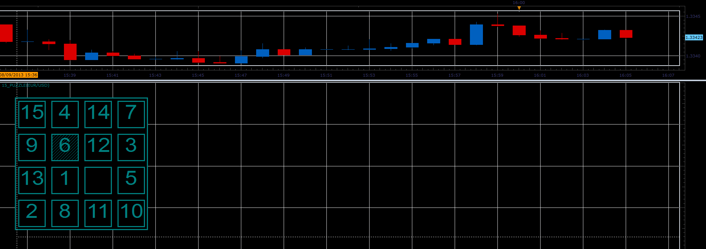

# 15-puzzle

> Source: https://fxcodebase.com/code/viewtopic.php?f=17&t=58830  
> Forum: 17 · Topic 58830 · 2 post(s)

---

## 15-puzzle

**Alexander.Gettinger** · Fri Aug 09, 2013 3:09 pm

The indicator is just a 15-puzzle game ([http://en.wikipedia.org/wiki/15_puzzle](https://en.wikipedia.org/wiki/15_puzzle)). Right-click and use context menu to make a turn and restart the game.

 

Download:

 [15_puzzle.lua](files/88194/15_puzzle.lua)

The indicator was revised and updated

---

## Re: 15-puzzle

**Apprentice** · Sat Jun 17, 2017 3:41 am

The indicator was revised and updated.
