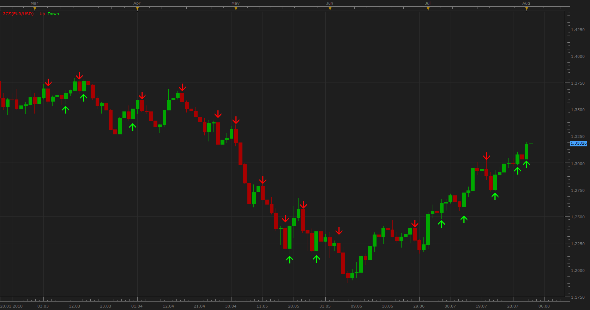
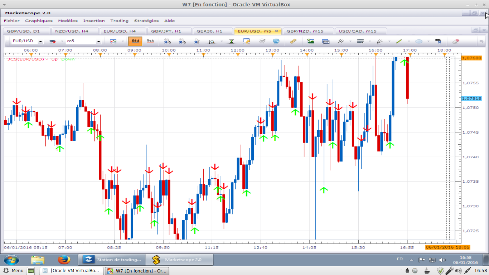
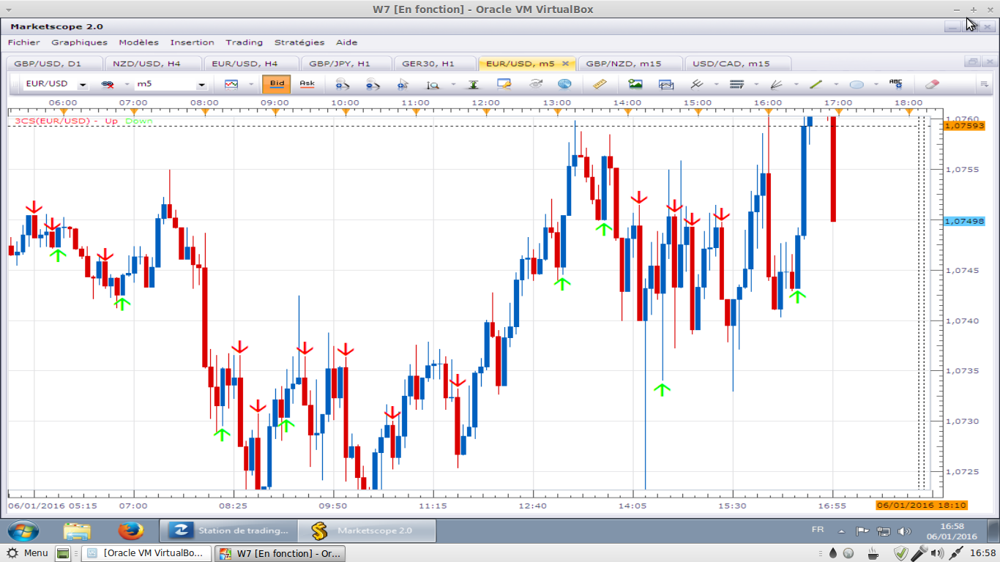

# 3 Candle signal Indicator

> Source: https://fxcodebase.com/code/viewtopic.php?f=17&t=1648  
> Forum: 17 · Topic 1648 · 5 post(s)

---

## 3 Candle signal Indicator

**Apprentice** · Mon Aug 02, 2010 11:51 pm

To go LONG
1. Body of the latest candle is greater than body of each of the 2 previous candles
2. Previous candle must be bearish
3. Close of latest candle is higher than close of the previous candle

To go SHORT
1. Body of the latest candle is greater than body of each of the 2 previous candles
2. Previous candle must be bullish
3. Close of latest candle is lower than close of the previous candle

 [3cs.lua](files/3284/3cs.lua)

Developed according to User request.

---

## Re: 3 Candle signal Indicator

**leftcoaster** · Tue Aug 03, 2010 4:41 pm

Hi,

Is this possible for this indicator...

I'd would like to see the larger timeframe indicator(arrows) be placed on a smaller timeframe chart. So for example, I want the arrows generated from the 4H to be place on the 5 minute chart. Larger timeframe to be an input parameter.

Reason for this is I'd like to analyze it in conjunction with your Trading Session Indicator (which does not apply to charts above 30min - btw, this indicator will not work for me on a 60 min chart, which I thought was suppose to).

Thanks for the great work & service your provide!

---

## Re: 3 Candle signal Indicator

**Avignon** · Thu Jan 07, 2016 4:26 pm

There are some false signals :

 

after refresh

 

---

## Re: 3 Candle signal Indicator

**Apprentice** · Fri Jan 08, 2016 4:17 am

Try it now.

"Show current period" parameter presented.
Logic Fix.

---

## Re: 3 Candle signal Indicator

**Apprentice** · Fri Oct 12, 2018 5:08 am

The indicator was revised and updated.
