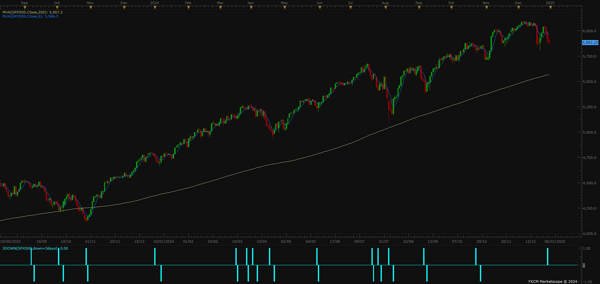
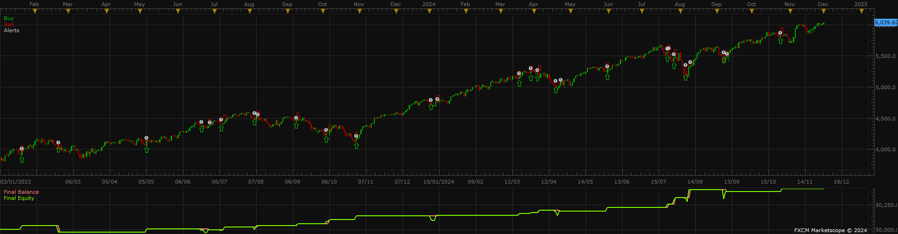
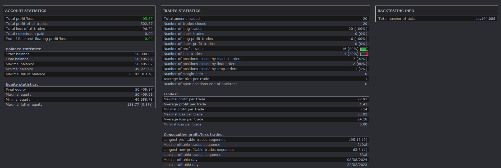
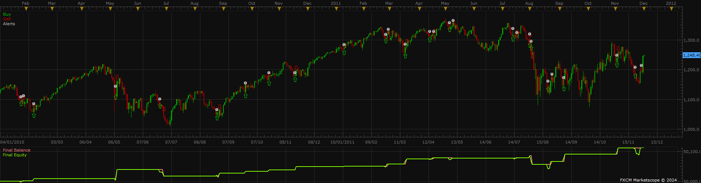

# 3 days down indicator

> Source: https://fxcodebase.com/code/viewtopic.php?f=17&t=75455  
> Forum: 17 · Topic 75455 · 2 post(s)

---

## 3 days down indicator

**Steve_W** · Tue Dec 31, 2024 2:54 pm

Hi all,

Here's a bare-bones oscillator indicator intended for use on stock indices.
It is based on this article [https://www.businessinsider.com/stock-trading-strategy-quant-fund-manager-competition-champion-sp500-return-2024-9](https://www.businessinsider.com/stock-trading-strategy-quant-fund-manager-competition-champion-sp500-return-2024-9) that describes Ivan Scherman's method.

Usage:
Daily timeframes
Stock indices (but may be of use on some other instruments)
3 down candles = look to go long at own discretion, as signalled by indicator
Exit on a close above a shorter moving average - or limit order.

Some enhancements have been added in particular looking at the quality of the last candle in the group - wick and body observation for momentum reversal assessment.
Comments in the code.

The signal frequency is quite low. Tuning doesn't seem too critical - across instruments and historical data. The default parameters were found for SPX500 on recent history.

I've included screenshots for my own strategy back-test - it requires appropriate money/risk management (I used quite a wide stop based on recent volatility). I may upload the strategy at a later date... more work needed.

Steve

 [3down.lua](files/157663/3down.lua)

 

*SPX500 daily*

 

*back-test chart and equity curve*

 

*back-test result - order size=1*

 

*back-test - same config for 2010-2011 data*

---

## Re: 3 days down indicator

**Apprentice** · Mon Jan 06, 2025 4:52 pm

Indicator-Based strategy.
[https://fxcodebase.com/code/viewtopic.php?f=31&t=75474](https://fxcodebase.com/code/viewtopic.php?f=31&t=75474)
