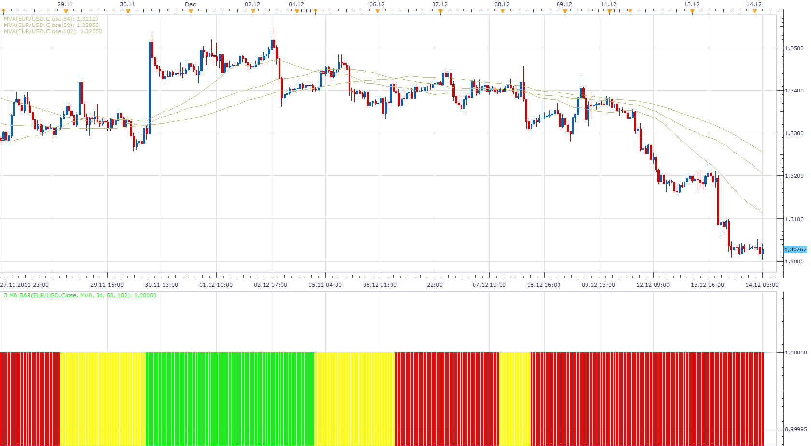

# 3 MA Bar Indicator

> Source: https://fxcodebase.com/code/viewtopic.php?f=17&t=9634  
> Forum: 17 · Topic 9634 · 37 post(s)

---

## 3 MA Bar Indicator

**Apprentice** · Wed Dec 14, 2011 3:47 am

3 MA bar indicator is based on 3 moving average.

ma1 > ma 2 > ma3 > ma4 > ma5 -------- green color
ma1 < ma2 < ma 3 < ma 4 < ma 5---------red color

 [3 MA Bar.lua](files/20603/3%20MA%20Bar.lua)

 [MTF MCP 5 MA Bar List.lua](files/20603/MTF%20MCP%205%20MA%20Bar%20List.lua)

MT4/MQ4 version
[viewtopic.php?f=38&t=65084&p=114855#p114855](https://fxcodebase.com/code/viewtopic.php?f=38&t=65084&p=114855#p114855)

---

## Re: 3 MA Bar Indicator

**mosesnobleraj** · Mon Dec 19, 2011 3:56 am

sir,

can you add following option in this indicator

1. price> ma1>ma2> ma 3 ---------- green color
2. price < ma1<ma2<ma3 ------------red color
3. otherwise ---------------yellow color

---

## Re: 3 MA Bar Indicator

**Apprentice** · Tue Dec 20, 2011 3:08 am

price> ma1>ma2> ma 3 ---------- green color
price < ma1<ma2<ma3 ------------red color
 otherwise ---------------yellow color

 [3 MA_Price Bar.lua](files/21276/3%20MA_Price%20Bar.lua)

---

## Re: 3 MA Bar Indicator

**mosesnobleraj** · Tue Dec 20, 2011 3:32 am

thank you sir.

---

## Re: 3 MA Bar Indicator

**blessing** · Wed Jan 18, 2012 5:11 pm

i request following strategy based on 3 ma price bar--**mtf 3 ma price bar strategy**

time frames: m15, h1, h4, d1

buy: h1 , h4, d1 bars are green and m15 bar change from yellow to green
sell: h1,h4,d1 bars are red and m15 bar change from yellow to red

---

## Re: 3 MA Bar Indicator

**BabyCoder** · Fri Jan 20, 2012 6:45 pm

Hi,

Can the super trend dot indicator be added to this one with the super trend ploted on the chart?

Thanks

---

## Re: 3 MA Bar Indicator

**Apprentice** · Tue Jan 24, 2012 10:28 am

To BabyCoder, can you describe with more detail your request.
About that indicator you are talking.

---

## Re: 3 MA Bar Indicator

**BabyCoder** · Wed Jan 25, 2012 10:13 am

Hi,

All I want is the 3 MA_Price indicator with the SuperTrend indicator confirming the trend and then an arrow signal showing which bar would have triggered a trade. Thanks

---

## Re: 3 MA Bar Indicator

**BabyCoder** · Thu Jan 26, 2012 11:58 am

As additional info, I would like the arrows (signals) to be similar to the SSL -supertrend indicator signals

In other words, the 3 ma-price bar indicator with super trend confirming the direction and arrows showing where conditions are met and signalling trade.

Kind regards

Babycoder

---

## Re: 3 MA Bar Indicator

**Apprentice** · Fri Jan 27, 2012 7:27 am

In addition to Standard 3 MA Price definition
price> ma1>ma2> ma 3 ---------- green color
price < ma1<ma2<ma3 ------------red color

This Indicator use Trend Indicator as an additional filter.
green color
price> ma1>ma2> ma 3
SuperTrend indicates Up Trend
red color
price < ma1<ma2<ma3
SuperTrend indicates Down Trend

 [3 MA_Price Bar with SuperTrend confirmation.lua](files/24368/3%20MA_Price%20Bar%20with%20SuperTrend%20confirmation.lua)

Please install super trend indicator, from here.
[viewtopic.php?f=17&t=3102&p=22191&hilit=super+trend#p22191](https://fxcodebase.com/code/viewtopic.php?f=17&t=3102&p=22191&hilit=super+trend#p22191)

 [3 MA_Price Bar with SuperTrend confirmation and Alert.lua](files/24368/3%20MA_Price%20Bar%20with%20SuperTrend%20confirmation%20and%20Alert.lua)

Dec 14, 2015: Compatibility issue Fixed. _Alert helper is not longer needed.

---

## Re: 3 MA Bar Indicator

**BabyCoder** · Sun Jan 29, 2012 8:03 pm

Hi,

You're a star!. Keep the good work

---

## Re: 3 MA Bar Indicator

**BabyCoder** · Sun Jan 29, 2012 8:09 pm

would you please suggest how this can be tested as 1. a signal and 2. as a strategy.
Once again, all your help is much appreciated. Kind regards

---

## Re: 3 MA Bar Indicator

**Apprentice** · Mon Jan 30, 2012 9:12 am

Unfortunately, currently it is not possible.
The appropriate strategy is not written.
The request, has not yet been given.

Specify for which the indicator you need it,
 specify the algorithm that such strategy should followed.

---

## Re: 3 MA Bar Indicator

**gator_trader** · Thu Feb 02, 2012 11:53 pm

Does this work in all time periods? I do not think it is working well in the 1 day time. Does anyone have better settings?

---

## Re: 3 MA Bar Indicator

**Apprentice** · Fri Feb 03, 2012 3:24 am

You can try to use Strategy Optimizer to find better Setings.
Generally, the parameters vary from time frame to time frame.
Currency pair to currency pair.

---

## Re: 3 MA Bar Indicator

**BabyCoder** · Fri Feb 10, 2012 1:10 pm

Hi,

I found out while testing the indicator, that when the indicator was supposed to show a sell signal, it displayed it as neutral. At times, I also noted that some of the buy signals were not triggered depiste meeting all conditions.

Please check the codes and keep up the good work.

Much appreciated

---

## Re: 3 MA Bar Indicator

**Apprentice** · Sun Feb 12, 2012 4:28 am

Not in my testing.
Can you re-read specification.

In addition to Standard 3 MA Price definition
price> ma1>ma2> ma 3 ---------- green color
price < ma1<ma2<ma3 ------------red color

This Indicator use Trend Indicator as an additional filter.
green color
price> ma1>ma2> ma 3
SuperTrend indicates Up Trend
red color
price < ma1<ma2<ma3
SuperTrend indicates Down Trend

---

## Re: 3 MA Bar Indicator

**newton** · Mon Feb 13, 2012 9:14 am

sir,

can you add atr in this indicator as follows

mva1>mva2>mva3- and mva1-mva2>atr[period 14, multiplier 1.5]---- green
mva1<mva2<mva3 and mva2-mva1> atr [period 14, multiplier 1.5]--- red

---

## Re: 3 MA Bar Indicator

**BabyCoder** · Mon Feb 13, 2012 8:39 pm

Hi,

Your description of the indicator is correct. I will load and test again. As you can see from the image posted, when the conditions for the sell were met, the signal remained yellow instead of red.

The strategy request for this indictor is as follows:

entry options (long): when conditions are met and bar is green, option to enter at the next bar or (n) bar with option to select number of pips from close of current bar.

exit options: options to select when price retracts back to any of the MAs and also option to have a trailing stop which would be the end of the current bar or previous bar (n)

I do hope this make sense.

Your good work is so appreciated. Thanks

---

## Re: 3 MA Bar Indicator

**kaya_171** · Tue Feb 14, 2012 6:11 am

Hi

Is it possible to write the same code for Ichimoku (ICH) with
1) tenkan sen > kijun sen > Senkou span B => green
tenkan sen < kijun sen < Senkou span B => red
neutral = yellow

2) price > tenkan sen > kijun sen > Senkou span B => green
price < tenkan sen < kijun sen < Senkou span B => red
neutral = yellow

Thanks in advance

Kaya

---

## Re: 3 MA Bar Indicator

**Apprentice** · Tue Feb 14, 2012 7:09 am

Your request is added to the developmental cue.

---

## Re: 3 MA Bar Indicator

**Apprentice** · Tue Feb 14, 2012 2:17 pm

Requested can be found here.
[viewtopic.php?f=17&t=13375](https://fxcodebase.com/code/viewtopic.php?f=17&t=13375)

---

## Re: 3 MA Bar Indicator with Super Trend Strategy

**BabyCoder** · Thu Mar 08, 2012 9:13 pm

Hi Apprentice,

As stated earlier, could the 3 MA bar with Supertrend indicator be converted into a strategy please.

The conditions are as follows:

Entry is at close of candle if price crosses smallest MA which is greater than the other 2 and confirmed by the Supertrend.

Entry option would be for x pips after end of candle (just like in the breakout strategy), and or N bar after this condition is met

Exit would be for following options: either one of the mid or higher MA or trailing SL at the close of N bar before current candle.

I hope this is all clear. All help is greatly appreciated. Kind regards

---

## Re: 3 MA Bar Indicator

**dtb71fxcm** · Thu Oct 11, 2012 1:19 am

Yes, that would be a great strategy! Please bump this request up in the queue
Thanks!

---

## Re: 3 MA Bar Indicator

**Apprentice** · Thu Oct 11, 2012 2:43 am

Your request is added to the development list.

---

## please add an audio alert

**SuperTrader** · Thu Feb 05, 2015 2:55 am

Hi. This is a truly **great**indicator... the "**3-MA Price bar with SuperTrend confirmation**" as a filter, on page 1 of this thread. **Excellent work** once again by Apprentice !!
Could you please just **add an alert** in its settings (a user-selectable "wav file", by making use of the "**_Alert.lua**" helper) when an arrow is printed on the chart ?
That would be totally awesome!
Thank you very much in advance!

---

## Re: 3 MA Bar Indicator

**Apprentice** · Sun Feb 08, 2015 2:02 am

Your request is added to the development list.

---

## Re: 3 MA Bar Indicator

**Apprentice** · Wed Feb 18, 2015 5:18 am

3 MA_Price Bar with SuperTrend confirmation and Alert Added.

---

## Re: 3 MA Bar Indicator

**ikhlaas** · Sun Feb 22, 2015 2:45 am

Hi Apprentice,

The 3 Price MA bar with Super trend confirmation indicator is a good one. Would it be possible to have it as a strategy as requested earlier by others. Much appreciated. Thanks.

---

## Re: 3 MA Bar Indicator

**Apprentice** · Mon Mar 09, 2015 5:45 am

For all interested ... MA_Price Bar and MA Bar will now support up to 5 moving averages.

---

## Re: 3 MA Bar Indicator

**cash4u** · Tue Mar 10, 2015 9:28 pm

hi,
can you create mtf mcp list ma indicator based on this indicator

---

## Re: 3 MA Bar Indicator

**Apprentice** · Wed Mar 11, 2015 5:19 am

MTF MCP 5 MA Bar List.lua Added.

---

## 5 MA price Bar Indicator resolution adjustment request

**rose123** · Mon Apr 20, 2015 12:18 pm

MAY I REQUEST TO ADJUST RESOLUTION OF 3 MA PRICE BAR LIKE PVA BAR AND MFI BAR

[http://www.fxcodebase.com/code/viewtopi ... =17&t=1968](http://www.fxcodebase.com/code/viewtopic.php?f=17&t=1968)

[http://www.fxcodebase.com/code/viewtopi ... 17&t=60177](http://www.fxcodebase.com/code/viewtopic.php?f=17&t=60177)

---

## Re: 3 MA Bar Indicator

**Apprentice** · Mon Dec 14, 2015 4:53 am

Dec 14, 2015: Compatibility issue Fixed. _Alert helper is not longer needed.

If you want to use updated version of this indicator,
please make sure to use TS Version 01.14.101415. or higher.

---

## Re: 3 MA Bar Indicator

**BadTunaSalad** · Tue Sep 12, 2017 1:27 pm

Is it possible for the 3 MA Bar histogram to be coded into MT4? Thank you.

BTS

---

## Re: 3 MA Bar Indicator

**Apprentice** · Wed Sep 13, 2017 5:21 am

Try this version.
[viewtopic.php?f=38&t=65084&p=114855#p114855](https://fxcodebase.com/code/viewtopic.php?f=38&t=65084&p=114855#p114855)

---

## Re: 3 MA Bar Indicator

**Apprentice** · Wed Aug 15, 2018 7:11 am

The Indicator was revised and updated.
