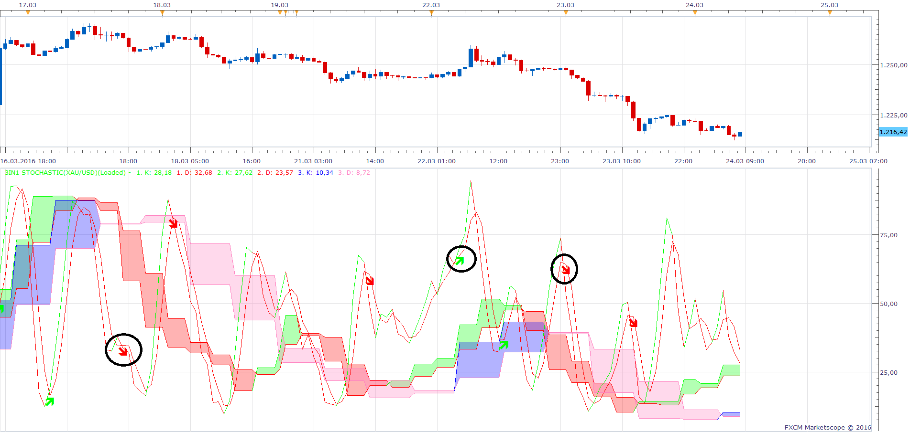

# 3 Time Frame Stochastic

> Source: https://fxcodebase.com/code/viewtopic.php?f=17&t=63215  
> Forum: 17 · Topic 63215 · 25 post(s)

---

## 3 Time Frame Stochastic

**Apprentice** · Fri Mar 04, 2016 5:10 am

Based on request.
[viewtopic.php?f=27&t=63212](https://fxcodebase.com/code/viewtopic.php?f=27&t=63212)
Will give the alert if all three time frames have same indication.

 [3 Time Frame Stochastic .lua](files/105115/3%20Time%20Frame%20Stochastic%20.lua)

The indicator was revised and updated

---

## 3in1 Stochastic

**Apprentice** · Thu Mar 24, 2016 4:20 am

 [3in1 Stochastic.lua](files/105428/3in1%20Stochastic.lua)

Mq4/MT4 version.
[viewtopic.php?f=38&t=64506](https://fxcodebase.com/code/viewtopic.php?f=38&t=64506)

---

## Re: 3 Time Frame Stochastic

**panos59** · Thu Mar 24, 2016 12:49 pm

I'm getting the followinfg error even if I have the TF equal to the chart TF..
"Failed to create the indicator '3IN1 STOCHASTIC' during the chart loading. The error details: C:/Program Files (x86)/Candleworks/FXTS2/Indicators/Custom/3in1 Stochastic.lua:203: The chosen time frame must be equal to or bigger than the chart time frame!."

---

## Re: 3 Time Frame Stochastic

**Apprentice** · Fri Mar 25, 2016 3:12 am

For example.
If you use the H1 cgart time frame.
You can select H1 and higher time frames.
m1 will not be allowed.

---

## Re: 3 Time Frame Stochastic

**panos59** · Fri Mar 25, 2016 10:17 am

I'm using H1 chart and the indicator settings are H1,H4 and D1..but I'm still getting the error message..

---

## Re: 3 Time Frame Stochastic

**panos59** · Sun Mar 27, 2016 6:26 am

is it possible to have oberbought/oversold horizontal lines ?

---

## Re: 3 Time Frame Stochastic

**Apprentice** · Mon Mar 28, 2016 7:30 am

OB/OS Line added.

---

## Re: 3 Time Frame Stochastic

**panos59** · Wed Mar 30, 2016 4:15 am

The 3in1 works nice right now..no errors..is it possible to make an alert/strategy ?

---

## Re: 3 Time Frame Stochastic

**Apprentice** · Wed Mar 30, 2016 6:52 am

Requested can be found here.
[viewtopic.php?f=31&t=63323&p=105568#p105568](https://fxcodebase.com/code/viewtopic.php?f=31&t=63323&p=105568#p105568)

---

## Re: 3 Time Frame Stochastic

**panos59** · Mon Apr 18, 2016 3:19 am

Does anybody knows if the 3in1 indicator repaints ? I have the "End Of Turn " on but it feels like repainting..any suggestions ?

---

## Re: 3 Time Frame Stochastic

**Apprentice** · Tue Apr 19, 2016 2:50 am

As it is implemented
will delay alert / indicator equally.

---

## Re: 3 Time Frame Stochastic

**mulligan** · Mon Jun 20, 2016 1:28 pm

This is a really good indicator. I can't seem to get the sound or dialog box alert to function. Your help would be appreciated.

Thanks

---

## Re: 3 Time Frame Stochastic

**mulligan** · Thu Jun 30, 2016 10:40 am

The dialog box and sound alert functions don't work (3 time frame not 3in1). Hope you can find the time to repair.

Thanks very much

---

## Re: 3 Time Frame Stochastic

**Apprentice** · Fri Jul 01, 2016 6:11 am

Indicator was NOT intended as a 3 in1 solution .

---

## Re: 3 Time Frame Stochastic

**Apprentice** · Wed Jul 27, 2016 5:22 am

Minor Update.

---

## Re: 3 Time Frame Stochastic

**Kilgharrah** · Wed Sep 28, 2016 4:08 pm

Hello, I wonder if you can add some true / false field to only show/alerts arrows when there is a change in trend sales to purchase or vice versa (see the attached picture) thanks in advance.

 

---

## Re: 3 Time Frame Stochastic

**Apprentice** · Sun Oct 02, 2016 3:48 am

Change Only parameter added.

---

## Re: 3 Time Frame Stochastic

**Kilgharrah** · Mon Oct 03, 2016 7:32 am

I have no words to thank, now add to the strategy would be wonderful , thank you very much again.

---

## Re: 3 Time Frame Stochastic

**Apprentice** · Tue Oct 04, 2016 1:57 am

Strategy is available here.
[viewtopic.php?f=31&t=63323&p=105568#p105568](https://fxcodebase.com/code/viewtopic.php?f=31&t=63323&p=105568#p105568)

---

## Re: 3 Time Frame Stochastic

**mulligan** · Tue Oct 04, 2016 2:55 pm

Does the strategy you referred kilgharrah to have the "change only" option? I loaded and looked, but didn't see it. The 3 time frame stochastic strategy with a change only option would be fantastic.

Many thanks for all you and your team do for us traders.

---

## Re: 3 Time Frame Stochastic

**mulligan** · Tue Oct 04, 2016 3:18 pm

My apologies, the 3 time frame stochastic and 3in 1 stochastic discussions are a bit combined. The "change only" and strategy I'm referring to is the 3 in 1 stochastic, not 3 time frame.
Thanks

---

## Re: 3 Time Frame Stochastic

**Kilgharrah** · Wed Oct 05, 2016 3:26 pm

Hello, regarding the added parameter **Change Only**, there is a small bug(not always), which appears with the option **End Of Turn** and not with the **Live** option.
and say I wrote [this](https://fxcodebase.com/code/viewtopic.php?f=31&t=63323&p=105568#p108404)other message in the wrong place. Thank you.

---

## Re: 3 Time Frame Stochastic

**Apprentice** · Fri Oct 07, 2016 4:06 am

Do you use live / demo or simulator?

---

## Re: 3 Time Frame Stochastic

**Kilgharrah** · Fri Oct 07, 2016 6:35 am

Hi, that image was **simulator**, but I'm almost sure I saw in **live**situation too. On the other side something strange is that sometimes an arrow shown in **End of turn** but to reload a bit later the indicator arrow is no longer visible.

---

## Re: 3 Time Frame Stochastic

**Apprentice** · Tue Mar 13, 2018 11:03 am

The indicator was revised and updated
