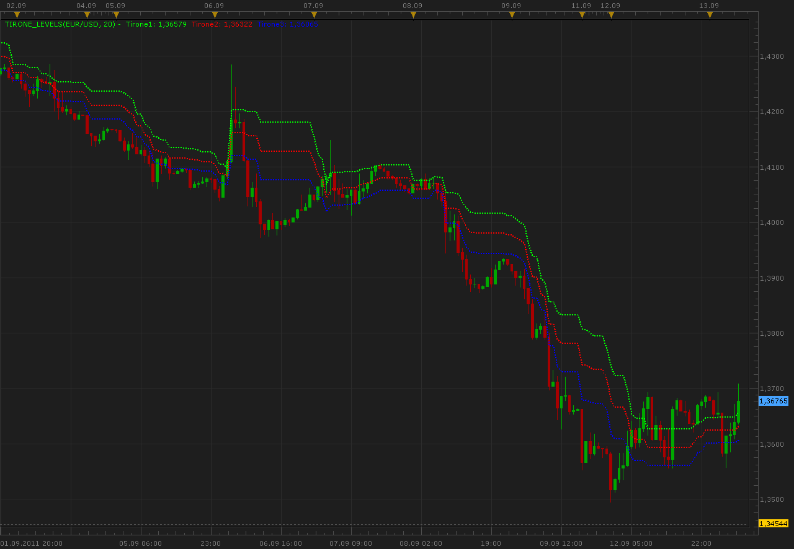

# 3 Tirone's levels

> Source: https://fxcodebase.com/code/viewtopic.php?f=17&t=6513  
> Forum: 17 · Topic 6513 · 2 post(s)

---

## 3 Tirone's levels

**Alexander.Gettinger** · Tue Sep 13, 2011 6:59 am

This indicator is a ported MQL5 indicator from [http://www.mql5.com/ru/code/457](http://www.mql5.com/ru/code/457) (in Russian).

This method of technical analysis developed by John Tirone in his book "Classical Technical Analysis as a Powerful Trading Methodology".

Formulas:
Tirone Level 1 = Hhigh - (Hhigh-Llow)/3
Tirone Level 2 = Llow + (Hhigh-Llow)/2
Tirone Level 3 = Llow + (Hhigh-Llow)/3, where
Hhigh and Llow is a maximum and minimum prices in the range from i-Period to i.

 

Download:

 [Tirone_Levels.lua](files/14878/Tirone_Levels.lua)

The indicator was revised and updated

---

## Re: 3 Tirone's levels

**Apprentice** · Thu Mar 16, 2017 2:20 pm

Indicator was revised and updated.
