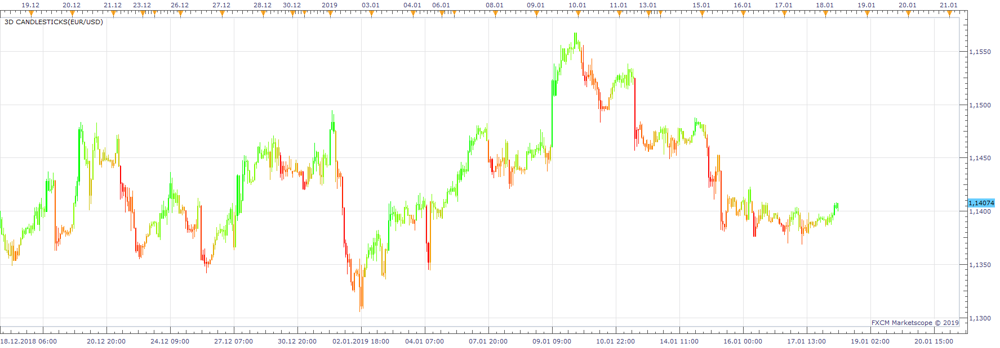
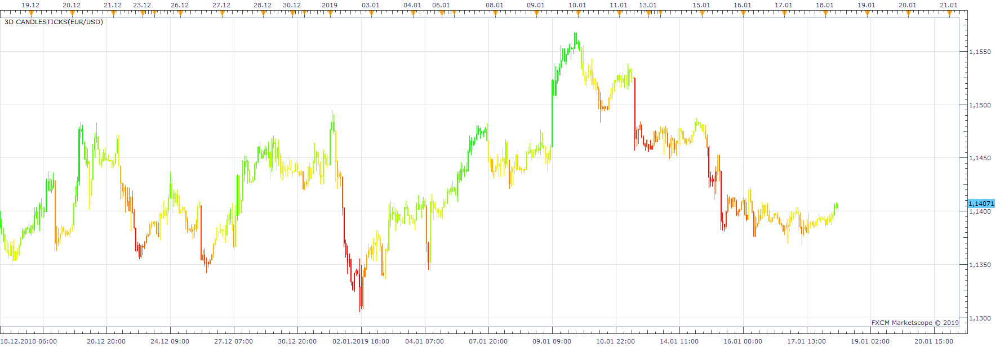
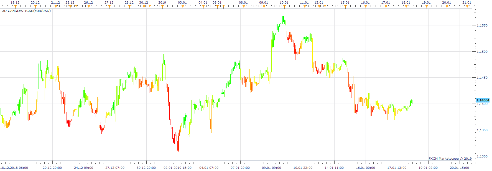
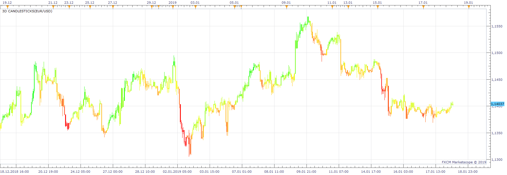

# 3D Candlesticks

> Source: https://fxcodebase.com/code/viewtopic.php?f=17&t=67283  
> Forum: 17 · Topic 67283 · 3 post(s)

---

## 3D Candlesticks

**Apprentice** · Fri Jan 18, 2019 9:36 am

 

 

 

 [3D Candlesticks.lua](files/123432/3D%20Candlesticks.lua)

---

## Re: 3D Candlesticks

**Apprentice** · Sun Sep 18, 2022 2:31 am

Another take based on 5D Candlesticks
[https://www.prorealcode.com/prorealtime ... indicator/](https://www.prorealcode.com/prorealtime-indicators/5d-candlesticks-and-line-indicator/)

 [5D Candlesticks.lua](files/147469/5D%20Candlesticks.lua)

Cycle indicator
[https://fxcodebase.com/code/viewtopic.php?f=17&t=72728](https://fxcodebase.com/code/viewtopic.php?f=17&t=72728)

---

## Re: 3D Candlesticks

**Apprentice** · Tue Sep 20, 2022 2:21 am

Cycle indicator added to the 5D Candlesticks.
