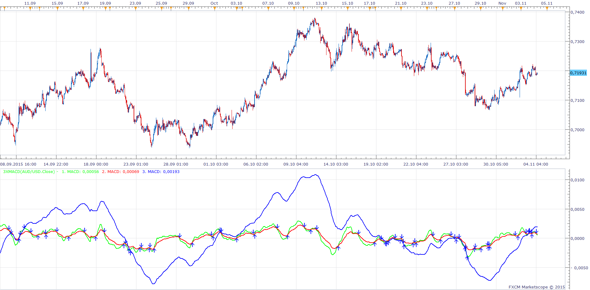

# 3xMACD

> Source: https://fxcodebase.com/code/viewtopic.php?f=17&t=62855  
> Forum: 17 · Topic 62855 · 5 post(s)

---

## 3xMACD

**Apprentice** · Wed Nov 04, 2015 7:17 am

Based on request.
[viewtopic.php?f=27&t=62848](https://fxcodebase.com/code/viewtopic.php?f=27&t=62848)
Will show three MACD lines.

 [3xMACD.lua](files/103182/3xMACD.lua)

The indicator was revised and updated

---

## Re: 3xMACD

**rose123** · Sat Nov 07, 2015 5:19 am

hi apprendice,
can you create a strategy based on this indicator,

3x macd with default parameter.

buy level:0
buy exit level: 0.005
sell level:0
sell exit level: -.005(for eurusd)

**buy: macd3> buy level and macd3< buy exit level and macd2> buy level and macd1 cross over macd 2
sell: macd3< sell level and macd3> sell exit level and macd2<sell level and macd1 cross under macd2**

---

## Re: 3xMACD

**Apprentice** · Mon Nov 09, 2015 6:41 am

Requested can be found here.
[viewtopic.php?f=31&t=62865](https://fxcodebase.com/code/viewtopic.php?f=31&t=62865)

---

## Re: 3xMACD

**Apprentice** · Thu Dec 03, 2015 7:34 am

Compatibility issue Fix.
_Alert helper is not longer needed.

---

## Re: 3xMACD

**Apprentice** · Sat Aug 05, 2017 4:10 am

The indicator was revised and updated.
