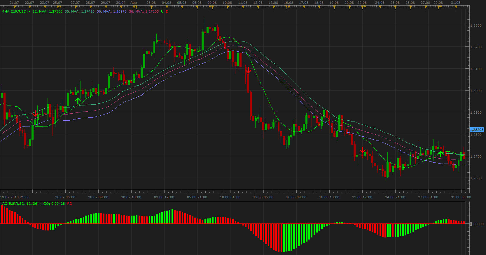

# 4 MA

> Source: https://fxcodebase.com/code/viewtopic.php?f=17&t=2020  
> Forum: 17 · Topic 2020 · 8 post(s)

---

## 4 MA

**Apprentice** · Thu Sep 02, 2010 6:01 am

 

Long
Short MA CrossOver Long MA Low and Close

Short
Short MA CrossOver Long MA High and Close

AO can be used as confirmation.

 [4MA.lua](files/4124/4MA.lua)

The indicator was revised and updated

---

## Re: 4 MA

**Apprentice** · Thu Sep 02, 2010 8:14 am

Update

---

## Re: 4 MA

**Pipsology** · Thu Sep 02, 2010 9:17 am

Hello Apprentice

Thank you for this indicator it’s great. I have noticed some false positives though,

I have signals generating after the fast MA crosses the slow at high without waiting for it to cross slow at close.

The following conditions should be met before a sell or buy signal is generated

Short (Sell) = the fast MA must cut across the slow MA 1 at High then MA 2 at close

Long (Buy) = the fast MA must cut across MA 3 at Low then MA 2 at close

This means that for any signal to be generated, the MA 2 (Close) has to be crossed after crossing High or Low MA.

Thank you

Please forgive me am very bad at instructions

---

## Re: 4 MA

**Alexander.Gettinger** · Thu Jan 08, 2015 4:52 pm

MQL4 version of 4 MA indicator: [viewtopic.php?f=38&t=61688](https://fxcodebase.com/code/viewtopic.php?f=38&t=61688).

---

## Re: 4 MA

**Apprentice** · Thu Aug 03, 2017 6:00 am

The indicator was revised and updated.

---

## Re: 4 MA

**bartwas1** · Fri Aug 04, 2017 5:07 am

Hi
Could anybody please tell me where could I download AO version shown in the first post?
Thanks in advance.

---

## Re: 4 MA

**Apprentice** · Fri Aug 04, 2017 8:14 am

[viewtopic.php?f=17&t=19&hilit=Awesome+Oscillator](https://fxcodebase.com/code/viewtopic.php?f=17&t=19&hilit=Awesome+Oscillator)

---

## Re: 4 MA

**bartwas1** · Mon Aug 07, 2017 3:32 am

Thanks Apprentice for your assistance.
