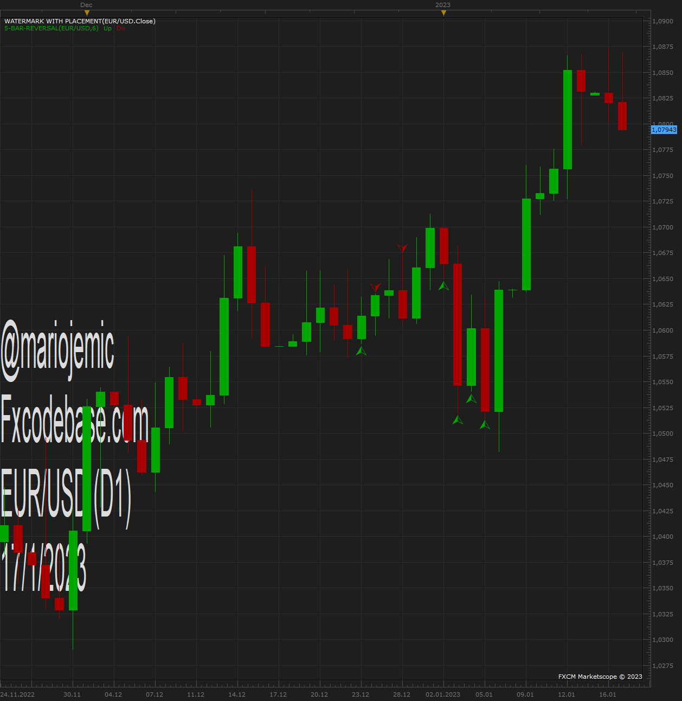
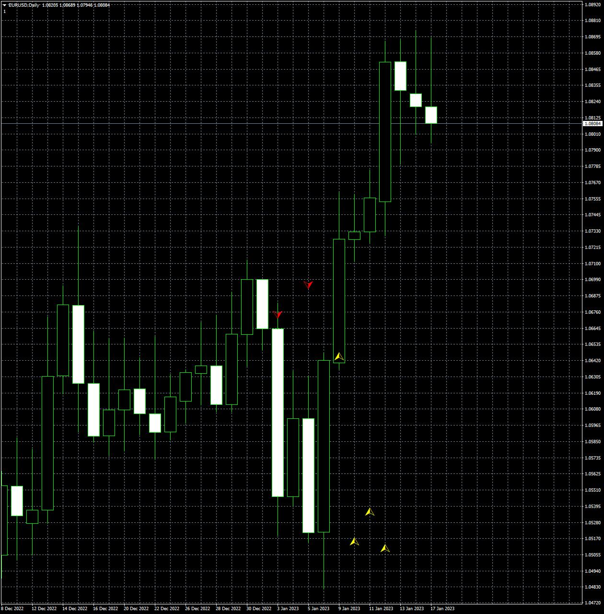

# 5-bar-reversal

> Source: https://fxcodebase.com/code/viewtopic.php?f=17&t=73145  
> Forum: 17 · Topic 73145 · 9 post(s)

---

## 5-bar-reversal

**Apprentice** · Sat Jan 07, 2023 7:34 am

Based on the request.
[https://fxcodebase.com/code/viewtopic.php?f=17&t=73107](https://fxcodebase.com/code/viewtopic.php?f=17&t=73107)

 [5-bar-reversal.lua](files/148964/5-bar-reversal.lua)

---

## Re: 5-bar-reversal

**ahmedalhosenyy** · Wed Jan 11, 2023 4:08 pm

Hello ,
I found another version of the indicator there are shift in signal " 5 bars "

Which one is the right indicator

Attached the two indicators
Thanks in advance

---

## Re: 5-bar-reversal

**Apprentice** · Thu Jan 12, 2023 4:25 am

The one, that gives you better signals.

---

## Re: 5-bar-reversal

**ahmedalhosenyy** · Thu Jan 12, 2023 2:44 pm

> **Apprentice wrote:**
> The one, that gives you better signals.

You are right
Kindly may you change the LUA indicator code to match "5 bar reversal v1[real][1].5.mq4"

Thanks inadvance

---

## Re: 5-bar-reversal

**Apprentice** · Sun Jan 15, 2023 4:44 am

We have added your request to the development list.
Development reference 44.

---

## Re: 5-bar-reversal

**Apprentice** · Tue Jan 17, 2023 11:16 am

 

Try it now.
The main difference between the two implementations,
the period used in calculation is greater for 1.

I have intentionally shifted signals X bars back,
on the actual candle, based on which signal is given.

---

## Re: 5-bar-reversal

**ahmedalhosenyy** · Tue Jan 17, 2023 2:47 pm

Many Thanks

---

## Re: 5-bar-reversal

**ahmedalhosenyy** · Wed Jan 18, 2023 2:50 pm

Hello ,

The problem is the indicator gives its signals after it moves by 5 bars " it gives a delayed signal "

the new version still give the delayed signal.

Note : May you approve posts a little faster it takes days and a forgot where and what i posted

if the approval step is mandatory could you add an option allow us to see our pending posts , it will be handy

---

## Re: 5-bar-reversal

**Apprentice** · Fri Jan 20, 2023 11:41 am

It is what it is,
signals are delayed for X periods.
You can try to use different parameters.
