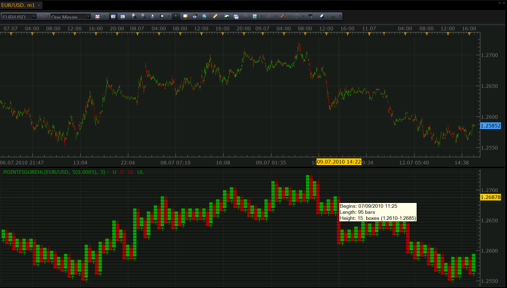

# A kind of Point and Figure (X&O) diagram.

> Source: https://fxcodebase.com/code/viewtopic.php?f=17&t=1361  
> Forum: 17 · Topic 1361 · 6 post(s)

---

## A kind of Point and Figure (X&O) diagram.

**Nikolay.Gekht** · Thu Jun 17, 2010 3:47 pm

Updated Jul, 12:
a) New calculation algorithm from the book of Thomas J. Dorsey "POINT AND FIGURE CHARTING". As a result, both High and Low prices are taken into account during the calculation and the first bar detecting algo is much improved.
b) Width of each X or O bar can be specified in a number of price bars. The 0 value stretches X-O diagram to the width of the original chart, so, for example, you can see the whole source price as well as the whole X-O diagram in the convenient view.
c) The algo of updating of the chart when a new price bar appears is fixed, so the chart does not become broken anymore.

There is an implementation of the point and figure diagram, which, I hope, can be used until some default solution is implemented in the Marketscope.

The indicator shows colored bars instead of X and O's, but, as far as I can see is easy to read and to use.

To see the detailed information (when bar is started, how long is it, how much boxes does it contain) just move the cursor to the arrow at the beginning of the bar. The information will be show in the tooltip.

Read on how point and figure diagram is created and used, please follow this link:
[http://stockcharts.com/school/doku.php? ... pnf_charts](http://stockcharts.com/school/doku.php?id=chart_school:chart_analysis:pnf_charts)

Also, please not forget that the time axis means nothing for the point and figure diagram. It is always shown ending at the most recent completely closed bar on the chart.

 

Download:

 [PointFigureHL.lua](files/2618/PointFigureHL.lua)

The indicator was revised and updated

---

## Re: A kind of Point and Figure (X&O) diagram.

**soridaijin** · Mon Jul 05, 2010 2:00 pm

Thank you very much Nikolay for coding this Point & Figure indicator. It looks like it was a lot of work judging from the length of code - much appreciated.

At least on my first few attempts to use the indicator there seems to be a small problem:-

The indicator loads fine, with nice looking point & figure columns, but, once the price data updates, say after 5mins or whatever period one has chosen, all the point & figure columns apart from the latest column get conflated - i.e. up and down elements overlap in the same column. I guess that is not your intention, and there is maybe an issue with the coding for the way the program handles a data refresh....?

Would be nice if this is not a big problem to resolve...

Thank you very much for all your work.

---

## Re: A kind of Point and Figure (X&O) diagram.

**Nikolay.Gekht** · Mon Jul 05, 2010 4:57 pm

Thank you for the information. I'll check the problem as soon as possible.

---

## Re: A kind of Point and Figure (X&O) diagram.

**Nikolay.Gekht** · Mon Jul 12, 2010 12:25 pm

Updated. Please see the first point of the topic for details.

---

## Re: A kind of Point and Figure (X&O) diagram.

**soridaijin** · Wed Jul 28, 2010 11:35 am

Been away for a couple of weeks, so exciting to find today that you have rewritten the Point of Figure code Nikolay. Thank you so much! The new version works very well, and the enhancement to change the column width is very helpful in order to compare the Point & Figure diagram with the original price data clearly. I am looking forward to testing the indicator in action.

---

## Re: A kind of Point and Figure (X&O) diagram.

**Apprentice** · Mon Jan 16, 2017 7:08 am

Bump up.
