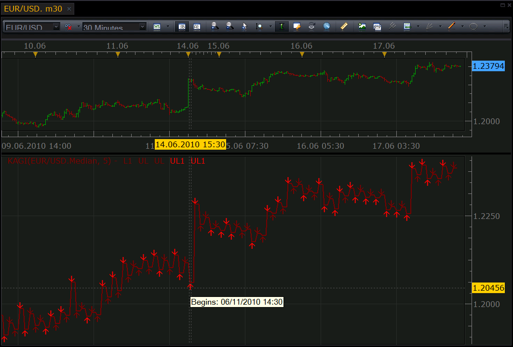

# A kind of Kagi chart

> Source: https://fxcodebase.com/code/viewtopic.php?f=17&t=1362  
> Forum: 17 · Topic 1362 · 8 post(s)

---

## A kind of Kagi chart

**Nikolay.Gekht** · Thu Jun 17, 2010 5:19 pm

There is a version of the Kagi charts. Read more about Kagi charts here: [http://en.wikipedia.org/wiki/Kagi_chart](https://en.wikipedia.org/wiki/Kagi_chart)

Please note that Kagi chart does not depend on the time axis. To the the date and time when another Kagi segment is started, please move the mouse cursor the the arrow at the beginning of the segment. The date and time will be shown in the tooltip.

Parameters:
Sensitivity: the sensitivity of switch in expressed points
Length: the length of one segment in bars. Please note, this is not length of the source price, just a number of bars to draw one segment.

The lighter arrow is shown in case the segment is above (below) the previous segment of the same direction.

 



```lua
-- Indicator profile initialization routine
-- Defines indicator profile properties and indicator parameters
function Init()
    indicator:name("Kagi Chart");
    indicator:description("");
    indicator:requiredSource(core.Bar);
    indicator:type(core.Oscillator);

    indicator.parameters:addDouble("S", "Sensitivity in points", "", 5, 0.1, 100);
    indicator.parameters:addInteger("L", "Length in bars", "", 2, 1, 10);
    indicator.parameters:addString("PT", "Price type", "", "M");
    indicator.parameters:addStringAlternative("PT", "High", "", "H");
    indicator.parameters:addStringAlternative("PT", "Low", "", "L");
    indicator.parameters:addStringAlternative("PT", "Close", "", "C");
    indicator.parameters:addStringAlternative("PT", "Median", "", "M");
    indicator.parameters:addStringAlternative("PT", "Typical", "", "T");
    indicator.parameters:addStringAlternative("PT", "Weigthed", "", "W");

    indicator.parameters:addColor("LI", "Line color", "", core.rgb(128, 0, 0));
    indicator.parameters:addColor("LH", "Highlight color", "", core.rgb(255, 0, 0));
end

-- Indicator instance initialization routine
-- Processes indicator parameters and creates output streams
-- Parameters block
local S, L;
local LI, UL, DL, UL1, DL1;
local first;
local source = nil;
local price = nil;
local pip;
local host;

-- Streams block

-- Routine
function Prepare()
    source = instance.source;
    -- size of the box in pips
    S = instance.parameters.S * source:pipSize();
    L = instance.parameters.L;

    first = source:first();
    host = core.host;

    if instance.parameters.PT == "H" then
        price = source.high;
    elseif instance.parameters.PT == "L" then
        price = source.low;
    elseif instance.parameters.PT == "C" then
        price = source.close;
    elseif instance.parameters.PT == "M" then
        price = source.median;
    elseif instance.parameters.PT == "T" then
        price = source.typical;
    elseif instance.parameters.PT == "W" then
        price = source.weighted;
    end

    local name = profile:id() .. "(" .. price:name() .. ", " .. instance.parameters.S .. ")";
    instance:name(name);

    LI = instance:addStream("L1", core.Line, name .. ".L1", "L1", instance.parameters.LI, first);
    UL = instance:createTextOutput ("UL", "UL", "Wingdings", 8, core.H_Center, core.V_Top, instance.parameters.LI, 0);
    DL = instance:createTextOutput ("UL", "UL", "Wingdings", 8, core.H_Center, core.V_Bottom, instance.parameters.LI, 0);
    UL1 = instance:createTextOutput ("UL1", "UL1", "Wingdings", 8, core.H_Center, core.V_Top, instance.parameters.LH, 0);
    DL1 = instance:createTextOutput ("UL1", "UL1", "Wingdings", 8, core.H_Center, core.V_Bottom, instance.parameters.LH, 0);
end

local lastdate = nil;
local laststart = nil;

-- Indicator calculation routine
function Update(period)
    if lastdate ~= nil and lastdate > source:date(period) then
        lastdate = nil;
    end

    if period == source:size() - 1 then
        -- recalculate for the latest candle only
        if source:isAlive() then
            if lastdate == nil or lastdate ~= source:date(period) then
                lastdate = source:date(period);
                period = period - 1;
            else
                -- the last candle is still changing
                return ;
            end
        end
    else
        -- do not work until the collection is finished
        return ;
    end

    if period <= first then
        return ;
    end

    local i, kagi, start, count;
    kagi = {};
    start = {};
    count = 0;

    kagi[count] = price[first];
    start[count] = price:date(first);

    -- calcute kagi
    for i = first + 1, period, 1 do
        if count == 0 then
            if price[i] >= kagi[count] + S then
                count = count + 1;
                kagi[count] = price[i];
                start[count] = price:date(i);
            elseif price[i] <= kagi[count] - S then
                count = count + 1;
                kagi[count] = price[i];
                start[count] = price:date(i);
            end
        else
            if kagi[count] > kagi[count - 1] then
                if price[i] > kagi[count] then
                    kagi[count] = price[i];
                elseif price[i] < kagi[count] - S then
                    count = count + 1;
                    kagi[count] = price[i];
                    start[count] = price:date(i);
                end
            elseif kagi[count] < kagi[count - 1] then
                if price[i] < kagi[count] then
                    kagi[count] = price[i];
                elseif price[i] > kagi[count] + S then
                    count = count + 1;
                    kagi[count] = price[i];
                    start[count] = price:date(i);
                end
            end
        end
    end
    -- draw kagi
    local size1 = L;
    local i, j, p, date, label, previous, b2, b3, level;
    p = period - (count + 1) * size1;
    if laststart ~= nil then
        for i = math.max(laststart, 0), math.min(source:size(), p), 1 do
            LI[i] = nil;
            UL:setNoData(i);
            DL:setNoData(i);
            UL1:setNoData(i);
            DL1:setNoData(i);
        end
    end
    laststart = p;
    for i = 0, count, 1 do
        if p >= first then
            if i > 1 then
                date = core.dateToTable(host:execute("convertTime", 1, 4, start[i]));
                label = string.format("Begins: %02i/%02i/%02i %02i:%02i", date.month, date.day, date.year, date.hour, date.min);
                if kagi[i] > kagi[i - 1] then
                    if i > 2 and kagi[i] > kagi[i - 2] then
                        UL1:set(p, kagi[i], "\226", label);
                    else
                        UL:set(p, kagi[i], "\226", label);
                    end
                else
                    if i > 2 and kagi[i] < kagi[i - 2] then
                        DL1:set(p, kagi[i], "\225", label);
                    else
                        DL:set(p, kagi[i], "\225", label);
                    end
                end
            end
            for j = 0, size1 - 1, 1 do
                LI[p + j] = kagi[i];
            end
        end
        p = p + size1;
    end
end
```

 [kagi.lua](files/2620/kagi.lua)

 [kagi_alert.lua](files/2620/kagi_alert.lua)

---

## Re: A kind of Kagi chart

**clodhoppes** · Tue Aug 31, 2010 3:08 am

Nice indicator. Thank you for your contribution, but I encountered a problem. Kagi chart does not update when a new period starts.

---

## Re: A kind of Kagi chart

**Apprentice** · Tue Aug 31, 2010 3:58 am

Just like P&F charts, Kagi charts only add a new vertical line when prices have reversed enough to cancel the current uptrend or downtrend.

The period between Kagi change is not in direct connection with the lapse of time.
The time between changes is not fixed.

---

## Re: A kind of Kagi chart

**clodhoppes** · Tue Aug 31, 2010 7:32 am

Sorry that I didn't make it clear. I found kagi charts did not update even after many periods. However, after I updated the chart window, the Kagi chart had added several new arrows. It's a surpise to me.

---

## Re: Kagi Charts

**gpfd1985** · Tue May 31, 2016 2:42 pm

Is it possible to add an email/text alert to a kagi chart when the chart changes from thick to thin and thin to thick. I'm not looking for a new or customized kagi chart only an alert when theres a change in thickness
Thank you

---

## Re: A kind of Kagi chart

**Apprentice** · Wed Jun 01, 2016 3:28 am

Your request is added to the development list.

---

## Re: A kind of Kagi chart

**Apprentice** · Thu Jul 28, 2016 1:38 pm

kagi_alert.lua added.

---

## Re: A kind of Kagi chart

**Apprentice** · Mon Sep 24, 2018 10:21 am

The indicator was revised and updated.
