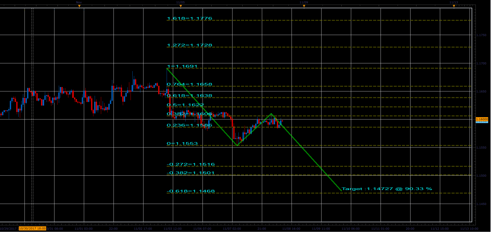

# ABCD Automatic Fibonacci Expansion

> Source: https://fxcodebase.com/code/viewtopic.php?f=17&t=64032  
> Forum: 17 · Topic 64032 · 6 post(s)

---

## ABCD Automatic Fibonacci Expansion

**Apprentice** · Thu Oct 27, 2016 9:40 am

Based on the request.
[viewtopic.php?f=27&t=64030](https://fxcodebase.com/code/viewtopic.php?f=27&t=64030)

 [ABCD Automatic Fibonacci Expansion .lua](files/108822/ABCD%20Automatic%20Fibonacci%20Expansion%20.lua)

---

## Re: ABCD Automatic Fibonacci Expansion

**oldporkchops2** · Sun Dec 18, 2016 9:25 pm

Thanks for this fabulous indicator, Apprentice!

When you have time, could you please see if you could please add the retracements?

---

## Re: ABCD Automatic Fibonacci Expansion

**Apprentice** · Mon Dec 19, 2016 11:39 am

Your request is added to the development list, Under Id Number 3699
 If someone is interested to do this task, please contact me.

---

## Re: ABCD Automatic Fibonacci Expansion

**Alexander.Gettinger** · Wed Nov 08, 2017 12:01 pm

> **oldporkchops2 wrote:**
> Thanks for this fabulous indicator, Apprentice!
>
> When you have time, could you please see if you could please add the retracements?

Please try this version of the indicator.

 

Download:

 [ABCD Automatic Fibonacci Expansion 2.lua](files/115936/ABCD%20Automatic%20Fibonacci%20Expansion%202.lua)

---

## Re: ABCD Automatic Fibonacci Expansion

**Apprentice** · Mon Apr 09, 2018 6:21 am

The Indicator was revised and updated.

---

## Expansion not so long?

**gosdar** · Mon Oct 29, 2018 4:19 am

Hi! Thanks share this good indicator of "ABCD Automatic Fibonacci Expansion".
Could you revised it and do not let expansion not so long?
Too long will let it not so come ture!
Thanks for your time.
