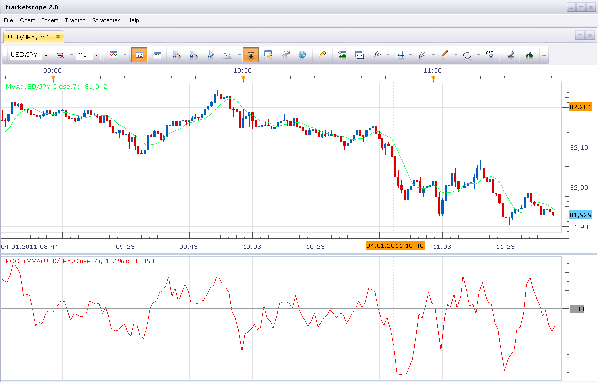
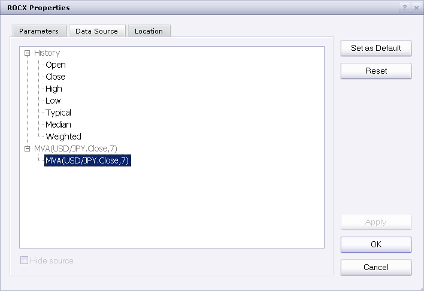

# Absolute Rate Of Change Value

> Source: https://fxcodebase.com/code/viewtopic.php?f=17&t=3095  
> Forum: 17 · Topic 3095 · 3 post(s)

---

## Absolute Rate Of Change Value

**Nikolay.Gekht** · Tue Jan 04, 2011 11:37 am

The simple indicator which shows absolute or relative change of the chosen source (could be either price or result of another indicator).

The positive value means up direction, the negative value means down direction. Bigger value means faster change.

Very similar to classic ROC (Rate of Change) indicator, but calculates the value as
`(current - previous) / previous` rather than `(current / previous - 1)`.

The indicator has three display modes:
1) Absolute value
2) Percent against previous value
3) 1/10 of percent against previous value

 

Download:

 [ROCX.lua](files/7211/ROCX.lua)

The indicator was revised and updated

Note: To apply the indicator on results of the indicator use "Source" tab of the indicator properties:

 

---

## Re: Absolute Rate Of Change Value

**Alexander.Gettinger** · Mon Dec 22, 2014 10:19 am

MQL4 version of Absolute Rate Of Change Value indicator: [viewtopic.php?f=38&t=61624](https://fxcodebase.com/code/viewtopic.php?f=38&t=61624).

---

## Re: Absolute Rate Of Change Value

**Apprentice** · Tue Jul 18, 2017 7:30 am

The indicator was revised and updated.
