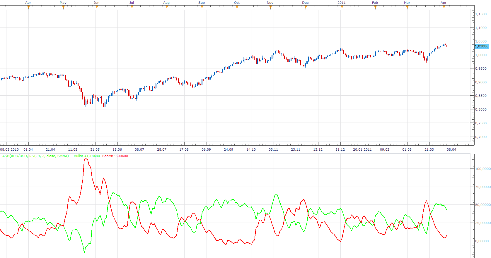

# Absolute Strength Histogram (ASH)

> Source: https://fxcodebase.com/code/viewtopic.php?f=17&t=3836  
> Forum: 17 · Topic 3836 · 3 post(s)

---

## Absolute Strength Histogram (ASH)

**Apprentice** · Tue Apr 05, 2011 6:46 am

 [ASH.lua](files/9377/ASH.lua)

A different version of ASH can be found here.
[viewtopic.php?f=17&t=2987&p=6869&hilit=Absolute+Strength#p6869](https://fxcodebase.com/code/viewtopic.php?f=17&t=2987&p=6869&hilit=Absolute+Strength#p6869)

The indicator was revised and updated

---

## Re: Absolute Strength Histogram (ASH)

**Alexander.Gettinger** · Tue Nov 25, 2014 11:41 am

MQL4 version of ASH oscillator: [viewtopic.php?f=38&t=61541](https://fxcodebase.com/code/viewtopic.php?f=38&t=61541).

---

## Re: Absolute Strength Histogram (ASH)

**Apprentice** · Mon Jun 26, 2017 10:21 am

The indicator was revised and updated.
