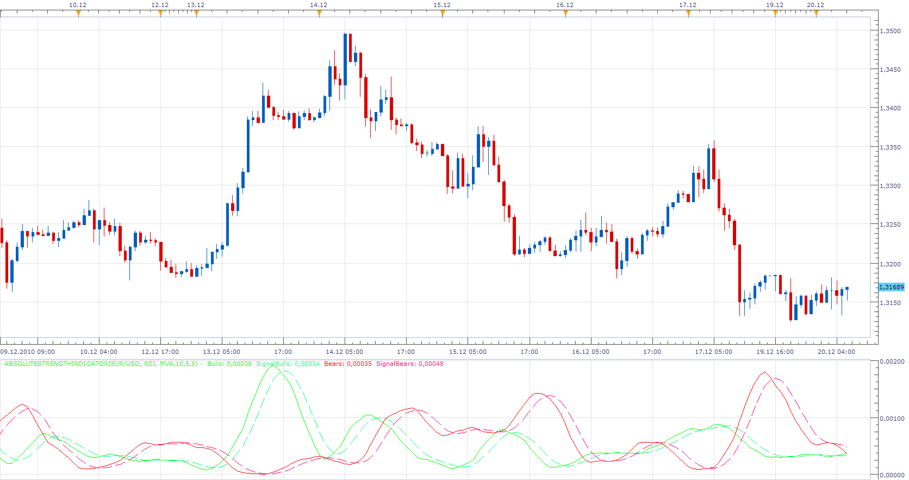
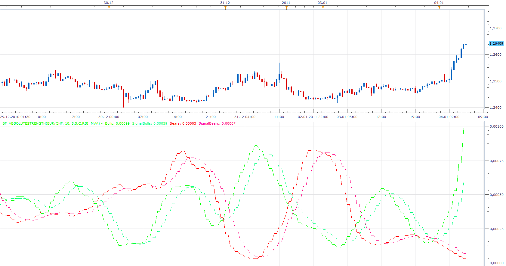

# Absolute Strength Indicator

> Source: https://fxcodebase.com/code/viewtopic.php?f=17&t=2987  
> Forum: 17 · Topic 2987 · 29 post(s)

---

## Absolute Strength Indicator

**Apprentice** · Mon Dec 20, 2010 6:53 am

Bar Version

 [AbsoluteStrengthIndicator.lua](files/6869/AbsoluteStrengthIndicator.lua)

 [AbsoluteStrengthIndicator With Alert.lua](files/6869/AbsoluteStrengthIndicator%20With%20Alert.lua)

Tick Version

 [AS.lua](files/6869/AS.lua)

MT4/MQ4 version.
[viewtopic.php?f=38&t=69191](https://fxcodebase.com/code/viewtopic.php?f=38&t=69191)

---

## Re: Absolute Strength Indicator

**deltayod** · Mon Dec 20, 2010 4:30 pm

Thank You Apprentice for coding this indicator. You did it promptly and with an excellent result.

Humbly, I'd like to share what I've learned over time about the use of this indicator.

The Absolute Strength Indicator is an excellent tool to determine:

1.- Market Trend as well as the strength of the trend.

 The Main Signal occurs when the Solid lines cross each other. Bulls over Bears signals long entries and vice versa. I consider this the most conservative entry point.

2.- Market Correction (Retracement and/or Reversal)

 Correctional entry signals are my favorite. They occur when a Solid line crosses over it's corresponding Dotted line but before the main signal crossover (see picture attached)

3.- Market Consolidation (Moving sideways).

 Another important aspect is the flatness of the market displayed by the lack of dominance of either bears or bulls. This occurs when both solids are under their corresponding dotted lines regardless of overall market sentiment (i.e., Bears over Bulls). When neither of the solid lines is over its corresponding dotted line, consolidation is taking place. It is too risky to trade and perhaps best to wait for either Correctional or Main signal.

Seek for the PIPS and you shall find them.

Regards,

Delta Yod

P.S. I have used successfully the following settings:
 Method: RSI
 Method: EMA
 Period for Evaluation: 7 (10 or 14 work well too)
 Period for Signal: 4
 Period for Smoothing: 4
 Overbought/Oversold: 0

---

## Re: Absolute Strength Indicator

**MrPips** · Mon Jan 03, 2011 12:28 pm

Could you please code this indicator as a MTF indicator.
Thank you.

---

## Re: Absolute Strength Indicator

**Blackcat2** · Tue Jan 04, 2011 3:38 am

Hi deltayod,

Thanks for the post regarding on how to use the indicator. Looking at the picture that you attached, can I ask why you didn't take the trade when there are occasions where the solid red crosses over the green solid?

Are there extra rules or indicators that you use?

Thanks..

---

## Re: Absolute Strength Indicator

**Apprentice** · Tue Jan 04, 2011 5:35 am

 [BF_AbsoluteStrength.lua](files/7195/BF_AbsoluteStrength.lua)

---

## Re: Absolute Strength Indicator

**sho-me-pips** · Tue Jan 04, 2011 9:57 am

A signal and later a strategy for the cross would be a great addition to this indicator.

---

## Re: Absolute Strength Indicator

**Apprentice** · Tue Jan 04, 2011 10:20 am

Added to developmental cue.

---

## Re: Absolute Strength Indicator

**Apprentice** · Wed Apr 06, 2011 2:36 am

Required can be found here.
[viewtopic.php?f=31&t=3848](https://fxcodebase.com/code/viewtopic.php?f=31&t=3848)
If you need a more complex strategy, I asked you to define the rules, if they differ.

---

## Re: BF Absolute Strength Indicator

**Giantball** · Sat Sep 24, 2011 5:01 pm

can I request for the calculation of the Bulls. Signalbulls, Bears and SignalBears be one more decimal place over? ie instead of bulls being 1 right now, can it be 1.1, 1.2, 1.3 etc.

Thanks,
G

Thank you in advance for helping us small guys out!

---

## Re: Absolute Strength Indicator

**Apprentice** · Sun Sep 25, 2011 2:18 pm

I'll add this option.

---

## Re: Absolute Strength Indicator

**Apprentice** · Fri Oct 07, 2011 10:59 am

After auditing your request, I'm not sure what you want.
Number of periods can only be a whole number.

I have add Double for "overbought" and "oversold".

---

## Re: Absolute Strength Indicator

**boursicoton** · Sun Oct 09, 2011 6:55 am

one suggestion....
color line with method color of bollinger bands color
thanks

---

## Re: Absolute Strength Indicator

**cruiser** · Mon Oct 31, 2011 4:52 am

Please,can we have BF Absolute strength strategy?

---

## Re: Absolute Strength Indicator

**Apprentice** · Mon Oct 31, 2011 6:57 am

You may not.
The reason, my boss gave us instructions that we no longer write BTF indicators.
The reason.
BTF functionality will be available in the new version of the trading station, by default.

---

## Re: Absolute Strength Indicator

**Apprentice** · Mon May 07, 2012 1:18 pm

Tick Version Added.

---

## Re: Absolute Strength Indicator

**arindam89** · Thu Oct 04, 2012 4:38 am

hi apps
please add these feature to the strategy
would be really greatwork if you you could code that
by
thanks

---

## Re: Absolute Strength Indicator

**Apprentice** · Thu Oct 04, 2012 5:47 am

Your request is added to the development list.

---

## Re: Absolute Strength Indicator

**Apprentice** · Mon Apr 24, 2017 5:53 am

Indicator was revised and updated.

---

## Re: Absolute Strength Indicator

**fjasonfx** · Tue Jul 16, 2019 11:58 pm

Hi Apprentice,
 Can you please add a signal such as an arrow showing when a Solid line crosses over it's corresponding Dotted line either way (up or down) for both the bull and bear lines? Having an additional signal option for the solid crosses would be nice also.

Thank you,

Jason

---

## Re: Absolute Strength Indicator

**Apprentice** · Thu Jul 18, 2019 8:19 am

AbsoluteStrengthIndicator With Alert.lua added.

---

## Re: Absolute Strength Indicator

**fjasonfx** · Fri Jul 19, 2019 12:24 am

Apprentice,
 Would it be possible to add the option to change the colors of the arrows (up trend color/down trend color) for each individual alert instead of just one color for all the bull/bear alerts? It would help distinguish between the different crosses when the lines get close together.

Thanks,

Jason

---

## Re: Absolute Strength Indicator

**Apprentice** · Sun Jul 21, 2019 4:45 am

Please Up Trend Color and Down Trend Color options.

---

## Re: Absolute Strength Indicator

**fjasonfx** · Mon Jul 22, 2019 12:12 am

I'm sorry Apprentice, I'm not sure what you mean by this?

> **Apprentice wrote:**
> Please Up Trend Color and Down Trend Color options.

---

## Re: Absolute Strength Indicator

**Apprentice** · Tue Jul 23, 2019 8:41 am

AbsoluteStrengthIndicator With Alert have this Arrow coloring options.

---

## Re: Absolute Strength Indicator

**Rex1980** · Sat Nov 30, 2019 12:17 am

Hi,

Can this version of ASH (with the signal lines) be coded for MT4 please?

The current MT4 version does not have the signal lines.

Thank you.

---

## Re: Absolute Strength Indicator

**Apprentice** · Sat Nov 30, 2019 6:13 am

Your request is added to the development list.
Development reference 377.

---

## Re: Absolute Strength Indicator

**Apprentice** · Wed Dec 04, 2019 4:52 pm

MT4/MQ4 version.
[viewtopic.php?f=38&t=69191](https://fxcodebase.com/code/viewtopic.php?f=38&t=69191)

---

## Re: Absolute Strength Indicator

**khanatd** · Thu Oct 23, 2025 5:10 am

plz make it non repaint at close of current candle with EA too, buffer numbers for buy sell too mt4 version sir

thanks a lot for great service
khan

---

## Re: Absolute Strength Indicator

**Apprentice** · Wed Oct 29, 2025 5:55 am

We have added your request to the development list.
Development reference 703
