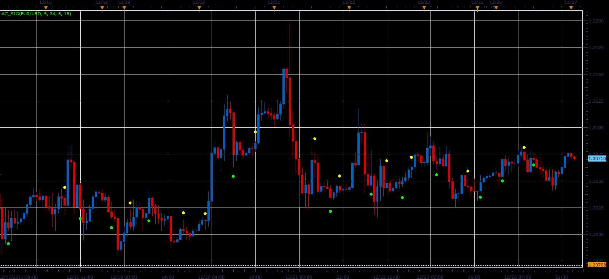

# AC_Sig indicator

> Source: https://fxcodebase.com/code/viewtopic.php?f=17&t=10494  
> Forum: 17 · Topic 10494 · 3 post(s)

---

## AC_Sig indicator

**Alexander.Gettinger** · Tue Dec 27, 2011 1:18 am

This indicator is a ported MQL5 indicator from [http://www.mql5.com/ru/code/777](http://www.mql5.com/ru/code/777) (in Russian).

Indicator shows the signals for trading on the indicator Accelerator Oscillator (see the book by B. Williams "New Dimensions in stock trading").

 

Download:

 [AC_Sig.lua](files/21749/AC_Sig.lua)

The indicator was revised and updated

---

## Re: AC_Sig indicator

**Alexander.Gettinger** · Fri Dec 30, 2011 2:13 am

Strategy based on AC_Sig indicator: [viewtopic.php?f=31&t=10687](https://fxcodebase.com/code/viewtopic.php?f=31&t=10687)

---

## Re: AC_Sig indicator

**Apprentice** · Mon Mar 20, 2017 8:10 am

Indicator was revised and updated.
