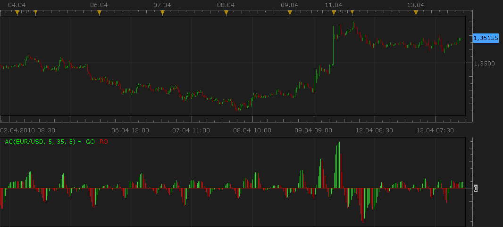

# Acceleration/Deceleration (AC) [updated]

> Source: https://fxcodebase.com/code/viewtopic.php?f=17&t=18  
> Forum: 17 · Topic 18 · 14 post(s)

---

## Acceleration/Deceleration (AC) [updated]

**admin** · Tue Oct 20, 2009 2:38 pm

**DESCRIPTION:**

AC bar chart is the difference between the value of 5/34 of the driving force bar chart and 5-period simple moving average, taken from that bar chart.

The height of an AC bar is the difference between 5-periods simple moving average and 34-periods simple moving average applied on a median price corresponding price bar. An AC bar is green in case it is above the previous bar and is red in case it is below the previous bar.

**CALCULATION:**

AC = SMA((HIGH + LOW) / 2; 5) - SMA((HIGH + LOW) / 2; 34)

**SCREENSHOT:**

 

The indicator was revised and updated

**DOWNLOAD:**

 [AC.lua](files/19/AC.lua)

Apr, 13 2010, ng:
In the new version of the indicator:
1) By default the covering line is not shown. An additional parameter is added to show the covering line (It may be useful for applying indicator on the AO results or for using the indicators
in another indicator).

2) In case the bar has the same size as the previous bar, the bar will have the same color (in the previous version the equal bar was always green).

Please, do not forget to update [Awesome oscillator](https://fxcodebase.com/code/viewtopic.php?f=17&t=19) too.

Tags: Acceleration, Deceleration, indicator, Marketscope, Trading Station, FXCM, dbFX

MT4/Mq4 version.
[viewtopic.php?f=38&t=64949&p=113730#p113730](https://fxcodebase.com/code/viewtopic.php?f=38&t=64949&p=113730#p113730)

---

## Re: Acceleration/Deceleration (AC)

**Paul Loatman** · Sun Dec 06, 2009 5:08 pm

I'm having problems getting this installed. I'm doing every step in the download and installation process, but after i restart the trading station and try to add it to a chart it says "[string "AC.lua"]:37: The indicator with the requested ID is not found".

Not quite sure what else to do than to ask.

-Paul

---

## Re: Acceleration/Deceleration (AC)

**TonyMod** · Mon Dec 07, 2009 11:14 am

> **Paul Loatman wrote:**
> I'm having problems getting this installed. I'm doing every step in the download and installation process, but after i restart the trading station and try to add it to a chart it says "[string "AC.lua"]:37: The indicator with the requested ID is not found".
>
> Not quite sure what else to do than to ask.
>
> -Paul

Paul,

I'm not an indicator developer, but looking at the "Line 37" in LUA code, i can see its trying to reference a indicator called "Awesome Oscillator (AO)".

I bet that if you install "Awesome Oscillator" problem will be fixed. That AO indicator is posted in "Custom Indicators":
[http://www.fxcodebase.com/code/viewtopic.php?f=17&t=19](http://www.fxcodebase.com/code/viewtopic.php?f=17&t=19)

Let me know how it works out.

Cheers,

TonyMod

---

## Re: Acceleration/Deceleration (AC)

**Paul Loatman** · Mon Dec 07, 2009 1:24 pm

> **TonyMod wrote:**
>
>
> > **Paul Loatman wrote:**
> > I'm having problems getting this installed. I'm doing every step in the download and installation process, but after i restart the trading station and try to add it to a chart it says "[string "AC.lua"]:37: The indicator with the requested ID is not found".
> >
> > Not quite sure what else to do than to ask.
> >
> > -Paul
>
>
>
> Paul,
>
> I'm not an indicator developer, but looking at the "Line 37" in LUA code, i can see its trying to reference a indicator called "Awesome Oscillator (AO)".
>
> I bet that if you install "Awesome Oscillator" problem will be fixed. That AO indicator is posted in "Custom Indicators":
> [http://www.fxcodebase.com/code/viewtopic.php?f=17&t=19](http://www.fxcodebase.com/code/viewtopic.php?f=17&t=19)
>
> Let me know how it works out.
>
> Cheers,
>
> TonyMod

Yes, that worked!

Not quite sure why i would need the AO indicator for it to work, but it did.

Thanks,

-Paul

---

## Re: Acceleration/Deceleration (AC) [updated]

**Nikolay.Gekht** · Tue Apr 13, 2010 4:51 pm

Updated

---

## Re: Acceleration/Deceleration (AC) [updated]

**business-investment** · Mon Apr 26, 2010 7:30 am

AO is a 34-period simple moving average s
That is,

AO = SMA (MEDIAN PRICE, 5 periods) - SMA (MEDIAN PRICE, 34 periods)

Where:

SMA - Simple Moving Average
MEDIAN PRICE = (HIGH+LOW)/2 (plotted through the central points of the bars)

---

## Re: Acceleration/Deceleration (AC) [updated]

**Panther** · Thu Oct 10, 2013 8:36 am

Would it possible to adjust the height? I would like to overlay it with a Stochastic.
I can do this on the Mt4 platform. On TS the scale it so small, it virtually disappears.
An Option that you could make it as high or low as you want.
Thanks.

---

## Re: Acceleration/Deceleration (AC) [updated]

**Apprentice** · Fri Oct 11, 2013 2:12 am

This is possible, what is your preferred platform?

---

## Re: Acceleration/Deceleration (AC) [updated]

**Panther** · Fri Oct 11, 2013 5:43 am

Trading Station is preferred.
What about a histo multiplier, like you did on the MACD - With Histogram Coloring?

---

## Re: Acceleration/Deceleration (AC) [updated]

**Apprentice** · Sat Oct 12, 2013 4:45 am

We have minor problem here.
AC have both positive and negative values​​.
On the other hand, Stochastic only have positive.
Some kind of normalization shift is needed.
Can you sketch out your idea of ​​the final product.

---

## Re: Acceleration/Deceleration (AC) [updated]

**Panther** · Sat Oct 12, 2013 8:46 am

At this point the, AC does not have to remain centered with the Stoch(i.e. the AC zero line matching up with the Stoch 50 line).
I have found that when level lines are added to a MACD it sets a boundary and has the effect of centering the MACD in the window. I am substituting the word "centering" for "normalizing". Is that what you mean? If so, add line levels with value, style, width, color options.

That may solve the minor issue. The main thing is to increase the size.

Another overlay example would be the CCI over the AC. Both use a zero line, but line levels would need to be used to keep both centered. Then the size of the AC could be adjusted accordingly.

Also I am not looking for a new indicator that is a combination of the two.

---

## Re: Acceleration/Deceleration (AC) [updated]

**Panther** · Sat Oct 12, 2013 4:22 pm

Attached is a picture. The MACD is where I want the AC to be.
The MACD histo mutiplier is set at 2,000.

The AC with multiplier and 2 level lines will be good.

---

## Re: Acceleration/Deceleration (AC) [updated]

**Apprentice** · Wed Oct 23, 2013 5:18 am

Requested can be found here.
[viewtopic.php?f=17&t=59725](https://fxcodebase.com/code/viewtopic.php?f=17&t=59725)

---

## Re: Acceleration/Deceleration (AC) [updated]

**Apprentice** · Sat Jul 29, 2017 9:29 am

The indicator was revised and updated.
