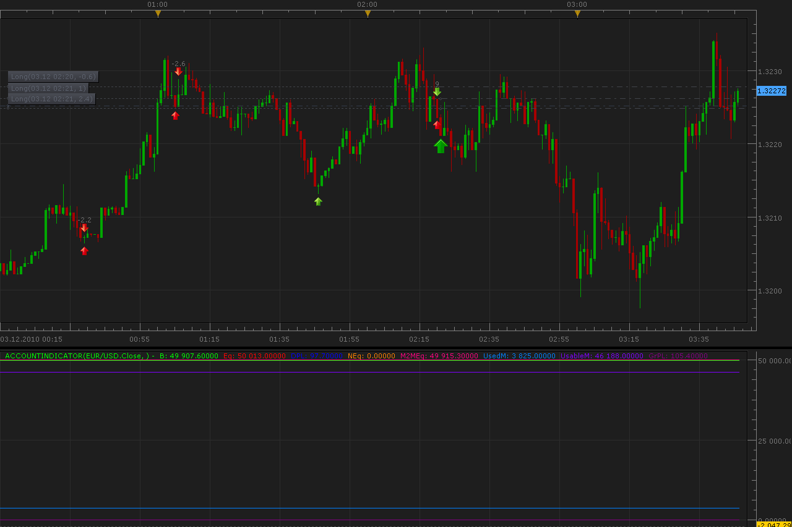

# Accounts indicator

> Source: https://fxcodebase.com/code/viewtopic.php?f=17&t=2851  
> Forum: 17 · Topic 2851 · 5 post(s)

---

## Accounts indicator

**Alexander.Gettinger** · Fri Dec 03, 2010 4:34 am

Indicator show follow accounts characteristics as lines:
Balance - The amount of funds in the account without taking into consideration profits and losses on all open positions,
Equity - The amount of funds in the account, including profits and losses on all open positions,
DayPL - The profit and loss during the current trading day,
NontrdEqty - The amount of funds that is deposited, transferred to, and/or withdrawn from the account during the current trading day,
M2MEquity - The "floating" balance of the account at the beginning of the trading day,
UsedMargin - The amount of funds currently committed to maintain all open positions in the account,
UsableMargin - The amount of funds available to open new positions or to absorb any losses on the existing positions,
GrossPL - The profit and loss on all open positions in the account.

 

Download:

 [AccountIndicator.lua](files/6510/AccountIndicator.lua)

The indicator was revised and updated

---

## Re: Accounts indicator

**sho-me-pips** · Sat Dec 03, 2011 10:20 am

Could this be modified, or have an option, to show Min/Max values?

I would like to know the maximum draw down strategies have on the account during the week.

---

## Re: Accounts indicator

**Apprentice** · Sun Mar 19, 2017 11:03 am

Indicator was revised and updated.

---

## Re: Accounts indicator

**Gilles** · Sat Aug 29, 2020 9:30 am

Hi, Apprentice !

Please could you provide a version that allows us to select a different time period m1, m5, m15, m30 etc.

Thank you.
See you soon !

---

## Re: Accounts indicator

**Apprentice** · Sat Aug 29, 2020 10:43 am

Account information is NOT a time frame.
Can you specify?
