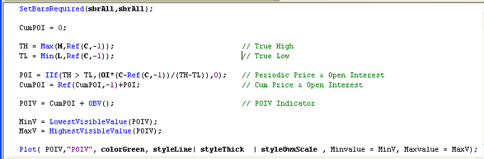

# Accumulation/Distribution Overlay

> Source: https://fxcodebase.com/code/viewtopic.php?f=17&t=37403  
> Forum: 17 · Topic 37403 · 18 post(s)

---

## Accumulation/Distribution Overlay

**Apprentice** · Sun May 12, 2013 2:42 am

This implementation, will paint the candles, in accordance with the chosen Accumulation / Distribution algorithm.

 [AD Overlay.lua](files/62263/AD%20Overlay.lua)

---

## Re: Accumulation/Distribution Overlay

**Apprentice** · Thu Jun 06, 2013 4:00 am

This version, overlay AD line on Price, uses normalization in an attempt to adapt two data series.

 [AD Price Overlay.lua](files/65535/AD%20Price%20Overlay.lua)

---

## Re: Accumulation/Distribution Overlay

**Jeffreyvnlk** · Sat Jul 06, 2013 3:10 am

> **Apprentice wrote:**
>
>
> AD Price Overlay.png
>
>
> This version, overlay AD line on Price, uses normalization in an attempt to adapt two data series.
>
>
> AD Price Overlay.lua

Thanks
I wonder anyone know the formula from Larry Williams to make POIV which combine price+ volume+ open interest into a single indicator

---

## Re: Accumulation/Distribution Overlay

**Apprentice** · Sat Jul 06, 2013 8:27 am

---

## Re: Accumulation/Distribution Overlay

**Apprentice** · Mon Apr 28, 2014 3:04 am

Yet another derivation, As Difference between Price Normalized AD and Price
Created according to the request.
[viewtopic.php?f=27&t=60582](https://fxcodebase.com/code/viewtopic.php?f=27&t=60582)

 [FairValue of AD.lua](files/93691/FairValue%20of%20AD.lua)

---

## Re: Accumulation/Distribution Overlay

**Apprentice** · Tue May 08, 2018 5:22 am

The indicator was revised and updated.

---

## Re: Accumulation/Distribution Overlay

**logicgate** · Sun Jan 20, 2019 5:53 pm

> **Apprentice wrote:**
>
>
> POIV-AMIBroker-Code.png

Dear friend is it possible to code the Larry Williams POIV for mt4?

---

## Re: Accumulation/Distribution Overlay

**Apprentice** · Mon Jan 21, 2019 8:51 am

In the formula, we use open interest.
As I know, MT4 does NOT provide this data.
Do you have any third party source, approximation or substitution mind?

---

## Re: Accumulation/Distribution Overlay

**logicgate** · Mon Jan 21, 2019 8:58 am

> **Apprentice wrote:**
> In the formula, we use open interest.
> As I know, MT4 does NOT provide this data.
> Do you have any third party source, approximation or substitution mind?

As a matter of fact, yes! But this one is for MT5 (file attached), can you take a look and check if it is possible to use the same code to make a MT4 version? Than you can fill the Open Interest gap in the formula with this.

If possible, you could make two versions:

One with indicator in a sub window and the other which plots the indicator on top of price.

Cheers!

---

## Re: Accumulation/Distribution Overlay

**logicgate** · Mon Jan 21, 2019 9:24 am

I found here on the forum this indi which also was supposed to use Open Interest data, you found a workaround here, perhaps you can use part of this formula if you can't use that MT5 indicator:

[viewtopic.php?f=17&t=64939&p=113693#p113693](https://fxcodebase.com/code/viewtopic.php?f=17&t=64939&p=113693#p113693)

---

## Re: Accumulation/Distribution Overlay

**Apprentice** · Tue Jan 22, 2019 9:07 am

From [https://docs.mql4.com](https://docs.mql4.com)
[https://docs.mql4.com/constants/environment_state/marketinfoconstants#enum_symbol_info_double](https://docs.mql4.com/constants/environment_state/marketinfoconstants#enum_symbol_info_double)

SYMBOL_SESSION_INTEREST is NOT Not supported

---

## Re: Accumulation/Distribution Overlay

**logicgate** · Tue Jan 22, 2019 9:26 am

> **Apprentice wrote:**
> From [https://docs.mql4.com](https://docs.mql4.com)
> [https://docs.mql4.com/constants/environment_state/marketinfoconstants#enum_symbol_info_double](https://docs.mql4.com/constants/environment_state/marketinfoconstants#enum_symbol_info_double)
>
> SYMBOL_SESSION_INTEREST is NOT Not supported

Oh I see, and how about this indi you coded:

[viewtopic.php?f=17&t=64939&p=113693#p113693](https://fxcodebase.com/code/viewtopic.php?f=17&t=64939&p=113693#p113693)

Can't you use here the same surrogate for open interest that you used there?

---

## Re: Accumulation/Distribution Overlay

**logicgate** · Sat Feb 16, 2019 9:14 am

Hello brother,

Do you think you can code the Larry Williams POIV to work in Excel? If yes, please.

Thanks a lot.

---

## Re: Accumulation/Distribution Overlay

**Apprentice** · Sun Feb 17, 2019 6:21 am

Can you provide web reference for it?

---

## Re: Accumulation/Distribution Overlay

**logicgate** · Sun Feb 17, 2019 9:18 am

> **Apprentice wrote:**
> Can you provide web reference for it?

You have posted the POIV formula in the 4th post of this thread, isn't the case of somehow applying the formula using the columns and cells, like you did with the Commercial Proxy Index?

---

## Re: Accumulation/Distribution Overlay

**logicgate** · Sun Feb 17, 2019 9:21 am

I found a formula to calculate the OBV in excel, which is part of the POIV formula:

[http://investexcel.net/calculate-on-bal ... ume-excel/](http://investexcel.net/calculate-on-balance-volume-excel/)

[http://tradingtuitions.com/on-balance-v ... cel-sheet/](http://tradingtuitions.com/on-balance-volume-indicator-excel-sheet/)

The open interest data you can get in any free EOD data site, for example barchart.com

---

## Re: Accumulation/Distribution Overlay

**Apprentice** · Mon Feb 18, 2019 6:21 am

Your request is added to the development list under Id Number 4487

---

## Re: Accumulation/Distribution Overlay

**logicgate** · Fri Jul 19, 2019 3:56 pm

> **Apprentice wrote:**
>
>
> POIV-AMIBroker-Code.png

Dear friend Apprentice, I found a way to make this work in MT4. I was watching a video where the presenter claims that the cumulative delta can be used as a proxy of Open Interest.

So you just need to grab the cumulative delta upgrade you coded and posted here:

[viewtopic.php?f=27&t=68642](https://fxcodebase.com/code/viewtopic.php?f=27&t=68642)

And then use it's output in the **OI** part of the POIV formula that I quoted from your post,
