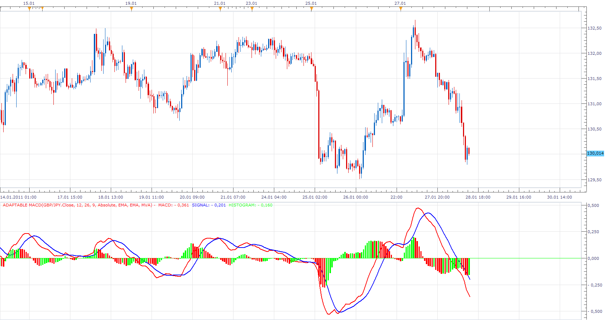

# Adaptable MACD

> Source: https://fxcodebase.com/code/viewtopic.php?f=17&t=3274  
> Forum: 17 · Topic 3274 · 20 post(s)

---

## Adaptable MACD

**Apprentice** · Fri Jan 28, 2011 1:27 pm

This indicator allows you to change type of moving averages used to calculate the MACD indicator.

Furthermore I added some options that were requested by the user.

If you do not touch anything, it behaves as a classic MACD indicator.

To work install 20 in 1 Moving Average Indicator a.k.a. Averages
[viewtopic.php?f=17&t=2430](https://fxcodebase.com/code/viewtopic.php?f=17&t=2430)

 [Adaptable MACD.lua](files/7777/Adaptable%20MACD.lua)

---

## Re: Adaptable MACD

**prtrader** · Fri Oct 21, 2011 11:37 am

This indicator suits what I am looking for. I was looking for an oscillator to draw a histogram based on the difference between two MAs using the Averages.lua file. The only thing that I would like to see is the ability to add another color to the histogram. For example if the value is above 0, but less than the previous bar to have a different color, the same if the opposite happens for bars below 0. So to have 4 colors. What would I need to add to the code to get this? Im new to this language, I am more familiar with C++.

---

## Re: Adaptable MACD

**Apprentice** · Sat Oct 22, 2011 4:26 pm

Your request is added to the developmental cue.

---

## Re: Adaptable MACD

**Apprentice** · Fri Feb 24, 2012 10:58 am

Requested can be found here.
[viewtopic.php?f=17&t=13963](https://fxcodebase.com/code/viewtopic.php?f=17&t=13963)

---

## Re: Adaptable MACD

**Alexander.Gettinger** · Tue Jun 19, 2012 5:38 pm

MQL4 version of Adaptable MACD: [viewtopic.php?f=38&t=20397](https://fxcodebase.com/code/viewtopic.php?f=38&t=20397)

---

## Re: Adaptable MACD

**Apprentice** · Wed Feb 21, 2018 10:56 am

The Indicator was revised and updated.

---

## Re: Adaptable MACD

**tutumlgb** · Mon Jun 01, 2020 7:32 pm

i want to make the fast line color of macd canbe changed , up color red and down color green

---

## Re: Adaptable MACD

**Apprentice** · Tue Jun 02, 2020 5:46 am

[Adaptable MACD.lua](files/134514/Adaptable%20MACD.lua)

Try this version.

---

## Re: Adaptable MACD

**tutumlgb** · Tue Jun 02, 2020 8:29 am

> **Apprentice wrote:**
>
>
> Adaptable MACD.lua
>
>
> Try this version.

its so great

but how to change the width of the fast line and signal line??

---

## Re: Adaptable MACD

**Apprentice** · Tue Jun 02, 2020 9:17 am

Style option added.

---

## Re: Adaptable MACD

**tutumlgb** · Tue Jun 02, 2020 9:29 am

> **Apprentice wrote:**
> Style option added.

where?

---

## Re: Adaptable MACD

**tutumlgb** · Tue Jun 02, 2020 9:52 am

> **Apprentice wrote:**
> Style option added.

thank you for your help my dear friend

---

## Re: Adaptable MACD

**tutumlgb** · Sun Jun 14, 2020 11:54 am

> **Apprentice wrote:**
>
>
> Adaptable MACD.lua
>
>
> Try this version.

would you like to help me to mark a up arrow on the k line graph when the dif is up for the first time
and a down arrow on the k line graph when the dif is down for the fisrt

it means that make the dif color change to be the up or down arrow on the k line graph

---

## Re: Adaptable MACD

**Apprentice** · Sun Jun 14, 2020 7:14 pm

Can you define dif?

---

## Re: Adaptable MACD

**tutumlgb** · Sun Jun 14, 2020 10:36 pm

> **Apprentice wrote:**
> Can you define dif?

i mean the dif is zhe fast line of the macd

last time you help me to make the fast line change the color and this time i want to make the point on the k line graph

the short line change green and there is a down arrow change red and there is a up arrow

---

## Re: Adaptable MACD

**Apprentice** · Mon Jun 15, 2020 4:21 am

Your request is added to the development list.
Development reference 1488.

---

## Re: Adaptable MACD

**tutumlgb** · Mon Jun 15, 2020 6:56 am

> **Apprentice wrote:**
> Your request is added to the development list.
> Development reference 1488.

i can not understand

---

## Re: Adaptable MACD

**Apprentice** · Tue Jun 16, 2020 4:51 am

Your request has been sent for development.
You can expect your code soon.

This is an internal id for or team.

---

## Re: Adaptable MACD

**Apprentice** · Tue Jun 16, 2020 5:50 am

[Adaptable MACD.lua](files/134990/Adaptable%20MACD.lua)

Try this version.

---

## Re: Adaptable MACD

**tutumlgb** · Wed Jun 17, 2020 11:59 am

> **Apprentice wrote:**
>
>
> Adaptable MACD.lua
>
>
> Try this version.

there is no change where is the arrow on k line graph
