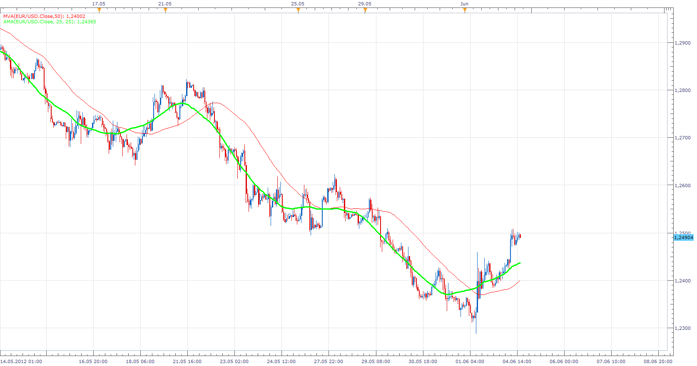
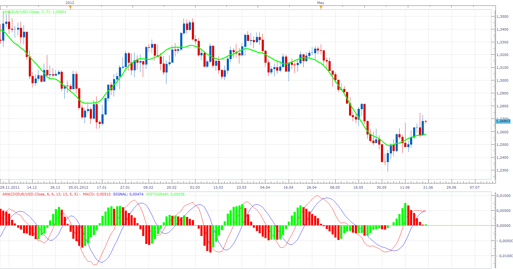

# Adaptable Moving Average

> Source: https://fxcodebase.com/code/viewtopic.php?f=17&t=19841  
> Forum: 17 · Topic 19841 · 10 post(s)

---

## Adaptable Moving Average

**Apprentice** · Mon Jun 04, 2012 3:12 pm

Unlike standard moving averages, which for calculate only use data points prior to the current period. AMA is using both, before and after, the current period. Adjusting, moving average to the price changes that will happen. If future periods are not available, behaves as a standard moving average.

 [AMA.bin](files/34988/AMA.bin)

The indicator was revised and updated

---

## Re: Adaptable Moving Average

**Alexander.Gettinger** · Fri Jun 15, 2012 10:35 am

MQL4 version of this indicator: [viewtopic.php?f=38&t=20223](https://fxcodebase.com/code/viewtopic.php?f=38&t=20223)

---

## Re: Adaptable Moving Average

**lucmat** · Tue Jun 19, 2012 7:53 am

Hi all!
Your indicators are very good!!!!

Is it possible to make a MACD with Adaptable moving average?
Thanks!

Bye

---

## Re: Adaptable Moving Average

**Apprentice** · Wed Jun 20, 2012 2:34 am

This is AMA based MACD.
I only have one request, do not ask me to write the AMA based strategy.
I'm not saying that it makes no sense, it is just highly unlikely.

 [AMACD.lua](files/35800/AMACD.lua)

---

## Re: Adaptable Moving Average

**jackflint** · Sat Sep 22, 2012 1:19 am

Hello Apprentice
Very nice indicators, and thank you, I like a lot your work. It is possible to adapt the amacd to on off? like macd on off?

---

## Re: Adaptable Moving Average

**Apprentice** · Sun Sep 23, 2012 2:51 pm

Here you go AMACD with ON / OFF selection of desired components.

 [AMACD ON OFF.lua](files/40797/AMACD%20ON%20OFF.lua)

---

## Re: Adaptable Moving Average

**klutzy** · Mon Sep 01, 2014 1:15 pm

I installed AMACD ON OFF.lua and it told me I need AMA.lua.
I only found AMA.bin, which does satisfy demand. Fix doc.

---

## Re: Adaptable Moving Average

**Apprentice** · Tue Sep 02, 2014 2:28 am

Fixed.

---

## Re: Adaptable Moving Average

**Apprentice** · Tue Sep 02, 2014 2:28 am

Fixed.

---

## Re: Adaptable Moving Average

**Apprentice** · Tue Jul 11, 2017 1:46 pm

The indicator was revised and updated.
