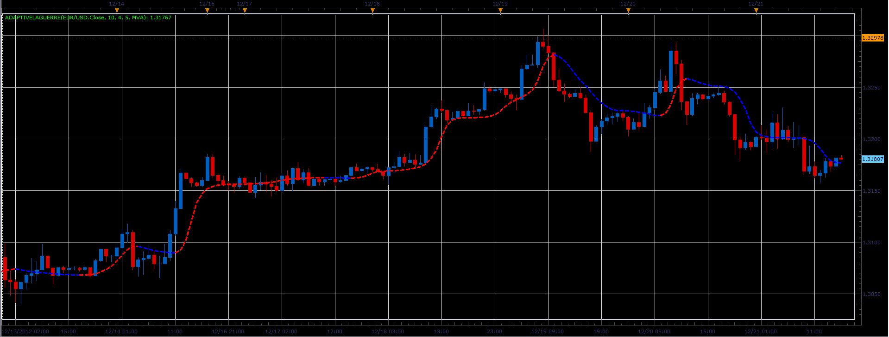

# Adaptive Laquerre Filter

> Source: https://fxcodebase.com/code/viewtopic.php?f=17&t=27884  
> Forum: 17 · Topic 27884 · 2 post(s)

---

## Adaptive Laquerre Filter

**Alexander.Gettinger** · Fri Dec 21, 2012 5:27 pm

This indicator is a ported MQL5 indicator from [viewtopic.php?f=27&t=27648](https://fxcodebase.com/code/viewtopic.php?f=27&t=27648)

 

Download:

 [AdaptiveLaguerre.lua](files/48928/AdaptiveLaguerre.lua)

For this indicator must be installed Averages indicator ([viewtopic.php?f=17&t=2430](https://fxcodebase.com/code/viewtopic.php?f=17&t=2430)).

The indicator was revised and updated

---

## Re: Adaptive Laquerre Filter

**Apprentice** · Thu Apr 27, 2017 4:44 am

Indicator was revised and updated.
