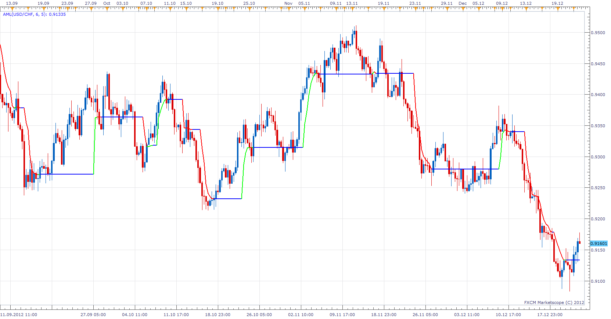

# Adaptive Market Level

> Source: https://fxcodebase.com/code/viewtopic.php?f=17&t=27922  
> Forum: 17 · Topic 27922 · 4 post(s)

---

## Adaptive Market Level

**Apprentice** · Sat Dec 22, 2012 1:17 pm

The indicator is based on fractal smoothing (known as FRAMA ).
It have a discrete filter that removes minor price movements,
if relative flat movement does not exceed the square of the interval dimension in the specified interval it is ignored.

 [AML.lua](files/48995/AML.lua)

The indicator was revised and updated

---

## Re: Adaptive Market Level

**irvin_verma** · Sun Dec 23, 2012 1:31 am

this is a good indicator

---

## Re: Adaptive Market Level

**Alexander.Gettinger** · Mon Sep 22, 2014 11:09 am

MQL4 version of Adaptive Market Level indicator: [viewtopic.php?f=38&t=61220](https://fxcodebase.com/code/viewtopic.php?f=38&t=61220).

---

## Re: Adaptive Market Level

**Apprentice** · Sat Jun 24, 2017 5:25 am

The indicator was revised and updated.
