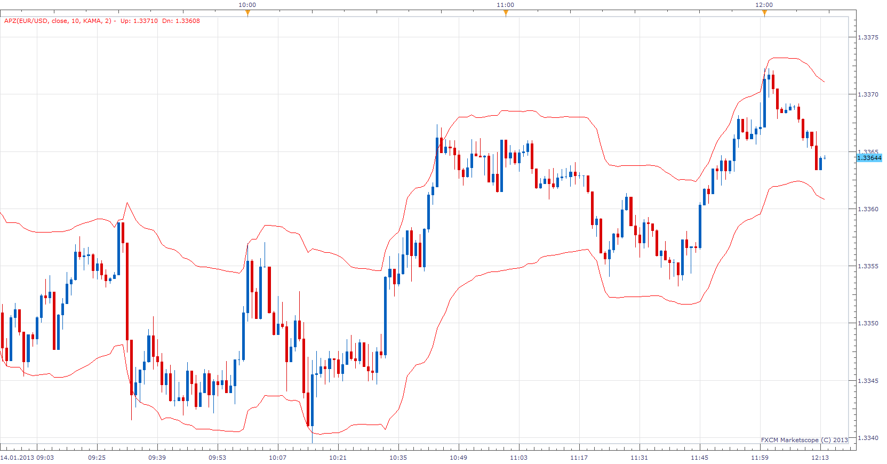

# Adaptive Price Zone

> Source: https://fxcodebase.com/code/viewtopic.php?f=17&t=30266  
> Forum: 17 · Topic 30266 · 3 post(s)

---

## Adaptive Price Zone

**Apprentice** · Mon Jan 14, 2013 1:38 pm

As described in the article, Trading With An Adaptive Price Zone by Lee Leibfarth.
Sept. 2006 issue of Stocks and Commodity magazine.

 [APZ.lua](files/52044/APZ.lua)

The indicator was revised and updated

---

## Re: Adaptive Price Zone

**Alexander.Gettinger** · Thu Sep 18, 2014 9:46 am

MQL4 version of Adaptive Price Zone indicator: [viewtopic.php?f=38&t=61175](https://fxcodebase.com/code/viewtopic.php?f=38&t=61175).

---

## Re: Adaptive Price Zone

**Apprentice** · Sat Jun 24, 2017 5:10 am

The indicator was revised and updated.
