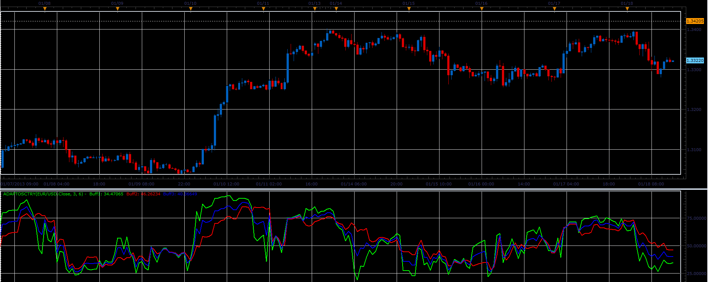

# Adaptosctry indicator

> Source: https://fxcodebase.com/code/viewtopic.php?f=17&t=31127  
> Forum: 17 · Topic 31127 · 2 post(s)

---

## Adaptosctry indicator

**Alexander.Gettinger** · Fri Jan 18, 2013 5:58 pm

This indicator is a ported MQL4 indicators from [viewtopic.php?f=27&t=27908](https://fxcodebase.com/code/viewtopic.php?f=27&t=27908)

 

Download:

 [Adaptosctry.lua](files/53125/Adaptosctry.lua)

For this indicator must be installed FATL indicator ([viewtopic.php?f=17&t=27885](https://fxcodebase.com/code/viewtopic.php?f=17&t=27885)).

The indicator was revised and updated

---

## Re: Adaptosctry indicator

**Apprentice** · Thu Apr 27, 2017 4:12 am

Indicator was revised and updated.
