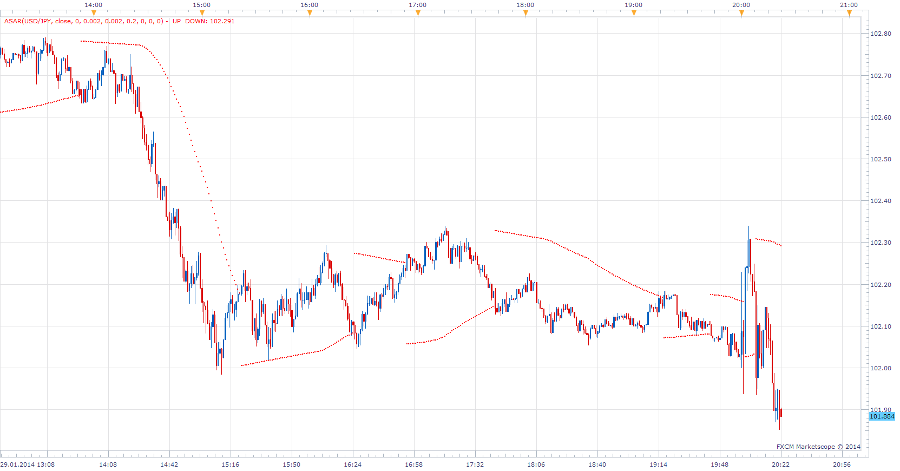

# Advance Parabolic Time/Price System

> Source: https://fxcodebase.com/code/viewtopic.php?f=17&t=60257  
> Forum: 17 · Topic 60257 · 6 post(s)

---

## Advance Parabolic Time/Price System

**Apprentice** · Wed Jan 29, 2014 2:35 pm

 [ASAR.lua](files/92345/ASAR.lua)

---

## Re: Advance Parabolic Time/Price System

**Apprentice** · Sun Jun 18, 2017 1:17 pm

The indicator was revised and updated.

---

## Re: Advance Parabolic Time/Price System

**Recursive Trendline** · Mon Jun 19, 2017 2:14 pm

Thanks for the great indicator Apprentice. Is it possible to translate the indicator for mt4?

Regards,

---

## Re: Advance Parabolic Time/Price System

**Apprentice** · Tue Jun 20, 2017 12:15 pm

Your request is added to the development list, Under Id Number 3813
 If someone is interested to do this task, please contact me.

---

## Re: Advance Parabolic Time/Price System

**Alexander.Gettinger** · Tue Sep 26, 2017 12:25 pm

> **Recursive Trendline wrote:**
> Thanks for the great indicator Apprentice. Is it possible to translate the indicator for mt4?
>
> Regards,

MT4 version of the indicator: [viewtopic.php?f=38&t=65118](https://fxcodebase.com/code/viewtopic.php?f=38&t=65118)

---

## Re: Advance Parabolic Time/Price System

**Apprentice** · Fri Oct 19, 2018 4:18 am

The indicator was revised and updated.
