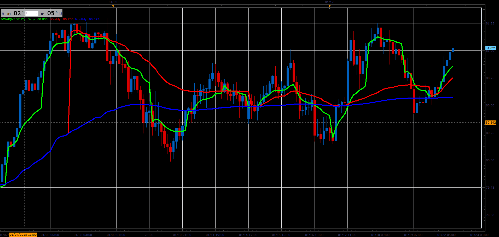

# Advance VWAP

> Source: https://fxcodebase.com/code/viewtopic.php?f=17&t=65661  
> Forum: 17 · Topic 65661 · 21 post(s)

---

## Advance VWAP

**Alexander.Gettinger** · Mon Jan 22, 2018 11:56 am

Based on request: [viewtopic.php?f=27&t=63499&p=106461#p106461](https://fxcodebase.com/code/viewtopic.php?f=27&t=63499&p=106461#p106461)

 

Download:

 [VWAP.lua](files/117194/VWAP.lua)

 

 [Any Time Frame VWAP.lua](files/117194/Any%20Time%20Frame%20VWAP.lua)

MT4/MQ4 version.
[viewtopic.php?f=38&t=66300](https://fxcodebase.com/code/viewtopic.php?f=38&t=66300)

---

## Re: Advance VWAP

**Alexander.Gettinger** · Mon Jan 22, 2018 11:57 am

MQL4 version of the indicator: [viewtopic.php?f=38&t=65662](https://fxcodebase.com/code/viewtopic.php?f=38&t=65662)

---

## Re: Advance VWAP

**bruno2017** · Mon Mar 26, 2018 1:05 pm

hello

I got messy message when I install vwap:
c:/user/brur/Bruno/desktop/vwaplua:1

---

## Re: Advance VWAP

**Apprentice** · Tue Mar 27, 2018 10:15 am

Looks like .lua is overwritten with .mq4

---

## Re: Advance VWAP

**bruno2017** · Tue Mar 27, 2018 11:19 am

> **Apprentice wrote:**
> Looks like .lua is overwritten with .mq4

here is the message unexpected symbol near y

---

## Re: Advance VWAP

**Apprentice** · Thu Apr 12, 2018 4:03 am

Try it now.

---

## Re: Advance VWAP

**ANTONIO** · Tue May 22, 2018 7:18 am

Can you add in this indicator a strategy without opening trades and sending mail notifications when the price touches or crosses this indicator at live / end of turn?
Also, I would like this modification to have the form of strategy and be registered at the trading station as strategy by choosing any pairs of currency I want

---

## Re: Advance VWAP

**bruno2017** · Thu May 24, 2018 6:24 am

> **Apprentice wrote:**
> Try it now.

thanks it works

---

## Re: Advance VWAP

**ANTONIO** · Thu May 31, 2018 4:05 am

Can you add in this indicator a strategy without opening trades and sending mail notifications when the price touches or crosses this indicator at live / end of turn?
Also, I would like this modification to have the form of strategy and be registered at the trading station as strategy by choosing any pairs of currency I want

---

## Re: Advance VWAP

**Apprentice** · Fri Jun 01, 2018 6:44 am

Strategy without the ability to trade?
Why not use the indicator with an alert option.
Or why NOT full-blooded strategy.
Note you can turn off trading, in any of my strategys.

---

## Re: Advance VWAP

**ANTONIO** · Fri Jun 01, 2018 9:18 am

Ok.
You have right apprentice.

Will you be able to build a strategy as follows:

For a buying position:

1. Buy if the closing of candle, for example, at timeframe 15 minute, is above from the VWAP (daily or weekly or monthly depending on which one or which we have chosen to participate in strategy) and the price is passing through VWAP from the bottom to the top.

2. Stop-loss is placed below the low of the activated candle.

3. Take profit with stop loss per 10pips or per 1 pip

4. When we win the initial risk, the stop-loss should move to the entry point.

The same set-up for the opening of a sale position.

---

## Re: Advance VWAP

**Apprentice** · Sat Jun 02, 2018 6:40 am

Any Time Frame VWAP added.

---

## Re: Advance VWAP

**Apprentice** · Sat Jun 02, 2018 7:13 am

Try this version.
[viewtopic.php?f=31&t=66167](https://fxcodebase.com/code/viewtopic.php?f=31&t=66167)

---

## Re: Advance VWAP

**ANTONIO** · Mon Jun 04, 2018 5:42 am

Thank you apprentice

---

## Re: Advance VWAP

**alishinobi** · Sat Jul 21, 2018 7:26 pm

> **Alexander.Gettinger wrote:**
> Based on request: [viewtopic.php?f=27&t=63499&p=106461#p106461](https://fxcodebase.com/code/viewtopic.php?f=27&t=63499&p=106461#p106461)
>
>
>
> VWAP.PNG
>
>
>
> Download:
>
>
> VWAP.lua
>
>
>
>
>
> EURUSD H6 (03-07-2017 1459).png
>
>
>
>
> Any Time Frame VWAP.lua

hello alexander thanks for the amazing indicator but the second indicator ( any time frame vwap ) can you make a mt4 version for it that's will be great

---

## Re: Advance VWAP

**Apprentice** · Sun Jul 22, 2018 6:51 am

Your request is added to the development list under Id Number 4193

---

## Re: Advance VWAP

**Apprentice** · Tue Jul 24, 2018 7:53 am

MT4/MQ4 version.
[viewtopic.php?f=38&t=66300](https://fxcodebase.com/code/viewtopic.php?f=38&t=66300)

---

## Re: Advance VWAP

**filoo7** · Sat Nov 28, 2020 11:01 am

Hi Apprentice,
Could you on the indicator "any timeframe vwap" add the 5 standard deviation with choice of color and style
Thank you

---

## Re: Advance VWAP

**Apprentice** · Sun Nov 29, 2020 3:12 am

5 standard deviation of the price?

Your request is added to the development list.
Development reference 2370.

---

## Re: Advance VWAP

**Apprentice** · Mon Nov 30, 2020 10:31 am

[Any Time Frame VWAP.lua](files/139214/Any%20Time%20Frame%20VWAP.lua)

Try this version.

---

## Re: Advance VWAP

**ahmedalhosenyy** · Tue Sep 30, 2025 10:40 am

Hello ,

Why the two vwaps indicators show different results
