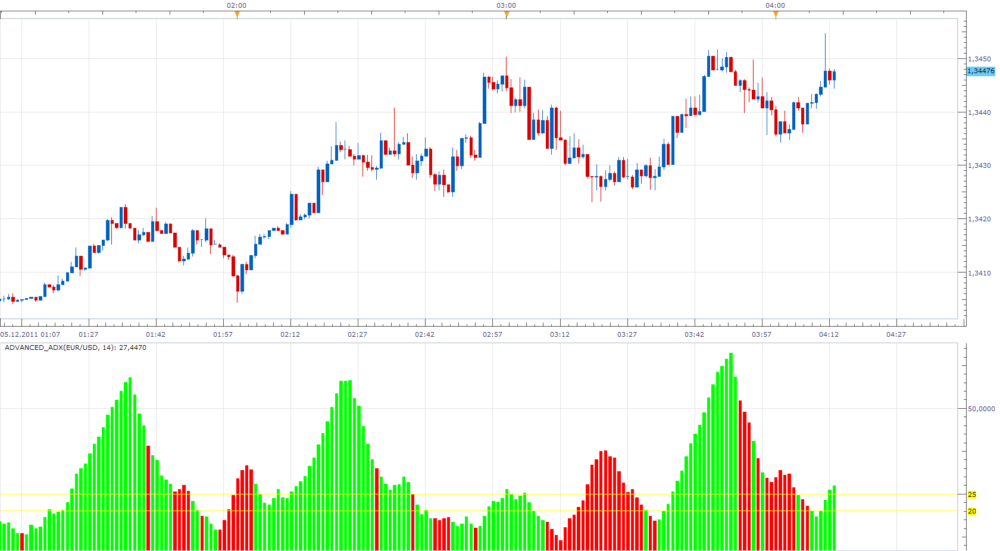
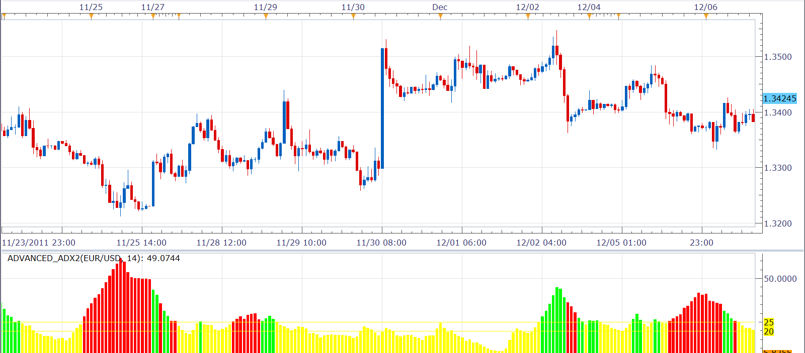

# Advanced_ADX

> Source: https://fxcodebase.com/code/viewtopic.php?f=17&t=8966  
> Forum: 17 · Topic 8966 · 34 post(s)

---

## Advanced_ADX

**Apprentice** · Mon Dec 05, 2011 4:11 am

Basically this is the ADX Bar chart.
Color Overlay use DMI.
Green
DIP> DIM
Red color
DIP <DIM

 [Advanced_ADX.lua](files/19627/Advanced_ADX.lua)

---

## Re: Advanced_ADX

**mosesnobleraj** · Mon Dec 05, 2011 7:40 am

thanks a lot for this useful indicator. can you add following option in this indicator

ADX> 25 ONLY THE INDICATOR SHOWS RED/GREEN COLOR
ADX<25 MEANS IT IS NOT GOOD TREND THEREFORE INDICATOR SHOWS YELLOW COLOR.

---

## Re: Advanced_ADX

**Apprentice** · Wed Dec 07, 2011 3:33 am

Your request is added to the developmental cue.

---

## Re: Advanced_ADX

**Alexander.Gettinger** · Wed Dec 07, 2011 4:38 am

Please, see this version of indicator.

 

Download:

 [Advanced_ADX2.lua](files/19854/Advanced_ADX2.lua)

MT4/MQ4 version.
[viewtopic.php?f=38&t=67338](https://fxcodebase.com/code/viewtopic.php?f=38&t=67338)

---

## Re: Advanced_ADX

**cersoz** · Thu Dec 08, 2011 3:05 pm

can u seperate adx and dmi settings?

for example adx periyod 13
and dmi period 8

---

## Re: Advanced_ADX

**Apprentice** · Thu Dec 08, 2011 5:49 pm

Your request is added to the developmental cue.

---

## Re: Advanced_ADX

**Alexander.Gettinger** · Thu Dec 08, 2011 9:17 pm

> **cersoz wrote:**
> can u seperate adx and dmi settings?
>
> for example adx periyod 13
> and dmi period 8

Please, see this indicators.

Download:

 [Advanced_ADX_Separate_Periods.lua](files/20024/Advanced_ADX_Separate_Periods.lua)

 [Advanced_ADX2_Separate_Periods.lua](files/20024/Advanced_ADX2_Separate_Periods.lua)

---

## Re: Advanced_ADX

**nookie** · Mon Dec 12, 2011 9:33 am

Can you please remove the color when ADX is sloping down ? (I guess it could be same color as if adx is weak)

---

## Re: Advanced_ADX

**Apprentice** · Mon Dec 12, 2011 5:52 pm

Your request is added to our database

---

## Re: Advanced_ADX

**Apprentice** · Fri Mar 09, 2012 7:52 am

Two Color Option Added.

 [Advanced_ADX.lua](files/27790/Advanced_ADX.lua)

---

## Re: Advanced_ADX

**nookie** · Wed Mar 14, 2012 5:29 pm

Can you please clarify what is the "strong trend line" and "weak trend line" about and what does it mean as a setting? I think much clear would be to have only one of these and its meaning to be:

example:
strong trend line=21
if value > 21 => color1 ADX
if value < 21 => color2 ADX

Currently this is not working as expected

---

## Re: Advanced_ADX

**Apprentice** · Thu Mar 15, 2012 8:09 pm

Is hard to have one that fits all.
This functionality is required from other users.

"strong trend line" and "weak trend line" define levels at which horizontal line will be drawn.

---

## Re: Advanced_ADX

**briansummy** · Wed Mar 21, 2012 12:41 pm

Any luck on an EA for this indicator in agreement with an Heikin-Ashi chart? Enter position when candles n+1 agree and exit when n+1 disagrees? Very interesting indicator here guys.

---

## Re: Advanced_ADX

**briansummy** · Wed Mar 21, 2012 12:45 pm

Oh and my EA idea was for advanced multi color option with yellow being neutral.

---

## Re: Advanced_ADX

**stainer** · Thu Sep 13, 2012 9:20 pm

Can we get a signal for this please.

---

## Re: Advanced_ADX

**Apprentice** · Fri Sep 14, 2012 3:21 am

Try existing DMI Strategy.
[viewtopic.php?f=31&t=2572&p=6682&hilit=dmi#p6682](https://fxcodebase.com/code/viewtopic.php?f=31&t=2572&p=6682&hilit=dmi#p6682)

---

## Re: Advanced_ADX

**arindam89** · Wed Sep 26, 2012 5:03 am

> **Alexander.Gettinger wrote:**
> Please, see this version of indicator.
>
>
>
> Advanced_ADX2.png
>
>
>
> Download:
>
>
> Advanced_ADX2.lua

hi alexander
u r indeed "Alexander the great" of our times
great indicator
can you code a simple strategy on this
If the advance_adx2 shows green bar on close of a candle above 25 level line goes **long** and if the advance_adx2 shows red bar on close of a candle above 25 level line goes **short**(do not open multiple positions and closes all open position before a new position is opened)
i am sure you will be able to code this
thanks
by
arindam roy

---

## Re: Advanced_ADX

**Apprentice** · Thu Sep 27, 2012 3:02 am

Your request is added to the development list.

---

## Re: Advanced_ADX

**Apprentice** · Thu Sep 27, 2012 4:38 am

Requested can be found here.
[viewtopic.php?f=31&t=23862](https://fxcodebase.com/code/viewtopic.php?f=31&t=23862)

---

## 4th color

**Jeffreyvnlk** · Thu May 02, 2013 8:47 pm

Appreciated if you could add 4th color for ADX being bellow the first level , for example even <16

---

## Re: Advanced_ADX

**Apprentice** · Fri May 03, 2013 3:40 am

Try updated Advanced_ADX2.lua

---

## Re: Advanced_ADX

**Jeffreyvnlk** · Mon Jul 01, 2013 1:54 pm

> **Apprentice wrote:**
> Try updated Advanced_ADX2.lua

I have tried but still 3 colors: 2 red and blue for above 35 and white color for under 35 and even under 15 level
The problem i need a yellow color for ADX bars under 15.Thank you in advance

---

## Re: Advanced_ADX

**Apprentice** · Wed Jul 03, 2013 2:41 am

Your request is added to the development list.

---

## Re: Advanced_ADX

**Pandakker** · Sun Feb 02, 2014 11:41 am

> **Apprentice wrote:**
> Two Color Option Added.
>
>
> Advanced_ADX.lua

Hello Apprentice,

Thank you for the indicator.
Could you add the option to set transparency coloring for the bars?
So you could see better other lines from other indicators in the same window.

Thanks in advance.

Regards

---

## Re: Advanced_ADX

**Apprentice** · Mon Feb 03, 2014 5:54 am

In the current implementation, transparency is not an option.
Indicator need a complete rewrite.

---

## Re: Advanced_ADX

**Pandakker** · Sun Feb 16, 2014 11:29 am

> **Apprentice wrote:**
> In the current implementation, transparency is not an option.
> Indicator need a complete rewrite.

Thank you for your reply.
So i guess a rewrite take s a lot of time?

---

## MTF MCP ADVANCED ADX LIST REQUEST

**supertrader123** · Fri May 15, 2015 7:22 am

HI,

MAY I REQUEST MTF MCP ADX INDICATOR WITH FOLLOWING CONDITIONS
TIME FRAME1:H1

ADX PERIOD: 14
DMI PERIOD: 14
ENTRY LEVEL;25
EXIT LEVEL:45

TIME FRAME2: H4

ADX PERIOD: 20
DMI PERIOD: 20
ENTRY LEVEL;30
EXIT LEVEL:45

TIME FRAME3: H8

ADX PERIOD: 20
DMI PERIOD: 20
ENTRY LEVEL;30
EXIT LEVEL:45

TIME FRAME4: D1

ADX PERIOD: 20
DMI PERIOD: 20
ENTRY LEVEL;30
EXIT LEVEL:45

TIME FRAME5: W1

ADX PERIOD: 20
DMI PERIOD: 20
ENTRY LEVEL;30
EXIT LEVEL:45

TIME FRAME6: M1

ADX PERIOD: 20
DMI PERIOD: 20
ENTRY LEVEL;30
EXIT LEVEL:45

{PERIOD OPTION AND ENTRY EXIT LEVEL TO BE CHANGEABLE FOR EACH TIME FRAME}

GREEN UP ARROW: ADX(PERIOD)> ADX(PERIOD-1) AND ADX > ENTRY LEVEL AND ADX < EXIT LEVEL AND DMI[POSITIVE]> DMI[NEGATIVE]

RED DOWN ARROW: ADX(PERIOD)> ADX(PERIOD-1) AND ADX > ENTRY LEVEL AND ADX < EXIT LEVEL AND DMI[POSITIVE]< DMI[NEGATIVE]

YELLOW DOT: OTHER WICE

---

## Re: Advanced_ADX

**Apprentice** · Mon May 18, 2015 2:53 am

Your request is added to the development list.

---

## Re: Advanced_ADX

**Apprentice** · Mon May 18, 2015 5:07 am

Required can be found here.
[viewtopic.php?f=17&t=62230&p=100515#p100515](https://fxcodebase.com/code/viewtopic.php?f=17&t=62230&p=100515#p100515)

---

## Re: Advanced_ADX

**Apprentice** · Mon Jul 03, 2017 7:38 am

The indicator was revised and updated.

---

## Re: Advanced_ADX

**amazon1a** · Mon Jul 30, 2018 10:47 am

Hi Apprentice,

Re: Advanced_ADX2.lua

Would it be possible to add colors for when ADX changes direction - similar to MACD when we can see Down in an UP trend or UP in a Down trend.

Thanks, AG

---

## Re: Advanced_ADX

**Apprentice** · Wed Aug 01, 2018 9:46 am

Try this version.

 [Trend Advanced_ADX.lua](files/120259/Trend%20Advanced_ADX.lua)

---

## Re: Advanced_ADX

**amazon1a** · Sat Feb 09, 2019 10:25 am

Hi Apprentice, Would it be possible to create an MT4 version of Advanced_ADX2.

Thanks, AG

---

## Re: Advanced_ADX

**Apprentice** · Mon Feb 11, 2019 6:07 am

MT4/MQ4 version of Advanced_ADX2.
[viewtopic.php?f=38&t=67338](https://fxcodebase.com/code/viewtopic.php?f=38&t=67338)
