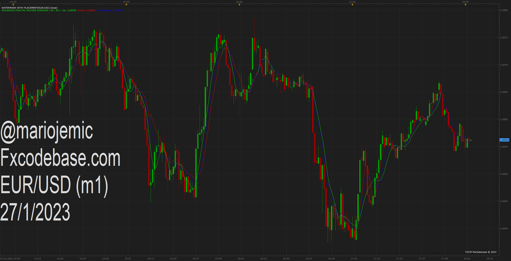
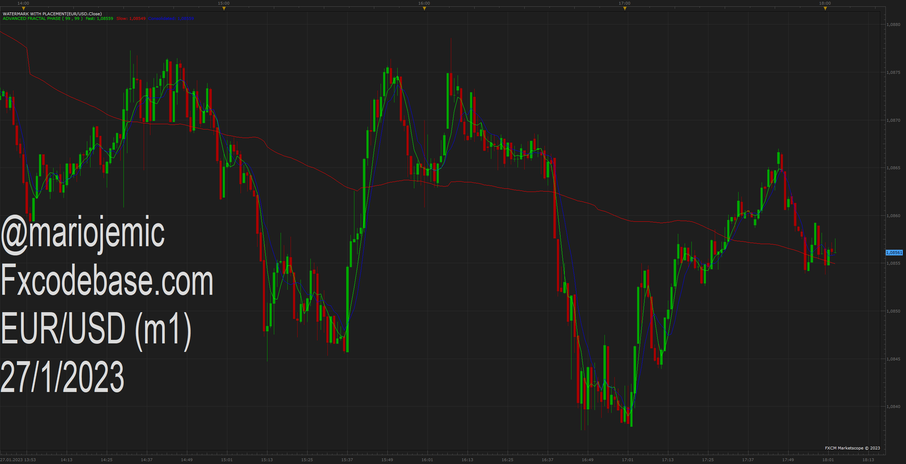

# Advanced Fractal Label

> Source: https://fxcodebase.com/code/viewtopic.php?f=17&t=73282  
> Forum: 17 · Topic 73282 · 4 post(s)

---

## Advanced Fractal Label

**Apprentice** · Fri Jan 27, 2023 12:05 pm

 [Advanced Fractal Label.lua](files/149330/Advanced%20Fractal%20Label.lua)

 [Advanced Fractal Period.lua](files/149330/Advanced%20Fractal%20Period.lua)

Advanced Fractal Period will present Advanced Fractal Label as oscillator

---

## Advanced Fractal Moving Average

**Apprentice** · Fri Jan 27, 2023 12:08 pm

Advanced Fractal Moving Average is calculated based on average value of Advanced Fractal Period

 [Advanced Fractal Moving Average.lua](files/149331/Advanced%20Fractal%20Moving%20Average.lua)

---

## Advanced Fractal Phase

**Apprentice** · Fri Jan 27, 2023 12:08 pm

Advanced Fractal Phase will calculate the moving average based on the Advanced Fractal Period
The advanced Fractal Period values will be divided into two zones.
Fast - will only take into account values smaller than 1/2 of the Max Fractal Number
Slow - will only take into account values greater than 1/2 of the Max Fractal Number

 [Advanced Fractal Phase.lua](files/149332/Advanced%20Fractal%20Phase.lua)

---

## Generic Factal Based Multi Phase Muving Average

**Apprentice** · Fri Jan 27, 2023 12:58 pm

 [Generic Factal Based Multi Phase Muving Average.lua](files/149333/Generic%20Factal%20Based%20Multi%20Phase%20Muving%20Average.lua)
