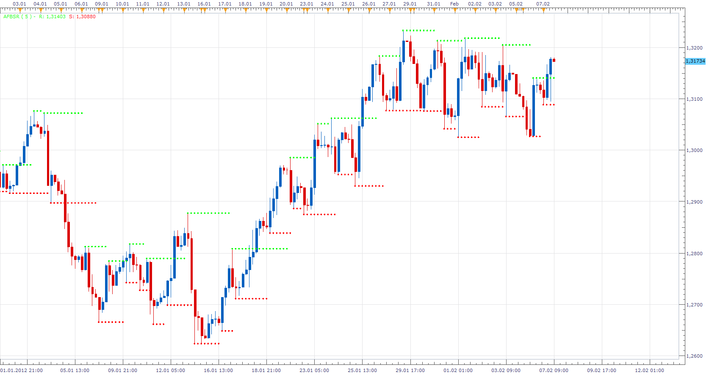
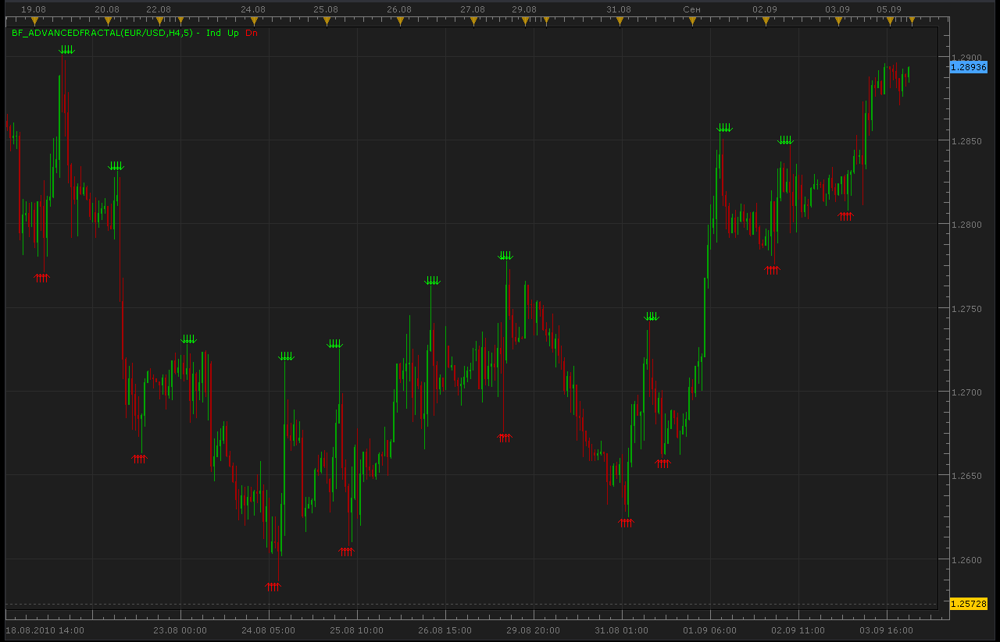
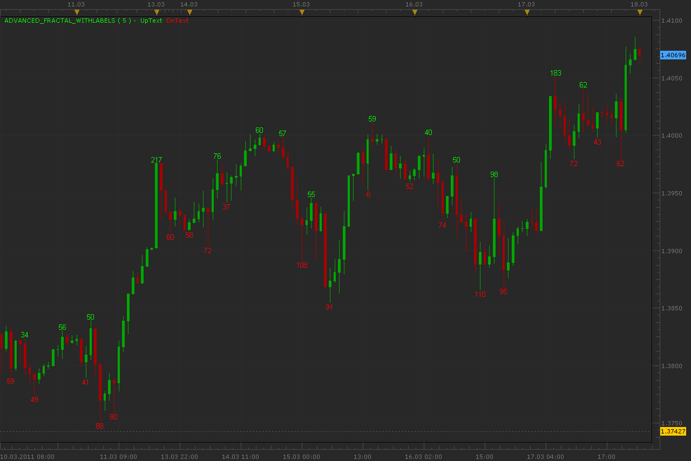
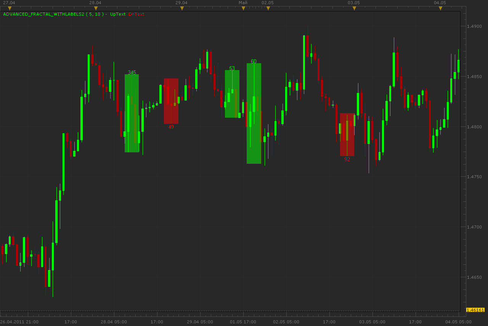
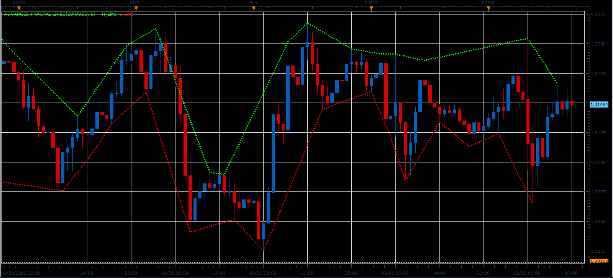
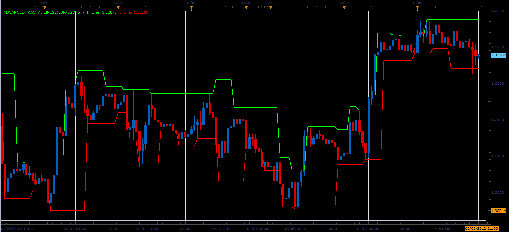
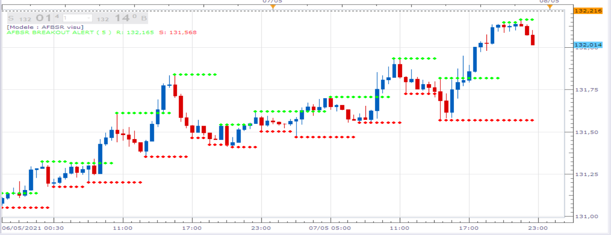
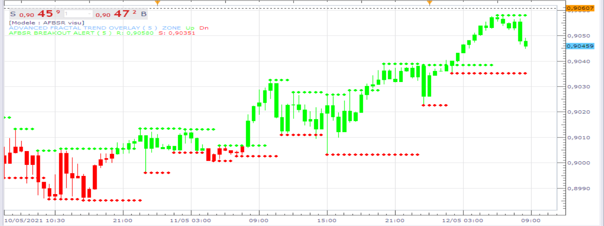

# Advanced Fractal

> Source: https://fxcodebase.com/code/viewtopic.php?f=17&t=724  
> Forum: 17 · Topic 724 · 155 post(s)

---

## Advanced Fractal

**Apprentice** · Wed Apr 21, 2010 4:37 am


*Advanced Fractal*

Advanced, Fractal indicator allows you to change, length of time frame that is checked. The algorithm allows only odd numbers.

 [Advanced Fractal.lua](files/1319/Advanced%20Fractal.lua)

 


Changes in trend are registered as follows.

**Up Trend.**
The closing price is higher than the Up fractal.
**Down Trend**
The closing price is lower than the Down fractal.

 [Advanced Fractal Trend Overlay.lua](files/1319/Advanced%20Fractal%20Trend%20Overlay.lua)

 [Advanced Fractal Trend Overlay with Alert.lua](files/1319/Advanced%20Fractal%20Trend%20Overlay%20with%20Alert.lua)

Strategy based on Advanced Fractal Trend Overlay can be found here.
[viewtopic.php?f=31&t=8283&p=18329#p18329](https://fxcodebase.com/code/viewtopic.php?f=31&t=8283&p=18329#p18329)

MT4/MQ4 version.
[viewtopic.php?f=38&t=17244](https://fxcodebase.com/code/viewtopic.php?f=38&t=17244)

 


Advanced fractal Labeling Tool will show you all the fractals, from 1 onwards,
and their weight.

1
3 Candles fractal
2
5 Candles fractal
3
7 Candles fractal
and so on.

 [Advanced Fractal Label.lua](files/1319/Advanced%20Fractal%20Label.lua)

 



 [AFBSR.lua](files/1319/AFBSR.lua)

 


 [Adv_Fractal_support_ resistance .lua](files/1319/Adv_Fractal_support_%20resistance%20.lua)

 [Advanced_Fractal_with_Alert.lua](files/1319/Advanced_Fractal_with_Alert.lua)

 


 [Advanced Fractal Support Resistance lines.lua](files/1319/Advanced%20Fractal%20Support%20Resistance%20lines.lua)

 


 [MTF MCP Advanced Fractal Multimeter.lua](files/1319/MTF%20MCP%20Advanced%20Fractal%20Multimeter.lua)

 


 [Unsymmetrical_Fractal_support_ resistance.lua](files/1319/Unsymmetrical_Fractal_support_%20resistance.lua)

---

## Re: Advanced Fractal

**bjmerkel** · Wed Apr 21, 2010 2:52 pm

what exactly does the number of fractals (odd) mean? Thanks a lot!

---

## Re: Advanced Fractal

**bjmerkel** · Wed Apr 21, 2010 3:23 pm

is the length of time minutes or how does that work?

---

## Re: Advanced Fractal

**thetruth** · Thu Aug 12, 2010 4:24 pm

can you put a other time frame option??
example, if you are in a 5 min time frame, calculate the fractal in 15 min? and put this in
same graph?
thanks!! and good work!!

---

## Re: Advanced Fractal

**Alexander.Gettinger** · Sun Sep 05, 2010 10:40 pm

Other timeframe version of advanced fractal.

 



```lua
function Init()
    indicator:name("Bigger timeframe advanced fractal");
    indicator:description("");
    indicator:requiredSource(core.Bar);
    indicator:type(core.Indicator);

    indicator.parameters:addGroup("Calculation");
    indicator.parameters:addString("BS", "Time frame to calculate advanced fractal", "", "D1");
    indicator.parameters:setFlag("BS", core.FLAG_PERIODS);
    indicator.parameters:addInteger("Frame", "Number of fractals (Odd)", "Number of fractals (Odd)", 5, 5,99);

    indicator.parameters:addGroup("Style");
    indicator.parameters:addColor("UP", "Up fractal color", "Up fractal color", core.rgb(0,255,0));
    indicator.parameters:addColor("DOWN", "Down fractal color", "Down fractal color", core.rgb(255,0,0));

end

local source;                   -- the source
local bf_data = nil;          -- the high/low data
local Frame;
local BS;
local bf_length;                 -- length of the bigger frame in seconds
local dates;                    -- candle dates
local host;
local day_offset;
local week_offset;
local extent;
local up;
local down;
local Indout;
local Shift;
local TF_Coeff;

function Prepare()
    source = instance.source;
    host = core.host;

    day_offset = host:execute("getTradingDayOffset");
    week_offset = host:execute("getTradingWeekOffset");

    BS = instance.parameters.BS;
    Frame = instance.parameters.Frame;
    extent = 20;

    local s, e, s1, e1;

    s, e = core.getcandle(source:barSize(), core.now(), 0, 0);
    s1, e1 = core.getcandle(BS, core.now(), 0, 0);
    assert ((e - s) <= (e1 - s1), "The chosen time frame must be bigger than the chart time frame!");
    bf_length = math.floor((e1 - s1) * 86400 + 0.5);

    local name = profile:id() .. "(" .. source:name() .. "," .. BS .. "," .. Frame .. ")";
    instance:name(name);
    up = instance:createTextOutput ("Up", "Up", "Wingdings", 10, core.H_Center, core.V_Top, instance.parameters.UP, 0);
    down = instance:createTextOutput ("Dn", "Dn", "Wingdings", 10, core.H_Center, core.V_Bottom, instance.parameters.DOWN, 0);
    Indout = instance:addStream("out", core.Line, name .. ".Ind", "Ind", core.rgb(0,255,0), 0);
    Shift=(Frame-1)/2;
    TF_Coeff=(e1-s1)/(e-s);
end

local loading = false;
local loadingFrom, loadingTo;
local pday = nil;

-- the function which is called to calculate the period
function Update(period, mode)
    -- get date and time of the hi/lo candle in the reference data
    local bf_candle;
    bf_candle = core.getcandle(BS, source:date(period-Shift), day_offset, week_offset);

    -- if data for the specific candle are still loading
    -- then do nothing
    if loading and bf_candle >= loadingFrom and (loadingTo == 0 or bf_candle <= loadingTo) then
        return ;
    end

    -- if the period is before the source start
    -- the do nothing
    if period-Shift*(TF_Coeff+1) < source:first() then
        return ;
    end
   
    -- if data is not loaded yet at all
    -- load the data
    if bf_data == nil then
        -- there is no data at all, load initial data
        local to, t;
        local from;

        if (source:isAlive()) then
            -- if the source is subscribed for updates
            -- then subscribe the current collection as well
            to = 0;
        else
            -- else load up to the last currently available date
            t, to = core.getcandle(BS, source:date(period-Shift), day_offset, week_offset);
        end

        from = core.getcandle(BS, source:date(source:first()), day_offset, week_offset);
        Indout:setBookmark(1, period);
        -- shift so the bigger frame data is able to provide us with the stoch data at the first period
        from = math.floor(from * 86400 - (bf_length * extent) + 0.5) / 86400;
        local nontrading, nontradingend;
        nontrading, nontradingend = core.isnontrading(from, day_offset);
        if nontrading then
            -- if it is non-trading, shift for two days to skip the non-trading periods
            from = math.floor((from - 2) * 86400 - (bf_length * extent) + 0.5) / 86400;
        end
        loading = true;
        loadingFrom = from;
        loadingTo = to;
        bf_data = host:execute("getHistory", 1, source:instrument(), BS, loadingFrom, to, source:isBid());
        return ;
    end

    -- check whether the requested candle is before
    -- the reference collection start
    if (bf_candle < bf_data:date(0)) then
        Indout:setBookmark(1, period);
        if loading then
            return ;
        end
        -- shift so the bigger frame data is able to provide us with the stoch data at the first period
        from = math.floor(bf_candle * 86400 - (bf_length * extent) + 0.5) / 86400;
        local nontrading, nontradingend;
        nontrading, nontradingend = core.isnontrading(from, day_offset);
        if nontrading then
            -- if it is non-trading, shift for two days to skip the non-trading periods
            from = math.floor((from - 2) * 86400 - (bf_length * extent) + 0.5) / 86400;
        end
        loading = true;
        loadingFrom = from;
        loadingTo = bf_data:date(0);
        host:execute("extendHistory", 1, bf_data, loadingFrom, loadingTo);
        return ;
    end

    -- check whether the requested candle is after
    -- the reference collection end
    if (not(source:isAlive()) and bf_candle > bf_data:date(bf_data:size() - 1)) then
        Indout:setBookmark(1, period);
        if loading then
            return ;
        end
        loading = true;
        loadingFrom = bf_data:date(bf_data:size() - 1);
        loadingTo = bf_candle;
        host:execute("extendHistory", 1, bf_data, loadingFrom, loadingTo);
        return ;
    end

    local p;
    p = findDateFast(bf_data, bf_candle, true);
    if p == -1 then
        return ;
    end
    if p>bf_data:size()-1 then
     return ;
    end
   
    local Fl=true;
    for i=1,(Frame-1)/2,1 do
     if bf_data.high[p-Shift]<bf_data.high[p-i-Shift] or bf_data.high[p-Shift]<bf_data.high[p+i-Shift] then
      Fl=false;
     end
    end
    if Fl==true then
     up:set(period-Shift*(TF_Coeff+1), bf_data.high[p-Shift], "\226");
--     up:set(period, bf_data.high[p-Shift], "\226");
    end
    Fl=true;
    for i=1,(Frame-1)/2,1 do
     if bf_data.low[p-Shift]>bf_data.low[p-i-Shift] or bf_data.low[p-Shift]>bf_data.low[p+i-Shift] then
      Fl=false;
     end
    end
    if Fl==true then
     down:set(period-Shift*(TF_Coeff+1), bf_data.low[p-Shift], "\225");
--     down:set(period, bf_data.low[p-Shift], "\225");
    end
   
end

-- the function is called when the async operation is finished
function AsyncOperationFinished(cookie)
    local period;

    pday = nil;
    period = Indout:getBookmark(1);

    if (period < 0) then
        period = 0;
    end
    loading = false;
    instance:updateFrom(period);
end

function findDateFast(stream, date, precise)
    local datesec = nil;
    local periodsec = nil;
    local min, max, mid;

    datesec = math.floor(date * 86400 + 0.5)

    min = 0;
    max = stream:size() - 1;

    while true do
        mid = math.floor((min + max) / 2);
        periodsec = math.floor(stream:date(mid) * 86400 + 0.5);
        if datesec == periodsec then
            return mid;
        elseif datesec > periodsec then
            min = mid + 1;
        else
            max = mid - 1;
        end
        if min > max then
            if precise then
                return -1;
            else
                return min - 1;
            end
        end
    end
end
```

---

## Re: Advanced Fractal

**Jigit Jigit** · Sat Oct 30, 2010 10:41 am

Hi,
Thank you for this excellent indicator Alexander.

Can you, please, help me with the following problems:
1) I have just installed the new Marketscope patch (the one posted here) and (as a result?) BF_Advanced_Fractal stopped working. I leave the the default settings, it does start loading but after a short while an "error" message appears in a bracket, on its label (see the pic in the attachment)

2) Why do the arrows representing fractals point in the directions opposite to the directions of the fractals they represent? That is to say, why is a fractal up represented by a down arrow, and a down fractal by an up arrow? Don't you think it's rather misleading?

I'll be much obliged for you help on those issues.
Cheers

---

## Re: Advanced Fractal

**Apprentice** · Sun Oct 31, 2010 6:39 am

Thank you for your report.
It is probably a bug in the indicators,
which platform previously have not detected.

---

## Re: Advanced Fractal

**Alexander.Gettinger** · Sun Oct 31, 2010 11:45 am

I cann't to repeat error.
Try to load indicator once again.

---

## Re: Advanced Fractal

**Jigit Jigit** · Sun Oct 31, 2010 3:33 pm

Cheers Alexander,
I have tried to load it again but it didn't help.
So I uninstalled the patch and it works now.
I guess there must be something wrong with this patch then.

What about those "misleading arrows" business?
Why do they point in the opposite directions (both in the standard Marketscope indicator and in yours BF_Advanced)?

---

## Re: Advanced Fractal

**Alexander.Gettinger** · Sun Oct 31, 2010 7:12 pm

Bug fixed.
Please, download indicator again.

---

## Re: Advanced Fractal

**Blackcat2** · Mon Nov 01, 2010 12:19 am

On a hindsight, the fractal seems to be accurate but in practice, using paramter 7, the signal appears like 3 candles (I'm using 15M chart) after the peak/bottom occured which is way way too late and practically unusable..

I was going to test this using a lower TF but the higher TF refused to set to lower TF, for example, place the indicator on 15M Chart but set it to look at 5M chart and place the fractal on 15M chart as soon as the 5M chart generated the signal, is this possible?

Thanks
BC

---

## Re: Advanced Fractal

**skarlaken** · Wed Nov 03, 2010 4:09 am

Apprentice? Is there a way to get the Advanced Fractal to auto-update on the charts, or am I doing something wrong?

---

## Re: Advanced Fractal

**Apprentice** · Wed Nov 03, 2010 5:23 am

On which version applies your remark.
Regular or BF variant.

I just tested regular and works as expected.

I tested with default parameters, which parameters you are using.

---

## Re: Advanced Fractal

**skarlaken** · Wed Nov 03, 2010 7:44 am

Hi Apprentice,

Thanks so much for the quick response!

I use several chart timeframes from 1m, 5m, 15m, 30m, 1H, 1D, 1W and I normally trade off 30m with 5m and 15m as leading triggers

I'm using the BF variant with the following parameters on my charts:

On 1min chart I use "Timeframe to calculate" = 5min and Number of fractals = 5
On 5min chart I use "Timeframe to calculate" = 15min and Number of fractals = 5
On 15min chart I use "Timeframe to calculate" = 30min and Number of fractals = 5
On 30min chart I use "Timeframe to calculate" = 1hour and Number of fractals = 5
On 1hour chart I use "Timeframe to calculate" = 2hour and Number of fractals = 5

This seems to reduce false signals quite a bit and also helps with confirmation. I also use TRENDLORD, AROON & EHLERS_HEATMAP as confirmation.

The main problem I have is that in order to get the BF variant to update I have no other choice than to go into edit mode and back to the chart. This then updates.

What am I doing wrong?
Thanks for the help!

---

## Re: Advanced Fractal

**thetruth** · Wed Nov 03, 2010 3:35 pm

great indicator!! thanks a lot!.
the indicator do not refresh automatic, can you put some instruction to refresh every candle?

---

## Re: Advanced Fractal

**orionjev** · Fri Nov 12, 2010 5:56 pm

Please add an instruction in BF_Advanced Fractal, is a Very Good indicator but don´t refresh for display new buy/sell signals.

Thank you

---

## Re: Advanced Fractal

**Surajs** · Sun Jan 02, 2011 12:30 pm

Hi Apprentice

Thanks for a great indicator - I wonder if there is a way to only display the marker arrows based on the number of bars visible on the chart i.e if I scroll back and then step forward I want to be able to see the marker arrows develop as the new bars come into play as a kind of 'forward testing' on old data to learn how to use the indicator.

Thanks,

Suraj

---

## Re: Advanced Fractal

**Apprentice** · Sun Jan 02, 2011 2:54 pm

I'm not sure what you want to achieve.
If I understand well, you would like fractal indication before it is confirmed.
For the last fractal.
Am I hit the meaning of your request

---

## Re: Advanced Fractal

**Surajs** · Sun Jan 02, 2011 4:57 pm

Hi Apprentice,

Thanks for the quick reply.

What I want to achieve is as follows: if for example I bring up a chart with the advanced fractal and it shows a number of up and down fractal indicators - then if I drag the chart to the right so that the most recent bars start to go off the screen ( as if I am looking at the chart on an earlier date/time) then the unconfirmed up or down arrows should disappear as the more recent bars disappear to the right. In other words if I am looking at a chart with some previous days data showing, only the fractal indicators confirmed by the bars visible on the chart should show until I drag the chart to the left to show more (enough) bars on the right of the display to confirm newer fractal indicator Arrows. It is as if I start the chart at an already earlier date with some fractal signals and as I drag the chart to see more and more new bars the newer fractal indicators appear when there is enough newer bars to confirm signals

You bring up a real good point about being able to see the unconfirmed fractal indicator: - if this was possible for example: let us say we are plotting a 5 period fractal and assign say arbitrary 25% completion for each higher high and each lower high (and vice versa on the other side) - then on the chart we could show a grey fractal indicator of darker shades until the fractal is confirmed and we change the indicator colour to the confirmed Down (or Up) fractal indicator colour - or in case the completion is scratched (negated) because of a bar high or low cancels the indicator confirmation, then we remove the grey arrow until the next fractal indicator starts to be processed.

(Sorry for my English and the wordy post - hopefully I have been able to clarify)

Thanks in advance,

Surajs

---

## Re: Advanced Fractal

**Surajs** · Thu Jan 06, 2011 9:26 am

Would it be possible to make a 100 tick chart and apply this indicator to it. (Or any other # of ticks eg 133 500 etc.)

Thanks

---

## Re: Advanced Fractal

**Alexander.Gettinger** · Fri Mar 18, 2011 12:07 am

New version of advanced fractals.
Indicator show difference (in pips) between current fractal and previous fractal of other direction.

 



Download:

 [Advanced_Fractal_withLabels.lua](files/8865/Advanced_Fractal_withLabels.lua)

---

## Re: Advanced Fractal

**jeisenm** · Fri Mar 18, 2011 9:10 am

i just installed the bf_fractal and it works for me. not sure what caused the error. seems like a nice indicator to show levels.

---

## Re: Advanced Fractal

**Alexander.Gettinger** · Fri May 06, 2011 2:14 am

Update of indicator.

Added:
1) Parameter [Distance] define min. distance between central bar and other bars.
2) Indicator draw rectangle on area which is found fractal.

 



Download:

 [Advanced_Fractal_withLabels2.lua](files/10355/Advanced_Fractal_withLabels2.lua)

---

## Re: Advanced Fractal

**lisa_baby_xx** · Fri May 06, 2011 7:02 am

Hi All,

This is a great indicator, I have looked on this site for an ADVANCED FRACTAL stratagy and cannot find one. If I have missed it, would somebody be kind enough to post it here.

Many thanks and much love to everyone.
lisa_baby_xx

---

## Re: Advanced Fractal

**Apprentice** · Fri May 06, 2011 10:13 am

Your request has been added to developmental cue.

---

## Re: Advanced Fractal

**lisa_baby_xx** · Fri May 06, 2011 10:42 am

Hi Apprentice,

If you are going to create a stratagy based upon this indicator, could you code it so as one position opens the previous position closes and would you be so kind to add the following parameter:

-"Allow Multiple Positions in the same direction."

Many thanks and much love sweetie. XX
lisa_baby_xx

---

## Re: Advanced Fractal

**Apprentice** · Fri May 06, 2011 11:28 am

I add this option in all my strategies, as standard.

---

## Re: Advanced Fractal

**Alexander.Gettinger** · Wed May 11, 2011 3:28 am

Please, see this strategy: [viewtopic.php?f=31&t=4196](https://fxcodebase.com/code/viewtopic.php?f=31&t=4196)

---

## Re: Advanced Fractal

**lisa_baby_xx** · Fri May 13, 2011 10:06 am

Hi Guys,

I was wondering, the AF behaves differently on shorter timeframes. Eg: When I use AF on a 1 Minute chart, the updating of the fractals is more regular than a 30 Minute. I spent 4 hours today watching a 1 minute chart - - i know!

I do prefer the AF on a 30 Minute TF.

Does it really behave differently on shorter TFs? And if so, why?

Many thanks and much love. XX
lisa_baby_xx

---

## Re: Advanced Fractal

**ambaado** · Tue Jun 28, 2011 8:48 am

Dear Alexsandr,

I use BF_Advanced Fractal. But it's not refreshing itself I have to open it and click on Show label. After that a new buy or sell arrows only shows? Why? Can you please fix it or I'm doing something wrong in here.

Thanks

Dorjoo

---

## Re: Advanced Fractal

**Apprentice** · Wed Jun 29, 2011 3:41 am

Thanks for the report.
We will test this problem.

---

## Re: Advanced Fractal

**Alexander.Gettinger** · Fri Jul 01, 2011 12:03 pm

BF_Advanced Fractal updated.

---

## Re: Advanced Fractal

**baz1234** · Thu Jul 14, 2011 7:51 am

Hi would be possible to add an email notification to the BF_Advanced_Fractal?

So that if there are any signals within any ccy pairs an email would be sent out.

Thanks for your help

---

## Re: Advanced Fractal

**Apprentice** · Thu Jul 14, 2011 3:41 pm

Indicator as such can not provide this type of signal.
However, we can write the signal.

---

## Re: Advanced Fractal

**ndx100** · Sat Nov 19, 2011 8:44 pm

hi;
I have a little request.Could you add arrow size option please? it must be easy for you
thanks

---

## Re: Advanced Fractal

**ndx100** · Sat Nov 19, 2011 9:50 pm

And one more thing..
Can you add a bar coloring option?
for example when prices break an upfractal up (close higher than nearest upfractal) , bars color turn green (or another selected color) and stay green until a down fractal broken down AND
when prices break a downfractal down (close lower than nearest downfractal) , bars color turn red and stay red until a up fractal broken up..

this option will make easier to understand fractals and break points..

---

## Re: Advanced Fractal

**Apprentice** · Sun Nov 20, 2011 6:04 pm

Your request is added to the developmental cue.

---

## Re: Advanced Fractal

**Apprentice** · Mon Nov 21, 2011 5:04 am

Font Size Added.

---

## Re: Advanced Fractal

**Apprentice** · Mon Nov 21, 2011 5:34 am

Advanced Fractal Trend Overlay Added

---

## Re: Advanced Fractal

**ndx100** · Mon Nov 21, 2011 7:42 am

thank you very much..

---

## Re: Advanced Fractal

**ndx100** · Mon Nov 21, 2011 1:27 pm

> **Apprentice wrote:**
> Advanced Fractal Trend Overlay Added

Can you develop a strategy for this indicator? When nearest fractal broken up/down at the close of candle strategy opens buy/sell positions. (buy at open of the second green bar ,sell at open of the second red bar)

thanks again..

---

## Re: Advanced Fractal

**Apprentice** · Mon Nov 21, 2011 2:02 pm

I'm one step ahead of you.
[viewtopic.php?f=31&t=8283](https://fxcodebase.com/code/viewtopic.php?f=31&t=8283)

---

## Re: Advanced Fractal

**ndx100** · Mon Nov 21, 2011 3:20 pm

> **Apprentice wrote:**
> I'm one step ahead of you.
> [viewtopic.php?f=31&t=8283](https://fxcodebase.com/code/viewtopic.php?f=31&t=8283)

wow

---

## 3 Fractal indicator comparison

**nazaar** · Fri Dec 02, 2011 4:29 pm

Hello,

this sounds like a very useful indicator. may i request, what is the difference between the three: advanced fractal vs. advanced fractal trend overlay vs. bf_advanced fractal?

also, the version on page 1, is that the most updated version?

thanks in advance.
nazaar

---

## Re: Advanced Fractal

**Apprentice** · Fri Dec 02, 2011 6:08 pm

advanced fractal
Fractal indicator with adjustable number of periods.

 advanced fractal trend overlay
Is Overlay for the simple strategy that uses advanced fractal.

 bf_advanced fractal
Shows the position of fractals from other (higher) time frames.

---

## Re: Advanced Fractal

**nazaar** · Fri Dec 02, 2011 10:08 pm

Apprentice, as always, thanks for the fast response.

FXCM has a fractal indicator already and I compared theirs to advance fractal with periods set to 5, got the same result, as expected. I then changed advance fractal period to 7 and the results were still the same. I also tested it for 9, 11 and 13 but the results remained same each time. Should this be?

We know that a **basic**fractal is identified as (let's call this **level 5**):
HIGH: price sets a high with the **2 bars** to the left and to the right having lower highs
LOW: price sets a low with the **2 bars** to the left and to the right having higher lows

Adjusting the periods then to say 7 would mean (let's call this **level 7**):
HIGH: price sets a high with **3 bars to the left** and 3 bars to the right having lower highs
LOW: price sets a low with **3 bars to the left**and 3 bars to the right having higher lows

I was wondering if we could build on the existing advanced fractal indicator. That is, show all basic fractals but when level 7 or level 9, or a level 11 fractal appears the number 7,9 or 11 respectively would appear above or below the fractal symbol?

Thanks,
Nazaar

p.s. I can't believe I am studying fractals at 10pm EST on a Friday night and excited about it.

---

## Re: Advanced Fractal

**Apprentice** · Sun Dec 04, 2011 5:02 am

Your request is added to the developmental cue.

---

## Re: Advanced Fractal

**Apprentice** · Tue Dec 06, 2011 9:56 am

Requested can be found on the top most post.

---

## Re: Advanced Fractal

**sho-me-pips** · Thu Feb 02, 2012 12:27 pm

I would like to use this only as a stoploss, could you add this as option or would it be easier to build new strategy?

Also add an option to add a few pips beyond the actual wick high or low.

---

## Re: Advanced Fractal

**Apprentice** · Fri Feb 03, 2012 3:41 am

First, this is, indicator, not a strategy.
However, you can use it, as an independent strategy,
or build in the algorithm. Both, however, must be programmed.
This is especially true for the build in version.

---

## Re: Advanced Fractal

**Alexander.Gettinger** · Sat Feb 04, 2012 9:12 pm

The indicator draws two lines on the High and Low prices.

 



Download:

 [Advanced Fractal lines.lua](files/25183/Advanced%20Fractal%20lines.lua)

---

## Re: Advanced Fractal

**Hailkayy** · Sat Feb 04, 2012 9:47 pm

Thanks, is it possible to make a second version of it ?
The links, each fractal tops are joined by a straight line. could you arrange the thing so the line moves from the top/bottom, vertically, and then, still on top of the top/bott, joins the next one horizontally.
With a right angle

That way an horizontal line, usefull for Breakout and stuff is kind of seen. Just a matter of "sight".
Thanks please

Great work.

---

## Re: Advanced Fractal

**Apprentice** · Sun Feb 05, 2012 2:57 am

Your request is added to the development list.

---

## Re: Advanced Fractal

**sho-me-pips** · Mon Feb 06, 2012 9:24 pm

Can these options be added?

1. A horizontal line from the fractal point to infinity, (users choice of color and line thickness)
2. If price closes beyond the line, change color (users choice of color), this support or resistance has been broken but is still relevant.
3. If price closes beyond the line the other direction, auto delete line, this support or resistance has no relevance at this point.

---

## Re: Advanced Fractal

**Alexander.Gettinger** · Wed Feb 08, 2012 8:10 pm

Advanced fractal lines with horizontal lines.

 



Download:

 [Advanced Fractal lines2.lua](files/25475/Advanced%20Fractal%20lines2.lua)

---

## Re: Advanced Fractal

**Apprentice** · Tue Feb 14, 2012 6:24 pm


Requested can be found here.
I did not have time to test this one.
Performance improvements are needed.

 [Adv_Fractal_support_ resistance .lua](files/26005/Adv_Fractal_support_%20resistance%20.lua)

---

## Re: Advanced Fractal

**sho-me-pips** · Tue Feb 14, 2012 10:34 pm

AWESOME

---

## Re: MTF Advanced Fractal Heatmap

**flem_wad** · Fri Feb 17, 2012 2:16 pm

Hi,

I have looked all over the internet for a MTF Advanced Fractal indicator - but cannot find one - not even for other platforms!

Can this indicator be written? Should I post this on the indicator requests page?

Hope you can help.
flem_wad

---

## Re: Advanced Fractal

**Apprentice** · Sat Feb 18, 2012 4:13 am

Your request is added to the development list.

---

## Re: Advanced Fractal

**Apprentice** · Sat Feb 18, 2012 12:51 pm

Requested can be found here.
[viewtopic.php?f=17&t=13608](https://fxcodebase.com/code/viewtopic.php?f=17&t=13608)

---

## Re: Advanced Fractal

**sho-me-pips** · Mon Feb 20, 2012 11:57 am

> **Apprentice wrote:**
>
>
> Adv_Fractal_support_ resistance.png
>
>
> Requested can be found here.
> I did not have time to test this one.
> **Performance improvements are needed.**
>
> Adv_Fractal_support_ resistance .lua

**Performance improvements are needed.** I agree. CPU runs at 90+% when indicator is applied.

**Works GREAT during the time I can allow it to run!**

---

## Re: Advanced Fractal

**subliminal** · Wed Mar 14, 2012 9:49 pm

Hey guys amazing indi as always! Is it possible to have an option to have 3 fractals? To go with the fractal stop loss

---

## Re: Advanced Fractal

**Apprentice** · Thu Mar 15, 2012 8:00 pm

Try this.

 [AFBSR.lua](files/28133/AFBSR.lua)

---

## Re: Advanced Fractal

**Alexander.Gettinger** · Fri Apr 27, 2012 12:37 pm

MQL4 version of Advanced Fractals: [viewtopic.php?f=38&t=17244](https://fxcodebase.com/code/viewtopic.php?f=38&t=17244)

---

## Re: Advanced Fractal

**amazon1a** · Sun Jun 10, 2012 10:53 am

Hi Alexander, Would it be possible to add an option to: BF_AdvancedFractal.lua in order to change the font size. This function, present on many indicators, would make it easier to spot the arrows particularly if the fractal indicator with labels is also on the screen. I use this combo eg on a H4 layout by overlaying the D1 fractal arrows on the H4 chart. Many thanks.

---

## Re: Advanced Fractal

**Apprentice** · Tue Jun 12, 2012 2:36 am

Try to use standard Advanced Fractal Indicator.
It has this option.
And then change the source time frame.

---

## Re: Advanced Fractal

**tastefullvenom** · Wed Nov 07, 2012 3:46 pm

Is there any chance to have the AFBSR.lua indi have just a dot on top/below the 3 day fractal pattern instead of a line please?

---

## Re: Advanced Fractal

**Apprentice** · Thu Nov 08, 2012 7:12 am

What's wrong with the arrows.
(Advanced Fractal.lua)

---

## Re: Advanced Fractal

**trdheat** · Mon Apr 28, 2014 10:18 am

Is it possible historical display for AFBSR?

---

## Re: Advanced Fractal

**Apprentice** · Tue Apr 29, 2014 3:54 am

Can you elaborate on your request, provide more details.
I'm not sure whether I understand that the manner of presentation will be used.

---

## Re: Advanced Fractal

**trdheat** · Tue Apr 29, 2014 12:03 pm

Apprentice,

I'm little confused about historical view and i don't have a suggestion. Let's ignore it.

I have a question about AFBSR.lua. If number of fractals is n then for non-repaint edition of AFBSR is sufficient n periods shift? How many periods shift required?

---

## Re: Advanced Fractal

**4x4359** · Thu Jun 19, 2014 2:17 am

i very much like this tho it freeze market Scope and trading station.
has a fix been created?

thanx 06/19/2014

Adv_Fractal_support_ resistance.lua

---

## Re: Advanced Fractal

**Apprentice** · Thu Jun 19, 2014 3:27 am

I failed to reproduce.
Can you share bit more, settings you're using, time frame, currency pair.
I admit this can prove resource demanding indicator.

---

## Re: Advanced Fractal

**Apprentice** · Thu Jun 19, 2014 5:01 am

Please Re-Dowload Adv_Fractal_support_ resistance.lua
Major performance update.

---

## Re: Advanced Fractal

**PaulEamonn** · Wed Jul 23, 2014 11:05 am

Hi Apprentice

I've just discovered the **AFBSR**and I think it's brilliant.

Is there any way you can include an alert in the same way as you have with the **ADVANCED_FRACTAL_WITH_ALERT** and also make it possible to change the Style and length of the line as well as the thickness? I'd like to plot the line just using the day data and then display it on the lower time frames but when I do this the dotted lines look a bit scrappy so I think a solid line would be better.

I hope you can manage this as I think this will answer a lot of my needs.

Many thanks.

---

## Re: Advanced Fractal

**Apprentice** · Mon Jan 05, 2015 2:51 am

Bump Up.

---

## Re: Advanced Fractal

**kashix** · Mon Jan 05, 2015 9:42 pm

Hi,

Can you make an Advanced Fractal version that doesn't draw the last fractal until current period or candle is complete? For example, when a new candle starts without breaking the last low/high, a false fractal may be drawn.

Thanks!!

---

## Re: Advanced Fractal

**Apprentice** · Tue Jan 06, 2015 2:40 am

Your request is added to the development list.

---

## Re: Advanced Fractal

**adloule** · Sun Mar 22, 2015 5:07 am

guys is it possible to add an alert and an arrow when price break resistance or support (after candle close) to AFBSR.lua indicator
thanks

---

## Re: Advanced Fractal

**tdesiato** · Sat Nov 28, 2015 1:27 am

> **Apprentice wrote:**
>
>
> The attachment **Adv_Fractal_support_ resistance.png** is no longer available
>
>
> Requested can be found here.
> I did not have time to test this one.
> Performance improvements are needed.
>
>
> The attachment **Adv_Fractal_support_ resistance.png** is no longer available

I modified this indicator to show Supply & Demand levels more clearly at the close of the candles, and limited the number of lines it will draw, so it doesn't crash anymore. Now, the Length is also the number of candles to be tested. I also fixed the line width & style and generally cleaned up the code. I think it is a very useful indicator for those trading S&D on higher time frames.

Best Regards,
Todd

---

## Re: Advanced Fractal

**Apprentice** · Mon Dec 14, 2015 7:33 am

Dec 14, 2015: Compatibility issue Fixed. _Alert helper is not longer needed.

If you want to use updated version of this indicator,
please make sure to use TS Version 01.14.101415. or higher.

---

## Re: Advanced Fractal

**Apprentice** · Wed Feb 22, 2017 4:16 am

Indicator was revised and updated.

---

## Re: Advanced Fractal

**Lucilene** · Sun Feb 26, 2017 7:37 pm

Hello Apprentice,

Can You make a modification in the Advanced Fractal with Alert Indicator to make it execute two* external *.exe files after to play the alert sound?

*If the signal is up execute the first file, if the signal is down execute the second file.

Thanks in advance,

Best regards.

---

## Re: Advanced Fractal

**Apprentice** · Tue Feb 28, 2017 3:54 am

Your request is added to the development list, Under Id Number 3754
 If someone is interested to do this task, please contact me.

---

## Re: Advanced Fractal

**Lucilene** · Tue Feb 28, 2017 6:34 am

For now I solved my problem inserting the following lines pointed by arrows:

(..)

if U[id]~=source:serial(period-Shift)
	and period == source:size()-1
	and not FIRST
then
	U[id]=source:serial(period-Shift);
	SoundAlert(Up[id]);
 ==>> os.execute("G:\\ForexDB\\Buy1xDN0m.exe")
	EmailAlert( Label[id], " Down ", period-Shift);
 if Show then
 Pop(Label[id], " Down" );
 end
end

(..)

if D[id]~=source:serial(period-Shift)
 and period == source:size()-1
 and not FIRST
then
 D[id]=source:serial(period-Shift);
 SoundAlert(Down[id]);
 ==>> os.execute("G:\\ForexDB\\Buy1xUP0m.exe")
 EmailAlert( Label[id] , " Up", period-Shift);
 if Show then
 Pop(Label[id], " Up " );
 end
end

(..)

But more elegant solution would be insert a session to permit the non programer user to choose the external files to up and down situations. I don't know LUA enough to do this task and I'm very sick to learn.

---

## Re: Advanced Fractal

**Lucilene** · Tue Feb 28, 2017 7:04 am

P.S: If possible make this indicator compatible with Strategy Builder.

Thanks in advance.

---

## Re: Advanced Fractal

**Apprentice** · Wed Mar 01, 2017 4:58 am

Try this version.

 [Advanced_Fractal_with_Alert.lua](files/111267/Advanced_Fractal_with_Alert.lua)

But there is downside of the users request: TS freezes during execution of the users exe file (you can't do otherwise in Lua, unfortunately).

Perhaps you can run .bat execute .exe from .bat?

---

## Re: Advanced Fractal

**Avignon** · Thu Apr 13, 2017 4:34 pm

Little bug. I think the signal is done at the highest / lowest instead of the fence of the candle.

 


After refrech.

 


---

## Re: Advanced Fractal

**Stonyheart** · Wed Apr 19, 2017 4:02 am

Hi, it's possible to make Advanced Trend Fractal Overlay in MQL4, please ?

---

## Re: Advanced Fractal

**Apprentice** · Wed Apr 19, 2017 1:41 pm

Your request is added to the development list, Under Id Number 3785
 If someone is interested to do this task, please contact me.

---

## Re: Advanced Fractal

**adloule** · Mon Jun 19, 2017 1:11 pm

guys is it possible to add an alert and an arrow when price break resistance or support (after candle close) to AFBSR.lua indicator
thanks

---

## Re: Advanced Fractal

**adloule** · Mon Aug 07, 2017 12:09 pm

Apprentice,
could you please answer me, is it possible to add fractal breakout alert ?
thank you sir.

---

## Re: Advanced Fractal

**Apprentice** · Mon Aug 07, 2017 1:44 pm

Your request is added to the development list, Under Id Number 3839
 If someone is interested to do this task, please contact me.

---

## Re: Advanced Fractal

**adloule** · Mon Aug 07, 2017 6:57 pm

Thank you very much for your answer

please do you know any other similar breakout indicator that i can use?
thanks

---

## Re: Advanced Fractal

**Apprentice** · Tue Aug 08, 2017 2:38 am

Not at this moment.

---

## Re: Advanced Fractal

**Apprentice** · Tue Aug 08, 2017 4:49 am

Try this version.
[viewtopic.php?f=17&t=64970&p=114057#p114057](https://fxcodebase.com/code/viewtopic.php?f=17&t=64970&p=114057#p114057)

---

## Re: Advanced Fractal

**adloule** · Tue Aug 08, 2017 7:23 am

Thank you thank you very much kind Sir.
it is exactly what i wanted

---

## Re: Advanced Fractal

**Silverthorn** · Fri Jul 20, 2018 12:54 am

Hi Apprentice,

Could I please have a version of AFBSR.lua that uses High ask and low bid for it's calculations.

Thanks heaps as always!!

---

## Re: Advanced Fractal

**Apprentice** · Sun Jul 22, 2018 6:49 am

Your request is added to the development list under Id Number 4192

---

## Re: Advanced Fractal

**Apprentice** · Tue Jul 24, 2018 8:02 am

[AFBSR.Silverthorn.lua](files/120059/AFBSR.Silverthorn.lua)

Try this version.

---

## Re: Advanced Fractal

**chai88888** · Wed Aug 05, 2020 12:23 am

can you add alert for this Advanced Fractal Trend Overlay.lua

thanks

---

## Re: Advanced Fractal

**chai88888** · Wed Aug 05, 2020 3:46 am

> **Avignon wrote:**
> Little bug. I think the signal is done at the highest / lowest instead of the fence of the candle.
>
>
>
> Capture 1.png
>
>
>
>
> After refrech.
>
>
> Capture 2.png

this happens to the indicator

---

## Re: Advanced Fractal

**Apprentice** · Wed Aug 05, 2020 4:03 am

Your request is added to the development list.
Development reference 1826.

---

## Re: Advanced Fractal

**Apprentice** · Mon Aug 10, 2020 10:12 am

[Advanced Fractal Trend Overlay with Alert.lua](files/136748/Advanced%20Fractal%20Trend%20Overlay%20with%20Alert.lua)

Try this version.

---

## Re: Advanced Fractal

**ericcky** · Tue Sep 15, 2020 7:56 am

Hi Apprentice and team,

Can help convert this for MT4 usage?

Thank you for your help.

---

## Re: Advanced Fractal

**Apprentice** · Wed Sep 16, 2020 10:58 am

MT4 version
[viewtopic.php?f=38&t=17244](https://fxcodebase.com/code/viewtopic.php?f=38&t=17244)

---

## Re: Advanced Fractal

**Avignon** · Sun May 09, 2021 11:54 am

On [Advanced Fractal Trend Overlay](https://fxcodebase.com/code/download/file.php?id=5057), can you replace the small arrows with lines in the form of dots for example like AFBSR Breakout?

 



Thank you.

---

## Re: Advanced Fractal

**Apprentice** · Tue May 11, 2021 3:18 am

Your request is added to the development list.
Development reference 462.

---

## Re: Advanced Fractal

**Apprentice** · Tue May 11, 2021 8:30 am

Advanced Fractal Support Resistance lines.lua added.

---

## Re: Advanced Fractal

**Avignon** · Wed May 12, 2021 1:34 am

Great!

Thank you Apprentice.

---

## Re: Advanced Fractal

**Avignon** · Wed May 12, 2021 2:09 am



---

## Re: Advanced Fractal

**Avignon** · Wed May 12, 2021 2:13 am

That's what I wanted, but there's a little bug to fix.

 


*good*

 


*no good*

---

## Re: Advanced Fractal

**Apprentice** · Wed May 12, 2021 5:05 am

Try it now.

---

## Re: Advanced Fractal

**Avignon** · Wed May 12, 2021 5:23 am

It's good now.

Thank you again.

---

## Re: Advanced Fractal

**richard85** · Thu Sep 30, 2021 5:06 am

> **Apprentice wrote:**
>
>
> Advanced Fractal.png
>
>
>
> Advanced, Fractal indicator allows you to change, length of time frame that is checked. The algorithm allows only odd numbers.
>
>
>
> Advanced Fractal.lua
>
>
>
>
>
> Advanced Fractal Trend Overlay.lua.png
>
>
> Changes in trend are registered as follows.
>
> **Up Trend.**
> The closing price is higher than the Up fractal.
> **Down Trend**
> The closing price is lower than the Down fractal.
>
>
>
> Advanced Fractal Trend Overlay.lua
>
>
>
>
> Advanced Fractal Trend Overlay with Alert.lua
>
>
> Strategy based on Advanced Fractal Trend Overlay can be found here.
> [viewtopic.php?f=31&t=8283&p=18329#p18329](https://fxcodebase.com/code/viewtopic.php?f=31&t=8283&p=18329#p18329)
>
> MT4/MQ4 version.
> [viewtopic.php?f=38&t=17244](https://fxcodebase.com/code/viewtopic.php?f=38&t=17244)
>
>
> Advanced Fractal Label.png
>
>
>
> Advanced fractal Labeling Tool will show you all the fractals, from 1 onwards,
> and their weight.
>
> 1
> 3 Candles fractal
> 2
> 5 Candles fractal
> 3
> 7 Candles fractal
> and so on.
>
>
>
> Advanced Fractal Label.lua
>
>
>
>
>
> AFBSR.png
>
>
>
>
> AFBSR.lua
>
>
>
>
>
> Adv_Fractal_support_ resistance.png
>
>
>
>
> Adv_Fractal_support_ resistance .lua
>
>
>
>
>
> Advanced_Fractal_with_Alert.lua
>
>
>
>
>
> EURUSD m5 (05-11-2021 1529).png
>
>
>
>
> Advanced Fractal Support Resistance lines.lua

Is it possible to convert the "Advanced Fractal Trend Overlay.lua" in MT4?

---

## Re: Advanced Fractal

**Apprentice** · Sat Oct 02, 2021 3:23 am

Your request is added to the development list.
Development reference 886.

---

## Re: Advanced Fractal

**Apprentice** · Sat Oct 16, 2021 5:46 am

MT4 version.
[https://fxcodebase.com/code/viewtopic.p ... 59#p143959](https://fxcodebase.com/code/viewtopic.php?f=38&t=71576&p=143959#p143959)

---

## Re: Advanced Fractal

**ahmedalhosenyy** · Tue Dec 20, 2022 5:41 pm

Is it possible for MTF lua version

thanks in advance

regards

---

## Re: Advanced Fractal

**Apprentice** · Thu Dec 22, 2022 9:30 am

We have added your request to the development list.
Development reference 846.

---

## Re: Advanced Fractal

**Apprentice** · Fri Dec 23, 2022 3:38 am


Please use these parameters to get a higher time frame version.

 


---

## Re: Advanced Fractal

**Apprentice** · Fri Dec 23, 2022 3:47 am

MTF MCP Advanced Fractal Multimeter.lua added.

---

## Re: Advanced Fractal

**Apprentice** · Fri Jan 27, 2023 9:17 am

Advanced Fractal Trend Overlay with Alert and Advanced Fractal Trend Overlay ware updated.

---

## Re: Advanced Fractal

**ahmedalhosenyy** · Fri Jul 14, 2023 7:39 pm

Hello and thanks for that very good indicator

But do you think that adding the 1 candle shift to indicator will prevent the small repainting at the candle of break !

[img][img]https://ibb.co/vxBZnQ3[/img][/img]

Thanks in advance

---

## Re: Advanced Fractal

**Apprentice** · Thu Jul 20, 2023 2:19 pm

Can you please repost the image?

---

## Re: Advanced Fractal

**ahmedalhosenyy** · Thu Jul 20, 2023 6:35 pm

hello,
picture attached

---

## Re: Advanced Fractal

**Apprentice** · Tue Jul 25, 2023 6:15 am

[Advanced Fractal Trend Overlay.lua](files/151788/Advanced%20Fractal%20Trend%20Overlay.lua)

Something like this?
One candle shift on a higher time frame may cause a significant delay.

---

## Re: Advanced Fractal

**ahmedalhosenyy** · Tue Jul 25, 2023 4:58 pm

Hello and many thanks for the new change

new Idea for : may you add a new option which is changing the **chart background**

Show :

Fractal
trend
**chart background**

thanks in advance

---

## Re: Advanced Fractal

**Apprentice** · Mon Jul 31, 2023 6:00 pm

We have added your request to the development list.
Development reference 669.

---

## Advanced Fractal Trend Chart Background

**Apprentice** · Wed Aug 02, 2023 5:45 am


Implementation using Draw functionality.

 [Advanced Fractal Trend Chart Background.lua](files/151893/Advanced%20Fractal%20Trend%20Chart%20Background.lua)

---

## Re: Advanced Fractal

**ahmedalhosenyy** · Thu Aug 03, 2023 10:40 am

Many thankx

---

## Re: Advanced Fractal

**ahmedalhosenyy** · Thu Aug 10, 2023 8:22 pm

Hello,

May you add the option of Levels " In Yellow "

Thanks in advance

---

## Re: Advanced Fractal

**Apprentice** · Wed Aug 16, 2023 3:05 pm

We have added your request to the development list.
Development reference 733.

---

## Re: Advanced Fractal

**ahmedalhosenyy** · Mon Oct 23, 2023 12:54 pm

Hello ,
just checking

thanks in advance

---

## Re: Advanced Fractal

**ahmedalhosenyy** · Tue Nov 21, 2023 4:27 am

> **tdesiato wrote:**
>
>
> > **Apprentice wrote:**
> >
> >
> > Adv_Fractal_support_ resistance.png
> >
> >
> > Requested can be found here.
> > I did not have time to test this one.
> > Performance improvements are needed.
> >
> >
> > Adv_Fractal_support_ resistance .lua
>
>
>
>
> I modified this indicator to show Supply & Demand levels more clearly at the close of the candles, and limited the number of lines it will draw, so it doesn't crash anymore. Now, the Length is also the number of candles to be tested. I also fixed the line width & style and generally cleaned up the code. I think it is a very useful indicator for those trading S&D on higher time frames.
>
> Best Regards,
> Todd

Hello
the indicator is very useful but it keep crashes and chart always frozen when use it in higher time frame CPU in my computer jumps to 100 %

Any help to fix this issue

regards

---

## Re: Advanced Fractal

**Apprentice** · Tue Nov 21, 2023 8:16 am

[Adv_Fractal_support_ resistance.lua](files/153345/Adv_Fractal_support_%20resistance.lua)

Try this version.
Lookback was introduced.
Also draw line was used.

---

## Re: Advanced Fractal

**adloule** · Wed Nov 22, 2023 6:23 am

Hello Apprentice,
could you please the option to choose the number of bars left and right ( picture below)
and please add a channel that to connect the fractals

thank you very much

---

## Re: Advanced Fractal

**Apprentice** · Tue Nov 28, 2023 11:00 am

We have added your request to the development list.
Development reference 1056

---

## Re: Advanced Fractal

**Apprentice** · Tue Nov 28, 2023 12:52 pm


Something like this?

 [Unsymmetrical_Fractal_support_ resistance.lua](files/153470/Unsymmetrical_Fractal_support_%20resistance.lua)

---

## Re: Advanced Fractal

**adloule** · Fri Dec 01, 2023 4:18 pm

Thank you sir

---

## Re: Advanced Fractal

**adloule** · Fri Dec 01, 2023 4:41 pm

Apprentice,
i think the the indicator doesn't work correctly

look at the picture below please on the left is how it should be with 5 Bars at the right and 5 bars at the left

thank you

---

## Re: Advanced Fractal

**Apprentice** · Tue Dec 05, 2023 7:09 am

We have added your request to the development list.
Development reference 1071

---

## Re: Advanced Fractal

**Apprentice** · Tue Dec 05, 2023 8:08 am

[Unsymmetrical_Fractal_support_ resistance.lua](files/153577/Unsymmetrical_Fractal_support_%20resistance.lua)

Fixed.

---

## Re: Advanced Fractal

**adloule** · Wed Jan 03, 2024 6:00 am

Thank you Apprentice

the limit of lower number of fractal is 5, could you please modify it to 3

and the lookback limit is 1000 could you please modify it to 5000 or more for back testing

thank you very much

---

## Re: Advanced Fractal

**Apprentice** · Wed Jan 10, 2024 7:41 am

We have added your request to the development list.
Development reference 57

---

## Re: Advanced Fractal

**Apprentice** · Wed Jan 10, 2024 2:31 pm

[Unsymmetrical_Fractal_support_ resistance.lua](files/154000/Unsymmetrical_Fractal_support_%20resistance.lua)

Try this version.

---

## Re: Advanced Fractal

**adloule** · Mon Jan 15, 2024 8:03 am

thank you Apprentice
could you please if it's possible to add a zigzag option

---

## Re: Advanced Fractal

**Apprentice** · Sat Jan 20, 2024 4:42 am

Can you clarify?

---

## Re: Advanced Fractal

**adloule** · Sun Jan 21, 2024 1:07 pm

a zigzag that follows the number of fractals chosen
like the purple zigzag i drew
thank you

---

## Re: Advanced Fractal

**Apprentice** · Tue Jan 23, 2024 2:48 pm

We have added your request to the development list.
Development reference 100

---

## Re: Advanced Fractal

**ahmedalhosenyy** · Wed Jan 24, 2024 8:27 am

> **ahmedalhosenyy wrote:**
> Hello,
>
> May you add the option of Levels " In Yellow "
>
> Thanks in advance

Hello ,

Any news about this request

Many thanks in advance

---

## Re: Advanced Fractal

**adloule** · Sun Sep 08, 2024 12:16 pm

hi Apprentice,

i found this indicator it can help you with the indicator of a zigzag that follows the number of fractals chosen

[https://www.tradingview.com/v/vCJe18K3/](https://www.tradingview.com/v/vCJe18K3/)

thank you very much

---

## Re: Advanced Fractal

**Apprentice** · Sun Sep 08, 2024 3:45 pm

We have added your request to the development list.
Development reference 690

---

## Re: Advanced Fractal

**Apprentice** · Thu Oct 31, 2024 8:12 am

Try this version.
[https://fxcodebase.com/code/viewtopic.p ... 10#p157110](https://fxcodebase.com/code/viewtopic.php?f=38&t=75327&p=157110#p157110)

---

## Re: Advanced Fractal

**ahmedalhosenyy** · Wed Oct 08, 2025 10:16 pm

May we have the fractal trend overlay as a heatmap

thanks

---

## Re: Advanced Fractal

**Apprentice** · Sun Oct 12, 2025 2:28 am

We have added your request to the development list.
Development reference 656
