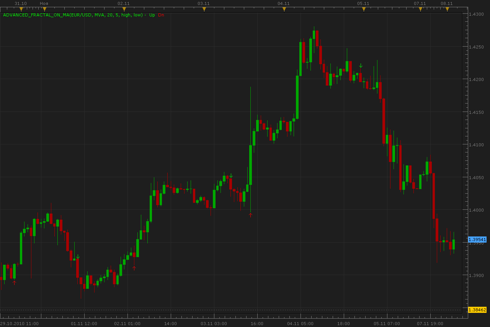

# Advanced fractals on MA

> Source: https://fxcodebase.com/code/viewtopic.php?f=17&t=2617  
> Forum: 17 · Topic 2617 · 6 post(s)

---

## Advanced fractals on MA

**Alexander.Gettinger** · Mon Nov 08, 2010 2:31 am

This version of fractals searches maximums and minimums MA using extended variant of MA.

 



 [Advanced_Fractal_On_MA.lua](files/5891/Advanced_Fractal_On_MA.lua)

For this indicator must be installed Averages indicator:
[viewtopic.php?f=17&t=2430](https://fxcodebase.com/code/viewtopic.php?f=17&t=2430)
MT4/Mq4 version.
[viewtopic.php?f=38&t=64330](https://fxcodebase.com/code/viewtopic.php?f=38&t=64330)

The indicator was revised and updated

---

## Re: Advanced fractals on MA

**sedraude** · Mon Nov 08, 2010 3:52 am

Hi Alexander,

Great work, awesome indicator for me. Can you make strategy too based on this indicator?

Thank in advance

---

## Re: Advanced fractals on MA

**Apprentice** · Mon Nov 08, 2010 4:06 am

Added to developmental cue.

---

## Re: Advanced fractals on MA

**Alexander.Gettinger** · Mon Nov 08, 2010 5:57 am

Strategy based on this indicator can be find here: [viewtopic.php?f=31&t=2624&p=5908#p5908](https://fxcodebase.com/code/viewtopic.php?f=31&t=2624&p=5908#p5908)

---

## Re: Advanced fractals on MA

**Alexander.Gettinger** · Mon Nov 22, 2010 2:46 am

Indicator updated.

```lua
function Init()
    indicator:name("Advanced fractal on MA");
    indicator:description("Advanced fractal on MA");
    indicator:requiredSource(core.Bar);
    indicator:type(core.Indicator);

    indicator.parameters:addGroup("Calculation");
    indicator.parameters:addString("Method", "Method", "", "MVA");
    indicator.parameters:addStringAlternative("Method", "MVA", "", "MVA");
    indicator.parameters:addStringAlternative("Method", "EMA", "", "EMA");
    indicator.parameters:addStringAlternative("Method", "Wilder", "", "Wilder");
    indicator.parameters:addStringAlternative("Method", "LWMA", "", "LWMA");
    indicator.parameters:addStringAlternative("Method", "SineWMA", "", "SineWMA");
    indicator.parameters:addStringAlternative("Method", "TriMA", "", "TriMA");
    indicator.parameters:addStringAlternative("Method", "LSMA", "", "LSMA");
    indicator.parameters:addStringAlternative("Method", "SMMA", "", "SMMA");
    indicator.parameters:addStringAlternative("Method", "HMA", "", "HMA");
    indicator.parameters:addStringAlternative("Method", "ZeroLagEMA", "", "ZeroLagEMA");
    indicator.parameters:addStringAlternative("Method", "DEMA", "", "DEMA");
    indicator.parameters:addStringAlternative("Method", "T3", "", "T3");
    indicator.parameters:addStringAlternative("Method", "ITrend", "", "ITrend");
    indicator.parameters:addStringAlternative("Method", "Median", "", "Median");
    indicator.parameters:addStringAlternative("Method", "GeoMean", "", "GeoMean");
    indicator.parameters:addStringAlternative("Method", "REMA", "", "REMA");
    indicator.parameters:addStringAlternative("Method", "ILRS", "", "ILRS");
    indicator.parameters:addStringAlternative("Method", "IE/2", "", "IE/2");
    indicator.parameters:addStringAlternative("Method", "TriMAgen", "", "TriMAgen");
    indicator.parameters:addStringAlternative("Method", "JSmooth", "", "JSmooth");
 
    indicator.parameters:addInteger("Period", "Period", "", 20);
   
    indicator.parameters:addString("up_price", "up_price", "", "high");
    indicator.parameters:addStringAlternative("up_price", "close", "", "close");
    indicator.parameters:addStringAlternative("up_price", "open", "", "open");
    indicator.parameters:addStringAlternative("up_price", "high", "", "high");
    indicator.parameters:addStringAlternative("up_price", "low", "", "low");
    indicator.parameters:addStringAlternative("up_price", "median", "", "median");
    indicator.parameters:addStringAlternative("up_price", "typical", "", "typical");
    indicator.parameters:addStringAlternative("up_price", "weighted", "", "weighted");
   
    indicator.parameters:addString("dn_price", "dn_price", "", "low");
    indicator.parameters:addStringAlternative("dn_price", "close", "", "close");
    indicator.parameters:addStringAlternative("dn_price", "open", "", "open");
    indicator.parameters:addStringAlternative("dn_price", "high", "", "high");
    indicator.parameters:addStringAlternative("dn_price", "low", "", "low");
    indicator.parameters:addStringAlternative("dn_price", "median", "", "median");
    indicator.parameters:addStringAlternative("dn_price", "typical", "", "typical");
    indicator.parameters:addStringAlternative("dn_price", "weighted", "", "weighted");
   
    indicator.parameters:addInteger("Frame", "Number of fractals (Odd)", "Number of fractals (Odd)", 5, 5,99);

    indicator.parameters:addGroup("Style");
    indicator.parameters:addColor("UP", "Up fractal color", "Up fractal color", core.rgb(0,255,0));
    indicator.parameters:addColor("DOWN", "Down fractal color", "Down fractal color", core.rgb(255,0,0));
end

local first;
local source = nil;
local Method;
local Period;
local Frame;
local up_price;
local dn_price;
local MA_up;
local MA_dn;
local up;
local down;

function Prepare()
    source = instance.source;
    Method=instance.parameters.Method;
    Period=instance.parameters.Period;
    Frame=instance.parameters.Frame;
    up_price=instance.parameters.up_price;
    dn_price=instance.parameters.dn_price;
    if up_price=="close" then
     MA_up = core.indicators:create("AVERAGES", source.close,  Method, Period, false);
    elseif up_price=="open" then
     MA_up = core.indicators:create("AVERAGES", source.open,  Method, Period, false);
    elseif up_price=="high" then
     MA_up = core.indicators:create("AVERAGES", source.high,  Method, Period, false);
    elseif up_price=="low" then
     MA_up = core.indicators:create("AVERAGES", source.low,  Method, Period, false);
    elseif up_price=="median" then
     MA_up = core.indicators:create("AVERAGES", source.median,  Method, Period, false);
    elseif up_price=="typical" then
     MA_up = core.indicators:create("AVERAGES", source.typical,  Method, Period, false);
    else
     MA_up = core.indicators:create("AVERAGES", source.weighted,  Method, Period, false);
    end
    if dn_price=="close" then
     MA_dn = core.indicators:create("AVERAGES", source.close,  Method, Period, false);
    elseif dn_price=="open" then
     MA_dn = core.indicators:create("AVERAGES", source.open,  Method, Period, false);
    elseif dn_price=="high" then
     MA_dn = core.indicators:create("AVERAGES", source.high,  Method, Period, false);
    elseif dn_price=="low" then
     MA_dn = core.indicators:create("AVERAGES", source.low,  Method, Period, false);
    elseif dn_price=="median" then
     MA_dn = core.indicators:create("AVERAGES", source.median,  Method, Period, false);
    elseif dn_price=="typical" then
     MA_dn = core.indicators:create("AVERAGES", source.typical,  Method, Period, false);
    else
     MA_dn = core.indicators:create("AVERAGES", source.weighted,  Method, Period, false);
    end
    first = MA_up.DATA:first()+2;
    local name = profile:id() .. "(" .. source:name() .. ", " .. instance.parameters.Method .. ", " .. instance.parameters.Period .. ", " .. instance.parameters.Frame .. ", " .. instance.parameters.up_price .. ", " .. instance.parameters.dn_price .. ")";
    instance:name(name);
    up = instance:createTextOutput ("Up", "Up", "Wingdings", 10, core.H_Center, core.V_Top, instance.parameters.UP, 0);
    down = instance:createTextOutput ("Dn", "Dn", "Wingdings", 10, core.H_Center, core.V_Bottom, instance.parameters.DOWN, 0);
end

function Update(period, mode)
   local shift=math.floor((Frame-1)/2)+1;
   if (period>first+Frame) then
    MA_up:update(mode);
    MA_dn:update(mode);
    local Fl_UP=true;
    local Fl_DN=true;
    local i;
    for i=1,math.floor((Frame-1)/2),1 do
     if MA_dn.DATA[period-i-shift]<=MA_dn.DATA[period-shift] or MA_dn.DATA[period+i-shift]<=MA_dn.DATA[period-shift] then
      Fl_DN=false;
     end
     if MA_up.DATA[period-i-shift]>=MA_up.DATA[period-shift] or MA_up.DATA[period+i-shift]>=MA_up.DATA[period-shift] then
      Fl_UP=false;
     end
    end
    if Fl_UP==true then
     up:set(period-shift, source.high[period-shift], "\226");
    end
    if Fl_DN==true then
     down:set(period-shift, source.low[period-shift], "\225");
    end
   end
end
```

---

## Re: Advanced fractals on MA

**Apprentice** · Wed Jan 25, 2017 5:17 am

Indicator was revised and updated.
