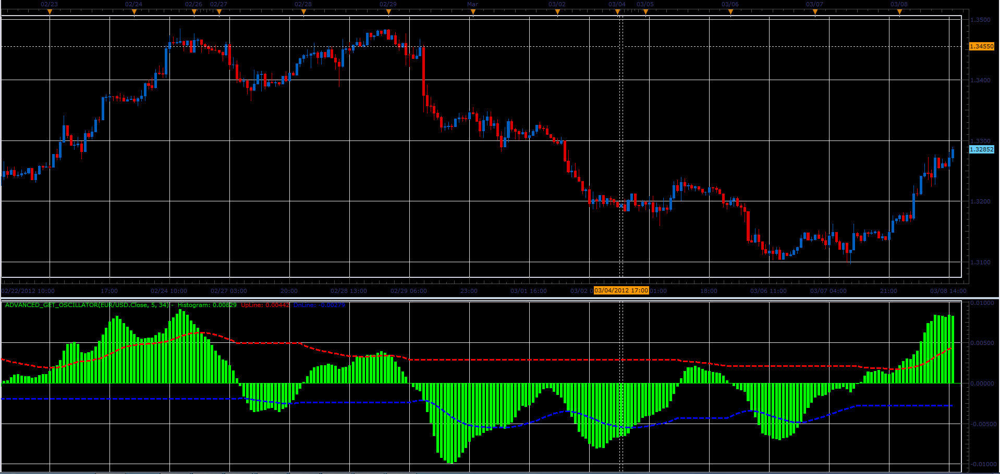
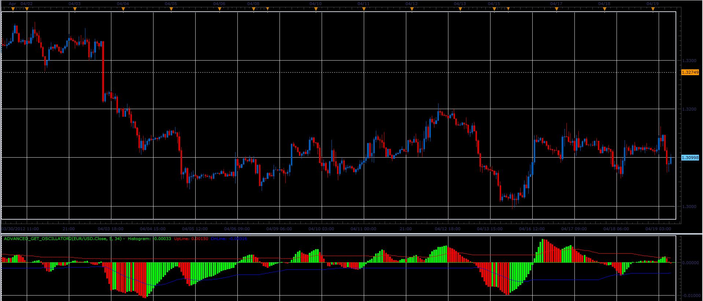
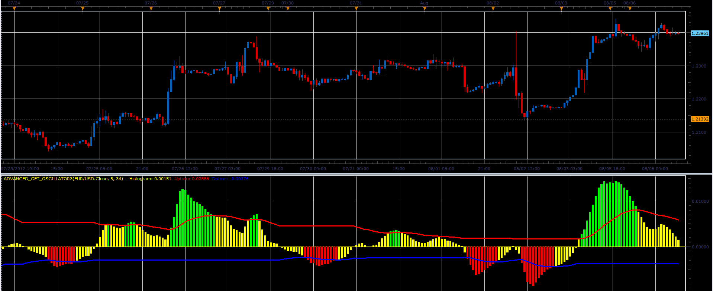

# Advanced Get Oscillator

> Source: https://fxcodebase.com/code/viewtopic.php?f=17&t=14631  
> Forum: 17 · Topic 14631 · 12 post(s)

---

## Advanced Get Oscillator

**Alexander.Gettinger** · Thu Mar 08, 2012 3:17 pm

This indicator is a ported MQL4 indicator from [viewtopic.php?f=27&t=13908](https://fxcodebase.com/code/viewtopic.php?f=27&t=13908)

Formulas:
Histogram=MVA(FastPeriod)-MVA(SlowPeriod),
if Histogram>=0: UpLine[i]=Histogram[i]*Coeff+UpLine[i-1]*(1-Coeff), DnLine[i]=DnLine[i-1],
if Histogram<0: UpLine[i]=UpLine[i-1], DnLine[i]=Histogram[i]*Coeff+DnLine[i-1]*(1-Coeff), where
Coeff=2/39.

 

Download:

 [Advanced_Get_Oscillator.lua](files/27756/Advanced_Get_Oscillator.lua)

The indicator was revised and updated

---

## Re: Advanced Get Oscillator

**briansummy** · Fri Mar 23, 2012 11:54 pm

This would make a great MTF Strategy. Amazing work here!!!!

---

## Re: Advanced Get Oscillator

**Apprentice** · Sun Mar 25, 2012 4:15 am

Can you define the Entry, Exit conditions.

---

## Re: Advanced Get Oscillator

**igariok_m** · Wed Apr 18, 2012 1:21 pm

Hi can make it color like Awsome Oscilator

---

## Re: Advanced Get Oscillator

**Apprentice** · Thu Apr 19, 2012 1:33 am

Your request is added to the development list.

---

## Re: Advanced Get Oscillator

**Alexander.Gettinger** · Thu Apr 19, 2012 8:36 am

> **igariok_m wrote:**
> Hi can make it color like Awsome Oscilator

See this version of oscillator.

 

Download:

 [Advanced_Get_Oscillator2.lua](files/30508/Advanced_Get_Oscillator2.lua)

---

## Re: Advanced Get Oscillator

**igariok_m** · Thu Apr 19, 2012 3:15 pm

Thanks a lot

---

## Re: Advanced Get Oscillator

**igariok_m** · Thu Jul 19, 2012 2:59 pm

Hi this version of "advanced get2" is using simple moving averages, can make it to use exponential moving average 5,35 close, and if can make this indicator to use with mt4 too

---

## Re: Advanced Get Oscillator

**Alexander.Gettinger** · Thu Jul 19, 2012 8:26 pm

> **igariok_m wrote:**
> Hi this version of "advanced get2" is using simple moving averages, can make it to use exponential moving average 5,35 close, and if can make this indicator to use with mt4 too

OK. I will write it.

---

## Re: Advanced Get Oscillator

**superleo** · Fri Jul 20, 2012 7:32 am

hi,

can you add yellow low color in this indicator;

conditions are:

green: histogram > upper line
red: histogram< lower line
yellow: histogram inbetween upper and lower line

---

## Re: Advanced Get Oscillator

**Alexander.Gettinger** · Mon Aug 06, 2012 4:30 pm

> **superleo wrote:**
> hi,
>
> can you add yellow low color in this indicator;
>
>
> conditions are:
>
> green: histogram > upper line
> red: histogram< lower line
> yellow: histogram inbetween upper and lower line

Please, see this version of indicator.

 

Download:

 [Advanced_Get_Oscillator3.lua](files/38280/Advanced_Get_Oscillator3.lua)

---

## Re: Advanced Get Oscillator

**Apprentice** · Thu Apr 06, 2017 4:11 pm

Indicator was revised and updated.
