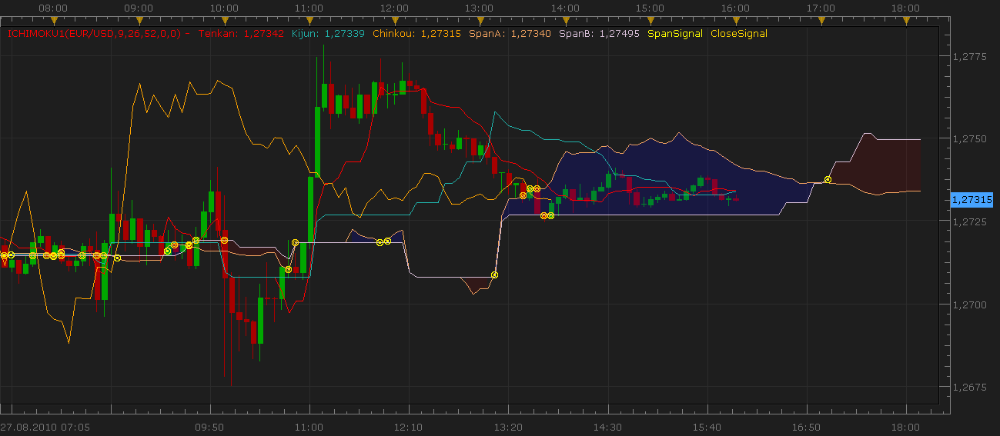

# Advanced Ichimoku Indicator and Signal

> Source: https://fxcodebase.com/code/viewtopic.php?f=17&t=1970  
> Forum: 17 · Topic 1970 · 26 post(s)

---

## Advanced Ichimoku Indicator and Signal

**Nikolay.Gekht** · Sat Aug 28, 2010 9:15 pm

The indicator is modification of the standard Ichimoku which is included into the Marketscope installation.

In addition to the standard indicator's features, this version allows to:
1) Hide or show Tenkan, Kijun and Chinkou lines
2) Specify Span and Chinkou lines shift (expressed in bars) against the default values against the default displacement of these lines (+/-Kijun)
3) Show the labels when the close price crosses the span lines and/or when the span lines crosses.
4) Uses different colors to fill the area between spans depending on which span line is currently on top.

The signal lets you show alert or play sound when close price crosses the span lines and/or when the span lines crosses.

 

Download indicator:

 [ichimoku1.lua](files/3994/ichimoku1.lua)

Download singal:

 [ichimoku1_signal.lua](files/3994/ichimoku1_signal.lua)

If you want to use the signal only, the indicator must be installed anyway. The signal will not work without the indicator.

The indicator was revised and updated

---

## Re: Advanced Ichimoku Indicator and Signal

**jsi@jp** · Tue Aug 31, 2010 6:44 am

Thank you very much Nikolay.
I think it's better when "ichimoku1" is used together with "cloud".

Cloud.lua URL
[http://fxcodebase.com/code/viewtopic.php?f=17&t=1589#p4007](https://fxcodebase.com/code/viewtopic.php?f=17&t=1589#p4007)

---

## Re: Advanced Ichimoku Indicator and Signal

**luigipg** · Fri Sep 03, 2010 4:08 pm

what is the cloud settage to use it with ichimoku? thanks. Luigi!!!

---

## Re: Advanced Ichimoku Indicator and Signal

**cornishcay** · Wed Dec 08, 2010 10:41 am

Hi,

i had downloaded both the indicator and signal and managed to load the indicator.

however, when trying to load the signal, i get the following error message (pls see attached picture). How do I go about resolving this error?

thanks!

---

## Re: Advanced Ichimoku Indicator and Signal

**Apprentice** · Wed Dec 08, 2010 12:37 pm

If you download The present indicator,
rename it to ICH1
Signal works as expected.

 [ICH1.lua](files/6643/ICH1.lua)

---

## Re: Advanced Ichimoku Indicator and Signal

**Blackcat2** · Thu Dec 09, 2010 6:28 pm

Is it possible to generate Buy/Sell signal instead or maybe bull/bear/ranging?

---

## Re: Advanced Ichimoku Indicator and Signal

**manhongw** · Tue Apr 05, 2011 3:38 am

How to interpret buy or sell?

---

## Re: Advanced Ichimoku Indicator and Signal

**TradeKing** · Fri Jun 03, 2011 12:38 pm

Can we get the lines on the Ichimoku thicker because you can barely see these lines. Thanks!

---

## Re: Advanced Ichimoku Indicator and Signal

**TradeKing** · Fri Jun 03, 2011 1:08 pm

Forgot to ask previously but can we also get the cross signal of the Tekan-Sen and Kijun-Sen which is really the main signal. Thanks!

---

## Re: Advanced Ichimoku Indicator and Signal

**Apprentice** · Sat Jun 04, 2011 4:38 am

I believe that this version has this functionality.
[viewtopic.php?f=29&t=861&p=11236&hilit=ichimoku#p11236](https://fxcodebase.com/code/viewtopic.php?f=29&t=861&p=11236&hilit=ichimoku#p11236)

---

## Re: Advanced Ichimoku Indicator and Signal

**cyanidez** · Thu May 03, 2012 12:45 pm

BRILLIANT indicator, thanks guys.

Can you just add one more feature please? The ability to shift Kijun and Tenkan as well.

Thank you very much!

---

## Re: Advanced Ichimoku Indicator and Signal

**Apprentice** · Sun May 06, 2012 4:29 am

Your request is added to the development list.

---

## Re: Advanced Ichimoku Indicator and Signal

**cyanidez** · Sun May 06, 2012 5:48 am

GREAT, can't wait thanks!

---

## Re: Advanced Ichimoku Indicator and Signal

**nazaar** · Wed Jun 06, 2012 11:11 am

Hello,

I would like to request a marker tool to compliment the ichimoku indicator.

Looking for a tool to mark the 9th, 26th and 52nd bars back, ideally a small symbol to by placed at each of the mentioned bars back.

Thanks in advance.

---

## Re: Advanced Ichimoku Indicator and Signal

**Apprentice** · Thu Jun 07, 2012 3:12 am

Your request is added to the development list.

---

## Re: Advanced Ichimoku Indicator and Signal

**lbikhope** · Thu Jun 21, 2012 7:16 pm

i woudlika ask for map-cloud

thx a lot of code

Code: [Select all](https://fxcodebase.com/code/)
`*/
#property copyright ""
#property link      ""

#property indicator_separate_window
#property indicator_minimum 0.0
#property indicator_maximum 1.0
#property indicator_buffers 7
#property indicator_color1 Green
#property indicator_color2 Green
#property indicator_color3 Blue
#property indicator_color4 Red
#property indicator_color5 Red
#property indicator_color6 DeepPink
#property indicator_color7 Gray

string gs_76 = "";
double gd_84 = 0.3;
string g_name_92 = "Mx_KumoPriceBreakout_";
string gs_100 = "London Trader Cloud";
int g_color_108 = Red;
extern int Tenkan = 8;
extern int Kijun = 29;
extern int Senkou = 34;
extern string ____Draw = "";
extern bool Signal_Arrows = FALSE;
double gd_136 = 0.3;
extern int maxBars = 2000;
double g_ibuf_148[];
double g_ibuf_152[];
double g_ibuf_156[];
double g_ibuf_160[];
double g_ibuf_164[];
double g_ibuf_168[];
double g_ibuf_172[];
int g_window_176;
datetime g_time_188;
datetime g_time_192;
bool gi_196;
int gi_200;
int g_stoplevel_204;
int gi_208;
double gd_212;
double g_tickvalue_220;
double gd_228;
double gd_236;
int PP=1;

int init() {

   if(Digits==5 || Digits==3)PP=10;
   int li_0 = 110;
   int li_4 = 110;
   int li_8 = 119;
   int li_12 = 233;
   int li_16 = 110;
   int li_20 = 119;
   int li_24 = 234;
   SetIndexBuffer(0, g_ibuf_148);
   SetIndexArrow(0, li_4);
   SetIndexBuffer(1, g_ibuf_152);
   SetIndexArrow(1, li_8);
   SetIndexBuffer(2, g_ibuf_156);
   SetIndexArrow(2, li_12);
   SetIndexBuffer(3, g_ibuf_160);
   SetIndexArrow(3, li_16);
   SetIndexBuffer(4, g_ibuf_164);
   SetIndexArrow(4, li_20);
   SetIndexBuffer(5, g_ibuf_168);
   SetIndexArrow(5, li_24);
   SetIndexBuffer(6, g_ibuf_172);
   SetIndexArrow(6, li_0);
   SetIndexStyle(0, DRAW_ARROW);
   SetIndexStyle(1, DRAW_ARROW);
   SetIndexStyle(2, DRAW_ARROW);
   SetIndexStyle(3, DRAW_ARROW);
   SetIndexStyle(4, DRAW_ARROW);
   SetIndexStyle(5, DRAW_ARROW);
   SetIndexStyle(6, DRAW_ARROW);
   SetIndexLabel(0, NULL);
   SetIndexLabel(1, NULL);
   SetIndexLabel(2, NULL);
   SetIndexLabel(3, NULL);
   SetIndexLabel(4, NULL);
   SetIndexLabel(5, NULL);
   SetIndexLabel(6, NULL);
   gs_76 = gs_76 + " (" + Tenkan + "," + Kijun + "," + Senkou + ")";
   IndicatorShortName(gs_76);
   IndicatorDigits(Digits);
   Get_MarketInfos();
   return (0);
}

int deinit() {
   ObjectDelete(g_name_92);
   ObjectsDeleteAll();
   return (0);
}

int start() {
   int li_12;
   if (g_window_176 == 0) g_window_176 = WindowFind(gs_76);
   if (gd_212 == 0.0) Get_MarketInfos();
   int li_8 = IndicatorCounted();
   if (li_8 > 0) li_8--;
   int li_4 = Bars - li_8;
   if (li_4 > maxBars) li_4 = maxBars;
   for (int li_0 = li_4; li_0 >= 0; li_0--) {
      li_12 = Get_KumoPrice_Breakout(li_0, Tenkan, Kijun, Senkou);
      if (Signal_Arrows == FALSE) {
         if (li_12 == 3) li_12 = 1;
         else
            if (li_12 == -3) li_12 = -1;
      }
      switch (li_12) {
      case 1:
         g_ibuf_148[li_0] = gd_84;
         g_ibuf_152[li_0] = EMPTY_VALUE;
         g_ibuf_156[li_0] = EMPTY_VALUE;
         g_ibuf_160[li_0] = EMPTY_VALUE;
         g_ibuf_164[li_0] = EMPTY_VALUE;
         g_ibuf_168[li_0] = EMPTY_VALUE;
         g_ibuf_172[li_0] = EMPTY_VALUE;
         break;
      case 2:
         g_ibuf_148[li_0] = EMPTY_VALUE;
         g_ibuf_152[li_0] = gd_84;
         g_ibuf_156[li_0] = EMPTY_VALUE;
         g_ibuf_160[li_0] = EMPTY_VALUE;
         g_ibuf_164[li_0] = EMPTY_VALUE;
         g_ibuf_168[li_0] = EMPTY_VALUE;
         g_ibuf_172[li_0] = EMPTY_VALUE;
         break;
      case 3:
         g_ibuf_148[li_0] = EMPTY_VALUE;
         g_ibuf_152[li_0] = EMPTY_VALUE;
         g_ibuf_156[li_0] = gd_84;
         g_ibuf_160[li_0] = EMPTY_VALUE;
         g_ibuf_164[li_0] = EMPTY_VALUE;
         g_ibuf_168[li_0] = EMPTY_VALUE;
         g_ibuf_172[li_0] = EMPTY_VALUE;
         break;
      case -1:
         g_ibuf_148[li_0] = EMPTY_VALUE;
         g_ibuf_152[li_0] = EMPTY_VALUE;
         g_ibuf_156[li_0] = EMPTY_VALUE;
         g_ibuf_160[li_0] = gd_84;
         g_ibuf_164[li_0] = EMPTY_VALUE;
         g_ibuf_168[li_0] = EMPTY_VALUE;
         g_ibuf_172[li_0] = EMPTY_VALUE;
         break;
      case -2:
         g_ibuf_148[li_0] = EMPTY_VALUE;
         g_ibuf_152[li_0] = EMPTY_VALUE;
         g_ibuf_156[li_0] = EMPTY_VALUE;
         g_ibuf_160[li_0] = EMPTY_VALUE;
         g_ibuf_164[li_0] = gd_84;
         g_ibuf_168[li_0] = EMPTY_VALUE;
         g_ibuf_172[li_0] = EMPTY_VALUE;
         break;
      case -3:
         g_ibuf_148[li_0] = EMPTY_VALUE;
         g_ibuf_152[li_0] = EMPTY_VALUE;
         g_ibuf_156[li_0] = EMPTY_VALUE;
         g_ibuf_160[li_0] = EMPTY_VALUE;
         g_ibuf_164[li_0] = EMPTY_VALUE;
         g_ibuf_168[li_0] = gd_84;
         g_ibuf_172[li_0] = EMPTY_VALUE;
         break;
      default:
         g_ibuf_148[li_0] = EMPTY_VALUE;
         g_ibuf_152[li_0] = EMPTY_VALUE;
         g_ibuf_156[li_0] = EMPTY_VALUE;
         g_ibuf_160[li_0] = EMPTY_VALUE;
         g_ibuf_164[li_0] = EMPTY_VALUE;
         g_ibuf_168[li_0] = EMPTY_VALUE;
         g_ibuf_172[li_0] = gd_84;
      }
    if(g_ibuf_148[li_0+1]<100000 && g_ibuf_148[li_0+2]>100000 )BUY(li_0+1);
    if(g_ibuf_160[li_0+1]<100000 && g_ibuf_160[li_0+2]>100000 )SELL(li_0+1);
   }
   Write_IndicatorName();
   
   static int TT1=0,TT2=0;
   
   if(g_ibuf_148[1]<100000 && g_ibuf_148[2]>100000 && TT1!=Time[0]){
   
      Alert("Buy");
      TT1=Time[0];
      BUY(1);
      }
   
   if(g_ibuf_160[1]<100000 && g_ibuf_160[2]>100000 && TT2!=Time[0]){
   
      Alert("Sell");
      TT2=Time[0];
      SELL(1);
      }
   
   return (0);
}

void BUY(int A){
     
    ObjectCreate("nameB"+Time[A], OBJ_ARROW, 0, Time[A],Low[A]-9*Point*PP);
    ObjectSet("nameB"+Time[A], OBJPROP_COLOR, Blue);
    ObjectSet("nameB"+Time[A], OBJPROP_WIDTH, 1);
    ObjectSet("nameB"+Time[A], OBJPROP_ARROWCODE, 241);
 
}

void SELL(int A){
 
    ObjectCreate("nameS"+Time[A], OBJ_ARROW, 0, Time[A],High[A]+9*Point*PP);
    ObjectSet("nameS"+Time[A], OBJPROP_COLOR, Red);
    ObjectSet("nameS"+Time[A], OBJPROP_WIDTH, 1);
    ObjectSet("nameS"+Time[A], OBJPROP_ARROWCODE, 242);
 
}

void Get_MarketInfos() {
   gi_200 = MarketInfo(Symbol(), MODE_SPREAD);
   g_stoplevel_204 = MarketInfo(Symbol(), MODE_STOPLEVEL);
   gd_212 = MarketInfo(Symbol(), MODE_POINT);
   g_tickvalue_220 = MarketInfo(Symbol(), MODE_TICKVALUE);
   gi_208 = MarketInfo(Symbol(), MODE_DIGITS);
   gd_228 = gi_200 * Point;
   gd_236 = g_stoplevel_204 * Point;
   if (gi_208 == 3 || gi_208 == 5) {
      gi_208--;
      gd_212 = 10.0 * gd_212;
      gi_200 = MathRound(gi_200 / 10.0);
      if (gi_200 < 1) gi_200 = 1;
   }
   gd_228 = gi_200 * gd_212;
}

void Write_IndicatorName() {
   int l_str_len_0;
   string l_text_4;
   g_time_188 = Time[0];
   if (g_time_188 != g_time_192) {
      g_time_192 = g_time_188;
      gi_196 = TRUE;
   } else gi_196 = FALSE;
   if (gi_196) {
      l_str_len_0 = StringLen(gs_100);
      for (int li_12 = 1; li_12 <= l_str_len_0 + 4; li_12++) l_text_4 = l_text_4 + " ";
      l_text_4 = l_text_4 + gs_100;
      if (ObjectFind(g_name_92) == -1) {
         ObjectCreate(g_name_92, OBJ_TEXT, g_window_176, Time[0], gd_84 + gd_136);
         ObjectSetText(g_name_92, l_text_4, 9, "Courier New", g_color_108);
      } else ObjectMove(g_name_92, 0, Time[0], gd_84 + gd_136);
   }
}

int Get_KumoPrice_Breakout(int ai_0, int ai_4, int ai_8, int ai_12) {
   double l_ichimoku_16 = iIchimoku(Symbol(), Period(), ai_4, ai_8, ai_12, MODE_SENKOUSPANA, ai_0);
   double l_ichimoku_24 = iIchimoku(Symbol(), Period(), ai_4, ai_8, ai_12, MODE_SENKOUSPANB, ai_0);
   double l_ichimoku_32 = iIchimoku(Symbol(), Period(), ai_4, ai_8, ai_12, MODE_SENKOUSPANA, ai_0 + 1);
   double l_ichimoku_40 = iIchimoku(Symbol(), Period(), ai_4, ai_8, ai_12, MODE_SENKOUSPANB, ai_0 + 1);
   double ld_48 = MathMin(l_ichimoku_16, l_ichimoku_24);
   double ld_56 = MathMax(l_ichimoku_16, l_ichimoku_24);
   double ld_64 = MathMin(l_ichimoku_32, l_ichimoku_40);
   double ld_72 = MathMax(l_ichimoku_32, l_ichimoku_40);
   double l_iclose_80 = iClose(Symbol(), Period(), ai_0);
   double l_iclose_88 = iClose(Symbol(), Period(), ai_0 + 1);
   int li_ret_96 = 0;
   if (l_iclose_80 > ld_56) {
      if (l_iclose_88 <= ld_72) {
         li_ret_96 = 3;
         return (li_ret_96);
      }
      li_ret_96 = 1;
      return (li_ret_96);
   }
   if (l_iclose_80 < ld_48) {
      if (l_iclose_88 >= ld_64) {
         li_ret_96 = -3;
         return (li_ret_96);
      }
      li_ret_96 = -1;
      return (li_ret_96);
   }
   return (li_ret_96);
}`

---

## Re: Advanced Ichimoku Indicator and Signal

**Apprentice** · Fri Jun 22, 2012 1:39 am

Your request is added to the development list.

---

## Re: Advanced Ichimoku Indicator and Signal

**lbikhope** · Fri Jun 22, 2012 2:22 am

thx

---

## Re: Advanced Ichimoku Indicator and Signal

**Alexander.Gettinger** · Fri Jun 22, 2012 4:47 pm

This program is decompiled and may violate copyright.

---

## Re: Advanced Ichimoku Indicator and Signal

**ertonm** · Thu Aug 09, 2012 7:49 pm

Hi,

Can we have the email option and recurrent sound for the Advanced Ichimoku Indicator and signal.

Thank you

---

## Re: Advanced Ichimoku Indicator and Signal

**Apprentice** · Fri Aug 10, 2012 2:01 am

Your request is added to the development list.

---

## Re: Advanced Ichimoku Indicator and Signal

**yogisan18** · Fri Aug 24, 2012 2:45 pm

Hey everyone, not sure if I missed something but wouldn't it be important for alert purposes to indicate/have alarm go off whenever Tenkan and Kijun cross?

Thank you!

Jo

---

## Re: Advanced Ichimoku Indicator and Signal

**Apprentice** · Mon Aug 27, 2012 6:45 am

Such a thing is possible.

---

## Re: Advanced Ichimoku Indicator and Signal

**TradeKing** · Tue Sep 18, 2012 8:47 am

Is it possible to get a signal in real time and or closing of candle when price touches or crosses the Kijun in either direction? I only trade using the kijun so therefore I miss signals if I am not constantly checking. I would appreciate this. Thanks!

---

## Re: Advanced Ichimoku Indicator and Signal

**Apprentice** · Wed Sep 19, 2012 2:41 am

Your request is added to the development list.

---

## Re: Advanced Ichimoku Indicator and Signal

**Apprentice** · Wed Apr 12, 2017 6:13 am

Indicator was revised and updated.
