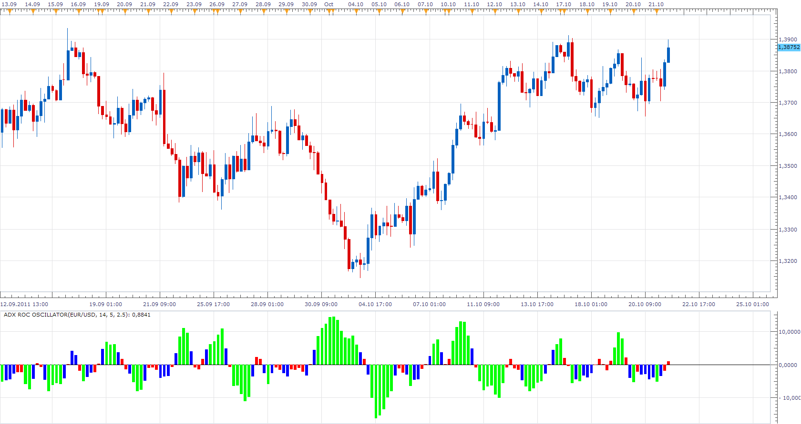

# ADX ROC Oscillator

> Source: https://fxcodebase.com/code/viewtopic.php?f=17&t=7485  
> Forum: 17 · Topic 7485 · 7 post(s)

---

## ADX ROC Oscillator

**Apprentice** · Fri Oct 21, 2011 9:32 am

This oscillator is trying to distinguish fast moving market (Strong Trend) from slow moving one.
Calculates the difference between the current value of ADX indicator and its value N periods ago.
Use absolute value.

 [ADX ROC Oscillator.lua](files/16613/ADX%20ROC%20Oscillator.lua)

The indicator was revised and updated

---

## Re: ADX ROC Oscillator

**Apprentice** · Fri Oct 21, 2011 11:24 am

 [ADX ROC Value Oscillator.lua](files/16617/ADX%20ROC%20Value%20Oscillator.lua)

---

## Re: ADX ROC Oscillator

**Alexander.Gettinger** · Thu Nov 20, 2014 5:45 pm

MQL4 version of oscillators: [viewtopic.php?f=38&t=61499](https://fxcodebase.com/code/viewtopic.php?f=38&t=61499).

---

## Re: ADX ROC Oscillator

**evgeniyn** · Sun Mar 22, 2015 3:18 am

Hi Apprentice,
Could you please fix the link below,

> **Apprentice wrote:**
> ADX ROC Value Oscillator.lua - [http://fxcodebase.com/code/download/file.php?id=4814](https://fxcodebase.com/code/download/file.php?id=4814)

Current refers to same indicator "ADX ROC Oscillator.lua" (not as shown on the picture).

---

## Re: ADX ROC Oscillator

**Apprentice** · Sun Mar 22, 2015 7:19 am

Fixed.

---

## Re: ADX ROC Oscillator

**evgeniyn** · Sun Mar 22, 2015 7:35 am

Thank you,

---

## Re: ADX ROC Oscillator

**Apprentice** · Thu Jul 13, 2017 3:55 am

The indicator was revised and updated.
