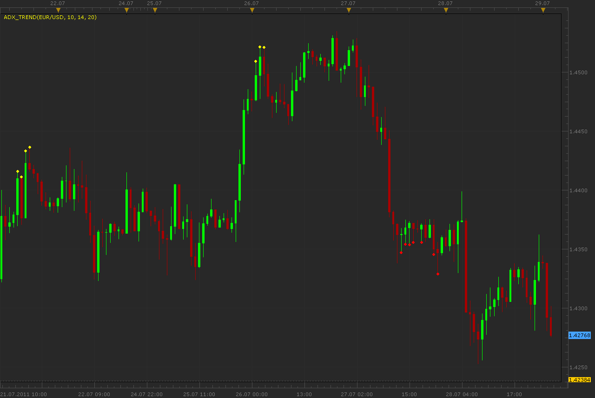

# ADX Trend indicator

> Source: https://fxcodebase.com/code/viewtopic.php?f=17&t=5530  
> Forum: 17 · Topic 5530 · 6 post(s)

---

## ADX Trend indicator

**Alexander.Gettinger** · Fri Jul 29, 2011 2:23 am

The indicator uses ADX and DMI indicators.

The indicator draws dots if all ADX (with ADX1_Period, ADX2_Period and ADX3_Period) increase and ADX(ADX1_Period)>[Level1], ADX(ADX2_Period)>[Level2].
if (DMI+)-(DMI-)>0, indicator draws a UP dot and if (DMI+)-(DMI-)<0, indicator draws a DN dot.

 

Download:

 [ADX_Trend.lua](files/13245/ADX_Trend.lua)

 [ADX_Trend with Alert.lua](files/13245/ADX_Trend%20with%20Alert.lua)

The indicator was revised and updated

---

## Re: ADX Trend indicator

**Alexander.Gettinger** · Fri Jul 29, 2011 2:32 am

Strategy based on ADX Trend indicator: [viewtopic.php?f=31&t=5531](https://fxcodebase.com/code/viewtopic.php?f=31&t=5531)

---

## Re: ADX Trend indicator

**7510109079** · Thu Dec 01, 2016 8:11 am

May i request a simple standard alert to be built into this indi when ever a dot appears
e.g. sound, popup, email

many thx in advance

---

## Re: ADX Trend indicator

**7510109079** · Thu Dec 01, 2016 9:36 am

forgot to add
-live alert
-Alert once

---

## Re: ADX Trend indicator

**Apprentice** · Thu Dec 01, 2016 9:53 am

ADX_Trend with Alert added.

---

## Re: ADX Trend indicator

**7510109079** · Thu Dec 01, 2016 10:30 am

Cool many thx
