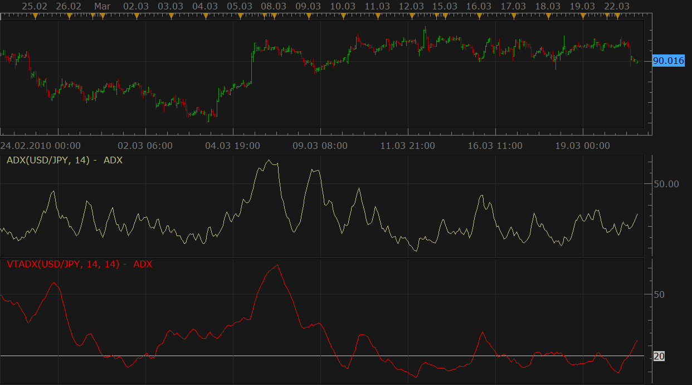

# ADX VTTrader version

> Source: https://fxcodebase.com/code/viewtopic.php?f=17&t=511  
> Forum: 17 · Topic 511 · 15 post(s)

---

## ADX VTTrader version

**Nikolay.Gekht** · Tue Mar 23, 2010 10:43 am

MT4 and Trading Station of the ADX indicator differs from one implemented in VTTrader. The VTTrader uses the following formula:

```
TR = MAX(PREVIOUS CLOSE, CURRENT HIGH) - MIN(PREVIOUS CLOSE, CURRENT LOW)
PLUSDM = IF ((CURRENT HIGH > PREVIOUS HIGH AND CURRENT LOW >= PREVIOUS LOW) OR
                   (CURRENT HIGH > PREVIOUS HIGH AND CURRENT LOW < PREVIOUS LOW AND
                    CURRENT HIGH  - PREVIOUS HIGH < PREVIOUS LOW - CURRENT LOW)
              THEN
                     CURRENT HIGH - PREVIOUS HIGH
              ELSE
                     0
MINUSDM = IF ((CURRENT HIGH <= PREVIOUS HIGH AND CURRENT LOW < PREVIOUS LOW) OR
                   (CURRENT HIGH > PREVIOUS HIGH AND CURRENT LOW < PREVIOUS LOW AND
                    CURRENT HIGH  - PREVIOUS HIGH < PREVIOUS LOW - CURRENT LOW)
              THEN
                     PREVIOUS LOW - CURRENT LOW
              ELSE
                     0

PLUSDI = 100 * WMA(PLUSDM, N1) / WMA(TR, N1)
MINUSDI = 100 * WMA(MINUSDM, N1) / WMA(TR, N1)

ADX = 100  * WMA((PLUSDI - MINUSDI) / (PLUSDI + MINUSDI), N2)
```

where WMA is [Wilders Moving Average](https://fxcodebase.com/code/viewtopic.php?f=17&t=248).

Compare the view of the standard ADX and VT-version of the ADX on the snapshot below:

 



The VT-like version of the ADX is below:

Please, do not forget to download and install [WMA.lua](https://fxcodebase.com/code/download/file.php?id=87) (Wilders Moving Average). This indicator is used by VTADX and, therefore, is required to be installed.

```lua
-- Indicator profile initialization routine
-- Defines indicator profile properties and indicator parameters
function Init()
    indicator:name("Average Directional Movement Index (VTTrader version)");
    indicator:description("");
    indicator:requiredSource(core.Bar);
    indicator:type(core.Oscillator);

    indicator.parameters:addInteger("SM1", "Smoothing periods 1", "No description", 14, 1, 100);
    indicator.parameters:addInteger("SM2", "Smoothing periods 2", "No description", 14, 1, 100);
    indicator.parameters:addColor("ADX_color", "Color of ADX", "Color of ADX", core.rgb(255, 0, 0));
end

-- Indicator instance initialization routine
-- Processes indicator parameters and creates output streams
-- Parameters block
local SM1;
local SM2;

local first;
local firstTR;
local firstDI;
local source = nil;

-- Streams block
local TR = nil;
local TR_W = nil;
local PlusDM = nil;
local PlusDM_W = nil;
local PlusDI = nil;
local MinusDM = nil;
local MinusDM_W = nil;
local MinusDI = nil;
local R = nil;
local R_W = nil;
local ADX = nil;
local H, L, C;

-- Routine
function Prepare()
    SM1 = instance.parameters.SM1;
    SM2 = instance.parameters.SM2;
    source = instance.source;
    firstTR = source:first() + 1;
    H = source.high;
    L = source.low;
    C = source.close;

    TR = instance:addInternalStream(firstTR, 0);
    PlusDM = instance:addInternalStream(firstTR, 0);
    MinusDM = instance:addInternalStream(firstTR, 0);

    TR_W = core.indicators:create("WMA", TR, SM1);
    PlusDM_W = core.indicators:create("WMA", PlusDM, SM1);
    MinusDM_W = core.indicators:create("WMA", MinusDM, SM1);

    firstDI = TR_W.DATA:first();

    PlusDI = instance:addInternalStream(firstDI, 0);
    MinusDI = instance:addInternalStream(firstDI, 0);
    R = instance:addInternalStream(firstDI, 0);

    R_W = core.indicators:create("WMA", R, SM2);

    first = R_W.DATA:first();
    local name = profile:id() .. "(" .. source:name() .. ", " .. SM1 .. ", " .. SM2 .. ")";
    instance:name(name);
    ADX = instance:addStream("ADX", core.Line, name, "ADX", instance.parameters.ADX_color, first);
    ADX:addLevel(20);
end

-- Indicator calculation routine
function Update(p, mode)
    if p >= firstTR then
        local th, tl;

        if C[p - 1] > H[p] then
            th = C[p - 1];
        else
            th = H[p];
        end

        if C[p - 1] < L[p] then
            tl = C[p - 1];
        else
            tl = L[p];
        end

        TR[p] = th - tl;

        if H[p] > H[p - 1] and L[p] >= L[p - 1] then
            PlusDM[p] = H[p] - H[p - 1];
        elseif  H[p] > H[p - 1] and L[p] < L[p - 1] and ((H[p] - H[p - 1]) > (L[p - 1] - L[p])) then
            PlusDM[p] = H[p] - H[p - 1];
        else
            PlusDM[p] = 0;
        end
        if L[p] < L[p - 1] and H[p] <= H[p - 1] then
            MinusDM[p] = L[p - 1] - L[p];
        elseif  L[p] < L[p - 1] and H[p] > H[p - 1] and ((H[p] - H[p - 1]) < (L[p - 1] - L[p])) then
            MinusDM[p] = L[p - 1] - L[p];
        else
            MinusDM[p] = 0;
        end
    end

    TR_W:update(mode);
    PlusDM_W:update(mode);
    MinusDM_W:update(mode);

    if p >= firstDI then
        PlusDI[p] = 100 * PlusDM_W.DATA[p] / TR_W.DATA[p]
        MinusDI[p] = 100 * MinusDM_W.DATA[p] / TR_W.DATA[p]

        local diff, sum;

        diff = math.abs(PlusDI[p] - MinusDI[p]);
        summ = PlusDI[p] + MinusDI[p];
        R[p] = diff / summ;
    end

    R_W:update(mode);

    if p >= first then
        ADX[p] = 100 * R_W.DATA[p];
    end
end
```

 [VTADX.lua](files/871/VTADX.lua)

 


 [MTF MCP VTADX.lua](files/871/MTF%20MCP%20VTADX.lua)

The indicator was revised and updated

---

## Re: ADX VTTrader version

**Nikolay.Gekht** · Tue Mar 23, 2010 10:45 am

Overview:

The Average Directional Movement Index (ADX) is a momentum indicator developed by J. Welles Wilder and described in his book "New Concepts in Technical Trading Systems", written in 1978. The ADX is constructed from two other Wilders' indicators: the Positive Directional indicator (+DI) and the Negative Directional Indicator (-DI). The +DI and -DI indicators are commonly referred to as the Directional Movement Index. Combining the +/-DI and applying a Wilders() smoothing filter results in the final ADX value.

Interpretation

The ADX's main purpose is to measure the strength of market trends on a 0-100 scale; the higher the ADX value the stronger the trend. It should be noted that while the direction of price is important to the ADX's calculation, the ADX itself is not a directional indicator. Values above 40 indicate very strong trending while values below 20 indicate non-trending or ranging market conditions.

Traders typically use the ADX as a filter along with other indicators to create a more concrete trading methodology. Many traders view ADX turning up from below 20 as an early signal of a new emerging trend while, conversely, a declining ADX turning down from above 40 as deterioration of the current trend. Wilder suggests using the ADX as part of a system that includes the +DI and -DI indicators. (See the Directional Movement System indicator for additional details)

Just for reference: VT code

```
TH:= if(Ref(C,-1)>H,Ref(C,-1),H);
TL:= if(Ref(C,-1)<L,Ref(C,-1),L);
TR:= TH-TL;
PlusDM:= if(H>Ref(H,-1) AND L>=Ref(L,-1), H-Ref(H,-1), if(H>Ref(H,-1) AND L<Ref(L,-1) AND
                 H-Ref(H,-1)>Ref(L,-1)-L, H-Ref(H,-1), 0));
PlusDI:= 100 * Wilders(PlusDM,Pr)/Wilders(Tr,Pr);
MinusDM:= if(L<Ref(L,-1) AND H<=Ref(H,-1), Ref(L,-1)-L, if(H>Ref(H,-1) AND L<Ref(L,-1) AND
                  H-Ref(H,-1)<Ref(L,-1)-L, Ref(L,-1)-L, 0));
MinusDI:= 100 * Wilders(MinusDM,Pr)/Wilders(Tr,Pr);
DIDif:= Abs(PlusDI-MinusDI);
DISum:= PlusDI + MinusDI;
_ADX:= 100 * Wilders(DIDif/DISum,SmPr);
```

---

## Re: ADX VTTrader version

**smartfx** · Mon May 03, 2010 8:30 am

Is there any possibility to add DMI lines into the same window, using VTTrader version of the formula?

It would be of great benefit!

THANK YOU, IN ADVANCE!!!

---

## Re: ADX VTTrader version

**Nikolay.Gekht** · Tue May 04, 2010 1:29 pm

The VTDMI indicator is here:
[viewtopic.php?f=17&t=950](https://fxcodebase.com/code/viewtopic.php?f=17&t=950)

To show it on the same area as ADX just go to the "Location" tab of the indicator properties and select the ADX indicator area .

---

## Re: ADX VTTrader version

**smartfx** · Tue May 04, 2010 1:58 pm

WONDERFUL! Great support! THANK YOU SO MUCH!

---

## Re: ADX VTTrader version

**DS0167** · Fri Jan 07, 2011 2:54 pm

Hello,

Can we get the width and style options added please ? and for the DMI VTTTrader version too ?

Big thank you in advance.
And happy new year to the team
Danielle

---

## Re: ADX VTTrader version

**Apprentice** · Fri Jan 07, 2011 4:07 pm

Added to developmental cue.

---

## Re: ADX VTTrader version

**Apprentice** · Sat Jan 08, 2011 9:00 am

Style Option Added.

---

## Re: ADX VTTrader version

**sabrumea** · Mon Jan 10, 2011 5:07 am

dear development team, could you guys please help with the signal for VADX?... to make a signal if ADX goes below a certain level.. i have downloaded this indicator together with VDMI you made.. and i found this very reliable tools.. please help with signal

---

## Re: ADX VTTrader version

**Apprentice** · Mon Jan 10, 2011 5:49 am

Added on developmental list.

---

## Re: ADX VTTrader version

**Apprentice** · Thu Apr 21, 2011 6:02 am

Requested can be found here.
[viewtopic.php?f=29&t=3986](https://fxcodebase.com/code/viewtopic.php?f=29&t=3986)

---

## Re: ADX VTTrader version

**Giantball** · Tue Jul 26, 2011 5:12 pm

Hi,

Is it possible to get a 3TF version of ADX VTTrader, just like the 3TF stochs version? thank you for all your help.

Best Regards,
G

---

## Re: ADX VTTrader version

**cc.matt** · Sun Jul 15, 2012 8:02 pm

Hi,

Could you create a multi-currency VTADX please?

Thanks,
Matt

---

## Re: ADX VTTrader version

**Apprentice** · Wed Apr 12, 2017 6:06 am

Indicator was revised and updated.

---

## Re: ADX VTTrader version

**Apprentice** · Wed Apr 12, 2017 7:57 am

MTF MCP VTADX.lua added.
