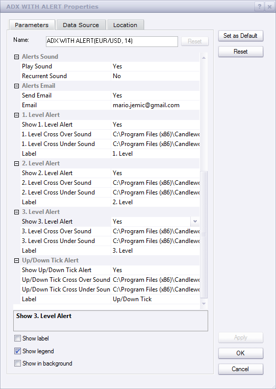

# ADX with Alert

> Source: https://fxcodebase.com/code/viewtopic.php?f=17&t=23594  
> Forum: 17 · Topic 23594 · 12 post(s)

---

## ADX with Alert

**Apprentice** · Wed Sep 19, 2012 11:21 am

 [ADX with Alert.lua](files/40601/ADX%20with%20Alert.lua)

This indicator provides Audio / Email Alerts if and when ADX cross over/under one of the three defined levels.

Compatibility issue fixed.
_Alert Helper is not longer needed.

---

## Re: ADX with Alert

**Apprentice** · Fri Nov 09, 2012 4:50 am

cjames I uploaded a new version.
If this does not help, and will start this one from scratch.

I simply can not reproduce this one.
You, my colleagues have the same problem, but not me.

One question, which version of the TS are using.
Beta or official.

Also can you post your Alarm parameter section.

 

---

## Re: ADX with Alert

**cjames** · Fri Nov 09, 2012 4:21 pm

I removed previous versions and re-installed your new version but get no change. The _Alert thing still requires a string in its first parameter. I've attached a screenshot of the alarm settings window of the new ADX with Alert as requested. It's a mystery. Cheers.

---

## Re: ADX with Alert

**cjames** · Fri Nov 09, 2012 4:29 pm

Also I am using the regular version of TS they gave me when I opened the account. I don't know anything about "beta". Cheers.

---

## Re: ADX with Alert

**cjames** · Sat Nov 10, 2012 12:39 pm

Also the current version of ADX with Alert does not allow the user to choose an uptick OR a downtick, unlike the older version. Cheers.

---

## Re: ADX with Alert

**Apprentice** · Sun Nov 11, 2012 4:04 am

Just to be sure, can I ask you, to install Beta version of TS.
and test ADX indicator on it.
Beta version of TS can be found here.
[viewtopic.php?f=30&t=20383](https://fxcodebase.com/code/viewtopic.php?f=30&t=20383)

---

## Re: ADX with Alert

**cjames** · Tue Nov 13, 2012 3:52 pm

Well, no. According to the site your link sent me to... "The beta version is not designed to work on real accounts". Cheers.

---

## Re: ADX with Alert

**Apprentice** · Mon Dec 07, 2015 5:30 am

Compatibility issue fixed.
_Alert Helper is not longer needed.

---

## Re: ADX with Alert

**SenseClash** · Fri Mar 11, 2016 2:22 am

Would anyone be willing to modify this so that I can choose to have an alert only in one direction (crossing from below, i.e., the ADX is increasing)?

How about a signal for this that gives the same choice?

Thank you.

---

## Re: ADX with Alert

**Apprentice** · Fri Mar 11, 2016 3:25 pm

Direction Cross Filter Added.

---

## Re: ADX with Alert

**Apprentice** · Tue Jun 07, 2016 3:36 am

Minor update.

---

## Re: ADX with Alert

**Apprentice** · Fri Aug 31, 2018 5:08 am

The indicator was revised and updated.
