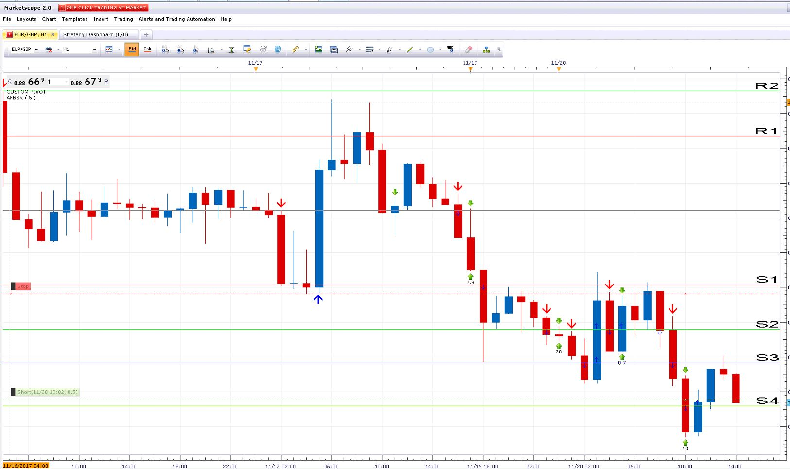
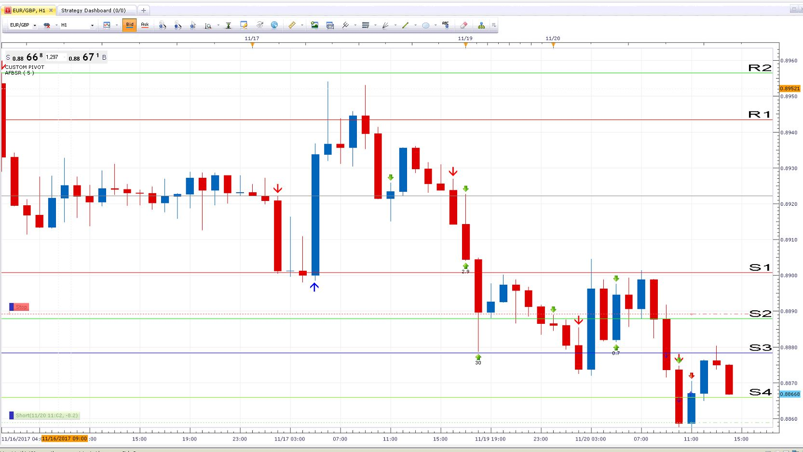
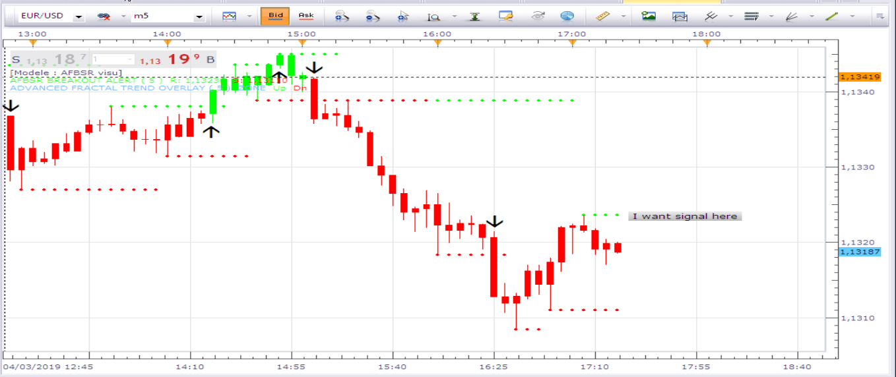

# AFBSR breakout alert

> Source: https://fxcodebase.com/code/viewtopic.php?f=17&t=64970  
> Forum: 17 · Topic 64970 · 22 post(s)

---

## AFBSR breakout alert

**Apprentice** · Tue Aug 08, 2017 4:47 am

Based on AFBSR.lua
[viewtopic.php?f=17&t=724](https://fxcodebase.com/code/viewtopic.php?f=17&t=724)
Alert will be given if price break resistance or support

 [AFBSR breakout alert.lua](files/114057/AFBSR%20breakout%20alert.lua)

MT4/MQ4 version.
[viewtopic.php?f=38&t=66213](https://fxcodebase.com/code/viewtopic.php?f=38&t=66213)

---

## Re: AFBSR breakout alert

**Avignon** · Mon Nov 06, 2017 8:00 pm

Hello,

Can you add "Allowed side" option (both, sell, buy) ?

Thanks.

---

## Re: AFBSR breakout alert

**Apprentice** · Tue Nov 07, 2017 4:11 pm

Allowed side" option added.

---

## Re: AFBSR breakout alert

**conjure** · Tue Nov 07, 2017 9:02 pm

Can you make a strategy for this indicator?

If there is a cross over open Buy position.Close on cross under and open Sell position.
Parameters needed
AllowTrade true
Close On Opposite true
MaxNumberOfPosition 1
MaxNumberOfPositionInAnyDirection 2
Limit
Stop

---

## Re: AFBSR breakout alert

**Avignon** · Wed Nov 08, 2017 5:55 pm

> **Apprentice wrote:**
> Allowed side" option added.

You are the best.

A little thing to correct.

 

and by email it's the same : I have 14:38 instead of 20:38

---

## Re: AFBSR breakout alert

**Apprentice** · Thu Nov 09, 2017 5:42 am

In what time zone you are in?
Probably a server was used.

---

## Re: AFBSR breakout alert

**Avignon** · Thu Nov 09, 2017 4:29 pm

Paris for the time zone and I am 1 hour of difference with the server.

I tested with a other indicator ramdom ([viewtopic.php?f=17&t=20&hilit=donchian#p21](http://www.fxcodebase.com/code/viewtopic.php?f=17&t=20&hilit=donchian#p21)), it's the same. With a strategy, it's ok.

If I can help you, give me the approach.

---

## Re: AFBSR breakout alert

**Apprentice** · Fri Nov 10, 2017 5:23 am

Have added time conversion to the strategies.
Unfortunately, the indicator does not have this functionality.
Will need to rewrite all indicator, add this functionality.
Will do this in next few moon.
And for this indicator in the next few days.

---

## Re: AFBSR breakout alert

**Avignon** · Fri Nov 10, 2017 1:01 pm

No problemo, it's not a blocking problem.

---

## Re: AFBSR breakout alert

**Apprentice** · Sun Nov 12, 2017 12:31 pm

Try it now.

---

## Re: AFBSR breakout alert

**Avignon** · Mon Nov 13, 2017 4:55 am

It's good.

Thank you.

---

## Re: AFBSR breakout alert

**conjure** · Mon Nov 20, 2017 12:14 pm

> **Apprentice wrote:**
> Based on AFBSR.lua
> [viewtopic.php?f=17&t=724](https://fxcodebase.com/code/viewtopic.php?f=17&t=724)
> Alert will be given if price break resistance or support

I loaded AFBSR.lua and AFBSR breakout alert.lua
but as you see at the last support breakout, the alert indicator did nothing
Is it possible to fix it?

---

## Re: AFBSR breakout alert

**conjure** · Mon Nov 20, 2017 4:17 pm

These are two different accounts where i have loaded the AFBSR breakout alert lua.
The red arrows are the alerts of the indicator.
In picture 1 there are two arrows where there should not be.
On my settings i have
Execution = End of Turn
Alert Once = No

If i change the alert once to yes,
 the alert disappears,
 when a pivot alert opens after the ABFSR alert.

What can i do?
Is it the indicators error?

 

 

---

## Re: AFBSR breakout alert

**Apprentice** · Wed Nov 22, 2017 5:19 am

If you use Alert Once,
after first alert, subsequent alerts will be suspended.

---

## Re: AFBSR breakout alert

**Apprentice** · Fri Jun 29, 2018 7:04 am

The Indicator was revised and updated.

---

## Re: AFBSR breakout alert

**Avignon** · Fri Mar 01, 2019 9:02 am

Hello,

Can you add "Type of signal" option (direct/reverse)?

Thanks.

---

## Re: AFBSR breakout alert

**Apprentice** · Mon Mar 04, 2019 6:49 am

Reverse option added.

---

## Re: AFBSR breakout alert

**MC. Trend Trader** · Mon Mar 04, 2019 8:21 am

Hello,

Request for Strategy from this Indicator.

Buy Signal: Candle cross over Up fractal line

Sell Signal: Candle close under Down fractal line

Best regards

---

## Re: AFBSR breakout alert

**Avignon** · Mon Mar 04, 2019 1:30 pm

> **MC. Trend Trader wrote:**
> Hello,
>
> Request for Strategy from this Indicator.
>
> Buy Signal: Candle cross over Up fractal line
>
> Sell Signal: Candle close under Down fractal line
>
> Best regards

Hello,

This? => [http://fxcodebase.com/code/viewtopic.ph ... 329#p18329](https://fxcodebase.com/code/viewtopic.php?f=31&t=8283&p=18329#p18329)

---

## Re: AFBSR breakout alert

**Avignon** · Mon Mar 04, 2019 1:33 pm

> **Apprentice wrote:**
> Reverse option added.

I did not write well, that's what I wanted.

 

Thank you.

---

## Re: AFBSR breakout alert

**Apprentice** · Tue Mar 05, 2019 6:33 am

Can explain with more details?
Pseudo code would help.

---

## Re: AFBSR breakout alert

**Avignon** · Tue Mar 05, 2019 4:06 pm

It was in a strategy I think so, but I can not find anymore.

I want Up fractal/Down fractal signal whit "Allowed side" (Up, Down, Both).

Please.

Thank you.
