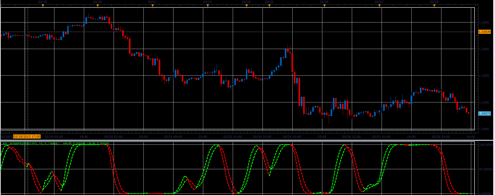

# AFL Winner oscillator

> Source: https://fxcodebase.com/code/viewtopic.php?f=17&t=32539  
> Forum: 17 · Topic 32539 · 3 post(s)

---

## AFL Winner oscillator

**Alexander.Gettinger** · Thu Feb 28, 2013 4:54 pm

This indicator is a ported MQL5 indicators from [http://www.mql5.com/en/code/1492](http://www.mql5.com/en/code/1492)

Formulas:
HBuff[i]=MA(rsv),
LBuff[i]=MA(HBuff), where
rsv[i]=100*(pa[i]-min)/(max-min),
min, max - minimum and maximum values of pa in the range from (i-Periods) to i,
pa[i]=SumCost[i]/SumVolume[i],
SumCost - sum of Volume*[Weighted price] in the range from (i-Average) to i,
SumVolume - sum of Volume in the range from (i-Average) to i.

 

Download:

 [AFL_Winner.lua](files/55432/AFL_Winner.lua)

For this indicator must be installed Averages indicator ([viewtopic.php?f=17&t=2430](https://fxcodebase.com/code/viewtopic.php?f=17&t=2430)).

 [AFL Winner Bars.lua](files/55432/AFL%20Winner%20Bars.lua)

---

## Re: AFL Winner oscillator

**Apprentice** · Tue May 09, 2017 5:41 am

Indicator was revised and updated.

---

## Re: AFL Winner oscillator

**Apprentice** · Sat Sep 15, 2018 7:50 am

AFL Winner Bars.lua added.
