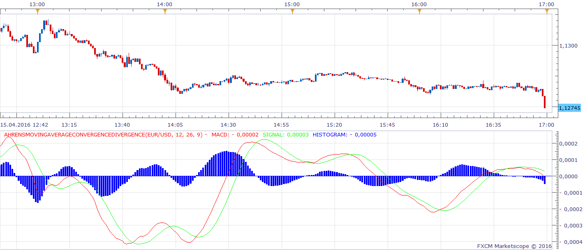
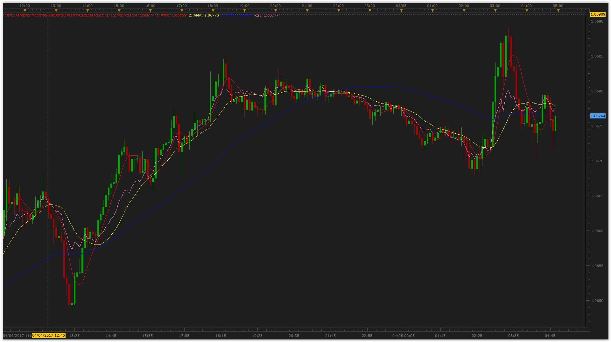

# Ahrens Moving Average

> Source: https://fxcodebase.com/code/viewtopic.php?f=17&t=62629  
> Forum: 17 · Topic 62629 · 14 post(s)

---

## Ahrens Moving Average

**Apprentice** · Fri Sep 04, 2015 6:53 am

Based on the request.
[viewtopic.php?f=27&t=62626](https://fxcodebase.com/code/viewtopic.php?f=27&t=62626)

 [Ahrens Moving Average.lua](files/102169/Ahrens%20Moving%20Average.lua)

 

 [3in1 Ahrens Moving Average.lua](files/102169/3in1%20Ahrens%20Moving%20Average.lua)

Mq4 version can be found here.
[viewtopic.php?f=38&t=62628&p=102166#p102166](https://fxcodebase.com/code/viewtopic.php?f=38&t=62628&p=102166#p102166)

---

## Ahrens_MovingAverage_ConvergenceDivergence

**Apprentice** · Sun Apr 17, 2016 6:20 am

Mq4 version can be found here.
[viewtopic.php?f=38&t=63383](https://fxcodebase.com/code/viewtopic.php?f=38&t=63383)

 [Ahrens_MovingAverage_ConvergenceDivergence.lua](files/105831/Ahrens_MovingAverage_ConvergenceDivergence.lua)

---

## Re: Ahrens Moving Average

**Apprentice** · Sun Apr 17, 2016 6:20 am

Ahrens_MovingAverage_ConvergenceDivergence.lua added.

---

## Re: Ahrens Moving Average

**Apprentice** · Mon Apr 18, 2016 1:54 am

3in1 Ahrens Moving Average.lua Added.

---

## Re: Ahrens Moving Average

**vikraj** · Mon Apr 18, 2016 8:50 am

Thanks very much Apprentice..Great work.
Kindly colour the Histogram like "MACD With Histogram Coloring" indicator.
Thanks

---

## Re: Ahrens Moving Average

**Apprentice** · Sun May 01, 2016 10:27 am

Histogram Coloring Fixed.

---

## Re: Ahrens Moving Average

**vikraj** · Mon May 02, 2016 5:53 pm

Thanks very much

---

## Re: Ahrens Moving Average

**Apprentice** · Sat Jan 21, 2017 4:26 am

Indicator was revised and updated.

---

## Re: Ahrens Moving Average

**chipsoft** · Thu Mar 16, 2017 7:54 am

Could you please includes different smoothing method option in 3 in 1 Ahrens moving average.
Regards

---

## Re: Ahrens Moving Average

**Apprentice** · Thu Mar 16, 2017 8:48 am

Do you want to have, MA of 3in1 AhrensMovingAverage components
or 3in1 or MA of Price?

---

## Re: Ahrens Moving Average

**chipsoft** · Thu Mar 16, 2017 9:39 am

I want each component ( all 3 lines) to be smoothed with EMA instead of SMA. Hope you get my point.

---

## Re: Ahrens Moving Average

**Apprentice** · Thu Mar 16, 2017 1:04 pm

No smoothing was used.
Formula is
local Median1=(AMA1[period-1]+AMA1[period-Period1])/2;
AMA1[period]= AMA1[period-1]+((source.median[period]-Median1)/Period1);

---

## Re: Ahrens Moving Average

**Gentle** · Wed Apr 05, 2017 5:57 am

I added RSI on chart to those 3 Ahrens MAs:

 

---

## Re: Ahrens Moving Average

**Apprentice** · Mon Feb 05, 2018 8:32 am

The Indicator was revised and updated.
