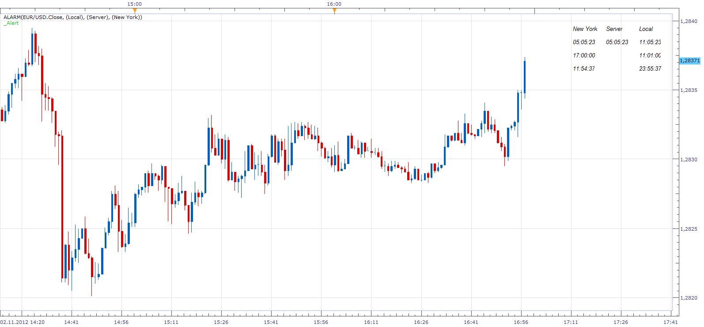

# Alarm / Alert Indicator

> Source: https://fxcodebase.com/code/viewtopic.php?f=17&t=25398  
> Forum: 17 · Topic 25398 · 9 post(s)

---

## Alarm / Alert Indicator

**Apprentice** · Sun Nov 04, 2012 5:04 am

This indicator allows you to define up to 5 alarm clock.
You can choose between several different time zones.
Countdown is present.

 [Alarm.lua](files/43645/Alarm.lua)

Compatibility issue fixed.
_Alert Helper is not longer needed.

---

## Re: Alarm / Alert Indicator

**glenville** · Tue Jan 22, 2013 9:46 pm

Hello

i down loaded the indicator and alarm as advised and loaded them into the platform, but does not work, please advise

---

## Re: Alarm / Alert Indicator

**Apprentice** · Wed Jan 23, 2013 8:50 am

Do you have installed and Activ _Alert.lua
In order to have Audio/Email alerts u have to install and activate Alert Signal.

---

## Re: Clock

**cigarguy** · Sun Feb 03, 2013 2:21 pm

> **Apprentice wrote:**
>
>
> Alarm.png
>
>
>
> This indicator allows you to define up to 5 alarm clock.
> You can choose between several different time zones.
> Countdown is present.
>
>
>
> Alarm.lua
>
>
>
> This indicator provides Audio / Email Alerts.
> In order to Audio/Email alerts could work, install and activate Alert Signal.
>
>
> _Alert.lua

Hello, I am in Arizona, USA , Mountain Standard Time -7 and London, Tokyo and Sydney 1hr off. Is this indicator suppose to take the time from the system clock?

Regards,
Cigarguy

---

## Re: Alarm / Alert Indicator

**Apprentice** · Mon Feb 04, 2013 5:55 am

Server time was used,
However, using "Reference Time", you can choose other alternatives.
Should work for all.

---

## Re: Alarm / Alert Indicator

**Apprentice** · Mon Dec 07, 2015 6:31 am

Compatibility issue fixed.
_Alert Helper is not longer needed.

---

## Re: Alarm / Alert Indicator

**Thumper** · Wed Feb 03, 2016 1:56 am

Where do I find "Alert.lua"?

---

## Re: Alarm / Alert Indicator

**Apprentice** · Thu Feb 04, 2016 1:54 am

Alert Helper is not longer needed.

---

## Re: Alarm / Alert Indicator

**Apprentice** · Thu Apr 26, 2018 7:33 am

The indicator was revised and updated.
