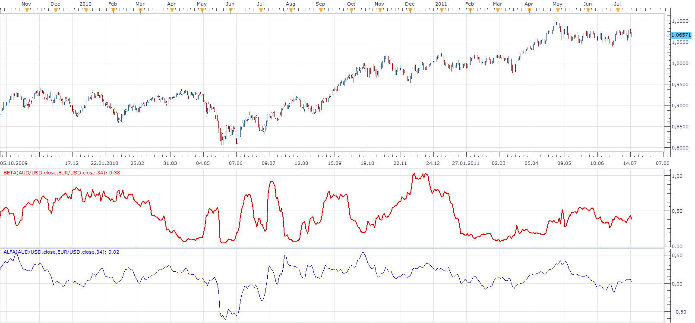

# Alfa & Beta

> Source: https://fxcodebase.com/code/viewtopic.php?f=17&t=5227  
> Forum: 17 · Topic 5227 · 5 post(s)

---

## Alfa & Beta

**Apprentice** · Sat Jul 16, 2011 8:18 am

Alfa
The difference between the fair and actually expected rates of return on a stock is called the stock's alpha.

 [Alfa.lua](files/12754/Alfa.lua)

Beta
The Beta coefficient is a measure of a stock's (or portfolio's) volatility in relation to the rest of the market.

 [Beta.lua](files/12754/Beta.lua)

These two coefficients are the foundation of modern portfolio theory.
In this version I compare the two currency pairs.

In the future I plan to add comparison portfolio / market.
But before that I have come up with Index to track market trends.

---

## Re: Alfa & Beta

**Apprentice** · Wed Mar 08, 2017 3:38 pm

Indicator was revised and updated.

---

## Re: Alfa & Beta

**jaricarr** · Wed Sep 13, 2017 12:38 am

Hi Apprentice,

Is there any information on how to use these indicators ?

---

## Re: Alfa & Beta

**Apprentice** · Wed Sep 13, 2017 2:55 am

Unfortunately no.
Was requested by a user.

---

## Re: Alfa & Beta

**Apprentice** · Sun Sep 23, 2018 7:17 am

The Indicator was revised and updated.
