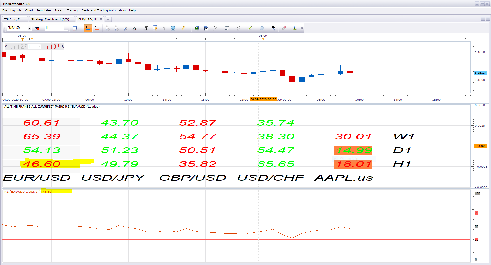

# All Time Frames All Currency Pairs RSI

> Source: https://fxcodebase.com/code/viewtopic.php?f=17&t=61345  
> Forum: 17 · Topic 61345 · 12 post(s)

---

## All Time Frames All Currency Pairs RSI

**Apprentice** · Mon Oct 20, 2014 5:01 am

This dashboard will present RSI values across MCP MTF instruments.

 [All Time Frames All Currency Pairs RSI.lua](files/96621/All%20Time%20Frames%20All%20Currency%20Pairs%20RSI.lua)

 [All Time Frames All Currency Pairs RSI View.lua](files/96621/All%20Time%20Frames%20All%20Currency%20Pairs%20RSI%20View.lua)

---

## Re: All Time Frames All Currency Pairs RSI

**FXSteve** · Tue Oct 21, 2014 2:05 am

Thank you Mario!

I tried it and it works great! Possible refinement: To be able to see RSI for 3 candles (current candle and previous two closed candles). The idea is to be able to see (for example) an overbought candle followed by a close below overbought. This would suggest a possible trade to be looked at more closely.

The output is a little hard to read using lots of currency pairs (and 52% font size), but one can get around that problem by doing a screen capture and just make it bigger.

Thanks again,
FXSteve

---

## Re: All Time Frames All Currency Pairs RSI

**Coondawg71** · Tue Oct 21, 2014 5:23 am

Great work!

It appears to me that there is not a calculation of RSI for this particular indicator but a call for the RSI indicator...so could we replace "RSI" in the script with "Williamspercentrange". ?

Thanks,

sjc

---

## Re: All Time Frames All Currency Pairs RSI

**Apprentice** · Tue Oct 21, 2014 2:50 pm

Requested can be found here.
[viewtopic.php?f=17&t=61353](https://fxcodebase.com/code/viewtopic.php?f=17&t=61353)

---

## Re: All Time Frames All Currency Pairs RSI

**Apprentice** · Sat Nov 18, 2017 11:36 am

The indicator was revised and updated.

---

## Re: All Time Frames All Currency Pairs RSI

**Avignon** · Sun Dec 03, 2017 2:01 pm

Hello,

Error message but It works:

 

(I know, I'm a nuisance ...)

---

## Re: All Time Frames All Currency Pairs RSI

**Apprentice** · Sun Feb 04, 2018 6:46 am

The Indicator was revised and updated.

---

## Re: All Time Frames All Currency Pairs RSI

**RSIWILDER83** · Mon Sep 07, 2020 9:08 am

Hello,

Your indicator is great but i have a trouble. in time M1, W1, D1, H8 the indicator follows the real time, but not in H6,H4,H3,H2, H1, m30,m15,m5,m1.

I have read your program and i have tryed to change some parameters. it doesn't work.

Have you a simply solution.

Thank lot and good job

---

## Re: All Time Frames All Currency Pairs RSI

**Apprentice** · Tue Sep 08, 2020 2:51 am

After you add the indicator please allow few seconds for the indicator to update.

---

## Re: Tous les délais Toutes les paires de devises RSI

**RSIWILDER83** · Tue Sep 08, 2020 10:23 am

Thank you for your quick reply. I actually had my OS corrupted. The problem is solved. Your work is excellent. To improve it, I was wondering if it was not possible to have your table in a window independent of the graphs ?

Thank's for your job.

---

## Re: All Time Frames All Currency Pairs RSI

**Apprentice** · Wed Sep 09, 2020 1:59 am

Your request is added to the development list.
Development reference 1997.

---

## Re: All Time Frames All Currency Pairs RSI

**Apprentice** · Thu Sep 10, 2020 4:48 am

All Time Frames All Currency Pairs RSI View added.
