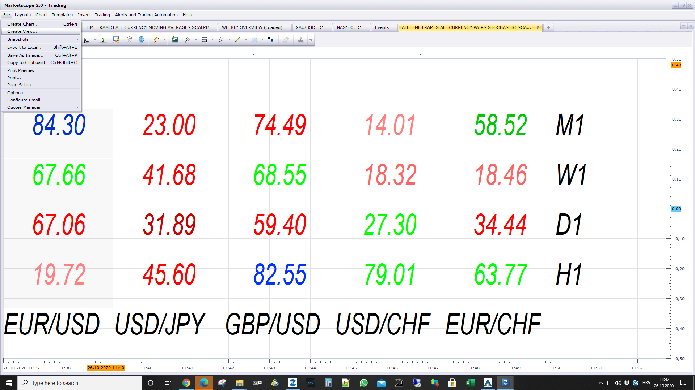

# All Time Frames All Currency Pairs Stochastic Scanner View

> Source: https://fxcodebase.com/code/viewtopic.php?f=17&t=70568  
> Forum: 17 · Topic 70568 · 1 post(s)

---

## All Time Frames All Currency Pairs Stochastic Scanner View

**Apprentice** · Mon Oct 26, 2020 5:40 am

 

MT4 version.
[viewtopic.php?f=38&t=70017](https://fxcodebase.com/code/viewtopic.php?f=38&t=70017)

 [All Time Frames All Currency Pairs Stochastic Scanner View.lua](files/138487/All%20Time%20Frames%20All%20Currency%20Pairs%20Stochastic%20Scanner%20View.lua)

 [All Time Frames All Currency Pairs SSD Scanner View.lua](files/138487/All%20Time%20Frames%20All%20Currency%20Pairs%20SSD%20Scanner%20View.lua)

 [All Time Frames All Currency Pairs SSD Scanner View with Alert.lua](files/138487/All%20Time%20Frames%20All%20Currency%20Pairs%20SSD%20Scanner%20View%20with%20Alert.lua)
