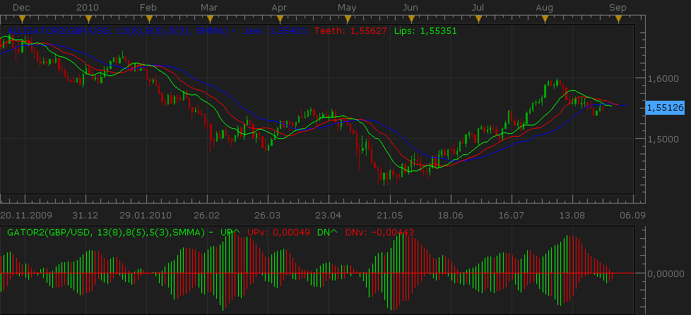

# Alligator and Gator for Aug 27 2010 release of TS

> Source: https://fxcodebase.com/code/viewtopic.php?f=17&t=1975  
> Forum: 17 · Topic 1975 · 2 post(s)

---

## Alligator and Gator for Aug 27 2010 release of TS

**Nikolay.Gekht** · Sat Aug 28, 2010 11:07 pm

Alligator Indicator is the indicator which displays 3 lines which represent three moving averages. They are Moving Averages with various parameters:

- The First BLUE line: Its usually referred to as the “jaw” of alligator, is a line of balance to the certain period of time. 13 period smoothed moving average, moved on 8 bars to the future.
- The GREEN line: Its usually referred to as the “lips” of alligator, is the line of balance for the considerable period of time, which is one more step less. 5 period smoothed moving average, moved on 3 bars to the future.
- The RED line: Its usually referred to as the “teeth” of alligator, is the line of balance for the considerable period of time, which is one step less. 8 period smoothed shifting average, moved on 5 bars to the future.

**INTERPRETATION:**

When all of the lines are intertwined in the same place, it shows that the “Alligator” is in sleeping “mode” so to say. Then Alligator wakes up for a hunt, and once again when lines meet together Alligator’s hunt is over. This is the place where you should fix your profit. Close all your position on this instrument and wait till Alligator starts waking up again.

Gator Oscillator is based on the Alligator Indicator and shows the degree of convergence/divergence of the Smoothed Moving Averages. Gator oscillator is usually used in combination with “Alligator” indicator. (As you can see on the screenshot)

Gator displays 2 history graphs:

- **Top Graph:** Shows the distance between Blue and Red lines of the “Alligator”. (Jaws <-> Teeth)
- **Bottom Graph:** Shows the distance between Red and Green lines of the “Alligator”. (Teeth <-> Lips)

“Gator” shows convergence and intertwining of the Lines when “Alligator” indicator is “asleep” or “awake” and can help you identify a trend.

 

Download:

 [alligator2.lua](files/4001/alligator2.lua)

 [gator2.lua](files/4001/gator2.lua)

Note: Both of the indicators uses SMMA indicator. This indicator is not included into the standard Marketscope installation, so, please, download and install this indicator before using alligator/gator indicators. Please follow this link to download SMMA indicator: [viewtopic.php?f=17&t=195](https://fxcodebase.com/code/viewtopic.php?f=17&t=195)

Note: gator2 oscillator uses alligator2 indicator, so, please, download and install both indicators even if you want to use gator2 oscillator only.

Note: These indicators replace all older versions of the alligator/gator oscillator previously published on the site. Comparing older releases these indicators are optimized and support all new features, such as line styles.

The indicator was revised and updated

---

## Re: Alligator and Gator for Aug 27 2010 release of TS

**Apprentice** · Mon Jan 16, 2017 6:51 am

Indicator was revised and updated.
