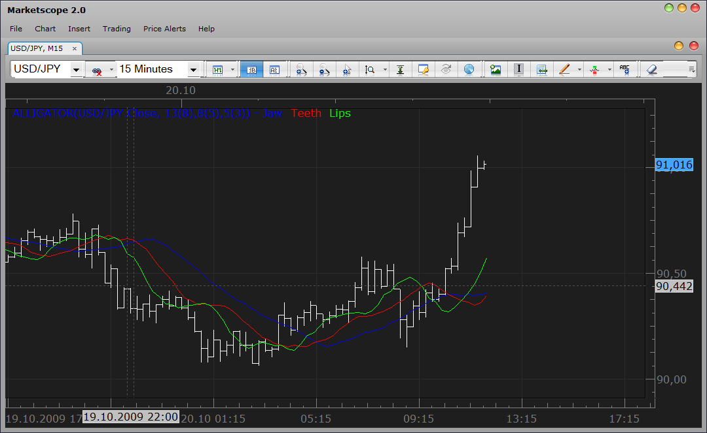
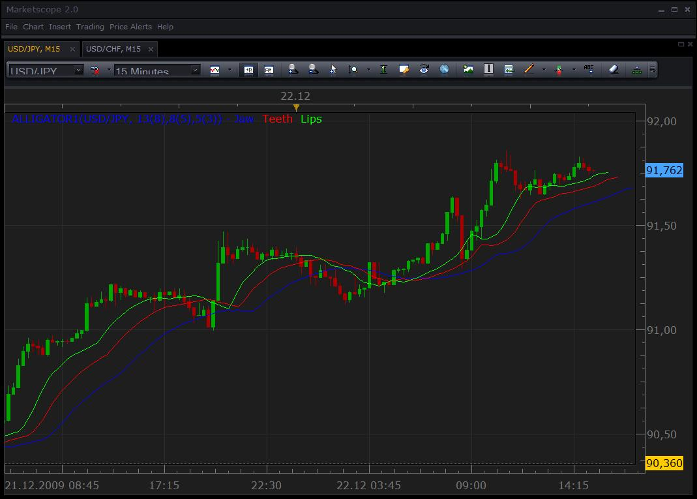

# Alligator Indicator (closed topic)

> Source: https://fxcodebase.com/code/viewtopic.php?f=17&t=15  
> Forum: 17 · Topic 15 · 5 post(s)

---

## Alligator Indicator (closed topic)

**admin** · Tue Oct 20, 2009 11:02 am

**DESCRIPTION:**

Alligator Indicator is the indicator which displays 3 lines which represent three moving averages. They are Moving Averages with various parameters:

- The First BLUE line: Its usually referred to as the “jaw” of alligator, is a line of balance to the certain period of time. 13 period smoothed moving average, moved on 8 bars to the future.
- The GREEN line: Its usually referred to as the “lips” of alligator, is the line of balance for the considerable period of time, which is one more step less. 5 period smoothed moving average, moved on 3 bars to the future.
- The RED line: Its usually referred to as the “teeth” of alligator, is the line of balance for the considerable period of time, which is one step less. 8 period smoothed shifting average, moved on 5 bars to the future.

 



**HOW TO USE/INTERPRETATION:**

When all of the lines are intertwined in the same place, it shows that the “Alligator” is in sleeping “mode” so to say. Then Alligator wakes up for a hunt, and once again when lines meet together Alligator’s hunt is over. This is the place where you should fix your profit. Close all your position on this instrument and wait till Alligator starts waking up again.

The indicator was revised and updated

**DOWNLOAD:**

 [alligator.lua](files/15/alligator.lua)

**See also: The SMMA/median (MT4-like) version of the indicator is [here](https://fxcodebase.com/code/viewtopic.php?f=17&t=15#p263)**

Tags: Allgator, indicator, Marketscope, Trading Station, FXCM, dbFX

---

## Re: Alligator Indicator

**gg_frx** · Thu Dec 17, 2009 9:09 am

hi all and thanks for your grat job helping us to create indicators

but ....
.... i compared this indicator with same indicator but in other trading platforms and noticed that something is .. wrong

i know that prices can be different in forex platforms but in this case the curves are too different

i try to take a look to the code but i am not so familiar with it (for now ..... )
but i think that possible reasons are two:
- the alligator indicator needs smoothed moving average calculation but there isn't such indicator coded in all fxcm indicators only simple, exponential and weighted .
- the moving average is build calculating (High+Low)/2 , while here seems that is only the close (or high or low or open) price that is used.

Can you verify ?

Thank you

---

## Re: Alligator Indicator

**Nikolay.Gekht** · Tue Dec 22, 2009 3:26 pm

Generally speaking, there is no indicator except the simplest one, such as MVA, which has "right" or "correct" formula. . This is why an ability to modify an indicator as you wish is very important.

As I can see this is MT4 implementation which uses SMMA and median prices.

Here is a modification of the Alligator indicator which uses the same formula as MT4's implementation:

 



Download the indicator:

 [alligator1.lua](files/263/alligator1.lua)

Note1: This indicator requires SMMA indicator. Please do not forget to [download and install](https://fxcodebase.com/code/viewtopic.php?f=17&t=195) it before using this version of the alligator indicator.

Code:

```lua
-- initializes the indicator
function Init()
    indicator:name("Alligator1");
    indicator:description("Median and SMMA-based version of the alligator")
    indicator:requiredSource(core.Bar);
    indicator:type(core.Indicator);

    indicator.parameters:addInteger("JawN", "Number of periods for smoothing the alligator jaw", "", 13);
    indicator.parameters:addInteger("JawS", "Number of periods for shifting the alligator jaw", "", 8);
    indicator.parameters:addColor("JawC", "Color of the the alligator jaw", "", core.rgb(0, 0, 255));
    indicator.parameters:addInteger("TeethN", "Number of periods for smoothing the alligator teeth", "", 8);
    indicator.parameters:addInteger("TeethS", "Number of periods for shifting the alligator teeth", "", 5);
    indicator.parameters:addColor("TeethC", "Color of the the alligator teeth", "", core.rgb(255, 0, 0));
    indicator.parameters:addInteger("LipsN", "Number of periods for smoothing the alligator lips", "", 5);
    indicator.parameters:addInteger("LipsS", "Number of periods for shifting the alligator lips", "", 3);
    indicator.parameters:addColor("LipsC", "Color of the the alligator lips", "", core.rgb(0, 255, 0));
    indicator.parameters:addString("MTH", "Smoothing method", "", "SMMA");
    indicator.parameters:addStringAlternative("MTH", "MVA", "", "MVA");
    indicator.parameters:addStringAlternative("MTH", "EMA", "", "EMA");
    indicator.parameters:addStringAlternative("MTH", "LWMA", "", "LWMA");
    indicator.parameters:addStringAlternative("MTH", "SMMA", "", "SMMA");
end

-- lines parameters
local JawN, JawS;
local TeethN, TeethS;
local LipsN, LipsC;

-- indicator source
local source;
local median;

-- lines
local Jaw, Teeth, Lips;
-- lines sources
local JawSrc, TeethSrc, LipsSrc;

-- process parameters and prepare for calculations
function Prepare()
    JawN = instance.parameters.JawN;
    JawS = instance.parameters.JawS;
    TeethN = instance.parameters.TeethN;
    TeethS = instance.parameters.TeethS;
    LipsN = instance.parameters.LipsN;
    LipsS = instance.parameters.LipsS;

    source = instance.source;
    median = instance:addInternalStream(source:first(), 0);

    JawSrc = core.indicators:create(instance.parameters.MTH, median, JawN, core.rgb(0, 0, 0));
    TeethSrc = core.indicators:create(instance.parameters.MTH, median, TeethN, core.rgb(0, 0, 0));
    LipsSrc = core.indicators:create(instance.parameters.MTH, median, LipsN, core.rgb(0, 0, 0));

    local name = profile:id() .. "(" .. source:name() .. ", " .. JawN .. "(" .. JawS .. ")," .. TeethN .. "(" .. TeethS .. ")," .. LipsN .. "(" .. LipsS .. "))";
    instance:name(name);
    Jaw = instance:addStream("Jaw", core.Line, name .. ".Jaw", "Jaw", instance.parameters.JawC, JawSrc.DATA:first() + JawS, JawS);
    Teeth = instance:addStream("Teeth", core.Line, name .. ".Teeth", "Teeth", instance.parameters.TeethC, TeethSrc.DATA:first() + TeethS, TeethS);
    Lips = instance:addStream("Lips", core.Line, name .. ".Lips", "Lips", instance.parameters.LipsC, LipsSrc.DATA:first() + LipsS, LipsS);
end

-- Indicator calculation routine
function Update(period, mode)
    median[period] = (source.high[period] + source.low[period]) / 2;
    JawSrc:update(mode);
    TeethSrc:update(mode);
    LipsSrc:update(mode);

    if (period + JawS >= 0 and period >= JawSrc.DATA:first()) then
        Jaw[period + JawS] = JawSrc.DATA[period];
    end

    if (period + TeethS >= 0 and period >= TeethSrc.DATA:first()) then
        Teeth[period + TeethS] = TeethSrc.DATA[period];
    end

    if (period + LipsS >= 0 and period >= LipsSrc.DATA:first()) then
        Lips[period + LipsS] = LipsSrc.DATA[period];
    end
end
```

Changes:
- this version of the indicator requires bar instead of ticks in order to calculate median (H+L)/2
- smma choice is added to the MTH (method of smoothing) parameter and this choice is default.
- all smoothing indicators are applied to internal stream which is filled by median value.

---

## Re: Alligator Indicator

**gg_frx** · Tue Dec 22, 2009 4:22 pm

wow ... great !
I'll try all new indicators!

yes, correct, his an .MT4 implementation but SMMA is anyway required to calculate alligator and gator, following the guidelines of the bill williams book "new trading dimensions" .

thank you again

---

## Re: Alligator Indicator (closed topic)

**Apprentice** · Mon Dec 26, 2016 6:49 am

Indicator was revised and updated.
