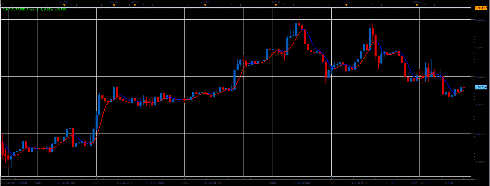
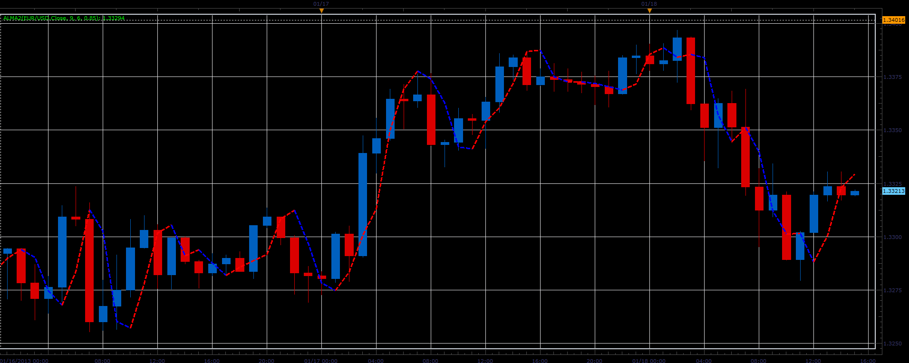

# ALMA indicator

> Source: https://fxcodebase.com/code/viewtopic.php?f=17&t=27883  
> Forum: 17 · Topic 27883 · 10 post(s)

---

## ALMA indicator

**Alexander.Gettinger** · Fri Dec 21, 2012 5:24 pm

This indicator is a ported MQL5 indicator from [viewtopic.php?f=27&t=27649#p48363](https://fxcodebase.com/code/viewtopic.php?f=27&t=27649#p48363)

 

Download:

 [Alma.lua](files/48926/Alma.lua)

The indicator was revised and updated

---

## Re: ALMA indicator

**Alexander.Gettinger** · Fri Jan 18, 2013 5:39 pm

Other version of this indicator.

 

Download:

 [Alma2.lua](files/53116/Alma2.lua)

For Alma2 indicator must be installed Alma indicator.

---

## Re: ALMA indicator

**crazymonkey** · Thu May 23, 2013 9:21 am

Hi Guys,

Is it possible to set up an alert and/or strategy for the ALMA2 indicator?

Alerts/strategy is triggered by trend direction change (color change).

I know this indicator can repaint the last candle, so is it possible to delay an alert/strategy trigger on close of the 2nd confirmation candle/period.

Thanks for all you guys do!

Also can we still submit donations? I couldn't find the page to do so.

---

## Re: ALMA indicator

**Apprentice** · Fri May 24, 2013 3:32 am

Your request is added to the development list.
Donation link can be found at the bottom of the home page.

---

## Re: ALMA indicator

**crazymonkey** · Wed May 29, 2013 11:56 am

Would it be easier to add the Alma and Alma2 to the averages strategy

---

## Re: ALMA indicator

**Apprentice** · Sun Jun 02, 2013 11:28 am

Can you provide a link for averages strategy.
And give detailed description.

---

## Re: ALMA indicator

**crazymonkey** · Tue Jun 04, 2013 1:39 pm

> **Apprentice wrote:**
> Can you provide a link for averages strategy.
> And give detailed description.

[viewtopic.php?f=31&t=3859&hilit=averages](http://www.fxcodebase.com/code/viewtopic.php?f=31&t=3859&hilit=averages)

Slope-Change Trend
Cross - Price / MA Cross

ALMA & ALMA2 could be added to averages indicator : [http://fxcodebase.com/code/viewtopic.php?f=17&t=2430](https://fxcodebase.com/code/viewtopic.php?f=17&t=2430)

------------------
**ALMA Trade conditions:**

**Condition :** Up Slope (shown in Blue)
**Entry Type :** Buy
**Entry Point :** Close of 1st or 2nd confirmation candle indicating new trend angle/slope
**Close Position :**Close of 1st or 2nd candle indicating new trend angle/slope change

**Condition :** Down Slope (Shown in Red)
**Entry Type :** Sell
**Entry Point :** Close of 1st or 2nd confirmation candle indicating new trend angle/slope
**Close Position :**Close of 1st or 2nd candle indicating new trend angle/slope change

**Optional Variables** (other than default ALMA calculation variables) :
**>** Option to choose whether strategy enters/exits after 1st, 2nd or 3rd candle confirmation. I am not sure if this is even possible if integrating with the AVERAGES indicator/strategy. If creating a new strategy, this option would be awesome - much less false signals.
**>** Standard Manual Limit/Stop/Trailing Stop options

--------------------------------------

**ALMA2 Trade conditions:**

**Condition :** Up Slope (shown in Blue)
**Entry Type :**Buy
**Entry Point :** Close of 1st or 2nd confirmation candle indicating new trend angle/slope
**Close Position :** Close of 1st or 2nd candle indicating new trend angle/slope change

**Condition :** Down Slope (Shown in Red)
**Entry Type :** Sell
**Entry Point :** Close of 1st or 2nd confirmation candle indicating new trend angle/slope
**Close Position :** Close of 1st or 2nd candle indicating new trend angle/slope change

**Condition :** Neutral Slope (Shown in Green)
**Entry Type :** No entry

**Optional Variables** (if possible):
**>** Option to choose whether to strategy enters/exits after 1st, 2nd or 3rd candle confirmation.
**>** Option to choose whether to close or keep trade open on Neutral Slope (shown in green in image. neutral slope is generated with the PCT filter). Not sure how hard this would be to do.
**>**Standard Manual Limit/Stop/Trailing Stop options

-----------------------------------------

---

## Re: ALMA indicator

**Apprentice** · Wed Jun 05, 2013 2:49 am

Your request is added to the development list.

---

## Re: ALMA indicator

**Apprentice** · Thu May 11, 2017 2:12 pm

Indicator was revised and updated.

---

## Re: ALMA indicator

**Apprentice** · Sun May 21, 2017 9:53 am

ALMA based strategy is available here.
[viewtopic.php?f=31&t=64666](https://fxcodebase.com/code/viewtopic.php?f=31&t=64666)
